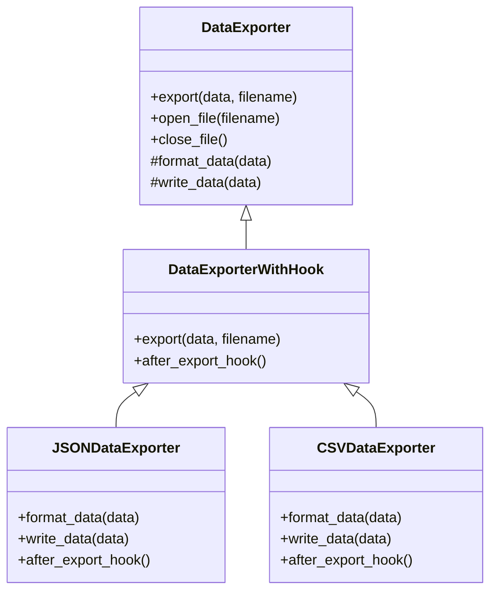

## 5.10.2 Defining Algorithm Steps

In the realm of software development, the Template Method Pattern is a powerful behavioral design pattern that allows developers to define the skeleton of an algorithm in a base class. This pattern is particularly useful when you want to ensure that certain steps of an algorithm remain unchanged while allowing subclasses to override other steps to implement specific behaviors. In this section, we will delve into the intricacies of defining algorithm steps within the Template Method Pattern, focusing on identifying invariant and variant steps, enforcing the algorithm structure, and utilizing hooks for flexibility.

### Understanding Invariant and Variant Steps

The first step in implementing the Template Method Pattern is to identify which parts of the algorithm are invariant (unchanging) and which parts are variant (subject to change). This distinction is crucial as it determines what will be implemented in the base class and what will be left for subclasses to define.

#### Identifying Invariant Steps

Invariant steps are those that remain consistent across all implementations of the algorithm. These steps are typically implemented in the base class and are not meant to be overridden by subclasses. For example, consider a data exporter that writes data to a file. The invariant steps might include:

- **Opening a file**: This step is necessary regardless of the data being written.
- **Closing a file**: Ensuring the file is properly closed after writing is a common requirement.

#### Identifying Variant Steps

Variant steps are those that can differ depending on the specific requirements of the subclass. These steps are defined in the base class as abstract methods or methods with default implementations that subclasses can override. In the data exporter example, the variant steps might include:

- **Formatting data**: Different subclasses might format data in various ways (e.g., JSON, XML, CSV).
- **Writing data**: The actual data writing logic can vary based on the data format.

### Example: Data Exporter

Let's illustrate these concepts with a Python example of a data exporter. We'll define a base class `DataExporter` that contains the template method and abstract methods for variant steps.

```python
from abc import ABC, abstractmethod

class DataExporter(ABC):
    def export(self, data, filename):
        """Template method defining the skeleton of the export algorithm."""
        self.open_file(filename)
        formatted_data = self.format_data(data)
        self.write_data(formatted_data)
        self.close_file()

    def open_file(self, filename):
        """Invariant step: Open the file."""
        self.file = open(filename, 'w')
        print(f"File {filename} opened.")

    @abstractmethod
    def format_data(self, data):
        """Variant step: Format the data."""
        pass

    @abstractmethod
    def write_data(self, data):
        """Variant step: Write the data."""
        pass

    def close_file(self):
        """Invariant step: Close the file."""
        self.file.close()
        print("File closed.")
```

In this example, `open_file` and `close_file` are invariant steps, while `format_data` and `write_data` are variant steps that subclasses must implement.

### Enforcing the Algorithm Structure

The Template Method Pattern enforces the structure of the algorithm by defining a template method in the base class. This method calls the invariant and variant steps in the correct order, ensuring that the algorithm's skeleton is maintained. It is crucial that subclasses do not override this template method, as doing so would disrupt the intended flow of the algorithm.

#### Importance of the Template Method

The template method is the cornerstone of the Template Method Pattern. It orchestrates the execution of the algorithm's steps, ensuring that the invariant steps are executed as intended and that the variant steps are properly overridden by subclasses.

### Demonstrating the Use of Hooks

Hooks are optional methods in the base class that provide additional flexibility without requiring subclasses to implement every method. Hooks can be used to insert additional behavior into the algorithm without altering its structure.

#### Example with Hooks

Let's extend our data exporter example to include a hook method that allows subclasses to perform additional actions after writing data.

```python
class DataExporterWithHook(DataExporter):
    def export(self, data, filename):
        """Template method with a hook."""
        super().export(data, filename)
        self.after_export_hook()

    def after_export_hook(self):
        """Hook method: Can be overridden by subclasses."""
        pass
```

Subclasses can override `after_export_hook` to add custom behavior after the data export process.

### Implementing Subclasses

Now, let's implement a couple of subclasses to demonstrate how the Template Method Pattern can be used to create different data exporters.

#### JSON Data Exporter

```python
import json

class JSONDataExporter(DataExporterWithHook):
    def format_data(self, data):
        """Format data as JSON."""
        return json.dumps(data)

    def write_data(self, data):
        """Write JSON data to file."""
        self.file.write(data)
        print("Data written in JSON format.")

    def after_export_hook(self):
        """Custom behavior after export."""
        print("JSON export completed.")
```

#### CSV Data Exporter

```python
import csv

class CSVDataExporter(DataExporterWithHook):
    def format_data(self, data):
        """Format data as CSV."""
        return [','.join(map(str, row)) for row in data]

    def write_data(self, data):
        """Write CSV data to file."""
        writer = csv.writer(self.file)
        for row in data:
            writer.writerow(row)
        print("Data written in CSV format.")

    def after_export_hook(self):
        """Custom behavior after export."""
        print("CSV export completed.")
```

### Try It Yourself

To deepen your understanding, try modifying the code examples above:

- **Add a new data exporter**: Implement a subclass for exporting data in XML format.
- **Enhance the hook method**: Add logging functionality to the `after_export_hook` method.
- **Experiment with error handling**: Introduce error handling in the `open_file` and `close_file` methods.

### Visualizing the Template Method Pattern

To better understand the flow of the Template Method Pattern, let's visualize the relationship between the base class and its subclasses using a class diagram.



### References and Further Reading

- [Python's `abc` module](https://docs.python.org/3/library/abc.html): Learn more about abstract base classes in Python.
- [Design Patterns: Elements of Reusable Object-Oriented Software](https://en.wikipedia.org/wiki/Design_Patterns): The seminal book on design patterns by the "Gang of Four."

### Knowledge Check

- **What are invariant steps, and why are they important in the Template Method Pattern?**
- **How do hooks add flexibility to the Template Method Pattern?**
- **Why should the template method not be overridden by subclasses?**

### Embrace the Journey

Remember, mastering design patterns like the Template Method Pattern is a journey. As you continue to explore and experiment with these patterns, you'll gain a deeper understanding of how to write flexible, maintainable, and scalable code. Keep experimenting, stay curious, and enjoy the journey!

## Quiz Time!



### What is the primary purpose of the Template Method Pattern?

- [x] To define the skeleton of an algorithm in a base class and allow subclasses to implement specific steps.
- [ ] To allow multiple classes to inherit from a single base class.
- [ ] To provide a way to create objects without specifying the exact class.
- [ ] To encapsulate a request as an object.

> **Explanation:** The Template Method Pattern is used to define the skeleton of an algorithm in a base class, allowing subclasses to implement specific steps.

### Which of the following is an invariant step in the data exporter example?

- [x] Opening a file.
- [ ] Formatting data.
- [ ] Writing data.
- [ ] Logging export completion.

> **Explanation:** Opening a file is an invariant step because it is common to all data export processes and does not change.

### What is a hook in the context of the Template Method Pattern?

- [x] An optional method that can be overridden by subclasses to add additional behavior.
- [ ] A mandatory method that must be implemented by all subclasses.
- [ ] A method that replaces the template method in subclasses.
- [ ] A method that defines the entire algorithm in the base class.

> **Explanation:** A hook is an optional method that can be overridden by subclasses to add additional behavior without altering the algorithm's structure.

### Why is it important not to override the template method in subclasses?

- [x] To ensure the algorithm's structure remains consistent.
- [ ] To allow subclasses to define their own algorithm structure.
- [ ] To prevent subclasses from adding additional behavior.
- [ ] To ensure all subclasses have the same behavior.

> **Explanation:** The template method should not be overridden to ensure the algorithm's structure remains consistent across all subclasses.

### How can hooks add flexibility to the Template Method Pattern?

- [x] By allowing subclasses to add custom behavior without altering the algorithm's structure.
- [ ] By requiring subclasses to implement every method.
- [ ] By replacing invariant steps with variant steps.
- [ ] By defining the entire algorithm in the base class.

> **Explanation:** Hooks add flexibility by allowing subclasses to add custom behavior without altering the algorithm's structure.

### In the data exporter example, which method is a variant step?

- [ ] Opening a file.
- [x] Formatting data.
- [ ] Closing a file.
- [ ] Logging export completion.

> **Explanation:** Formatting data is a variant step because it can differ depending on the specific requirements of the subclass.

### What is the role of the `export` method in the data exporter example?

- [x] To define the skeleton of the export algorithm and call the invariant and variant steps.
- [ ] To format data for export.
- [ ] To write data to a file.
- [ ] To log the export completion.

> **Explanation:** The `export` method defines the skeleton of the export algorithm and calls the invariant and variant steps.

### What is the benefit of using the Template Method Pattern?

- [x] It allows for code reuse and consistency by defining a common algorithm structure.
- [ ] It allows for complete customization of the algorithm in each subclass.
- [ ] It simplifies the code by removing the need for a base class.
- [ ] It eliminates the need for variant steps in subclasses.

> **Explanation:** The Template Method Pattern allows for code reuse and consistency by defining a common algorithm structure in the base class.

### True or False: The Template Method Pattern allows subclasses to override the template method to change the algorithm's structure.

- [ ] True
- [x] False

> **Explanation:** False. The Template Method Pattern does not allow subclasses to override the template method to change the algorithm's structure, as this would disrupt the intended flow of the algorithm.

### What is the purpose of the `after_export_hook` method in the data exporter example?

- [x] To allow subclasses to add custom behavior after the data export process.
- [ ] To format data for export.
- [ ] To write data to a file.
- [ ] To open a file for writing.

> **Explanation:** The `after_export_hook` method allows subclasses to add custom behavior after the data export process.


