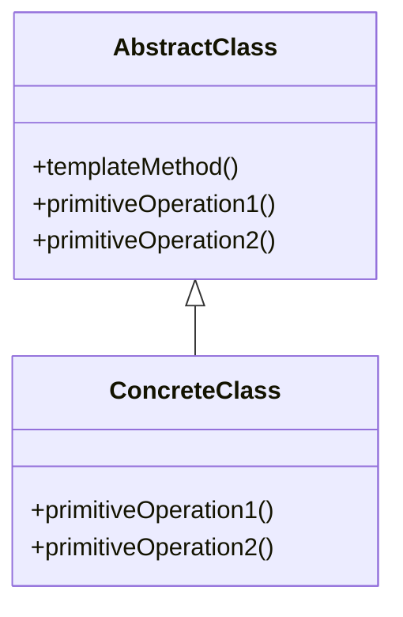

## 5.10.3 Use Cases and Examples

The Template Method pattern is a behavioral design pattern that defines the skeleton of an algorithm in a method, deferring some steps to subclasses. It allows subclasses to redefine certain steps of an algorithm without changing the algorithm's structure. This pattern is particularly useful when you have a set of similar algorithms that share a common structure but differ in specific steps. Let's delve into practical use cases and examples to understand how this pattern can be effectively applied in Python.

### Game Development: Implementing a Game Loop

In game development, the game loop is a fundamental concept. It is responsible for continuously updating the game state and rendering the game world. The Template Method pattern can be applied to create a flexible game loop where specific steps like input handling, updating, and rendering can be customized by subclasses.

#### Game Loop Example

Consider a simple game framework where we want to define a game loop. The basic structure of the loop involves initializing the game, handling input, updating the game state, and rendering the game world. Here's how we can implement this using the Template Method pattern in Python:

```python
from abc import ABC, abstractmethod

class Game(ABC):
    def play(self):
        self.initialize()
        while not self.is_game_over():
            self.handle_input()
            self.update()
            self.render()

    @abstractmethod
    def initialize(self):
        pass

    @abstractmethod
    def is_game_over(self):
        pass

    @abstractmethod
    def handle_input(self):
        pass

    @abstractmethod
    def update(self):
        pass

    @abstractmethod
    def render(self):
        pass

class Chess(Game):
    def initialize(self):
        print("Chess game initialized.")

    def is_game_over(self):
        # Simplified condition for demonstration
        return False

    def handle_input(self):
        print("Handling chess input.")

    def update(self):
        print("Updating chess game state.")

    def render(self):
        print("Rendering chess board.")

chess_game = Chess()
chess_game.play()
```

In this example, the `Game` class defines the template method `play()`, which outlines the game loop. The `Chess` class extends `Game` and provides concrete implementations for the abstract methods. This allows us to easily create different types of games by subclassing `Game` and implementing the specific steps.

#### Benefits in Game Development

- **Consistent Architecture**: The Template Method pattern enforces a consistent structure for game loops, making it easier to manage and extend.
- **Ease of Maintenance**: Changes to the game loop structure can be made in the base class, affecting all subclasses uniformly.
- **Flexibility**: New game types can be added by simply creating new subclasses and implementing the required methods.

### Document Processing: Parsing Different Formats

Document processing often involves parsing documents of various formats (e.g., PDF, DOCX, TXT) using a common processing algorithm. The Template Method pattern can be used to define the overall parsing process while allowing subclasses to handle format-specific details.

#### Document Processing Example

Let's create a document processing framework where we parse different document formats. The framework will define the overall parsing process, and subclasses will implement format-specific parsing logic.

```python
from abc import ABC, abstractmethod

class DocumentParser(ABC):
    def parse_document(self, file_path):
        self.open_file(file_path)
        self.extract_content()
        self.analyze_content()
        self.close_file()

    @abstractmethod
    def open_file(self, file_path):
        pass

    @abstractmethod
    def extract_content(self):
        pass

    @abstractmethod
    def analyze_content(self):
        pass

    @abstractmethod
    def close_file(self):
        pass

class PDFParser(DocumentParser):
    def open_file(self, file_path):
        print(f"Opening PDF file: {file_path}")

    def extract_content(self):
        print("Extracting content from PDF.")

    def analyze_content(self):
        print("Analyzing PDF content.")

    def close_file(self):
        print("Closing PDF file.")

class DOCXParser(DocumentParser):
    def open_file(self, file_path):
        print(f"Opening DOCX file: {file_path}")

    def extract_content(self):
        print("Extracting content from DOCX.")

    def analyze_content(self):
        print("Analyzing DOCX content.")

    def close_file(self):
        print("Closing DOCX file.")

pdf_parser = PDFParser()
pdf_parser.parse_document("sample.pdf")

docx_parser = DOCXParser()
docx_parser.parse_document("sample.docx")
```

In this example, `DocumentParser` defines the template method `parse_document()`, which outlines the document parsing process. The `PDFParser` and `DOCXParser` classes extend `DocumentParser` and provide concrete implementations for the abstract methods, allowing them to handle format-specific details.

#### Benefits in Document Processing

- **Consistent Parsing Process**: The Template Method pattern ensures a consistent parsing process across different document formats.
- **Simplified Addition of New Formats**: New document formats can be supported by creating new subclasses and implementing the required methods.
- **Centralized Control**: Changes to the overall parsing process can be made in the base class, affecting all subclasses uniformly.

### Observed Benefits of the Template Method Pattern

The Template Method pattern offers several benefits that make it a valuable tool in software development:

- **Consistent Architecture**: By defining a common algorithm structure, the Template Method pattern promotes consistency across different implementations.
- **Ease of Maintenance**: Changes to the algorithm structure can be made in the base class, reducing the need for duplicate changes in subclasses.
- **Simplified Extension**: New implementations can be added by creating new subclasses and implementing the required methods, without altering the base class.
- **Code Reusability**: Shared algorithm logic is encapsulated in the base class, promoting code reuse and reducing duplication.

### Encouraging the Use of the Template Method Pattern

As you develop software, consider looking for repetitive algorithms in your code where only some steps vary. The Template Method pattern can help you encapsulate the common structure and allow subclasses to customize specific steps, leading to more maintainable and flexible code.

### Try It Yourself

To get hands-on experience with the Template Method pattern, try modifying the examples provided:

- **Game Development**: Create a new game class, such as `TicTacToe`, and implement the required methods to customize the game loop.
- **Document Processing**: Add a new document parser class for a different format, such as `TXTParser`, and implement the format-specific parsing logic.

Experiment with these modifications to see how the Template Method pattern can be applied to different scenarios.

### Visualizing the Template Method Pattern

To better understand the Template Method pattern, let's visualize its structure using a class diagram:



**Diagram Description**: The diagram illustrates the relationship between the `AbstractClass` and `ConcreteClass`. The `AbstractClass` defines the `templateMethod()` and declares abstract methods `primitiveOperation1()` and `primitiveOperation2()`, which are implemented by the `ConcreteClass`.

### Knowledge Check

Before we conclude, let's reinforce the key concepts covered in this section:

- **Template Method Pattern**: A behavioral design pattern that defines the skeleton of an algorithm in a method, allowing subclasses to redefine specific steps.
- **Use Cases**: Game development and document processing are practical scenarios where the Template Method pattern can be effectively applied.
- **Benefits**: Consistent architecture, ease of maintenance, simplified extension, and code reusability are some of the observed benefits of using the Template Method pattern.

### Embrace the Journey

Remember, this is just the beginning. As you progress, you'll discover more opportunities to apply the Template Method pattern and other design patterns in your projects. Keep experimenting, stay curious, and enjoy the journey of mastering design patterns in Python!

## Quiz Time!



### What is the primary purpose of the Template Method pattern?

- [x] To define the skeleton of an algorithm and allow subclasses to redefine specific steps.
- [ ] To encapsulate a request as an object, allowing parameterization and queuing.
- [ ] To provide a way to access elements of a collection sequentially without exposing the underlying representation.
- [ ] To define an object that encapsulates how a set of objects interact.

> **Explanation:** The Template Method pattern is used to define the skeleton of an algorithm in a method, deferring some steps to subclasses.

### In the game development example, what method defines the game loop structure?

- [x] play()
- [ ] initialize()
- [ ] handle_input()
- [ ] update()

> **Explanation:** The `play()` method in the `Game` class defines the game loop structure by calling other methods in a specific order.

### How does the Template Method pattern promote code reusability?

- [x] By encapsulating shared algorithm logic in the base class.
- [ ] By allowing subclasses to implement their own algorithms.
- [ ] By providing a way to access elements of a collection sequentially.
- [ ] By defining an object that encapsulates how a set of objects interact.

> **Explanation:** The Template Method pattern promotes code reusability by encapsulating shared algorithm logic in the base class, reducing duplication.

### What is a benefit of using the Template Method pattern in document processing?

- [x] It ensures a consistent parsing process across different document formats.
- [ ] It allows for real-time updates of document content.
- [ ] It provides a way to access document elements sequentially.
- [ ] It encapsulates document requests as objects.

> **Explanation:** The Template Method pattern ensures a consistent parsing process across different document formats by defining a common algorithm structure.

### Which of the following is NOT a benefit of the Template Method pattern?

- [ ] Consistent architecture
- [ ] Ease of maintenance
- [x] Increased algorithm complexity
- [ ] Simplified extension

> **Explanation:** The Template Method pattern simplifies the algorithm structure, making it easier to maintain and extend, rather than increasing complexity.

### In the document processing example, which class is responsible for format-specific parsing logic?

- [x] PDFParser
- [ ] DocumentParser
- [ ] AbstractParser
- [ ] TemplateParser

> **Explanation:** The `PDFParser` class extends `DocumentParser` and provides format-specific parsing logic by implementing abstract methods.

### What should you consider when looking for opportunities to apply the Template Method pattern?

- [x] Repetitive algorithms where only some steps vary.
- [ ] Algorithms that require real-time updates.
- [ ] Algorithms that need to be encapsulated as objects.
- [ ] Algorithms that need to be accessed sequentially.

> **Explanation:** Look for repetitive algorithms in your code where only some steps vary, as the Template Method pattern can help encapsulate the common structure.

### How can you extend the game development example to include a new game type?

- [x] Create a new subclass and implement the required methods.
- [ ] Modify the `Game` class to include new game logic.
- [ ] Add new methods to the `Chess` class.
- [ ] Change the `play()` method to include new game steps.

> **Explanation:** To include a new game type, create a new subclass of `Game` and implement the required methods to customize the game loop.

### What does the class diagram for the Template Method pattern illustrate?

- [x] The relationship between the abstract class and concrete class.
- [ ] The sequence of method calls in the algorithm.
- [ ] The encapsulation of requests as objects.
- [ ] The way elements of a collection are accessed sequentially.

> **Explanation:** The class diagram illustrates the relationship between the abstract class and concrete class, showing how the template method and abstract methods are defined.

### True or False: The Template Method pattern allows subclasses to change the overall algorithm structure.

- [ ] True
- [x] False

> **Explanation:** False. The Template Method pattern allows subclasses to redefine specific steps of an algorithm, but the overall structure is defined in the base class.


