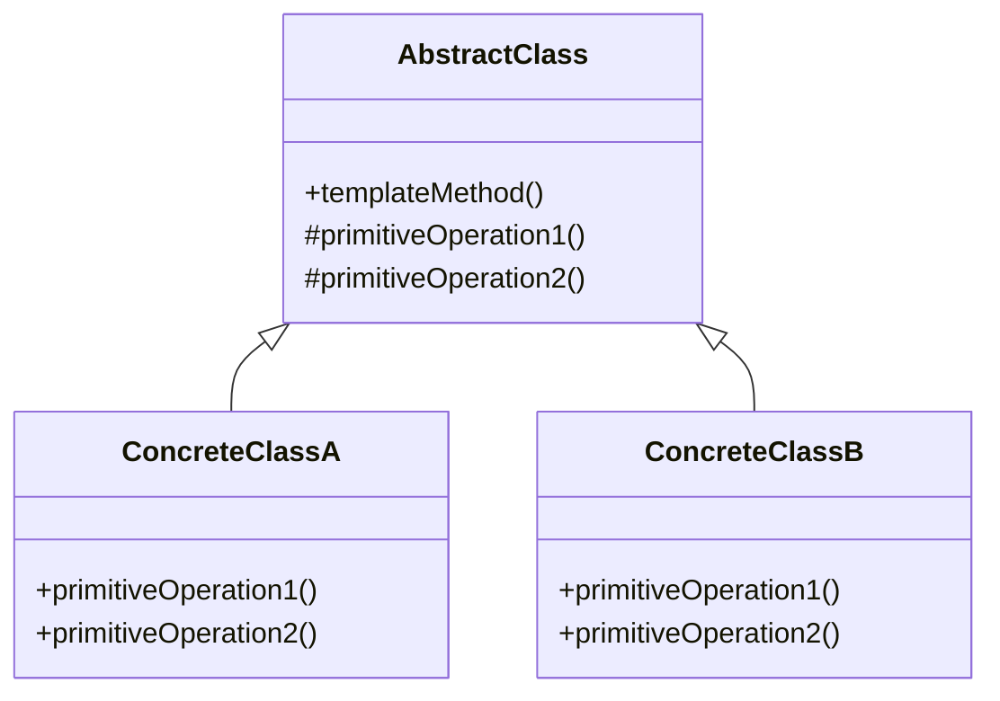
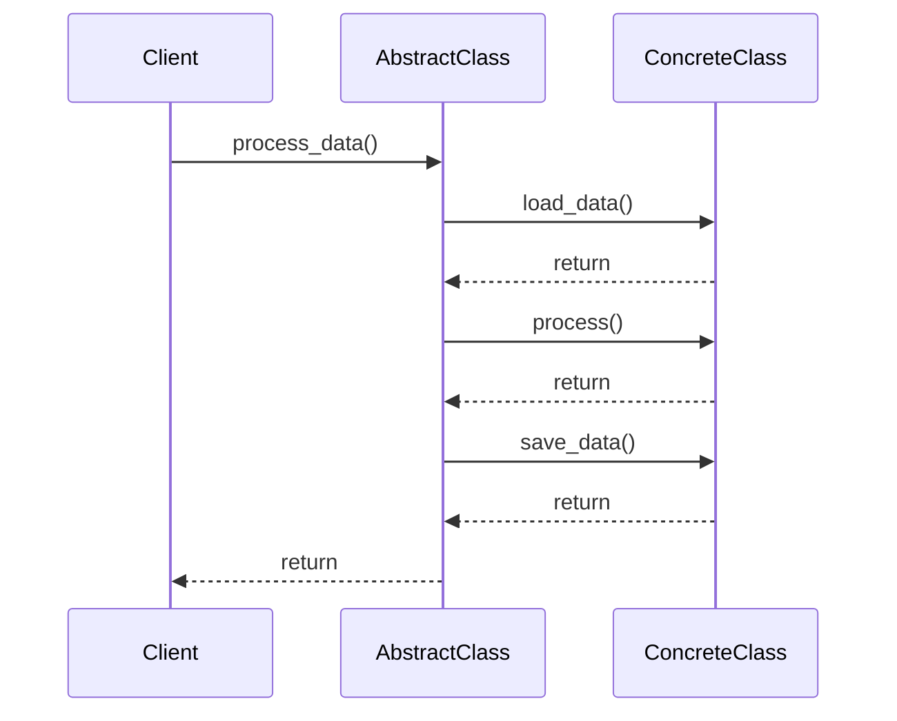

## 5.10 Template Method Pattern

The Template Method Pattern is a behavioral design pattern that defines the skeleton of an algorithm in an operation, deferring some steps to subclasses. This pattern allows subclasses to redefine certain steps of an algorithm without changing the algorithm's overall structure. It is particularly useful when you want to enforce a consistent algorithm structure across different implementations while allowing specific steps to vary.

### Intent and Motivation

The primary intent of the Template Method Pattern is to provide a framework for an algorithm, where the invariant parts are defined in a base class, and the variant parts are implemented in derived classes. This separation of concerns allows for code reuse and flexibility, as the algorithm's structure is controlled by the base class, while specific steps can be customized by subclasses.

#### Key Motivations:
- **Control Over Algorithm Structure**: By defining the skeleton of an algorithm in a base class, you ensure that the overall structure remains consistent across different implementations.
- **Flexibility in Specific Steps**: Subclasses can override specific steps of the algorithm, providing flexibility and customization without altering the core structure.
- **Code Reuse**: Common algorithmic steps are implemented once in the base class, promoting reuse and reducing duplication.
- **Simplified Maintenance**: Changes to the algorithm's structure are centralized in the base class, making maintenance easier and less error-prone.

### Pattern Structure

The Template Method Pattern involves the following components:

1. **Abstract Class**: This class defines the template method and declares abstract primitive operations that subclasses must implement.
2. **Template Method**: A method defined in the abstract class that outlines the algorithm's structure. It calls the primitive operations, some of which are abstract and must be implemented by subclasses.
3. **Concrete Subclasses**: These classes implement the primitive operations to provide specific behavior for the algorithm's steps.

#### Structure Diagram

Below is a Mermaid.js diagram illustrating the structure of the Template Method Pattern:



- **AbstractClass**: Contains the `templateMethod()` and abstract methods `primitiveOperation1()` and `primitiveOperation2()`.
- **ConcreteClassA** and **ConcreteClassB**: Implement the abstract methods to provide specific behavior.

### Python Implementation

Let's implement a Python application that processes data from different sources (e.g., files, databases, web services) using the Template Method Pattern.

#### Abstract Class

We'll start by defining an abstract class `DataProcessor` that outlines the template method `process_data()` and declares abstract methods for specific steps.

```python
from abc import ABC, abstractmethod

class DataProcessor(ABC):
    def process_data(self):
        self.load_data()
        self.process()
        self.save_data()

    @abstractmethod
    def load_data(self):
        pass

    @abstractmethod
    def process(self):
        pass

    @abstractmethod
    def save_data(self):
        pass
```

- **`process_data()`**: The template method that defines the algorithm's structure.
- **`load_data()`, `process()`, `save_data()`**: Abstract methods that subclasses must implement.

#### Concrete Subclasses

Now, let's create concrete subclasses that implement the abstract methods for different data sources.

```python
class FileDataProcessor(DataProcessor):
    def load_data(self):
        print("Loading data from a file.")

    def process(self):
        print("Processing file data.")

    def save_data(self):
        print("Saving processed file data.")

class DatabaseDataProcessor(DataProcessor):
    def load_data(self):
        print("Loading data from a database.")

    def process(self):
        print("Processing database data.")

    def save_data(self):
        print("Saving processed database data.")
```

- **`FileDataProcessor`**: Implements data processing steps for files.
- **`DatabaseDataProcessor`**: Implements data processing steps for databases.

#### Usage Example

Let's see how we can use these classes to process data from different sources.

```python
def main():
    file_processor = FileDataProcessor()
    file_processor.process_data()

    print("\n")

    db_processor = DatabaseDataProcessor()
    db_processor.process_data()

if __name__ == "__main__":
    main()
```

**Output:**

```
Loading data from a file.
Processing file data.
Saving processed file data.

Loading data from a database.
Processing database data.
Saving processed database data.
```

### Benefits of the Template Method Pattern

- **Code Reuse**: The invariant parts of the algorithm are implemented once in the base class, promoting reuse and reducing duplication.
- **Consistent Algorithm Structure**: The template method ensures that the algorithm's structure remains consistent across different implementations.
- **Flexibility**: Subclasses can override specific steps, providing flexibility and customization without altering the core structure.
- **Simplified Maintenance**: Changes to the algorithm's structure are centralized in the base class, making maintenance easier and less error-prone.

### Potential Issues

While the Template Method Pattern offers several benefits, it also has potential drawbacks:

- **Restrictive Inheritance Hierarchy**: The pattern relies on inheritance, which can lead to a rigid class hierarchy. Overuse of inheritance can make the design inflexible and difficult to modify.
- **Overuse**: Applying the Template Method Pattern inappropriately can lead to a design that is overly complex and difficult to understand.

### Best Practices

- **Use Abstract Base Classes**: Utilize Python's `abc` module to define abstract base classes, ensuring that subclasses implement the required methods.
- **Document Expected Behavior**: Clearly document the expected behavior of primitive operations to guide subclass implementations.
- **Limit Inheritance Depth**: Avoid deep inheritance hierarchies to maintain flexibility and simplicity in the design.

### Encouraging Application

Consider using the Template Method Pattern when there are invariant parts of an algorithm across various implementations. It is particularly useful in scenarios where you want to enforce a consistent algorithm structure while allowing specific steps to vary.

### Try It Yourself

Experiment with the provided code examples by adding new data sources, such as web services or APIs. Implement new subclasses that define the `load_data()`, `process()`, and `save_data()` methods for these sources. This exercise will help you understand how the Template Method Pattern promotes code reuse and flexibility.

### Visualizing the Template Method Pattern

To further illustrate the Template Method Pattern, let's visualize the process flow using a sequence diagram:



This diagram shows the interaction between the client, the abstract class, and the concrete class during the execution of the template method.

### Knowledge Check

Before we conclude, let's reinforce our understanding of the Template Method Pattern with a few questions:

- What is the primary intent of the Template Method Pattern?
- How does the Template Method Pattern promote code reuse?
- What are the potential drawbacks of using the Template Method Pattern?
- When should you consider using the Template Method Pattern?

### Summary

The Template Method Pattern is a powerful tool for defining the skeleton of an algorithm while allowing flexibility in specific steps. By separating the invariant parts of an algorithm from the variant parts, this pattern promotes code reuse, consistency, and flexibility. However, it is essential to use this pattern judiciously to avoid a restrictive inheritance hierarchy and overly complex designs. By following best practices and understanding the pattern's benefits and potential issues, you can effectively apply the Template Method Pattern in your Python projects.

## Quiz Time!



### What is the primary intent of the Template Method Pattern?

- [x] To define the skeleton of an algorithm, allowing subclasses to redefine specific steps.
- [ ] To encapsulate a request as an object, allowing parameterization and queuing.
- [ ] To provide a way to access elements of a collection sequentially.
- [ ] To define a one-to-many dependency between objects.

> **Explanation:** The Template Method Pattern is designed to define the skeleton of an algorithm in a base class, allowing subclasses to redefine specific steps without changing the algorithm's structure.

### How does the Template Method Pattern promote code reuse?

- [x] By implementing common algorithmic steps once in the base class.
- [ ] By allowing multiple inheritance for flexibility.
- [ ] By using interfaces to define behavior.
- [ ] By encapsulating behavior in separate classes.

> **Explanation:** The Template Method Pattern promotes code reuse by implementing the invariant parts of an algorithm in the base class, allowing subclasses to reuse this code while providing specific implementations for the variant parts.

### What is a potential drawback of using the Template Method Pattern?

- [x] It can lead to a restrictive inheritance hierarchy.
- [ ] It requires the use of multiple inheritance.
- [ ] It makes the code less readable.
- [ ] It cannot be used with abstract classes.

> **Explanation:** One potential drawback of the Template Method Pattern is that it relies on inheritance, which can lead to a rigid class hierarchy and reduced flexibility.

### When should you consider using the Template Method Pattern?

- [x] When there are invariant parts of an algorithm across various implementations.
- [ ] When you need to encapsulate a request as an object.
- [ ] When you want to provide a way to access elements of a collection sequentially.
- [ ] When you need to define a one-to-many dependency between objects.

> **Explanation:** The Template Method Pattern is useful when there are invariant parts of an algorithm that need to be consistent across different implementations, while allowing specific steps to vary.

### What is the role of the template method in the Template Method Pattern?

- [x] It defines the algorithm's structure and calls the primitive operations.
- [ ] It encapsulates a request as an object.
- [ ] It provides a way to access elements of a collection sequentially.
- [ ] It defines a one-to-many dependency between objects.

> **Explanation:** The template method in the Template Method Pattern defines the algorithm's structure and calls the primitive operations, some of which are abstract and must be implemented by subclasses.

### Which Python module is recommended for defining abstract base classes in the Template Method Pattern?

- [x] abc
- [ ] functools
- [ ] itertools
- [ ] collections

> **Explanation:** The `abc` module in Python is recommended for defining abstract base classes, providing a framework for creating abstract methods that must be implemented by subclasses.

### How can the Template Method Pattern simplify maintenance?

- [x] By centralizing changes to the algorithm's structure in the base class.
- [ ] By allowing multiple inheritance for flexibility.
- [ ] By using interfaces to define behavior.
- [ ] By encapsulating behavior in separate classes.

> **Explanation:** The Template Method Pattern simplifies maintenance by centralizing changes to the algorithm's structure in the base class, making it easier to update and modify the algorithm without affecting subclasses.

### What is a best practice when using the Template Method Pattern?

- [x] Clearly document the expected behavior of primitive operations.
- [ ] Use multiple inheritance to increase flexibility.
- [ ] Avoid using abstract base classes.
- [ ] Implement all methods in the base class.

> **Explanation:** A best practice when using the Template Method Pattern is to clearly document the expected behavior of primitive operations, guiding subclass implementations and ensuring consistency.

### What is the main benefit of using the Template Method Pattern?

- [x] It promotes code reuse and enforces a consistent algorithm structure.
- [ ] It allows multiple inheritance for flexibility.
- [ ] It makes the code less readable.
- [ ] It cannot be used with abstract classes.

> **Explanation:** The main benefit of the Template Method Pattern is that it promotes code reuse and enforces a consistent algorithm structure, allowing subclasses to provide specific implementations for variant parts.

### True or False: The Template Method Pattern allows subclasses to change the overall structure of the algorithm.

- [ ] True
- [x] False

> **Explanation:** False. The Template Method Pattern allows subclasses to redefine specific steps of an algorithm, but the overall structure is defined in the base class and remains unchanged.



Remember, this is just the beginning. As you progress, you'll build more complex and interactive applications using the Template Method Pattern. Keep experimenting, stay curious, and enjoy the journey!
