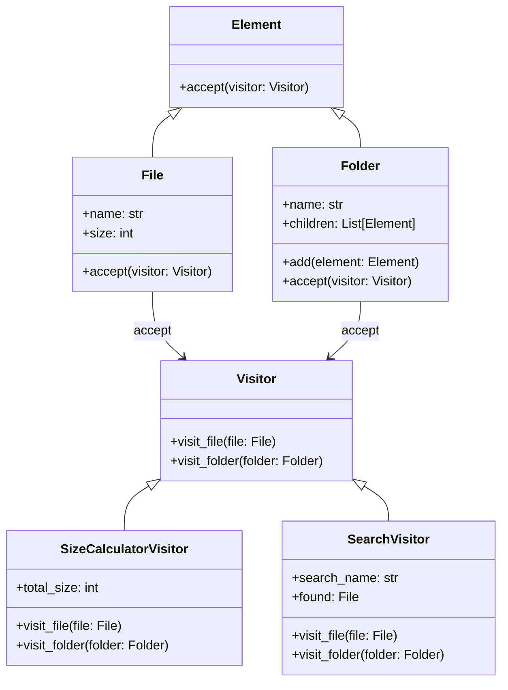

## 5.11.1 Implementing Visitor in Python

The Visitor Pattern is a powerful design pattern that allows you to separate algorithms from the objects on which they operate. This separation enables you to add new operations without modifying the objects themselves, promoting flexibility and maintainability in your codebase. In this section, we will explore how to implement the Visitor Pattern in Python, using a practical example involving file system elements such as files and folders. We will also discuss the concept of double dispatch, the advantages of using the Visitor Pattern, and best practices to follow.

### Understanding the Visitor Pattern

The Visitor Pattern is part of the behavioral design patterns family. It allows you to define a new operation without changing the classes of the elements on which it operates. This is particularly useful when you have a complex object structure and you need to perform various operations on these objects.

#### Key Components of the Visitor Pattern

1. **Element Interface**: This defines an `accept` method that takes a visitor as an argument. The `accept` method is crucial for enabling double dispatch.

2. **Concrete Element Classes**: These are the classes that implement the Element interface. Each concrete element class implements the `accept` method to call the visitor's method corresponding to the element's class.

3. **Visitor Interface**: This interface declares a set of visiting methods for each concrete element class. Each method corresponds to a specific operation that can be performed on an element.

4. **Concrete Visitor Classes**: These classes implement the visitor interface and define the operations to be performed on the elements.

### Implementing the Visitor Pattern in Python

Let's dive into a practical implementation of the Visitor Pattern in Python. We will use a file system example with files and folders as elements, and visitors that perform operations like size calculation and searching.

#### Step 1: Define the Element Interface

First, we need to define an Element interface with an `accept` method. In Python, we can use an abstract base class to define this interface.

```python
from abc import ABC, abstractmethod

class Element(ABC):
    @abstractmethod
    def accept(self, visitor):
        pass
```

#### Step 2: Implement Concrete Element Classes

Next, we implement concrete element classes for files and folders. Each class implements the `accept` method to call the appropriate visitor method.

```python
class File(Element):
    def __init__(self, name, size):
        self.name = name
        self.size = size

    def accept(self, visitor):
        visitor.visit_file(self)

class Folder(Element):
    def __init__(self, name):
        self.name = name
        self.children = []

    def add(self, element):
        self.children.append(element)

    def accept(self, visitor):
        visitor.visit_folder(self)
```

#### Step 3: Define the Visitor Interface

The Visitor interface declares a visiting method for each concrete element class. This allows the visitor to perform operations specific to each element type.

```python
class Visitor(ABC):
    @abstractmethod
    def visit_file(self, file):
        pass

    @abstractmethod
    def visit_folder(self, folder):
        pass
```

#### Step 4: Implement Concrete Visitor Classes

Concrete visitor classes implement the visitor interface and define specific operations. Let's create a visitor that calculates the total size of files in the file system.

```python
class SizeCalculatorVisitor(Visitor):
    def __init__(self):
        self.total_size = 0

    def visit_file(self, file):
        self.total_size += file.size

    def visit_folder(self, folder):
        for child in folder.children:
            child.accept(self)
```

To add another operation, such as searching for a file by name, we can create another visitor.

```python
class SearchVisitor(Visitor):
    def __init__(self, search_name):
        self.search_name = search_name
        self.found = None

    def visit_file(self, file):
        if file.name == self.search_name:
            self.found = file

    def visit_folder(self, folder):
        for child in folder.children:
            child.accept(self)
```

### Double Dispatch in the Visitor Pattern

The Visitor Pattern relies on a technique called double dispatch. This technique allows the program to determine the correct method to call at runtime based on the types of two objects involved in the call: the element and the visitor.

In our implementation, the `accept` method in each element class takes a visitor as an argument and calls the appropriate visitor method. This ensures that the correct operation is performed based on the element's class.

### Advantages of the Visitor Pattern

- **Separation of Concerns**: The Visitor Pattern separates algorithms from the objects on which they operate, making it easier to manage and extend both independently.
- **Ease of Adding New Operations**: You can add new operations by simply creating new visitor classes without modifying existing element classes.
- **Encapsulation of Operations**: Operations are encapsulated in visitor classes, promoting cleaner and more organized code.

### Best Practices for Using the Visitor Pattern

- **Minimize Dependency**: Keep dependencies between elements and visitors to a minimum. Elements should only know about the visitor interface, not specific visitor implementations.
- **Clear Documentation**: Clearly document the responsibilities of each visitor to ensure that operations are well-understood and correctly implemented.
- **Consider Alternatives**: The Visitor Pattern is not always the best choice. Consider alternatives if the object structure is likely to change frequently, as adding new element classes requires modifying all visitors.

### Try It Yourself

Now that we've covered the basics of implementing the Visitor Pattern in Python, it's time for you to try it yourself. Here are some suggestions for modifications and experiments:

- **Add a New Visitor**: Create a visitor that counts the number of files in the file system.
- **Extend the Element Classes**: Add new properties or methods to the `File` and `Folder` classes and update the visitors accordingly.
- **Experiment with Different Structures**: Try implementing the Visitor Pattern with different object structures, such as a graphical user interface or a mathematical expression tree.

### Visualizing the Visitor Pattern

To better understand the Visitor Pattern, let's visualize the interaction between elements and visitors using a class diagram.



This diagram illustrates the relationships between the element and visitor classes, highlighting how the `accept` method facilitates double dispatch.

### References and Further Reading

- [Design Patterns: Elements of Reusable Object-Oriented Software](https://en.wikipedia.org/wiki/Design_Patterns) by Erich Gamma, Richard Helm, Ralph Johnson, and John Vlissides.
- [Python's Abstract Base Classes](https://docs.python.org/3/library/abc.html) - Official Python documentation on abstract base classes.
- [Visitor Pattern on Refactoring Guru](https://refactoring.guru/design-patterns/visitor) - A comprehensive guide to the Visitor Pattern with examples in various languages.

### Knowledge Check

Before we conclude, let's reinforce what we've learned with a few questions and exercises.

1. **What is the primary purpose of the Visitor Pattern?**
2. **How does double dispatch work in the Visitor Pattern?**
3. **What are the advantages of using the Visitor Pattern?**
4. **Create a new visitor that performs a different operation on the file system elements.**

### Embrace the Journey

Remember, mastering design patterns is a journey, not a destination. As you continue to explore and implement patterns like the Visitor Pattern, you'll develop a deeper understanding of software design principles and become a more effective programmer. Keep experimenting, stay curious, and enjoy the journey!

## Quiz Time!



### What is the primary purpose of the Visitor Pattern?

- [x] To separate algorithms from the objects on which they operate.
- [ ] To encapsulate object creation.
- [ ] To manage object lifecycles.
- [ ] To handle object serialization.

> **Explanation:** The Visitor Pattern allows you to separate algorithms from the objects they operate on, making it easier to add new operations without changing the objects.

### How does double dispatch work in the Visitor Pattern?

- [x] It determines the correct method to call based on the types of both the element and the visitor.
- [ ] It uses a single method call to determine the operation.
- [ ] It relies on inheritance to dispatch methods.
- [ ] It uses a lookup table to find the method.

> **Explanation:** Double dispatch involves calling a method on the visitor from the element, allowing the operation to be determined by the types of both the element and the visitor.

### Which of the following is an advantage of the Visitor Pattern?

- [x] It simplifies adding new operations over the object structure.
- [ ] It reduces the number of classes in the system.
- [ ] It makes object creation more efficient.
- [ ] It improves object serialization.

> **Explanation:** The Visitor Pattern makes it easy to add new operations without modifying existing element classes, promoting flexibility and maintainability.

### What is a potential drawback of the Visitor Pattern?

- [x] Adding new element classes requires modifying all visitors.
- [ ] It increases the number of classes in the system.
- [ ] It makes object creation more complex.
- [ ] It reduces code readability.

> **Explanation:** While the Visitor Pattern simplifies adding new operations, adding new element classes requires updating all existing visitors, which can be a drawback.

### In the Visitor Pattern, what is the role of the `accept` method?

- [x] To enable double dispatch by calling the appropriate visitor method.
- [ ] To create a new visitor instance.
- [ ] To serialize the element.
- [ ] To manage object lifecycles.

> **Explanation:** The `accept` method is used to call the appropriate visitor method, enabling double dispatch and allowing the correct operation to be performed.

### What is the benefit of encapsulating operations in visitor classes?

- [x] It promotes cleaner and more organized code.
- [ ] It reduces the number of classes in the system.
- [ ] It makes object creation more efficient.
- [ ] It improves object serialization.

> **Explanation:** Encapsulating operations in visitor classes helps keep the code organized and separate from the element classes, making it easier to manage and extend.

### How can you minimize dependencies between elements and visitors?

- [x] By ensuring elements only know about the visitor interface, not specific implementations.
- [ ] By using global variables for communication.
- [ ] By hardcoding visitor operations in elements.
- [ ] By using singletons for all visitors.

> **Explanation:** To minimize dependencies, elements should only interact with the visitor interface, avoiding knowledge of specific visitor implementations.

### What is a common use case for the Visitor Pattern?

- [x] Performing operations on a complex object structure.
- [ ] Managing object lifecycles.
- [ ] Creating objects efficiently.
- [ ] Serializing objects.

> **Explanation:** The Visitor Pattern is commonly used to perform operations on complex object structures, such as traversing a file system or processing a syntax tree.

### What should you consider before using the Visitor Pattern?

- [x] Whether the object structure is likely to change frequently.
- [ ] The number of classes in the system.
- [ ] The efficiency of object creation.
- [ ] The complexity of object serialization.

> **Explanation:** If the object structure is likely to change frequently, the Visitor Pattern may not be the best choice, as adding new element classes requires updating all visitors.

### True or False: The Visitor Pattern is always the best choice for adding new operations to an object structure.

- [ ] True
- [x] False

> **Explanation:** The Visitor Pattern is not always the best choice, especially if the object structure is subject to frequent changes, as it requires updating all visitors for new element classes.


