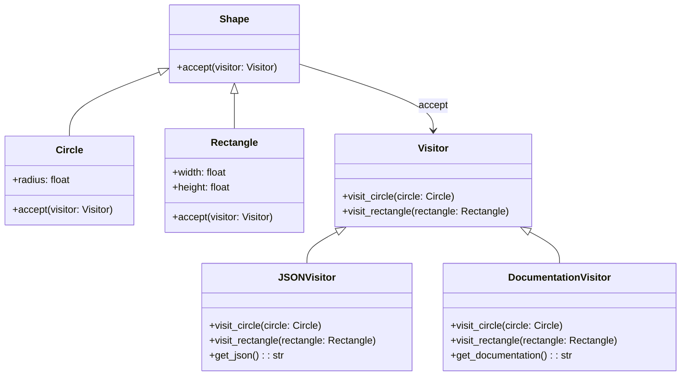

## 5.11.2 Operations on Object Structures

In software development, we often encounter scenarios where we need to perform various operations on a set of objects with different types. The Visitor Pattern is a powerful design pattern that allows us to add new operations to object structures without modifying the elements themselves. This pattern is particularly useful when dealing with complex object structures where the operations on the objects are subject to change more frequently than the object structure itself.

### Understanding the Visitor Pattern

The Visitor Pattern involves two main components: the Visitor and the Element. The Element is the object structure that we want to operate on, and the Visitor is the object that performs the operation. The key idea is to separate the algorithm from the object structure, allowing new operations to be added without altering the existing structure.

#### Key Concepts

- **Element**: Represents an object in the structure. It defines an `accept` method that takes a visitor as an argument.
- **Visitor**: Defines an interface with a `visit` method for each type of element. This method performs the operation on the element.

### How the Visitor Pattern Helps Add Operations

The Visitor Pattern allows us to define a new operation without changing the classes of the elements on which it operates. This is achieved by creating a new Visitor class that implements the operation. The elements remain unchanged, and we simply add a new Visitor to perform the new operation.

#### Example: Serializing Elements to JSON

Let's consider a scenario where we have a set of elements representing different shapes, and we want to serialize these shapes to JSON. We can use the Visitor Pattern to achieve this without modifying the shape classes.

```python
import json

class Shape:
    def accept(self, visitor):
        pass

class Circle(Shape):
    def __init__(self, radius):
        self.radius = radius
    
    def accept(self, visitor):
        visitor.visit_circle(self)

class Rectangle(Shape):
    def __init__(self, width, height):
        self.width = width
        self.height = height
    
    def accept(self, visitor):
        visitor.visit_rectangle(self)

class Visitor:
    def visit_circle(self, circle):
        pass
    
    def visit_rectangle(self, rectangle):
        pass

class JSONVisitor(Visitor):
    def __init__(self):
        self.result = {}
    
    def visit_circle(self, circle):
        self.result['Circle'] = {'radius': circle.radius}
    
    def visit_rectangle(self, rectangle):
        self.result['Rectangle'] = {'width': rectangle.width, 'height': rectangle.height}
    
    def get_json(self):
        return json.dumps(self.result)

shapes = [Circle(5), Rectangle(4, 6)]
json_visitor = JSONVisitor()

for shape in shapes:
    shape.accept(json_visitor)

print(json_visitor.get_json())
```

In this example, we have a `JSONVisitor` that serializes `Circle` and `Rectangle` objects to JSON. The `accept` method in each shape class calls the appropriate `visit` method on the visitor, allowing the visitor to perform the serialization.

### Adding a Visitor for Documentation or Reports

Let's add another Visitor that generates documentation or reports for the shapes. This visitor will create a simple text description of each shape.

```python
class DocumentationVisitor(Visitor):
    def __init__(self):
        self.documentation = []
    
    def visit_circle(self, circle):
        self.documentation.append(f"Circle with radius {circle.radius}")
    
    def visit_rectangle(self, rectangle):
        self.documentation.append(f"Rectangle with width {rectangle.width} and height {rectangle.height}")
    
    def get_documentation(self):
        return "\n".join(self.documentation)

doc_visitor = DocumentationVisitor()

for shape in shapes:
    shape.accept(doc_visitor)

print(doc_visitor.get_documentation())
```

The `DocumentationVisitor` generates a text description for each shape, demonstrating how easy it is to add new operations using the Visitor Pattern.

### Limitations of the Visitor Pattern

While the Visitor Pattern is powerful, it has some limitations:

1. **Adding New Element Types**: When a new element type is added to the structure, all existing visitors must be updated to handle the new element. This can be cumbersome if there are many visitors.

2. **Complex Code**: If the object structure is highly dynamic, the Visitor Pattern can lead to complex and hard-to-maintain code.

### Strategies to Mitigate Issues

To address these limitations, we can use several strategies:

#### Default Implementations

We can provide default implementations in the Visitor interface for new element types. This way, if a visitor does not need to handle a new element type, it can rely on the default implementation.

```python
class Visitor:
    def visit_circle(self, circle):
        pass
    
    def visit_rectangle(self, rectangle):
        pass
    
    def visit_default(self, element):
        print(f"Default visit for {element}")

class ExtendedJSONVisitor(JSONVisitor):
    def visit_default(self, element):
        self.result['Unknown'] = str(element)

class Triangle(Shape):
    def __init__(self, base, height):
        self.base = base
        self.height = height
    
    def accept(self, visitor):
        visitor.visit_default(self)

triangle = Triangle(3, 4)
shapes.append(triangle)

extended_json_visitor = ExtendedJSONVisitor()

for shape in shapes:
    shape.accept(extended_json_visitor)

print(extended_json_visitor.get_json())
```

In this example, the `ExtendedJSONVisitor` provides a default implementation for unknown elements, allowing it to handle new element types gracefully.

#### Reflection in Python

Python's dynamic nature allows us to use reflection to handle new element types without modifying the visitor interface. This can be achieved using the `getattr` function to dynamically call the appropriate `visit` method.

```python
class ReflectiveVisitor(Visitor):
    def visit(self, element):
        method_name = f'visit_{element.__class__.__name__.lower()}'
        visit_method = getattr(self, method_name, self.visit_default)
        visit_method(element)

reflective_visitor = ReflectiveVisitor()

for shape in shapes:
    reflective_visitor.visit(shape)
```

The `ReflectiveVisitor` uses reflection to call the appropriate `visit` method based on the element's class name, providing flexibility in handling new element types.

### Visualizing the Visitor Pattern

To better understand the Visitor Pattern, let's visualize the interaction between elements and visitors using a class diagram.



This diagram illustrates the relationship between the `Shape` elements and the `Visitor` classes. The `accept` method in each shape class allows the visitor to perform operations on the shape.

### Try It Yourself

Now that we've covered the basics of the Visitor Pattern, try modifying the code examples to add new shapes or visitors. For instance, you could add a `Triangle` shape and a `CSVVisitor` that serializes shapes to CSV format. Experiment with different visitors to see how they interact with the elements.

### Knowledge Check

- **What is the primary benefit of using the Visitor Pattern?**
- **How does the Visitor Pattern help in adding new operations?**
- **What are the limitations of the Visitor Pattern?**
- **How can default implementations help mitigate the limitations of the Visitor Pattern?**
- **How can reflection be used in Python to handle new element types?**

### Conclusion

The Visitor Pattern is a powerful tool for adding new operations to object structures without modifying the elements themselves. By separating the algorithm from the object structure, we can easily extend the functionality of our software without altering the existing code. However, it's important to be aware of the limitations of the pattern and use strategies like default implementations and reflection to mitigate these issues. Keep experimenting with the Visitor Pattern to discover its full potential in your projects.

## Quiz Time!



### What is the primary benefit of using the Visitor Pattern?

- [x] It allows adding new operations without modifying existing elements.
- [ ] It simplifies the addition of new element types.
- [ ] It reduces the complexity of the object structure.
- [ ] It enhances the performance of the application.

> **Explanation:** The Visitor Pattern allows adding new operations to object structures without modifying the elements themselves, which is its primary benefit.

### How does the Visitor Pattern help in adding new operations?

- [x] By defining new Visitor classes for each operation.
- [ ] By modifying the existing element classes.
- [ ] By using inheritance to extend element classes.
- [ ] By reducing the number of classes in the object structure.

> **Explanation:** The Visitor Pattern helps in adding new operations by defining new Visitor classes, which implement the operations without altering the existing element classes.

### What is a limitation of the Visitor Pattern?

- [x] Adding new element types requires updating all existing visitors.
- [ ] It makes the codebase more complex.
- [ ] It requires modifying existing element classes.
- [ ] It reduces the flexibility of the object structure.

> **Explanation:** A limitation of the Visitor Pattern is that adding new element types requires updating all existing visitors to handle the new types.

### How can default implementations help mitigate the limitations of the Visitor Pattern?

- [x] By providing a fallback method for unhandled element types.
- [ ] By allowing visitors to modify element classes.
- [ ] By reducing the number of visitors needed.
- [ ] By simplifying the object structure.

> **Explanation:** Default implementations provide a fallback method for unhandled element types, allowing visitors to handle new types without explicit updates.

### How can reflection be used in Python to handle new element types?

- [x] By dynamically calling the appropriate visit method using `getattr`.
- [ ] By modifying the element classes at runtime.
- [ ] By reducing the number of visitor methods needed.
- [ ] By simplifying the object structure.

> **Explanation:** Reflection can be used in Python to dynamically call the appropriate visit method using `getattr`, allowing visitors to handle new element types without explicit updates.

### What method do elements implement to interact with visitors?

- [x] `accept`
- [ ] `visit`
- [ ] `operate`
- [ ] `process`

> **Explanation:** Elements implement the `accept` method to interact with visitors, allowing the visitor to perform operations on the element.

### What is a potential downside of using the Visitor Pattern in a dynamic object structure?

- [x] It can lead to complex and hard-to-maintain code.
- [ ] It simplifies the addition of new operations.
- [ ] It reduces the number of classes needed.
- [ ] It enhances the performance of the application.

> **Explanation:** In a dynamic object structure, the Visitor Pattern can lead to complex and hard-to-maintain code due to the need to update visitors for new element types.

### What is the role of the Visitor interface?

- [x] To define visit methods for each element type.
- [ ] To modify the element classes.
- [ ] To simplify the object structure.
- [ ] To enhance the performance of the application.

> **Explanation:** The Visitor interface defines visit methods for each element type, allowing visitors to perform operations on the elements.

### What is the purpose of the `get_json` method in the JSONVisitor class?

- [x] To return the serialized JSON representation of the elements.
- [ ] To modify the elements.
- [ ] To add new element types.
- [ ] To enhance the performance of the application.

> **Explanation:** The `get_json` method in the JSONVisitor class returns the serialized JSON representation of the elements, demonstrating the operation performed by the visitor.

### True or False: The Visitor Pattern allows adding new element types without modifying existing visitors.

- [ ] True
- [x] False

> **Explanation:** False. The Visitor Pattern requires updating existing visitors to handle new element types, which is one of its limitations.


