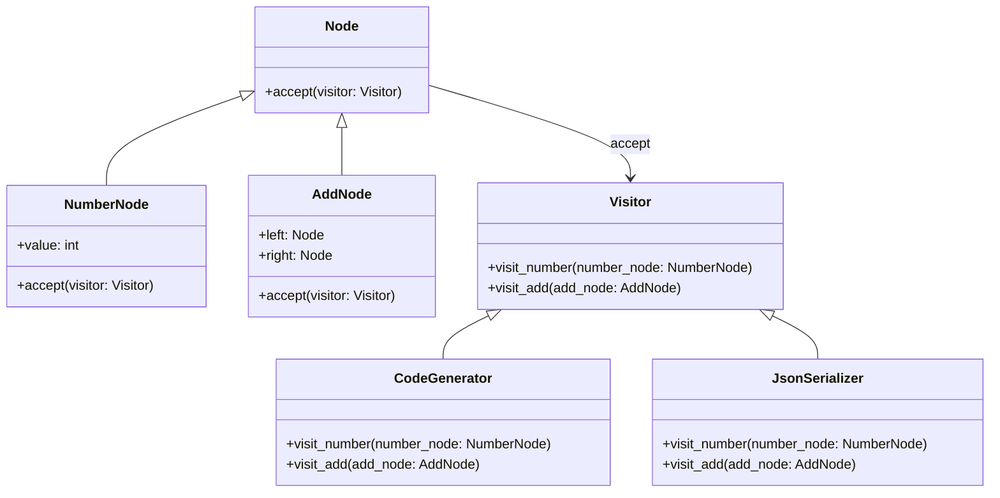

## 5.11.3 Use Cases and Examples

The Visitor pattern is a powerful design pattern that allows you to separate algorithms from the objects on which they operate. This separation is particularly useful when you have a complex object structure and need to perform various operations on these objects. In this section, we will delve into practical use cases of the Visitor pattern, such as compiler design and object serialization, and provide detailed Python code examples to illustrate its application.

### Understanding the Visitor Pattern

Before diving into the use cases, let's briefly revisit the core concept of the Visitor pattern. The Visitor pattern involves two main components: the Visitor and the Element. The Element represents the objects that can be visited, while the Visitor defines operations to be performed on these elements. The pattern allows you to add new operations to existing object structures without modifying the structures themselves.

### Use Case 1: Compiler Design

In compiler design, the Visitor pattern is often used to traverse and process nodes of an abstract syntax tree (AST). The AST is a tree representation of the abstract syntactic structure of source code. Each node in the tree represents a construct occurring in the source code. The Visitor pattern can be used to perform operations such as code generation, optimization, or analysis on these nodes.

#### Example: Code Generation

Let's consider a simple example where we use the Visitor pattern to generate code from an AST. We'll define a basic AST structure for arithmetic expressions and implement a Visitor to generate code.

```python
class Node:
    def accept(self, visitor):
        pass

class NumberNode(Node):
    def __init__(self, value):
        self.value = value

    def accept(self, visitor):
        return visitor.visit_number(self)

class AddNode(Node):
    def __init__(self, left, right):
        self.left = left
        self.right = right

    def accept(self, visitor):
        return visitor.visit_add(self)

class Visitor:
    def visit_number(self, number_node):
        pass

    def visit_add(self, add_node):
        pass

class CodeGenerator(Visitor):
    def visit_number(self, number_node):
        return str(number_node.value)

    def visit_add(self, add_node):
        left_code = add_node.left.accept(self)
        right_code = add_node.right.accept(self)
        return f"({left_code} + {right_code})"

ast = AddNode(NumberNode(1), AddNode(NumberNode(2), NumberNode(3)))
code_generator = CodeGenerator()
generated_code = ast.accept(code_generator)
print(generated_code)  # Output: (1 + (2 + 3))
```

In this example, we define a simple AST with `NumberNode` and `AddNode`. The `CodeGenerator` visitor traverses the tree and generates the corresponding arithmetic expression in string format. The Visitor pattern allows us to easily extend the functionality, such as adding support for subtraction or multiplication, without modifying the existing node classes.

### Use Case 2: Object Serialization

Another practical application of the Visitor pattern is object serialization, where objects are converted to different data formats, such as JSON or XML. The Visitor pattern can be used to traverse an object structure and serialize each element according to its type.

#### Example: JSON Serialization

Let's implement a Visitor that serializes objects to JSON format.

```python
import json

class JsonSerializer(Visitor):
    def visit_number(self, number_node):
        return number_node.value

    def visit_add(self, add_node):
        return {
            "operation": "add",
            "left": add_node.left.accept(self),
            "right": add_node.right.accept(self)
        }

ast = AddNode(NumberNode(1), AddNode(NumberNode(2), NumberNode(3)))
json_serializer = JsonSerializer()
serialized_data = ast.accept(json_serializer)
print(json.dumps(serialized_data, indent=2))
```

In this example, the `JsonSerializer` visitor converts the AST into a JSON-compatible dictionary. The Visitor pattern makes it easy to add support for new node types or serialization formats by simply extending the visitor.

### Benefits of the Visitor Pattern

The Visitor pattern offers several benefits, particularly in scenarios involving complex object structures:

- **Separation of Concerns**: The Visitor pattern separates the operations from the object structure, allowing you to define new operations without modifying the objects themselves. This separation enhances code maintainability and readability.

- **Ease of Adding New Functionalities**: Adding new operations is straightforward with the Visitor pattern. You can introduce new visitors without altering the existing object structure, making it easier to extend the system.

- **Flexibility**: The pattern provides flexibility in defining operations. You can implement multiple visitors to perform different tasks on the same object structure, such as code generation, optimization, or serialization.

- **Clean Code**: The Visitor pattern promotes clean code by encapsulating operations within visitors, reducing the need for complex conditional logic within the object classes.

### When to Use the Visitor Pattern

Consider using the Visitor pattern in the following scenarios:

- **Complex Object Structures**: When working with complex object structures, such as trees or graphs, the Visitor pattern can simplify operations on these structures.

- **Multiple Operations**: If you need to perform various operations on the same object structure, the Visitor pattern allows you to define these operations separately, enhancing modularity.

- **Frequent Changes to Operations**: When operations on an object structure are likely to change frequently, the Visitor pattern provides a flexible way to manage these changes without modifying the structure itself.

### Visualizing the Visitor Pattern

To better understand the interaction between the Visitor and Elements, let's visualize the process using a class diagram.



In this diagram, `Node` is the base class for elements, and `Visitor` is the base class for visitors. `NumberNode` and `AddNode` are concrete elements, while `CodeGenerator` and `JsonSerializer` are concrete visitors. The `accept` method in `Node` allows visitors to perform operations on the elements.

### Try It Yourself

Experiment with the Visitor pattern by extending the examples provided. Here are some suggestions:

- **Add New Operations**: Implement a new visitor that performs a different operation, such as evaluating the expression represented by the AST.

- **Support New Node Types**: Extend the AST with new node types, such as `SubtractNode` or `MultiplyNode`, and update the visitors to handle these new types.

- **Serialize to XML**: Implement a visitor that serializes the AST to XML format instead of JSON.

### Conclusion

The Visitor pattern is a versatile design pattern that offers a clean and flexible way to perform operations on complex object structures. By separating the operations from the objects, the Visitor pattern enhances code maintainability and extensibility. Whether you're working on compiler design, object serialization, or any other domain involving complex structures, the Visitor pattern can be a valuable tool in your software design toolkit.

Remember, this is just the beginning. As you continue to explore design patterns, you'll discover new ways to apply them to solve real-world problems. Keep experimenting, stay curious, and enjoy the journey!

## Quiz Time!



### What is a primary benefit of using the Visitor pattern?

- [x] Separation of operations from object structures
- [ ] Simplification of object creation
- [ ] Reduction of memory usage
- [ ] Improved network performance

> **Explanation:** The Visitor pattern separates operations from the object structures, allowing for easier addition of new operations without modifying the objects.

### In the context of the Visitor pattern, what is an Element?

- [x] An object that can be visited by a Visitor
- [ ] A method that performs operations on objects
- [ ] A function that generates code
- [ ] A class that serializes data

> **Explanation:** An Element is an object that can be visited by a Visitor, allowing operations to be performed on it.

### How does the Visitor pattern enhance code extensibility?

- [x] By allowing new operations to be added without modifying existing structures
- [ ] By reducing the number of classes needed
- [ ] By increasing the speed of execution
- [ ] By minimizing the use of memory

> **Explanation:** The Visitor pattern allows new operations to be added by defining new visitors, without altering the existing object structures.

### What is a common use case for the Visitor pattern?

- [x] Compiler design
- [ ] Database management
- [ ] Network communication
- [ ] User interface design

> **Explanation:** The Visitor pattern is commonly used in compiler design to traverse and process nodes of an abstract syntax tree.

### Which of the following is NOT a component of the Visitor pattern?

- [ ] Visitor
- [ ] Element
- [x] Factory
- [ ] Node

> **Explanation:** The Factory is not a component of the Visitor pattern; it involves Visitors and Elements (or Nodes).

### What does the `accept` method do in the Visitor pattern?

- [x] Allows a Visitor to perform operations on an Element
- [ ] Creates a new Visitor instance
- [ ] Serializes an object to JSON
- [ ] Optimizes the performance of a program

> **Explanation:** The `accept` method allows a Visitor to perform operations on an Element by passing itself to the Visitor.

### In the provided code example, what does the `visit_add` method do?

- [x] Generates code for an addition operation
- [ ] Serializes a number to JSON
- [ ] Creates a new Node
- [ ] Optimizes an arithmetic expression

> **Explanation:** The `visit_add` method generates code for an addition operation by combining the code for the left and right nodes.

### How can you add support for a new node type in the Visitor pattern?

- [x] By defining a new method in the Visitor for the node type
- [ ] By modifying the existing Visitor methods
- [ ] By creating a new Visitor class
- [ ] By deleting the existing nodes

> **Explanation:** To add support for a new node type, you define a new method in the Visitor to handle the new node.

### What is the output of the `CodeGenerator` visitor in the example?

- [x] (1 + (2 + 3))
- [ ] 1 + 2 + 3
- [ ] (1 + 2 + 3)
- [ ] (1 + 2) + 3

> **Explanation:** The `CodeGenerator` visitor outputs the expression `(1 + (2 + 3))` based on the structure of the AST.

### True or False: The Visitor pattern is suitable for scenarios where the object structure frequently changes.

- [ ] True
- [x] False

> **Explanation:** The Visitor pattern is not ideal for scenarios where the object structure frequently changes, as it requires modifying all visitors to accommodate the new structure.


