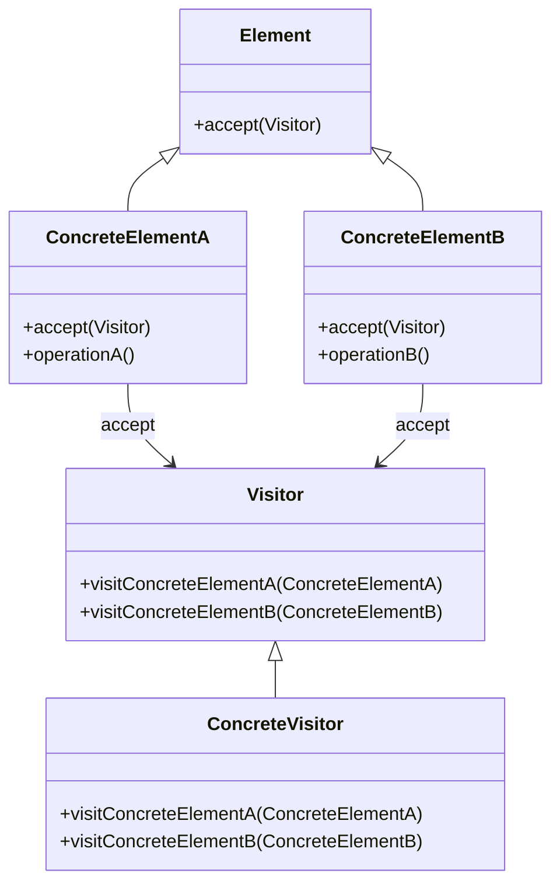
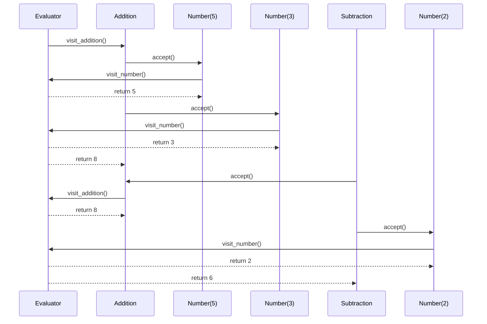

## 5.11 Visitor Pattern

**Description**: The Visitor Pattern is a design pattern that allows you to add new operations to existing object structures without altering their classes. It achieves this by separating the algorithm from the object structure, enabling new functionality to be added without modifying the objects themselves. This pattern is particularly useful when dealing with complex object structures, such as abstract syntax trees or composite patterns.

### Understanding the Visitor Pattern

#### Intent and Motivation

The primary intent of the Visitor Pattern is to define a new operation on a set of objects without changing the objects themselves. This is achieved by creating a visitor class that implements the operation and then "visiting" each object in the structure. The motivation behind this pattern is to promote separation of concerns by decoupling the algorithm from the objects it operates on. This allows for greater flexibility and maintainability, as new operations can be added without modifying the existing object structure.

#### Key Concepts

- **Visitor**: An interface or abstract class that declares a visit method for each type of element in the object structure.
- **Concrete Visitor**: A class that implements the visitor interface and defines the operations to be performed on each element.
- **Element**: An interface or abstract class that declares an accept method, which takes a visitor as an argument.
- **Concrete Element**: A class that implements the element interface and defines the accept method to call the appropriate visit method on the visitor.

### Structure of the Visitor Pattern

The Visitor Pattern involves several key components, each playing a crucial role in its implementation:



- **Visitor**: Declares visit methods for each type of element.
- **Concrete Visitor**: Implements the visit methods for specific operations.
- **Element**: Declares an accept method that takes a visitor.
- **Concrete Element**: Implements the accept method and calls the visitor's visit method.

### Implementing the Visitor Pattern in Python

Let's explore a practical example of the Visitor Pattern in Python. We'll implement a system that processes different types of nodes in a composite structure, such as an abstract syntax tree (AST).

#### Step 1: Define the Visitor Interface

First, we define the `Visitor` interface with visit methods for each type of element:

```python
class Visitor:
    def visit_number(self, number):
        pass

    def visit_addition(self, addition):
        pass

    def visit_subtraction(self, subtraction):
        pass
```

#### Step 2: Implement Concrete Visitors

Next, we implement a `ConcreteVisitor` that performs specific operations on each element:

```python
class Evaluator(Visitor):
    def visit_number(self, number):
        return number.value

    def visit_addition(self, addition):
        return addition.left.accept(self) + addition.right.accept(self)

    def visit_subtraction(self, subtraction):
        return subtraction.left.accept(self) - subtraction.right.accept(self)
```

#### Step 3: Define the Element Interface

Now, we define the `Element` interface with an accept method:

```python
class Element:
    def accept(self, visitor):
        pass
```

#### Step 4: Implement Concrete Elements

Finally, we implement concrete elements that represent different types of nodes in the AST:

```python
class Number(Element):
    def __init__(self, value):
        self.value = value

    def accept(self, visitor):
        return visitor.visit_number(self)

class Addition(Element):
    def __init__(self, left, right):
        self.left = left
        self.right = right

    def accept(self, visitor):
        return visitor.visit_addition(self)

class Subtraction(Element):
    def __init__(self, left, right):
        self.left = left
        self.right = right

    def accept(self, visitor):
        return visitor.visit_subtraction(self)
```

#### Step 5: Use the Visitor

With the elements and visitor defined, we can now use the visitor to evaluate an expression:

```python
expression = Subtraction(
    Addition(Number(5), Number(3)),
    Number(2)
)

evaluator = Evaluator()

result = expression.accept(evaluator)
print(f"Result: {result}")  # Output: Result: 6
```

### Benefits of the Visitor Pattern

The Visitor Pattern offers several benefits:

- **Extensibility**: New operations can be added without modifying existing object structures. This makes it easy to extend the functionality of the system.
- **Separation of Concerns**: By separating the algorithm from the objects it operates on, the Visitor Pattern promotes cleaner and more maintainable code.
- **Single Responsibility Principle**: Visitors can be focused on a single responsibility, making them easier to understand and manage.

### Potential Complexities

While the Visitor Pattern offers many benefits, it also introduces some complexities:

- **Tight Coupling**: There is a tight coupling between the Visitor and Element classes. Adding new Element classes requires updating all Visitor classes.
- **Double Dispatch**: The pattern relies on double dispatch to handle method calls appropriately, which can be complex to implement.

### Best Practices for Using the Visitor Pattern

To effectively use the Visitor Pattern, consider the following best practices:

- **Use Double Dispatch**: Implement double dispatch to ensure the correct visit method is called for each element.
- **Focus on Single Responsibility**: Keep each visitor focused on a single responsibility to maintain clarity and simplicity.
- **Consider Alternatives**: Evaluate whether the Visitor Pattern is the best solution for your problem. In some cases, other patterns or approaches may be more appropriate.

### When to Use the Visitor Pattern

The Visitor Pattern is particularly useful when you need to perform operations across a heterogeneous object structure, such as:

- **Abstract Syntax Trees**: When processing or interpreting code, the Visitor Pattern can be used to traverse and evaluate the AST.
- **Composite Structures**: In systems with complex composite structures, the Visitor Pattern can simplify the implementation of operations.

### Try It Yourself

Experiment with the Visitor Pattern by modifying the code examples provided. Try adding new operations or element types to see how the pattern handles these changes. For example, you could add a `Multiplication` element and a corresponding visit method in the visitor.

### Visualizing the Visitor Pattern

To further illustrate the Visitor Pattern, let's visualize the process of visiting elements in an object structure:



This sequence diagram illustrates the process of visiting elements in an expression tree and evaluating the result.

### References and Further Reading

For more information on the Visitor Pattern and its applications, consider exploring the following resources:

- [Design Patterns: Elements of Reusable Object-Oriented Software](https://en.wikipedia.org/wiki/Design_Patterns) by Erich Gamma, Richard Helm, Ralph Johnson, and John Vlissides.
- [Python Design Patterns](https://refactoring.guru/design-patterns/python) on Refactoring.Guru.
- [Visitor Pattern on Wikipedia](https://en.wikipedia.org/wiki/Visitor_pattern).

### Knowledge Check

To reinforce your understanding of the Visitor Pattern, consider the following questions and exercises:

- **Question**: What is the primary intent of the Visitor Pattern?
- **Exercise**: Implement a new visitor that performs a different operation on the elements, such as printing their values.
- **Challenge**: Add a new element type to the example and update the visitor to handle it.

### Embrace the Journey

Remember, mastering design patterns is a journey. As you continue to explore and apply the Visitor Pattern, you'll gain a deeper understanding of its benefits and complexities. Keep experimenting, stay curious, and enjoy the process of learning and growing as a developer!

## Quiz Time!



### What is the primary intent of the Visitor Pattern?

- [x] To define a new operation on a set of objects without changing the objects themselves.
- [ ] To modify the classes of the elements on which it operates.
- [ ] To encapsulate object creation.
- [ ] To provide a simplified interface to a complex subsystem.

> **Explanation:** The Visitor Pattern's primary intent is to define new operations on a set of objects without changing the objects themselves, promoting separation of concerns.

### Which of the following is a key component of the Visitor Pattern?

- [x] Visitor
- [ ] Factory
- [ ] Singleton
- [ ] Adapter

> **Explanation:** The Visitor Pattern includes key components such as Visitor, Concrete Visitor, Element, and Concrete Element.

### What is a potential complexity of the Visitor Pattern?

- [x] Tight coupling between Visitor and Element classes.
- [ ] Difficulty in creating new objects.
- [ ] Inability to add new operations.
- [ ] Lack of flexibility in object structures.

> **Explanation:** One potential complexity of the Visitor Pattern is the tight coupling between Visitor and Element classes, requiring updates to Visitor classes when new Element classes are added.

### What is double dispatch in the context of the Visitor Pattern?

- [x] A technique to ensure the correct visit method is called for each element.
- [ ] A method to create objects in a factory pattern.
- [ ] A way to encapsulate object creation.
- [ ] A strategy for managing object lifecycles.

> **Explanation:** Double dispatch is a technique used in the Visitor Pattern to ensure the correct visit method is called for each element, handling method calls appropriately.

### Which of the following is a benefit of the Visitor Pattern?

- [x] Extensibility
- [x] Separation of Concerns
- [ ] Increased complexity
- [ ] Tight coupling

> **Explanation:** The Visitor Pattern offers benefits such as extensibility and separation of concerns, allowing new operations to be added without modifying existing object structures.

### When is the Visitor Pattern particularly useful?

- [x] When you need to perform operations across a heterogeneous object structure.
- [ ] When you need to encapsulate object creation.
- [ ] When you need to provide a simplified interface to a complex subsystem.
- [ ] When you need to ensure a class has only one instance.

> **Explanation:** The Visitor Pattern is particularly useful when you need to perform operations across a heterogeneous object structure, such as abstract syntax trees or composite patterns.

### What is the role of the Concrete Visitor in the Visitor Pattern?

- [x] To implement the visit methods for specific operations.
- [ ] To declare visit methods for each type of element.
- [ ] To encapsulate object creation.
- [ ] To provide a simplified interface to a complex subsystem.

> **Explanation:** The Concrete Visitor in the Visitor Pattern implements the visit methods for specific operations, defining the actions to be performed on each element.

### How does the Visitor Pattern promote the Single Responsibility Principle?

- [x] By keeping each visitor focused on a single responsibility.
- [ ] By encapsulating object creation.
- [ ] By providing a simplified interface to a complex subsystem.
- [ ] By ensuring a class has only one instance.

> **Explanation:** The Visitor Pattern promotes the Single Responsibility Principle by keeping each visitor focused on a single responsibility, making them easier to understand and manage.

### What is the role of the Element in the Visitor Pattern?

- [x] To declare an accept method that takes a visitor.
- [ ] To implement the visit methods for specific operations.
- [ ] To encapsulate object creation.
- [ ] To provide a simplified interface to a complex subsystem.

> **Explanation:** The Element in the Visitor Pattern declares an accept method that takes a visitor, allowing the visitor to perform operations on the element.

### True or False: The Visitor Pattern allows new operations to be added without modifying existing object structures.

- [x] True
- [ ] False

> **Explanation:** True. The Visitor Pattern allows new operations to be added without modifying existing object structures, promoting flexibility and maintainability.


