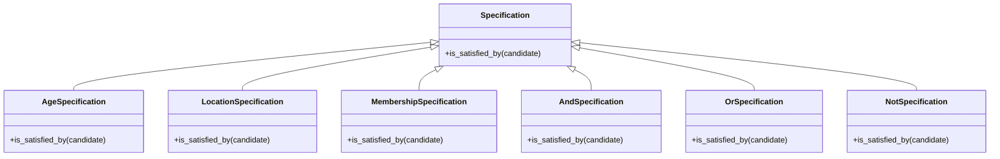

## 5.12.1 Implementing Specification in Python

In the realm of software development, business rules often dictate the behavior of applications. The Specification Pattern is a powerful tool that allows us to encapsulate these rules in a clear, reusable, and combinable manner. This pattern is particularly useful when you need to filter or validate objects based on complex criteria. In this section, we will explore how to implement the Specification Pattern in Python, providing a robust framework for managing business logic.

### Understanding the Specification Pattern

The Specification Pattern is a behavioral design pattern that defines a business rule in a separate class. This pattern allows us to combine these rules using logical operators, making it easy to create complex conditions without cluttering the main business logic.

#### Key Concepts

- **Specification**: A class that encapsulates a business rule.
- **Combinator Specifications**: Classes that allow combining multiple specifications using logical operators like AND, OR, and NOT.
- **Reusability**: Specifications can be reused across different parts of an application.
- **Expressiveness**: Business rules are clear and easy to understand.

### Implementing the Specification Pattern

Let's dive into the implementation of the Specification Pattern in Python. We will start by defining a base class for specifications and then create concrete specifications for specific rules. Finally, we will implement combinator specifications to allow logical operations on these rules.

#### Step 1: Define the Specification Base Class

The base class for specifications will define a common interface for all specifications. This interface will include a method `is_satisfied_by` that determines if a given object satisfies the specification.

```python
class Specification:
    def is_satisfied_by(self, candidate):
        """Determine if the candidate satisfies the specification."""
        raise NotImplementedError("You should implement this method.")
```

This base class serves as a blueprint for all concrete specifications. Each specific rule will inherit from this class and implement the `is_satisfied_by` method.

#### Step 2: Implement Concrete Specification Classes

Concrete specifications are specific rules that inherit from the base `Specification` class. Let's consider a scenario where we have a list of customers, and we want to filter them based on various criteria such as age, location, and membership status.

```python
class Customer:
    def __init__(self, name, age, location, is_member):
        self.name = name
        self.age = age
        self.location = location
        self.is_member = is_member

class AgeSpecification(Specification):
    def __init__(self, min_age):
        self.min_age = min_age

    def is_satisfied_by(self, candidate):
        return candidate.age >= self.min_age

class LocationSpecification(Specification):
    def __init__(self, location):
        self.location = location

    def is_satisfied_by(self, candidate):
        return candidate.location == self.location

class MembershipSpecification(Specification):
    def __init__(self, is_member):
        self.is_member = is_member

    def is_satisfied_by(self, candidate):
        return candidate.is_member == self.is_member
```

In this example, we have defined three concrete specifications: `AgeSpecification`, `LocationSpecification`, and `MembershipSpecification`. Each of these classes implements the `is_satisfied_by` method to check if a customer meets the specified criteria.

#### Step 3: Create Combinator Specifications

Combinator specifications allow us to combine multiple specifications using logical operators. Let's implement `AndSpecification`, `OrSpecification`, and `NotSpecification`.

```python
class AndSpecification(Specification):
    def __init__(self, spec1, spec2):
        self.spec1 = spec1
        self.spec2 = spec2

    def is_satisfied_by(self, candidate):
        return self.spec1.is_satisfied_by(candidate) and self.spec2.is_satisfied_by(candidate)

class OrSpecification(Specification):
    def __init__(self, spec1, spec2):
        self.spec1 = spec1
        self.spec2 = spec2

    def is_satisfied_by(self, candidate):
        return self.spec1.is_satisfied_by(candidate) or self.spec2.is_satisfied_by(candidate)

class NotSpecification(Specification):
    def __init__(self, spec):
        self.spec = spec

    def is_satisfied_by(self, candidate):
        return not self.spec.is_satisfied_by(candidate)
```

These combinator specifications allow us to create complex business rules by combining simple specifications. For example, we can create a rule that checks if a customer is a member and lives in a specific location.

#### Step 4: Using the Specification Pattern

Let's see how we can use these specifications to filter a list of customers.

```python
customers = [
    Customer("Alice", 30, "New York", True),
    Customer("Bob", 25, "Los Angeles", False),
    Customer("Charlie", 35, "New York", True),
    Customer("David", 40, "Chicago", False)
]

age_spec = AgeSpecification(30)
location_spec = LocationSpecification("New York")
member_spec = MembershipSpecification(True)

combined_spec = AndSpecification(age_spec, location_spec)

filtered_customers = [customer for customer in customers if combined_spec.is_satisfied_by(customer)]

for customer in filtered_customers:
    print(f"{customer.name} is a member and lives in New York.")
```

In this example, we filter customers who are at least 30 years old and live in New York. The `AndSpecification` combines the `AgeSpecification` and `LocationSpecification` to create a complex rule.

### Advantages of the Specification Pattern

The Specification Pattern offers several advantages:

- **Reusability**: Specifications can be reused across different parts of an application, reducing code duplication.
- **Clarity**: Business rules are encapsulated in separate classes, making the code easier to read and maintain.
- **Flexibility**: New specifications can be added without modifying existing code, allowing for easy extension.
- **Testability**: Each specification can be tested independently, ensuring that business rules are implemented correctly.

### Best Practices for Using the Specification Pattern

To make the most of the Specification Pattern, consider the following best practices:

- **Keep Specifications Simple**: Each specification should represent a single business rule. Avoid combining multiple rules in a single specification.
- **Document Specifications**: Clearly document the purpose and usage of each specification to ensure that other developers understand the business logic.
- **Use Combinator Specifications**: Leverage combinator specifications to create complex rules from simple ones, enhancing code readability and maintainability.
- **Test Thoroughly**: Write unit tests for each specification to verify that they behave as expected.

### Visualizing the Specification Pattern

To better understand how the Specification Pattern works, let's visualize the relationships between specifications using a class diagram.



This diagram illustrates the hierarchy of specifications, with the base `Specification` class at the top and concrete specifications inheriting from it. Combinator specifications also inherit from the base class, allowing them to be used interchangeably with other specifications.

### Try It Yourself

Now that we've covered the basics of the Specification Pattern, it's time to experiment with the code. Try modifying the specifications to filter customers based on different criteria. For example:

- Create a specification that filters customers who are not members.
- Combine multiple specifications using `OrSpecification` to create more complex rules.
- Add new specifications for additional criteria, such as customer spending habits or subscription status.

### Knowledge Check

Before we wrap up, let's reinforce what we've learned with a few questions:

1. What is the primary purpose of the Specification Pattern?
2. How do combinator specifications enhance the flexibility of business rules?
3. Why is it important to keep specifications simple and focused?

### Conclusion

The Specification Pattern is a powerful tool for managing business rules in a clear, reusable, and flexible manner. By encapsulating rules in separate classes and combining them using logical operators, we can create complex conditions without cluttering the main business logic. Remember to keep specifications simple, document their purpose, and test them thoroughly to ensure that your application behaves as expected.

## Quiz Time!



### What is the primary purpose of the Specification Pattern?

- [x] To encapsulate business rules in a reusable and combinable manner.
- [ ] To optimize database queries.
- [ ] To enhance user interface design.
- [ ] To manage memory allocation.

> **Explanation:** The Specification Pattern is designed to encapsulate business rules in a way that allows them to be reused and combined, making it easier to manage complex conditions.

### How do combinator specifications enhance the flexibility of business rules?

- [x] By allowing multiple specifications to be combined using logical operators.
- [ ] By reducing the number of classes needed.
- [ ] By simplifying database schemas.
- [ ] By improving user interface responsiveness.

> **Explanation:** Combinator specifications like `AndSpecification`, `OrSpecification`, and `NotSpecification` allow multiple specifications to be combined, enhancing the flexibility and expressiveness of business rules.

### Why is it important to keep specifications simple and focused?

- [x] To ensure clarity and maintainability of business logic.
- [ ] To reduce the number of lines of code.
- [ ] To improve database indexing.
- [ ] To enhance graphical rendering.

> **Explanation:** Keeping specifications simple and focused ensures that each specification represents a single business rule, making the code easier to understand and maintain.

### Which method must be implemented in a concrete specification class?

- [x] is_satisfied_by
- [ ] validate
- [ ] execute
- [ ] process

> **Explanation:** The `is_satisfied_by` method is the core of a specification class, determining if a candidate satisfies the specification.

### What is a key advantage of using the Specification Pattern?

- [x] Reusability of business rules.
- [ ] Faster execution speed.
- [ ] Reduced memory usage.
- [ ] Enhanced graphical output.

> **Explanation:** One of the main advantages of the Specification Pattern is the reusability of business rules, which can be applied across different parts of an application.

### What should be documented for each specification?

- [x] The purpose and usage of the specification.
- [ ] The memory footprint of the specification.
- [ ] The graphical representation of the specification.
- [ ] The database schema associated with the specification.

> **Explanation:** Documenting the purpose and usage of each specification helps ensure that other developers understand the business logic and how to apply it.

### How can new specifications be added without modifying existing code?

- [x] By creating new classes that inherit from the Specification base class.
- [ ] By modifying the existing database schema.
- [ ] By changing the user interface layout.
- [ ] By optimizing the existing code.

> **Explanation:** New specifications can be added by creating new classes that inherit from the Specification base class, allowing for easy extension without modifying existing code.

### What is the role of the `AndSpecification` class?

- [x] To combine two specifications using a logical AND operation.
- [ ] To execute database queries.
- [ ] To manage user sessions.
- [ ] To render graphical elements.

> **Explanation:** The `AndSpecification` class combines two specifications using a logical AND operation, allowing for more complex business rules.

### Which of the following is a combinator specification?

- [x] OrSpecification
- [ ] AgeSpecification
- [ ] LocationSpecification
- [ ] CustomerSpecification

> **Explanation:** `OrSpecification` is a combinator specification that allows combining two specifications using a logical OR operation.

### True or False: The Specification Pattern can only be used for filtering lists.

- [ ] True
- [x] False

> **Explanation:** False. The Specification Pattern can be used for various purposes, including validation and decision-making, not just filtering lists.



Remember, this is just the beginning. As you progress, you'll build more complex and interactive applications using the Specification Pattern. Keep experimenting, stay curious, and enjoy the journey!
