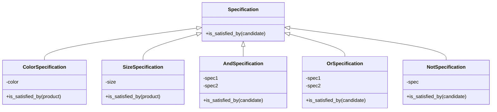

## 5.12.2 Combining Business Rules

In the realm of software development, business rules often dictate the logic that drives the behavior of applications. These rules can range from simple to complex, and as developers, we frequently encounter scenarios where multiple criteria must be evaluated together. This is where the Specification Pattern shines, offering a structured way to combine business rules using logical operations. In this section, we will delve into the need for combining specifications, provide practical examples, discuss the implementation of combinators, and highlight the benefits of this approach.

### Understanding the Need for Combining Specifications

Business applications often require the evaluation of multiple criteria to make decisions. For instance, consider an e-commerce platform where products need to be filtered based on various attributes such as color, size, and price. A customer might want to see products that are red and large, or green and medium. In such cases, combining specifications becomes essential to handle complex queries efficiently.

#### Real-World Scenarios

1. **Product Filtering**: In an online store, customers may want to filter products based on multiple attributes like color, size, and brand. Combining these specifications allows for dynamic and flexible filtering options.

2. **User Permissions**: In a software application, user permissions might be determined by a combination of roles and access levels. Combining specifications can help in evaluating these complex permission rules.

3. **Loan Approval**: In a banking application, loan approval might depend on a combination of criteria such as credit score, income level, and employment status. Specifications can be combined to evaluate these criteria collectively.

### Implementing the Specification Pattern

The Specification Pattern provides a way to encapsulate business rules into reusable components called specifications. These specifications can be combined using logical operations like `and`, `or`, and `not` to form complex rules.

#### Basic Specification Class

Let's start by defining a basic `Specification` class in Python:

```python
class Specification:
    def is_satisfied_by(self, candidate):
        raise NotImplementedError("Subclasses should implement this method.")
```

This class serves as a base for all specifications, requiring subclasses to implement the `is_satisfied_by` method, which evaluates whether a candidate satisfies the specification.

#### Concrete Specifications

Next, we define concrete specifications for specific criteria. For instance, let's create specifications for filtering products based on color and size:

```python
class ColorSpecification(Specification):
    def __init__(self, color):
        self.color = color

    def is_satisfied_by(self, product):
        return product.color == self.color

class SizeSpecification(Specification):
    def __init__(self, size):
        self.size = size

    def is_satisfied_by(self, product):
        return product.size == self.size
```

Here, `ColorSpecification` and `SizeSpecification` are concrete implementations that check if a product's color or size matches the specified criteria.

### Combining Specifications with Combinators

To combine specifications, we need to implement logical combinators that allow us to perform `and`, `or`, and `not` operations.

#### Logical AND Combinator

The `AndSpecification` combines two specifications using a logical AND operation:

```python
class AndSpecification(Specification):
    def __init__(self, spec1, spec2):
        self.spec1 = spec1
        self.spec2 = spec2

    def is_satisfied_by(self, candidate):
        return self.spec1.is_satisfied_by(candidate) and self.spec2.is_satisfied_by(candidate)
```

This combinator returns `True` only if both specifications are satisfied by the candidate.

#### Logical OR Combinator

The `OrSpecification` combines two specifications using a logical OR operation:

```python
class OrSpecification(Specification):
    def __init__(self, spec1, spec2):
        self.spec1 = spec1
        self.spec2 = spec2

    def is_satisfied_by(self, candidate):
        return self.spec1.is_satisfied_by(candidate) or self.spec2.is_satisfied_by(candidate)
```

This combinator returns `True` if either of the specifications is satisfied by the candidate.

#### Logical NOT Combinator

The `NotSpecification` negates a specification:

```python
class NotSpecification(Specification):
    def __init__(self, spec):
        self.spec = spec

    def is_satisfied_by(self, candidate):
        return not self.spec.is_satisfied_by(candidate)
```

This combinator returns `True` if the specification is not satisfied by the candidate.

### Practical Examples

Let's see how these specifications can be combined to filter products based on multiple criteria.

#### Example: Filtering Products

Consider a list of products, each with attributes like color and size:

```python
class Product:
    def __init__(self, name, color, size):
        self.name = name
        self.color = color
        self.size = size

products = [
    Product("Product 1", "red", "large"),
    Product("Product 2", "green", "medium"),
    Product("Product 3", "blue", "small"),
    Product("Product 4", "red", "medium"),
    Product("Product 5", "green", "large"),
]
```

We can now use our specifications to filter products that are red and large:

```python
red_spec = ColorSpecification("red")
large_spec = SizeSpecification("large")
red_and_large_spec = AndSpecification(red_spec, large_spec)

filtered_products = [product for product in products if red_and_large_spec.is_satisfied_by(product)]

for product in filtered_products:
    print(product.name)
```

This code will output:

```
Product 1
```

#### Example: Flexible Queries

The power of the Specification Pattern lies in its flexibility. We can easily modify our query to find products that are either red or large:

```python
red_or_large_spec = OrSpecification(red_spec, large_spec)

filtered_products = [product for product in products if red_or_large_spec.is_satisfied_by(product)]

for product in filtered_products:
    print(product.name)
```

This code will output:

```
Product 1
Product 4
Product 5
```

### Benefits of Combining Specifications

Combining specifications using the Specification Pattern offers several advantages:

1. **Flexibility**: Specifications can be combined in various ways to form complex queries, allowing for dynamic and flexible rule evaluation.

2. **Reusability**: Individual specifications can be reused across different parts of the application, reducing code duplication and improving maintainability.

3. **Clarity**: By encapsulating business rules into specifications, the code becomes more readable and easier to understand.

4. **Extensibility**: New specifications can be added without modifying existing code, making it easy to extend the application with new business rules.

### Visualizing the Specification Pattern

To better understand how specifications are combined, let's visualize the process using a class diagram.



**Diagram Description**: The diagram illustrates the relationship between the `Specification` class and its concrete implementations. `ColorSpecification` and `SizeSpecification` are specific criteria, while `AndSpecification`, `OrSpecification`, and `NotSpecification` are combinators that allow for logical operations on specifications.

### Try It Yourself

Experiment with the Specification Pattern by modifying the code examples. Here are some suggestions:

- **Add a new specification**: Create a `PriceSpecification` to filter products based on price. Combine it with existing specifications to form complex queries.
- **Implement a custom combinator**: Create a `XorSpecification` that returns `True` if exactly one of the specifications is satisfied.
- **Optimize performance**: Consider caching results of specifications that are frequently evaluated to improve performance.

### Knowledge Check

Before we conclude, let's reinforce our understanding with a few questions:

- What are the benefits of using the Specification Pattern to combine business rules?
- How do logical combinators like `AndSpecification` and `OrSpecification` enhance flexibility in rule evaluation?
- Can you think of a scenario in your current project where the Specification Pattern could be applied?

### Conclusion

The Specification Pattern is a powerful tool for combining business rules in a flexible and reusable manner. By encapsulating criteria into specifications and using logical combinators, we can build complex queries that are easy to understand and maintain. As you continue to develop applications, consider leveraging this pattern to enhance the clarity and flexibility of your code.

Remember, this is just the beginning. As you progress, you'll discover more ways to apply the Specification Pattern in your projects. Keep experimenting, stay curious, and enjoy the journey!

## Quiz Time!



### What is the primary purpose of the Specification Pattern?

- [x] To encapsulate business rules into reusable components.
- [ ] To optimize database queries.
- [ ] To improve user interface design.
- [ ] To enhance security protocols.

> **Explanation:** The Specification Pattern is designed to encapsulate business rules into reusable components, allowing for flexible and dynamic rule evaluation.

### Which combinator would you use to combine two specifications with a logical AND operation?

- [x] AndSpecification
- [ ] OrSpecification
- [ ] NotSpecification
- [ ] XorSpecification

> **Explanation:** The `AndSpecification` combinator is used to combine two specifications with a logical AND operation, returning `True` only if both specifications are satisfied.

### How does the Specification Pattern improve code maintainability?

- [x] By reducing code duplication and encapsulating business logic.
- [ ] By increasing the complexity of the code.
- [ ] By requiring more lines of code.
- [ ] By making the code harder to understand.

> **Explanation:** The Specification Pattern improves code maintainability by reducing code duplication and encapsulating business logic into reusable components, making the code easier to understand and modify.

### What is the result of combining a `ColorSpecification` for "red" and a `SizeSpecification` for "large" using an `AndSpecification`?

- [x] Products that are both red and large.
- [ ] Products that are either red or large.
- [ ] Products that are not red and not large.
- [ ] Products that are red but not large.

> **Explanation:** Combining a `ColorSpecification` for "red" and a `SizeSpecification` for "large" using an `AndSpecification` results in products that are both red and large.

### Which of the following is NOT a benefit of using the Specification Pattern?

- [ ] Flexibility in building complex queries.
- [ ] Reusability of individual specifications.
- [ ] Clarity in code structure.
- [x] Increased execution speed.

> **Explanation:** While the Specification Pattern offers flexibility, reusability, and clarity, it does not inherently increase execution speed. Performance optimization may require additional considerations.

### What does the `NotSpecification` combinator do?

- [x] Negates the result of a specification.
- [ ] Combines two specifications with an AND operation.
- [ ] Combines two specifications with an OR operation.
- [ ] Returns the opposite of a logical XOR operation.

> **Explanation:** The `NotSpecification` combinator negates the result of a specification, returning `True` if the specification is not satisfied.

### How can the Specification Pattern be extended to handle new business rules?

- [x] By adding new specifications without modifying existing code.
- [ ] By rewriting all existing specifications.
- [ ] By removing existing specifications.
- [ ] By combining all specifications into a single class.

> **Explanation:** The Specification Pattern can be extended to handle new business rules by adding new specifications without modifying existing code, enhancing extensibility.

### What is a potential use case for the Specification Pattern?

- [x] Filtering products in an e-commerce application.
- [ ] Designing a user interface layout.
- [ ] Encrypting sensitive data.
- [ ] Managing network connections.

> **Explanation:** A potential use case for the Specification Pattern is filtering products in an e-commerce application based on various attributes like color, size, and price.

### Can the Specification Pattern be used to evaluate user permissions?

- [x] True
- [ ] False

> **Explanation:** True. The Specification Pattern can be used to evaluate user permissions by combining specifications that represent different roles and access levels.

### What is the role of a base `Specification` class?

- [x] To define a common interface for all specifications.
- [ ] To store product data.
- [ ] To manage database connections.
- [ ] To handle user input.

> **Explanation:** The base `Specification` class defines a common interface for all specifications, requiring subclasses to implement the `is_satisfied_by` method.


