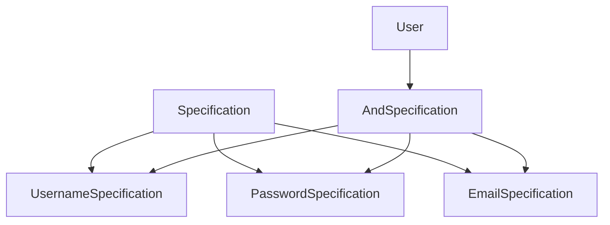

## 5.12.3 Use Cases and Examples

The Specification Pattern is a powerful tool in the software developer's toolkit, particularly when it comes to defining complex business rules and criteria. This pattern allows us to encapsulate business logic into reusable and combinable components, making our code cleaner and more maintainable. In this section, we'll explore practical applications of the Specification Pattern in real-world scenarios, focusing on validation frameworks and filtering systems. We'll also provide code snippets to illustrate how to implement this pattern in Python, and discuss the benefits of using it in your projects.

### Introduction to the Specification Pattern

The Specification Pattern is a behavioral design pattern that allows us to encapsulate business rules into separate, reusable components called specifications. These specifications can be combined using logical operators to form complex criteria. This pattern is particularly useful when dealing with complex conditional logic that needs to be reused or modified frequently.

### Practical Examples of the Specification Pattern

Let's dive into some practical examples of how the Specification Pattern can be applied in real-world scenarios.

#### Validation Frameworks

One of the most common use cases for the Specification Pattern is in validation frameworks. When dealing with data input, it's crucial to validate the data against a set of rules before processing it. The Specification Pattern allows us to define these validation rules as separate specifications, which can be combined and reused across different parts of the application.

##### Example: User Registration Validation

Consider a user registration system where we need to validate user input such as username, password, and email. We can define specifications for each validation rule and combine them to form a comprehensive validation framework.

```python
class Specification:
    def is_satisfied_by(self, candidate):
        raise NotImplementedError("Subclasses should implement this method")

class UsernameSpecification(Specification):
    def is_satisfied_by(self, candidate):
        return candidate.username.isalnum() and len(candidate.username) >= 5

class PasswordSpecification(Specification):
    def is_satisfied_by(self, candidate):
        return len(candidate.password) >= 8 and any(char.isdigit() for char in candidate.password)

class EmailSpecification(Specification):
    def is_satisfied_by(self, candidate):
        return "@" in candidate.email and "." in candidate.email

class AndSpecification(Specification):
    def __init__(self, *specs):
        self.specs = specs

    def is_satisfied_by(self, candidate):
        return all(spec.is_satisfied_by(candidate) for spec in self.specs)

class User:
    def __init__(self, username, password, email):
        self.username = username
        self.password = password
        self.email = email

username_spec = UsernameSpecification()
password_spec = PasswordSpecification()
email_spec = EmailSpecification()

user_spec = AndSpecification(username_spec, password_spec, email_spec)

user = User("john_doe", "pass1234", "john@example.com")
print(user_spec.is_satisfied_by(user))  # Output: True
```

In this example, we define three specifications: `UsernameSpecification`, `PasswordSpecification`, and `EmailSpecification`. We then combine these specifications using the `AndSpecification` to create a comprehensive validation rule for user registration. This approach allows us to easily modify or extend validation rules without affecting other parts of the system.

#### Filtering Systems

Another common application of the Specification Pattern is in filtering systems, such as those used in e-commerce websites. When users search for products, they often specify complex search criteria that need to be applied to filter the results. The Specification Pattern allows us to define these criteria as specifications and combine them to create complex filters.

##### Example: Product Filtering in E-commerce

Consider an e-commerce website where users can filter products based on criteria such as category, price range, and availability. We can define specifications for each filter criterion and combine them to create a flexible filtering system.

```python
class Product:
    def __init__(self, name, category, price, in_stock):
        self.name = name
        self.category = category
        self.price = price
        self.in_stock = in_stock

class CategorySpecification(Specification):
    def __init__(self, category):
        self.category = category

    def is_satisfied_by(self, candidate):
        return candidate.category == self.category

class PriceRangeSpecification(Specification):
    def __init__(self, min_price, max_price):
        self.min_price = min_price
        self.max_price = max_price

    def is_satisfied_by(self, candidate):
        return self.min_price <= candidate.price <= self.max_price

class InStockSpecification(Specification):
    def is_satisfied_by(self, candidate):
        return candidate.in_stock

category_spec = CategorySpecification("Electronics")
price_spec = PriceRangeSpecification(100, 500)
in_stock_spec = InStockSpecification()

product_spec = AndSpecification(category_spec, price_spec, in_stock_spec)

products = [
    Product("Laptop", "Electronics", 450, True),
    Product("Smartphone", "Electronics", 300, False),
    Product("Book", "Books", 20, True),
]

filtered_products = [product for product in products if product_spec.is_satisfied_by(product)]
for product in filtered_products:
    print(product.name)  # Output: Laptop
```

In this example, we define specifications for filtering products by category, price range, and availability. We then combine these specifications using the `AndSpecification` to create a comprehensive filter for products. This approach allows us to easily modify or extend filtering criteria without affecting other parts of the system.

### Benefits of Using the Specification Pattern

The Specification Pattern offers several benefits that make it a valuable tool in software development:

- **Cleaner, More Maintainable Code**: By encapsulating business rules into separate specifications, we can keep our codebase organized and easy to maintain. This separation of concerns makes it easier to understand and modify individual rules without affecting the entire system.

- **Reusability**: Specifications can be reused across different parts of the application, reducing code duplication and promoting consistency. This reusability is particularly beneficial in large systems with complex business logic.

- **Flexibility**: The ability to combine specifications using logical operators allows us to create complex criteria without writing additional code. This flexibility makes it easy to adapt to changing business requirements.

- **Testability**: By isolating business rules into separate specifications, we can test each rule independently, improving the overall test coverage and reliability of the system.

### Encouraging the Use of the Specification Pattern

We encourage you to analyze your codebase for complex conditional logic that could be encapsulated using the Specification Pattern. By adopting this pattern, you can improve the maintainability, reusability, and flexibility of your code. Consider the following steps to apply the Specification Pattern in your projects:

1. **Identify Complex Conditional Logic**: Look for areas in your code where complex conditional logic is used, such as validation rules or filtering criteria.

2. **Define Specifications**: Create separate specifications for each rule or criterion. Ensure that each specification implements a common interface, such as the `Specification` class in our examples.

3. **Combine Specifications**: Use logical operators to combine specifications and create complex criteria. This approach allows you to build flexible and reusable business rules.

4. **Refactor Code**: Refactor your code to use the newly defined specifications. Replace complex conditional logic with calls to the `is_satisfied_by` method of the specifications.

5. **Test and Validate**: Test each specification independently to ensure that it behaves as expected. Validate the combined specifications to ensure that they produce the desired results.

### Visualizing the Specification Pattern

To better understand the Specification Pattern, let's visualize how specifications can be combined to form complex criteria.



In this diagram, we see how individual specifications (`UsernameSpecification`, `PasswordSpecification`, `EmailSpecification`) are combined using an `AndSpecification` to form a comprehensive validation rule for a `User`.

### Try It Yourself

Now that we've explored the Specification Pattern and its applications, it's time to try it yourself. Here are some suggestions for experimenting with the pattern:

- **Modify the Validation Framework**: Add new validation rules, such as checking for special characters in the password or validating the email domain. Combine these new rules with existing specifications.

- **Extend the Filtering System**: Add new filter criteria, such as filtering products by brand or rating. Combine these new criteria with existing specifications to create more complex filters.

- **Create Your Own Specifications**: Identify a use case in your own projects where the Specification Pattern could be applied. Define specifications for the business rules and criteria, and refactor your code to use them.

### Conclusion

The Specification Pattern is a versatile and powerful tool for encapsulating business rules and criteria into reusable components. By applying this pattern, we can improve the maintainability, reusability, and flexibility of our code. Whether you're building validation frameworks or filtering systems, the Specification Pattern can help you manage complex logic with ease. Remember, this is just the beginning. As you progress, you'll discover more opportunities to apply the Specification Pattern in your projects. Keep experimenting, stay curious, and enjoy the journey!

## Quiz Time!



### What is the primary purpose of the Specification Pattern?

- [x] To encapsulate business rules into reusable components
- [ ] To optimize performance
- [ ] To simplify user interfaces
- [ ] To enhance security

> **Explanation:** The Specification Pattern is designed to encapsulate business rules into reusable components, making the code more maintainable and flexible.

### Which of the following is a benefit of using the Specification Pattern?

- [x] Cleaner, more maintainable code
- [ ] Faster execution speed
- [ ] Reduced memory usage
- [ ] Enhanced graphics rendering

> **Explanation:** The Specification Pattern helps in organizing business rules into separate components, resulting in cleaner and more maintainable code.

### In the provided user registration example, what does the `AndSpecification` class do?

- [x] Combines multiple specifications into one
- [ ] Validates email addresses
- [ ] Encrypts passwords
- [ ] Sends registration emails

> **Explanation:** The `AndSpecification` class combines multiple specifications into a single one, allowing for complex criteria to be evaluated.

### How can the Specification Pattern improve testability?

- [x] By isolating business rules into separate specifications
- [ ] By reducing the number of lines of code
- [ ] By increasing execution speed
- [ ] By enhancing user interface design

> **Explanation:** By isolating business rules into separate specifications, each rule can be tested independently, improving test coverage and reliability.

### What is a common use case for the Specification Pattern?

- [x] Validation frameworks
- [ ] Image processing
- [ ] Network communication
- [ ] File compression

> **Explanation:** Validation frameworks are a common use case for the Specification Pattern, as they often require complex business rules.

### In the product filtering example, which specification checks if a product is in stock?

- [x] InStockSpecification
- [ ] CategorySpecification
- [ ] PriceRangeSpecification
- [ ] UserSpecification

> **Explanation:** The `InStockSpecification` checks if a product is available in stock.

### What is the role of the `is_satisfied_by` method in a specification?

- [x] To determine if a candidate meets the specification criteria
- [ ] To encrypt data
- [ ] To render graphics
- [ ] To manage database connections

> **Explanation:** The `is_satisfied_by` method is used to determine if a candidate meets the criteria defined by the specification.

### Which logical operator is used in the `AndSpecification` class to combine specifications?

- [x] All
- [ ] Any
- [ ] Not
- [ ] Or

> **Explanation:** The `AndSpecification` class uses the `all` operator to ensure that all combined specifications are satisfied.

### True or False: The Specification Pattern can only be used in validation frameworks.

- [ ] True
- [x] False

> **Explanation:** False. The Specification Pattern can be used in various scenarios, including validation frameworks, filtering systems, and more.

### What should you do if you find complex conditional logic in your codebase?

- [x] Consider encapsulating it using the Specification Pattern
- [ ] Ignore it
- [ ] Remove it without replacement
- [ ] Convert it to a single if-else statement

> **Explanation:** If you find complex conditional logic, consider encapsulating it using the Specification Pattern to improve maintainability and flexibility.


