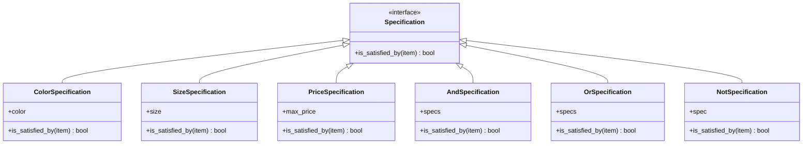

## 5.12 Specification Pattern

In the ever-evolving landscape of software development, the need to encapsulate business rules in a flexible and reusable manner is paramount. The Specification Pattern offers a robust solution by allowing you to define criteria for evaluating objects, which can be combined to form complex logical queries. This pattern is particularly useful in scenarios where business rules are dynamic and subject to frequent changes.

### Intent and Motivation

The primary intent of the Specification Pattern is to separate the logic of querying and filtering from the objects themselves. By encapsulating business rules into distinct specifications, we can create a system that is both flexible and maintainable. This separation of concerns allows for the dynamic combination of rules, enabling complex querying without cluttering the core business logic.

**Motivation:**

- **Reusability:** Specifications can be reused across different parts of an application, reducing redundancy.
- **Composability:** Specifications can be combined using logical operations (AND, OR, NOT) to form complex criteria.
- **Maintainability:** Encapsulating business rules in specifications makes it easier to update and manage them independently of the objects they evaluate.

### Structure of the Specification Pattern

To implement the Specification Pattern, we define a `Specification` interface that outlines the method for evaluating objects. Concrete specifications implement this interface to encapsulate specific business rules. These specifications can then be combined using logical operations to form composite specifications.

#### Specification Interface

The `Specification` interface typically includes a method, such as `is_satisfied_by`, which takes an object and returns a boolean indicating whether the object meets the criteria.

```python
from abc import ABC, abstractmethod

class Specification(ABC):
    @abstractmethod
    def is_satisfied_by(self, item) -> bool:
        pass
```

#### Concrete Specifications

Concrete specifications implement the `Specification` interface to define specific criteria. For example, a `ColorSpecification` might check if a product is of a certain color.

```python
class ColorSpecification(Specification):
    def __init__(self, color):
        self.color = color

    def is_satisfied_by(self, item) -> bool:
        return item.color == self.color
```

#### Combining Specifications

Specifications can be combined using logical operations to form new specifications. This is achieved by creating composite specifications that take two or more specifications and combine their logic.

```python
class AndSpecification(Specification):
    def __init__(self, *specs):
        self.specs = specs

    def is_satisfied_by(self, item) -> bool:
        return all(spec.is_satisfied_by(item) for spec in self.specs)

class OrSpecification(Specification):
    def __init__(self, *specs):
        self.specs = specs

    def is_satisfied_by(self, item) -> bool:
        return any(spec.is_satisfied_by(item) for spec in self.specs)

class NotSpecification(Specification):
    def __init__(self, spec):
        self.spec = spec

    def is_satisfied_by(self, item) -> bool:
        return not self.spec.is_satisfied_by(item)
```

### Python Example: Product Filtering

Let's implement a product filtering system using the Specification Pattern. We'll filter products based on criteria such as color, size, and price.

#### Product Class

First, we define a simple `Product` class with attributes for color, size, and price.

```python
class Product:
    def __init__(self, name, color, size, price):
        self.name = name
        self.color = color
        self.size = size
        self.price = price

    def __repr__(self):
        return f"Product(name={self.name}, color={self.color}, size={self.size}, price={self.price})"
```

#### Concrete Specifications

We create specifications for color, size, and price.

```python
class SizeSpecification(Specification):
    def __init__(self, size):
        self.size = size

    def is_satisfied_by(self, item) -> bool:
        return item.size == self.size

class PriceSpecification(Specification):
    def __init__(self, max_price):
        self.max_price = max_price

    def is_satisfied_by(self, item) -> bool:
        return item.price <= self.max_price
```

#### Filtering Products

Now, we can filter products using these specifications.

```python
class ProductFilter:
    def filter(self, items, spec):
        return [item for item in items if spec.is_satisfied_by(item)]

products = [
    Product("Apple", "red", "small", 1.0),
    Product("Banana", "yellow", "medium", 0.5),
    Product("Watermelon", "green", "large", 3.0)
]

color_spec = ColorSpecification("red")
size_spec = SizeSpecification("small")
price_spec = PriceSpecification(2.0)

combined_spec = AndSpecification(color_spec, size_spec, price_spec)

filter = ProductFilter()
filtered_products = filter.filter(products, combined_spec)
print(filtered_products)
```

### Benefits of the Specification Pattern

The Specification Pattern offers several benefits, particularly in the context of complex business logic:

- **Improved Maintainability:** By encapsulating business rules in separate specifications, we can easily update and manage them without affecting the core business logic.
- **Enhanced Flexibility:** Specifications can be combined in various ways to form complex criteria, allowing for dynamic querying and filtering.
- **Reusability:** Specifications can be reused across different parts of an application, reducing redundancy and promoting consistency.

### Potential Complexities

While the Specification Pattern offers numerous benefits, it also introduces some complexities:

- **Overhead of Small Classes:** Implementing the pattern may result in the creation of many small classes, which can increase the complexity of the codebase.
- **Managing Combinations:** As the number of specifications grows, managing their combinations can become challenging.

### Best Practices

To effectively implement the Specification Pattern, consider the following best practices:

- **Use Composition Over Inheritance:** Favor composition when combining specifications to promote flexibility and reduce coupling.
- **Ensure Immutability and Statelessness:** Specifications should be immutable and stateless to ensure consistency and predictability.
- **Encourage Reusability:** Design specifications to be reusable across different contexts and scenarios.

### Encouraging Application

The Specification Pattern is particularly useful in scenarios where business rules are complex and subject to frequent changes. By encapsulating these rules in specifications, we can create a system that is both flexible and maintainable. Consider using the Specification Pattern when dealing with dynamic business rules that require frequent updates and modifications.

### Visualizing the Specification Pattern

To better understand the Specification Pattern, let's visualize its structure using a class diagram.



### Try It Yourself

To deepen your understanding of the Specification Pattern, try modifying the code examples provided:

- **Add a new specification** for filtering products based on a different attribute, such as weight or brand.
- **Combine multiple specifications** using different logical operations to create more complex filtering criteria.
- **Experiment with different combinations** of specifications to see how they affect the filtering results.

### Knowledge Check

Before we wrap up, let's review some key takeaways from this section:

- The Specification Pattern encapsulates business rules into reusable and combinable components.
- Specifications can be combined using logical operations to form complex criteria.
- The pattern improves maintainability and flexibility by separating business logic from the objects it evaluates.

### Embrace the Journey

Remember, the Specification Pattern is just one of many tools in your software design toolkit. As you continue to explore and apply design patterns, you'll gain a deeper understanding of how to create flexible, maintainable, and scalable systems. Keep experimenting, stay curious, and enjoy the journey!

## Quiz Time!



### What is the primary intent of the Specification Pattern?

- [x] To separate the logic of querying and filtering from the objects themselves.
- [ ] To create a single class that handles all business logic.
- [ ] To encapsulate data within objects.
- [ ] To improve performance by reducing the number of classes.

> **Explanation:** The Specification Pattern aims to separate the logic of querying and filtering from the objects themselves, allowing for flexible and reusable business logic components.

### How can specifications be combined in the Specification Pattern?

- [x] Using logical operations such as AND, OR, and NOT.
- [ ] By inheriting from a base specification class.
- [ ] By using decorators to wrap specifications.
- [ ] By merging their attributes into a single specification.

> **Explanation:** Specifications can be combined using logical operations such as AND, OR, and NOT to form complex criteria.

### What is a key benefit of using the Specification Pattern?

- [x] It improves code maintainability by encapsulating business rules.
- [ ] It reduces the number of classes in a codebase.
- [ ] It increases the performance of the application.
- [ ] It simplifies the user interface design.

> **Explanation:** The Specification Pattern improves code maintainability by encapsulating business rules into separate specifications, making it easier to update and manage them.

### What is a potential complexity introduced by the Specification Pattern?

- [x] The overhead of creating many small classes.
- [ ] The difficulty in understanding the core business logic.
- [ ] The increase in runtime performance.
- [ ] The reduction in code readability.

> **Explanation:** Implementing the Specification Pattern may result in the creation of many small classes, which can increase the complexity of the codebase.

### Which best practice should be followed when implementing the Specification Pattern?

- [x] Use composition over inheritance for combining specifications.
- [ ] Ensure specifications are mutable and stateful.
- [ ] Avoid reusing specifications across different contexts.
- [ ] Combine specifications using inheritance.

> **Explanation:** It is recommended to use composition over inheritance for combining specifications to promote flexibility and reduce coupling.

### When is the Specification Pattern particularly useful?

- [x] When dealing with complex and dynamic business rules.
- [ ] When performance is the primary concern.
- [ ] When the application has a simple and static set of rules.
- [ ] When the user interface needs to be simplified.

> **Explanation:** The Specification Pattern is particularly useful when dealing with complex and dynamic business rules that require frequent updates and modifications.

### What is the role of the `is_satisfied_by` method in the Specification Pattern?

- [x] To evaluate whether an object meets the criteria defined by the specification.
- [ ] To modify the object's attributes based on the specification.
- [ ] To create a new object that satisfies the specification.
- [ ] To delete objects that do not meet the criteria.

> **Explanation:** The `is_satisfied_by` method evaluates whether an object meets the criteria defined by the specification.

### How does the Specification Pattern enhance flexibility?

- [x] By allowing specifications to be combined in various ways to form complex criteria.
- [ ] By reducing the number of classes needed for business logic.
- [ ] By improving the performance of the application.
- [ ] By simplifying the user interface design.

> **Explanation:** The Specification Pattern enhances flexibility by allowing specifications to be combined in various ways to form complex criteria.

### What should specifications be to ensure consistency and predictability?

- [x] Immutable and stateless.
- [ ] Mutable and stateful.
- [ ] Dynamic and adaptable.
- [ ] Static and fixed.

> **Explanation:** Specifications should be immutable and stateless to ensure consistency and predictability.

### True or False: The Specification Pattern is only useful for filtering products.

- [x] False
- [ ] True

> **Explanation:** The Specification Pattern is not limited to filtering products; it can be applied to any scenario where business rules need to be encapsulated and combined.




