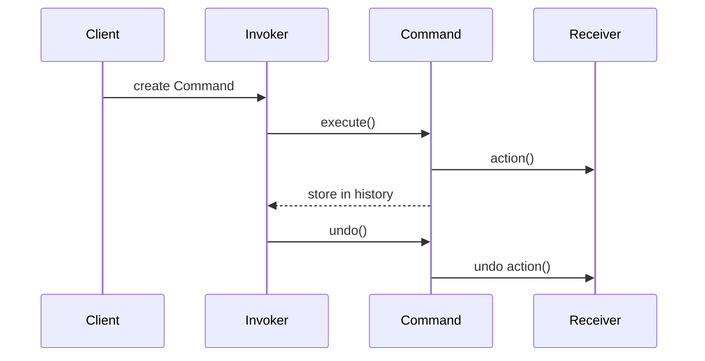

## 5.2.1 Implementing Command in Python

In the realm of software design patterns, the Command Pattern stands out as a robust solution for encapsulating requests as objects, thereby allowing for parameterization of clients with queues, requests, and operations. This pattern is particularly useful in scenarios where you need to issue requests to objects without knowing anything about the operation being requested or the receiver of the request. In this section, we will delve into the intricacies of implementing the Command Pattern in Python, providing you with the knowledge to enhance your code's modularity and testability.

### Understanding the Command Pattern

The Command Pattern is a behavioral design pattern that turns a request into a stand-alone object that contains all information about the request. This transformation allows for the parameterization of methods with different requests, queuing of requests, and logging of the requests. It also provides support for undoable operations.

#### Key Components of the Command Pattern

1. **Command Interface**: This defines the interface for executing an operation.
2. **ConcreteCommand**: This class implements the Command interface and defines a binding between a Receiver object and an action. It calls the corresponding operation(s) on the Receiver.
3. **Receiver**: This is the component that knows how to perform the work needed to carry out the request.
4. **Invoker**: This component asks the command to carry out the request.
5. **Client**: This component creates a ConcreteCommand object and sets its receiver.

### Implementing the Command Pattern in Python

Let's walk through the steps to implement the Command Pattern in Python by creating a simple text editor application that supports writing text, undoing, and redoing actions.

#### Step 1: Define the Command Interface

The Command interface will have an `execute` method that all concrete commands must implement.

```python
from abc import ABC, abstractmethod

class Command(ABC):
    @abstractmethod
    def execute(self):
        pass

    @abstractmethod
    def undo(self):
        pass
```

#### Step 2: Create ConcreteCommand Classes

ConcreteCommand classes implement the Command interface and define the relationship between the Receiver and an action.

```python
class WriteCommand(Command):
    def __init__(self, receiver, text):
        self.receiver = receiver
        self.text = text

    def execute(self):
        self.receiver.write(self.text)

    def undo(self):
        self.receiver.undo_write(self.text)
```

#### Step 3: Set Up the Receiver Class

The Receiver class contains the actual logic to perform the operations. In our text editor example, it will handle the writing and undoing of text.

```python
class TextEditor:
    def __init__(self):
        self.content = ""

    def write(self, text):
        self.content += text
        print(f"Content after write: {self.content}")

    def undo_write(self, text):
        self.content = self.content[:-len(text)]
        print(f"Content after undo: {self.content}")
```

#### Step 4: Implement the Invoker

The Invoker is responsible for executing commands. It can also maintain a history of commands to support undo and redo operations.

```python
class TextEditorInvoker:
    def __init__(self):
        self.history = []

    def execute_command(self, command):
        command.execute()
        self.history.append(command)

    def undo(self):
        if self.history:
            command = self.history.pop()
            command.undo()
```

#### Step 5: Client Code

The client code ties everything together by creating command objects and using the Invoker to execute them.

```python
if __name__ == "__main__":
    editor = TextEditor()
    invoker = TextEditorInvoker()

    command1 = WriteCommand(editor, "Hello, ")
    command2 = WriteCommand(editor, "World!")

    invoker.execute_command(command1)
    invoker.execute_command(command2)

    invoker.undo()
    invoker.undo()
```

### Parameterization in Command Pattern

One of the strengths of the Command Pattern is its ability to store state or parameters within the command objects. This feature allows commands to be reused and manipulated in various ways, such as queuing, logging, or undoing.

In our example, the `WriteCommand` class stores the text to be written as a parameter. This allows the command to be executed and undone with the same piece of information.

### Best Practices for Using the Command Pattern

- **Encapsulation**: Use the Command Pattern to encapsulate all details of a request, allowing for flexible and reusable command objects.
- **Modularity**: Enhance modularity by separating the request for an action from the object that performs the action.
- **Testability**: Improve testability by isolating commands and testing them independently of the receiver.
- **Undo/Redo Functionality**: Implement undo and redo functionality by maintaining a history of executed commands.

### Visualizing the Command Pattern

To better understand the flow of the Command Pattern, let's visualize the interaction between its components using a sequence diagram.



### Try It Yourself

To solidify your understanding of the Command Pattern, try modifying the code example to include a `RedoCommand` that re-applies the last undone command. Consider how you would manage the history of commands to support this functionality.

### Knowledge Check

- **What is the primary purpose of the Command Pattern?**
- **How does the Command Pattern enhance modularity and testability?**
- **What role does the Invoker play in the Command Pattern?**
- **How can commands store state or parameters?**

### Conclusion

The Command Pattern is a powerful tool in the software developer's arsenal, providing a structured way to encapsulate requests as objects. By implementing this pattern in Python, you can create flexible, modular, and testable code that supports complex operations like undo and redo. As you continue to explore design patterns, remember that the key to mastering them lies in practice and experimentation. Keep experimenting, stay curious, and enjoy the journey!

## Quiz Time!



### What is the primary purpose of the Command Pattern?

- [x] To encapsulate requests as objects
- [ ] To improve data storage
- [ ] To enhance graphical interfaces
- [ ] To manage user input

> **Explanation:** The Command Pattern encapsulates requests as objects, allowing for parameterization and queuing of requests.

### Which component in the Command Pattern is responsible for executing commands?

- [ ] Client
- [x] Invoker
- [ ] Receiver
- [ ] ConcreteCommand

> **Explanation:** The Invoker is responsible for executing commands and can also maintain a history for undo operations.

### How does the Command Pattern enhance testability?

- [x] By isolating commands for independent testing
- [ ] By integrating with databases
- [ ] By simplifying user interfaces
- [ ] By reducing code complexity

> **Explanation:** The Command Pattern enhances testability by isolating commands, making them easier to test independently of the receiver.

### What method must all ConcreteCommand classes implement?

- [ ] `run`
- [x] `execute`
- [ ] `start`
- [ ] `perform`

> **Explanation:** All ConcreteCommand classes must implement the `execute` method to define the action to be performed.

### What role does the Receiver play in the Command Pattern?

- [x] It performs the actual work needed to carry out the request
- [ ] It creates command objects
- [ ] It stores command history
- [ ] It manages user input

> **Explanation:** The Receiver performs the actual work needed to carry out the request defined by the command.

### How can commands store state or parameters?

- [x] By including them as attributes within the command object
- [ ] By using global variables
- [ ] By storing them in a database
- [ ] By passing them as function arguments

> **Explanation:** Commands can store state or parameters by including them as attributes within the command object.

### What is a potential use case for the Command Pattern?

- [x] Implementing undo and redo functionality
- [ ] Enhancing graphical interfaces
- [ ] Managing database connections
- [ ] Simplifying API requests

> **Explanation:** The Command Pattern is often used to implement undo and redo functionality by maintaining a history of executed commands.

### Which component in the Command Pattern defines the binding between a Receiver and an action?

- [ ] Client
- [ ] Invoker
- [x] ConcreteCommand
- [ ] Command Interface

> **Explanation:** The ConcreteCommand defines the binding between a Receiver and an action, implementing the Command interface.

### What is the benefit of parameterizing methods with commands?

- [x] It allows for flexible and reusable command objects
- [ ] It simplifies user interfaces
- [ ] It enhances graphical rendering
- [ ] It improves data storage

> **Explanation:** Parameterizing methods with commands allows for flexible and reusable command objects, enhancing modularity.

### True or False: The Command Pattern can be used to queue requests.

- [x] True
- [ ] False

> **Explanation:** True. The Command Pattern can queue requests, allowing for deferred execution and undo operations.


