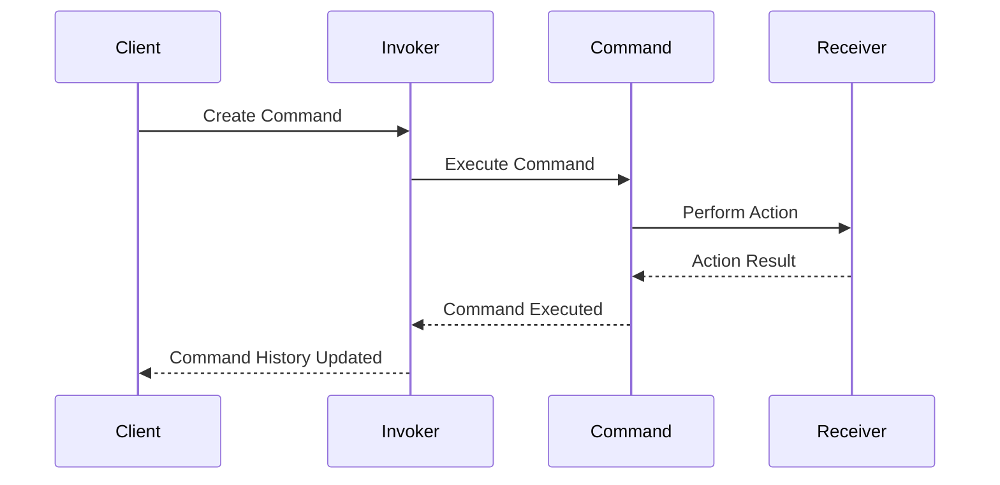

## 5.2.2 Encapsulating Actions

In the realm of software design, the ability to decouple components and promote flexibility is paramount. The Command Pattern is a behavioral design pattern that encapsulates a request as an object, thereby allowing for parameterization of clients with queues, requests, and operations. This pattern is particularly powerful because it decouples the object that invokes the operation from the one that knows how to perform it. Let's delve into the intricacies of encapsulating actions using the Command Pattern in Python.

### Understanding the Command Pattern

The Command Pattern is a way to separate the concerns of issuing a request from handling it. By encapsulating actions as command objects, we can achieve a higher degree of flexibility and control over how and when actions are executed. This encapsulation allows for:

- **Queuing**: Commands can be queued for later execution.
- **Logging**: Commands can be logged for auditing or debugging purposes.
- **Undo/Redo**: Commands can be reversed or reapplied.
- **Callbacks**: Commands can be executed as callbacks in asynchronous operations.

#### Key Components of the Command Pattern

1. **Command Interface**: Declares an interface for executing an operation.
2. **Concrete Command**: Implements the Command interface and defines the binding between a Receiver object and an action.
3. **Invoker**: Asks the command to carry out the request.
4. **Receiver**: Knows how to perform the operations associated with carrying out a request.
5. **Client**: Creates a ConcreteCommand object and sets its receiver.

### Benefits of Encapsulation

Encapsulation in the Command Pattern provides several benefits:

- **Decoupling**: By encapsulating the request, the invoker is decoupled from the receiver, allowing for flexibility in changing the receiver without affecting the invoker.
- **Flexibility**: Commands can be swapped or modified without altering the invoker's code, promoting a more flexible and maintainable codebase.
- **Reusability**: Commands can be reused across different invokers or contexts.
- **Extensibility**: New commands can be added with minimal changes to existing code.

### Implementing the Command Pattern in Python

Let's explore a practical example of the Command Pattern in Python. We'll create a simple text editor application where commands like `Copy`, `Paste`, and `Undo` are encapsulated as command objects.

```python
from abc import ABC, abstractmethod

class Command(ABC):
    @abstractmethod
    def execute(self):
        pass

class TextEditor:
    def __init__(self):
        self.text = ""
        self.clipboard = ""

    def copy(self, text):
        self.clipboard = text
        print(f"Copied '{text}' to clipboard.")

    def paste(self):
        self.text += self.clipboard
        print(f"Pasted '{self.clipboard}' to text.")

    def undo(self):
        print("Undo operation not implemented yet.")

class CopyCommand(Command):
    def __init__(self, editor, text):
        self.editor = editor
        self.text = text

    def execute(self):
        self.editor.copy(self.text)

class PasteCommand(Command):
    def __init__(self, editor):
        self.editor = editor

    def execute(self):
        self.editor.paste()

class EditorInvoker:
    def __init__(self):
        self.history = []

    def execute_command(self, command):
        command.execute()
        self.history.append(command)

if __name__ == "__main__":
    editor = TextEditor()
    invoker = EditorInvoker()

    copy_command = CopyCommand(editor, "Hello, World!")
    paste_command = PasteCommand(editor)

    invoker.execute_command(copy_command)
    invoker.execute_command(paste_command)
```

### Explanation of the Code

- **Command Interface**: The `Command` class is an abstract base class that defines the `execute` method, which must be implemented by all concrete commands.
- **Receiver**: The `TextEditor` class acts as the receiver, containing methods to perform operations like `copy`, `paste`, and `undo`.
- **Concrete Commands**: `CopyCommand` and `PasteCommand` are concrete implementations of the `Command` interface. They encapsulate the actions of copying and pasting text.
- **Invoker**: The `EditorInvoker` class is responsible for executing commands and maintaining a history of executed commands.
- **Client**: The main block of code acts as the client, creating command objects and executing them through the invoker.

### Promoting Flexibility

One of the key advantages of the Command Pattern is its ability to promote flexibility. By encapsulating actions as objects, we can easily swap out commands without changing the invoker's code. This is particularly useful in scenarios where the set of operations may change dynamically or need to be configured at runtime.

#### Example: Swapping Commands

Consider a scenario where we want to add a `Cut` command to our text editor. We can easily extend our application without modifying the existing invoker or receiver.

```python
class CutCommand(Command):
    def __init__(self, editor, text):
        self.editor = editor
        self.text = text

    def execute(self):
        self.editor.copy(self.text)
        self.editor.text = self.editor.text.replace(self.text, "")
        print(f"Cut '{self.text}' from text.")

cut_command = CutCommand(editor, "Hello")
invoker.execute_command(cut_command)
```

### Considerations and Best Practices

When implementing the Command Pattern, there are several considerations to keep in mind:

- **Managing Dependencies**: Ensure that commands have access to the necessary context and dependencies. This may involve passing additional parameters or using dependency injection.
- **Command Lifecycle**: Consider the lifecycle of command objects, especially if they maintain state or resources that need to be cleaned up.
- **Error Handling**: Implement robust error handling within command execution to handle failures gracefully.
- **Performance**: Be mindful of the performance implications of creating and storing command objects, especially in resource-constrained environments.

### Visualizing the Command Pattern

To better understand the interactions between the components of the Command Pattern, let's visualize the flow using a sequence diagram.



In this diagram, we see the client creating a command and passing it to the invoker. The invoker then executes the command, which in turn performs an action on the receiver. The result of the action is communicated back through the command and invoker, allowing the client to update its command history.

### Try It Yourself

To fully grasp the power of the Command Pattern, try modifying the example code:

- **Add New Commands**: Implement additional commands like `Undo` or `Redo` and integrate them into the invoker.
- **Enhance the Receiver**: Extend the `TextEditor` class with more complex operations and see how commands can encapsulate these actions.
- **Implement Logging**: Add logging functionality to track command execution and history.

### Knowledge Check

Before we conclude, let's reinforce our understanding with a few questions:

- What are the benefits of encapsulating actions as command objects?
- How does the Command Pattern promote flexibility in software design?
- What considerations should be taken into account when implementing the Command Pattern?

### Summary

Encapsulating actions using the Command Pattern in Python provides a robust framework for decoupling invokers from executors, enhancing flexibility, and enabling advanced programming techniques. By understanding and applying this pattern, developers can create more maintainable and adaptable software systems.

Remember, this is just the beginning. As you progress, you'll discover even more powerful ways to leverage design patterns in your projects. Keep experimenting, stay curious, and enjoy the journey!

## Quiz Time!



### What is the primary purpose of the Command Pattern?

- [x] To encapsulate a request as an object
- [ ] To create a single instance of a class
- [ ] To provide a simplified interface to a complex subsystem
- [ ] To compose objects into tree structures

> **Explanation:** The Command Pattern encapsulates a request as an object, allowing for parameterization and queuing of requests.

### Which component in the Command Pattern is responsible for executing the command?

- [ ] Client
- [x] Invoker
- [ ] Receiver
- [ ] Concrete Command

> **Explanation:** The Invoker is responsible for executing the command by calling its `execute` method.

### How does the Command Pattern promote flexibility?

- [x] By allowing commands to be swapped without changing the invoker's code
- [ ] By creating a single instance of a class
- [ ] By providing a simplified interface to a complex subsystem
- [ ] By composing objects into tree structures

> **Explanation:** The Command Pattern promotes flexibility by allowing commands to be swapped or modified without altering the invoker's code.

### What is a key benefit of encapsulating actions as command objects?

- [x] Decoupling the invoker from the receiver
- [ ] Creating a single instance of a class
- [ ] Simplifying complex subsystems
- [ ] Composing objects into tree structures

> **Explanation:** Encapsulating actions as command objects decouples the invoker from the receiver, allowing for greater flexibility and maintainability.

### Which of the following is NOT a component of the Command Pattern?

- [ ] Command Interface
- [ ] Concrete Command
- [x] Singleton
- [ ] Invoker

> **Explanation:** The Singleton is not a component of the Command Pattern; it is a separate design pattern.

### What should be considered when implementing the Command Pattern?

- [x] Managing dependencies and ensuring commands have necessary context
- [ ] Creating a single instance of a class
- [ ] Simplifying complex subsystems
- [ ] Composing objects into tree structures

> **Explanation:** When implementing the Command Pattern, it's important to manage dependencies and ensure commands have the necessary context.

### How can the Command Pattern facilitate undo/redo functionality?

- [x] By maintaining a history of executed commands
- [ ] By creating a single instance of a class
- [ ] By providing a simplified interface to a complex subsystem
- [ ] By composing objects into tree structures

> **Explanation:** The Command Pattern can facilitate undo/redo functionality by maintaining a history of executed commands, allowing them to be reversed or reapplied.

### Which of the following is a common use case for the Command Pattern?

- [x] Logging and queuing of requests
- [ ] Creating a single instance of a class
- [ ] Simplifying complex subsystems
- [ ] Composing objects into tree structures

> **Explanation:** The Command Pattern is commonly used for logging and queuing of requests, among other applications.

### What is the role of the Receiver in the Command Pattern?

- [ ] To encapsulate a request as an object
- [ ] To execute the command
- [x] To perform the operations associated with carrying out a request
- [ ] To create a single instance of a class

> **Explanation:** The Receiver knows how to perform the operations associated with carrying out a request in the Command Pattern.

### True or False: The Command Pattern can be used to implement callbacks in asynchronous operations.

- [x] True
- [ ] False

> **Explanation:** True. The Command Pattern can be used to implement callbacks in asynchronous operations by encapsulating the actions as command objects.


