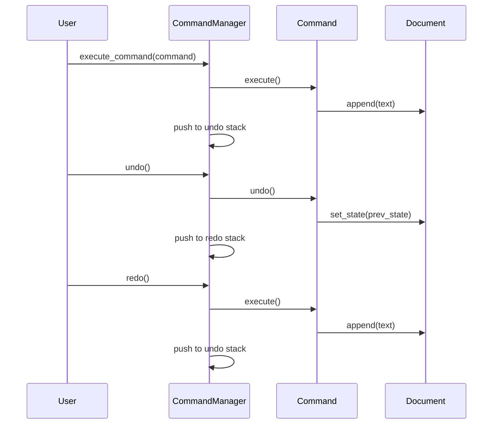

## 5.2.3 Undo and Redo Mechanisms

In the realm of software development, providing users with the ability to undo and redo actions is a critical feature that enhances user experience and application robustness. This capability is particularly important in applications where users frequently make changes, such as text editors, graphic design tools, and any software that involves complex data manipulation. In this section, we will delve into how the Command pattern can be leveraged to implement undo and redo mechanisms in Python, enabling reversible operations that can significantly improve your application's functionality.

### Understanding the Command Pattern

Before we dive into undo and redo mechanisms, let's briefly revisit the Command pattern. The Command pattern is a behavioral design pattern that encapsulates a request as an object, thereby allowing for parameterization of clients with queues, requests, and operations. It decouples the sender and receiver of a request, enabling more flexible and reusable code.

In the context of undo and redo, the Command pattern provides a structured way to encapsulate operations and their corresponding undo actions. Each command object typically implements an `execute` method to perform the action and an `undo` method to reverse it.

### Implementing Undo with the Command Pattern

To implement undo functionality, we need to introduce an `undo` method in our command classes. This method should reverse the effect of the `execute` method, restoring the previous state of the application.

#### Example: Basic Command Structure

Let's start with a simple example to illustrate the basic structure of a command class with undo capability.

```python
class Command:
    def execute(self):
        raise NotImplementedError("Execute method not implemented.")

    def undo(self):
        raise NotImplementedError("Undo method not implemented.")

class AddTextCommand(Command):
    def __init__(self, document, text):
        self.document = document
        self.text = text

    def execute(self):
        self.document.append(self.text)

    def undo(self):
        self.document.pop()

document = []
command = AddTextCommand(document, "Hello, World!")
command.execute()
print(document)  # Output: ['Hello, World!']
command.undo()
print(document)  # Output: []
```

In this example, we define a `Command` base class with `execute` and `undo` methods. The `AddTextCommand` class implements these methods to add and remove text from a document.

### Managing Command History

To support undo and redo operations, we need to maintain a history of executed commands. This can be achieved using a stack data structure, which allows us to easily push executed commands and pop them for undo operations.

#### Example: Command History Stack

```python
class CommandHistory:
    def __init__(self):
        self._history = []

    def push(self, command):
        self._history.append(command)

    def pop(self):
        return self._history.pop() if self._history else None

history = CommandHistory()
command = AddTextCommand(document, "Hello, World!")
command.execute()
history.push(command)

last_command = history.pop()
if last_command:
    last_command.undo()
```

In this example, we create a `CommandHistory` class to manage a stack of executed commands. When a command is executed, it is pushed onto the stack. To undo an operation, we pop the last command from the stack and call its `undo` method.

### Implementing Redo Functionality

Redo functionality can be implemented by maintaining a separate stack for undone commands. When a command is undone, it is pushed onto the redo stack. To redo an operation, we pop the command from the redo stack and execute it again.

#### Example: Redo Mechanism

```python
class CommandManager:
    def __init__(self):
        self._undo_stack = []
        self._redo_stack = []

    def execute_command(self, command):
        command.execute()
        self._undo_stack.append(command)
        self._redo_stack.clear()  # Clear redo stack on new command

    def undo(self):
        if self._undo_stack:
            command = self._undo_stack.pop()
            command.undo()
            self._redo_stack.append(command)

    def redo(self):
        if self._redo_stack:
            command = self._redo_stack.pop()
            command.execute()
            self._undo_stack.append(command)

manager = CommandManager()
command = AddTextCommand(document, "Hello, World!")
manager.execute_command(command)

manager.undo()
manager.redo()
```

In this example, we introduce a `CommandManager` class to handle both undo and redo operations. The `execute_command` method executes a command and pushes it onto the undo stack, clearing the redo stack to ensure consistency. The `undo` and `redo` methods manage the respective stacks to perform the operations.

### Handling Complex Undo Operations

In more complex applications, undo operations may involve restoring the state of multiple objects or handling operations that cannot be easily reversed. In such cases, state management becomes crucial.

#### State Management

To manage state effectively, consider storing snapshots of the application's state before executing a command. This allows you to restore the state during an undo operation.

```python
class Document:
    def __init__(self):
        self._content = []

    def append(self, text):
        self._content.append(text)

    def pop(self):
        return self._content.pop()

    def get_state(self):
        return list(self._content)

    def set_state(self, state):
        self._content = state

class AddTextCommand(Command):
    def __init__(self, document, text):
        self.document = document
        self.text = text
        self.prev_state = None

    def execute(self):
        self.prev_state = self.document.get_state()
        self.document.append(self.text)

    def undo(self):
        self.document.set_state(self.prev_state)

document = Document()
command = AddTextCommand(document, "Hello, World!")
command.execute()
print(document.get_state())  # Output: ['Hello, World!']
command.undo()
print(document.get_state())  # Output: []
```

In this example, the `Document` class provides methods to get and set its state. The `AddTextCommand` class stores the previous state before executing the command, allowing it to restore the state during an undo operation.

### Challenges in Implementing Undo/Redo

Implementing undo and redo mechanisms presents several challenges, including handling commands that cannot be easily undone and managing memory when storing states.

#### Handling Non-Reversible Commands

Some commands may not be easily reversible, such as operations that involve external systems or irreversible changes. In such cases, consider providing alternative solutions, such as warning users before executing non-reversible commands or offering a way to confirm actions.

#### Memory Management

Storing states for undo operations can consume significant memory, especially in applications with large or complex data structures. To mitigate this, consider implementing strategies such as:

- **State Compression**: Compressing state data to reduce memory usage.
- **Limited History**: Restricting the number of states stored in history to a manageable size.
- **Selective Undo**: Allowing undo operations only for specific commands or actions.

### Encouraging Implementation in Projects

Implementing undo and redo mechanisms can greatly enhance your application's usability and robustness. Start by implementing simple commands with basic undo functionality, and gradually introduce more complex operations as needed. Consider the following tips:

- **Start Small**: Begin with basic commands and a simple command history stack.
- **Iterate**: Gradually add complexity, such as state management and redo functionality.
- **Test Thoroughly**: Ensure that undo and redo operations work correctly in all scenarios.
- **Optimize**: Continuously optimize memory usage and performance as your application grows.

### Visualizing Undo and Redo Mechanisms

To better understand the flow of undo and redo operations, let's visualize the process using a sequence diagram.



This diagram illustrates the interactions between the user, command manager, command, and document during execute, undo, and redo operations. It highlights the flow of commands through the undo and redo stacks, providing a clear visual representation of the process.

### Try It Yourself

To reinforce your understanding of undo and redo mechanisms, try modifying the code examples provided in this section. Consider implementing additional command classes with different operations, or experiment with alternative state management techniques. As you explore these concepts, you'll gain valuable insights into the power and flexibility of the Command pattern in Python.

### Conclusion

Implementing undo and redo mechanisms using the Command pattern is a powerful technique that can greatly enhance the functionality and user experience of your applications. By encapsulating operations and their corresponding undo actions, you can provide users with the flexibility to easily reverse and reapply changes, improving the overall robustness and usability of your software.

Remember, this is just the beginning. As you progress, you'll discover more advanced techniques and optimizations for implementing undo and redo mechanisms in your projects. Keep experimenting, stay curious, and enjoy the journey!

## Quiz Time!



### What is the primary role of the `undo` method in a command class?

- [x] To reverse the effect of the `execute` method
- [ ] To execute a command
- [ ] To store the state of the application
- [ ] To clear the command history

> **Explanation:** The `undo` method is designed to reverse the effect of the `execute` method, allowing the application to restore its previous state.

### Which data structure is commonly used to manage command history for undo operations?

- [x] Stack
- [ ] Queue
- [ ] List
- [ ] Dictionary

> **Explanation:** A stack is commonly used to manage command history because it allows for easy push and pop operations, which are ideal for undoing the most recent command.

### How can redo functionality be implemented alongside undo?

- [x] By maintaining a separate stack for undone commands
- [ ] By reversing the undo stack
- [ ] By storing all commands in a list
- [ ] By clearing the undo stack

> **Explanation:** Redo functionality can be implemented by maintaining a separate stack for undone commands, allowing the application to reapply them when needed.

### What is a potential challenge when implementing undo/redo mechanisms?

- [x] Handling commands that cannot be easily undone
- [ ] Executing commands
- [ ] Storing commands in a list
- [ ] Clearing command history

> **Explanation:** A challenge in implementing undo/redo mechanisms is handling commands that cannot be easily undone, such as those involving irreversible changes.

### What strategy can help mitigate memory usage when storing states for undo operations?

- [x] State Compression
- [ ] Increasing stack size
- [ ] Using a queue
- [ ] Clearing the redo stack

> **Explanation:** State compression can help reduce memory usage by compressing state data, making it more manageable.

### What is the first step in implementing undo/redo mechanisms in a project?

- [x] Start with simple commands and a basic command history stack
- [ ] Implement complex state management
- [ ] Optimize memory usage
- [ ] Test thoroughly

> **Explanation:** The first step is to start with simple commands and a basic command history stack, gradually adding complexity as needed.

### How can state management be achieved in complex undo operations?

- [x] By storing snapshots of the application's state
- [ ] By using a queue
- [ ] By clearing the undo stack
- [ ] By reversing the redo stack

> **Explanation:** State management can be achieved by storing snapshots of the application's state, allowing it to be restored during an undo operation.

### What does the `execute_command` method do in the `CommandManager` class?

- [x] Executes a command and pushes it onto the undo stack
- [ ] Clears the redo stack
- [ ] Pops a command from the undo stack
- [ ] Stores the application's state

> **Explanation:** The `execute_command` method executes a command and pushes it onto the undo stack, preparing it for potential undo operations.

### True or False: The Command pattern decouples the sender and receiver of a request.

- [x] True
- [ ] False

> **Explanation:** True. The Command pattern decouples the sender and receiver of a request, allowing for more flexible and reusable code.

### True or False: Redo operations can be performed without maintaining a redo stack.

- [ ] True
- [x] False

> **Explanation:** False. Redo operations typically require a redo stack to manage undone commands, allowing them to be reapplied when needed.


