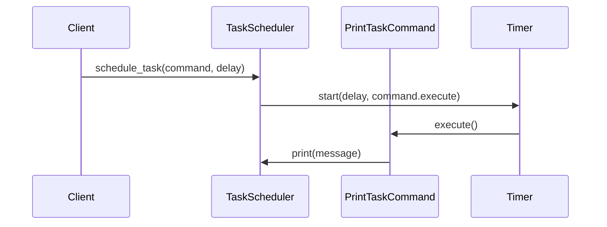

## 5.2.4 Use Cases and Examples

The Command pattern is a behavioral design pattern that transforms requests or simple operations into objects. This encapsulation allows for parameterization of clients with queues, requests, and operations, and provides support for undoable operations. In this section, we will delve into practical use cases and examples where the Command pattern adds significant value, particularly in GUI applications and task scheduling.

### Understanding the Command Pattern

Before diving into specific use cases, let's briefly recap the Command pattern's structure. The pattern typically involves the following components:

- **Command Interface**: Declares an interface for executing operations.
- **Concrete Command**: Implements the Command interface and defines the binding between a Receiver and an action.
- **Receiver**: Knows how to perform the operations associated with carrying out a request.
- **Invoker**: Asks the command to carry out the request.
- **Client**: Creates a ConcreteCommand object and sets its receiver.

Here's a simple illustration of the Command pattern in Python:

```python
from abc import ABC, abstractmethod

class Command(ABC):
    @abstractmethod
    def execute(self):
        pass

class LightOnCommand(Command):
    def __init__(self, light):
        self.light = light

    def execute(self):
        self.light.turn_on()

class Light:
    def turn_on(self):
        print("The light is on")

class RemoteControl:
    def __init__(self):
        self.command = None

    def set_command(self, command):
        self.command = command

    def press_button(self):
        if self.command:
            self.command.execute()

light = Light()
light_on_command = LightOnCommand(light)
remote = RemoteControl()
remote.set_command(light_on_command)
remote.press_button()
```

In this example, the `LightOnCommand` encapsulates the action of turning on a light, allowing the `RemoteControl` to execute this action without needing to know the details of how it's performed.

### Use Case 1: GUI Applications

#### Scenario: Menu Items Triggering Command Execution

In GUI applications, the Command pattern is particularly useful for implementing menu items and buttons that trigger specific actions. By encapsulating actions as command objects, you can easily manage and extend the functionality of your GUI.

**Example: Implementing a Text Editor with Undo Functionality**

Consider a simple text editor where users can perform actions like typing text, deleting text, and undoing the last action. Each action can be encapsulated as a command object, allowing for easy implementation of undo functionality.

```python
class TextEditor:
    def __init__(self):
        self.text = ""

    def write(self, text):
        self.text += text

    def delete_last(self):
        self.text = self.text[:-1]

    def __str__(self):
        return self.text

class WriteCommand(Command):
    def __init__(self, editor, text):
        self.editor = editor
        self.text = text

    def execute(self):
        self.editor.write(self.text)

class DeleteCommand(Command):
    def __init__(self, editor):
        self.editor = editor

    def execute(self):
        self.editor.delete_last()

class EditorInvoker:
    def __init__(self):
        self.history = []

    def execute_command(self, command):
        command.execute()
        self.history.append(command)

    def undo(self):
        if self.history:
            command = self.history.pop()
            # Assuming each command knows how to undo itself
            command.undo()

editor = TextEditor()
invoker = EditorInvoker()

write_command = WriteCommand(editor, "Hello")
delete_command = DeleteCommand(editor)

invoker.execute_command(write_command)
print(editor)  # Output: Hello

invoker.execute_command(delete_command)
print(editor)  # Output: Hell

invoker.undo()
print(editor)  # Output: Hello
```

**Benefits Observed:**

- **Improved Code Organization**: Each action is encapsulated in its own class, making the codebase more modular and easier to manage.
- **Easier Addition of New Commands**: New actions can be added without modifying existing code, adhering to the Open/Closed Principle.
- **Undo Functionality**: The history of commands allows for easy implementation of undo operations.

### Use Case 2: Task Scheduling

#### Scenario: Commands Representing Tasks to Run at Scheduled Times

In task scheduling systems, the Command pattern can be used to encapsulate tasks as command objects. This approach allows for flexible scheduling, execution, and management of tasks.

**Example: Implementing a Simple Task Scheduler**

Let's create a simple task scheduler that can schedule and execute tasks at specified intervals.

```python
import time
from threading import Timer

class PrintTaskCommand(Command):
    def __init__(self, message):
        self.message = message

    def execute(self):
        print(self.message)

class TaskScheduler:
    def __init__(self):
        self.tasks = []

    def schedule_task(self, command, delay):
        timer = Timer(delay, command.execute)
        self.tasks.append(timer)
        timer.start()

    def cancel_all(self):
        for task in self.tasks:
            task.cancel()

scheduler = TaskScheduler()
task1 = PrintTaskCommand("Task 1 executed")
task2 = PrintTaskCommand("Task 2 executed")

scheduler.schedule_task(task1, 2)  # Execute after 2 seconds
scheduler.schedule_task(task2, 5)  # Execute after 5 seconds

time.sleep(6)  # Wait for tasks to complete
scheduler.cancel_all()  # Cancel any remaining tasks
```

**Benefits Observed:**

- **Decoupling of Task Definition and Execution**: Tasks are defined independently of their execution, allowing for flexible scheduling.
- **Centralized Task Management**: The scheduler manages all tasks, providing a single point of control.
- **Scalability**: New tasks can be added easily without affecting the existing system.

### Visualizing the Command Pattern in Task Scheduling

To better understand how the Command pattern fits into a task scheduling system, let's visualize the interaction between components using a sequence diagram.



**Diagram Description:**

- The `Client` schedules a task by passing a `PrintTaskCommand` and a delay to the `TaskScheduler`.
- The `TaskScheduler` uses a `Timer` to delay the execution of the command.
- Once the delay is over, the `Timer` triggers the `execute` method of the `PrintTaskCommand`.
- The command performs its action, in this case, printing a message.

### Try It Yourself

To solidify your understanding, try modifying the examples above:

- **Extend the Text Editor**: Add new commands such as `CopyCommand` and `PasteCommand`.
- **Enhance the Task Scheduler**: Implement a recurring task feature that executes commands at regular intervals.

### Additional Use Cases

Beyond GUI applications and task scheduling, the Command pattern can be applied in various other scenarios:

- **Macro Recording**: Record a sequence of commands and replay them later.
- **Network Requests**: Encapsulate network requests as commands, allowing for retries and error handling.
- **Game Development**: Implement actions such as moving a character or firing a weapon as commands, enabling undo and replay features.

### Key Takeaways

- **Encapsulation of Operations**: The Command pattern encapsulates operations, making them reusable and easy to manage.
- **Decoupling**: It decouples the object that invokes the operation from the one that performs it.
- **Flexibility**: New commands can be added with minimal changes to existing code, enhancing flexibility and maintainability.

### References and Further Reading

- [Command Pattern on Wikipedia](https://en.wikipedia.org/wiki/Command_pattern)
- [Python Design Patterns](https://www.python.org/dev/peps/pep-0008/)
- [Real Python: Python Design Patterns](https://realpython.com/python-design-patterns/)

## Quiz Time!



### What is the primary benefit of using the Command pattern in GUI applications?

- [x] It allows for encapsulation of actions, making it easier to manage and extend functionality.
- [ ] It reduces the number of classes needed in the application.
- [ ] It simplifies the user interface design.
- [ ] It eliminates the need for event handlers.

> **Explanation:** The Command pattern encapsulates actions as objects, making it easier to manage and extend functionality, especially in GUI applications.

### In the context of the Command pattern, what role does the Invoker play?

- [x] It asks the command to carry out the request.
- [ ] It performs the actual operation.
- [ ] It creates the command object.
- [ ] It defines the interface for executing operations.

> **Explanation:** The Invoker is responsible for asking the command to carry out the request, without knowing the details of how the operation is performed.

### How does the Command pattern improve code organization?

- [x] By encapsulating each action in its own class, making the codebase more modular.
- [ ] By reducing the number of methods in a class.
- [ ] By combining multiple actions into a single method.
- [ ] By eliminating the need for classes.

> **Explanation:** The Command pattern improves code organization by encapsulating each action in its own class, making the codebase more modular and easier to manage.

### Which of the following is a benefit of using the Command pattern for task scheduling?

- [x] Decoupling of task definition and execution.
- [ ] Simplification of task logic.
- [ ] Reduction in the number of tasks.
- [ ] Elimination of task dependencies.

> **Explanation:** The Command pattern decouples task definition from execution, allowing for flexible scheduling and management of tasks.

### What is a common use case for the Command pattern in game development?

- [x] Implementing actions such as moving a character or firing a weapon.
- [ ] Designing the game interface.
- [ ] Managing game assets.
- [ ] Creating game levels.

> **Explanation:** In game development, the Command pattern is commonly used to implement actions such as moving a character or firing a weapon, enabling undo and replay features.

### How does the Command pattern facilitate the implementation of undo functionality?

- [x] By maintaining a history of executed commands.
- [ ] By reversing the order of operations.
- [ ] By combining all actions into a single method.
- [ ] By eliminating the need for state management.

> **Explanation:** The Command pattern facilitates undo functionality by maintaining a history of executed commands, allowing for easy reversal of actions.

### What is the role of the Receiver in the Command pattern?

- [x] It knows how to perform the operations associated with carrying out a request.
- [ ] It creates the command object.
- [ ] It asks the command to carry out the request.
- [ ] It defines the interface for executing operations.

> **Explanation:** The Receiver knows how to perform the operations associated with carrying out a request, as defined by the command.

### Which component of the Command pattern encapsulates the action to be performed?

- [x] Concrete Command
- [ ] Invoker
- [ ] Receiver
- [ ] Client

> **Explanation:** The Concrete Command encapsulates the action to be performed, binding a Receiver with an action.

### True or False: The Command pattern can be used to encapsulate network requests, allowing for retries and error handling.

- [x] True
- [ ] False

> **Explanation:** True. The Command pattern can encapsulate network requests, allowing for retries and error handling, making it a flexible solution for managing network operations.

### True or False: The Command pattern eliminates the need for event handlers in GUI applications.

- [ ] True
- [x] False

> **Explanation:** False. The Command pattern does not eliminate the need for event handlers; rather, it encapsulates actions as objects, which can be triggered by event handlers.



Remember, this is just the beginning. As you progress, you'll build more complex and interactive applications. Keep experimenting, stay curious, and enjoy the journey!
