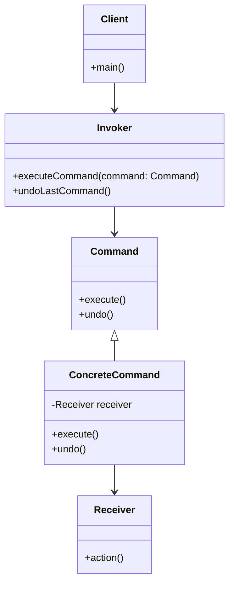

## 5.2 Command Pattern

In the realm of software design, the Command Pattern stands out as a powerful tool for encapsulating requests as objects. This pattern is particularly useful for parameterizing clients with queues, logging, and supporting undoable operations. By decoupling the object that invokes the operation from the one that knows how to perform it, the Command Pattern provides a flexible and extensible architecture.

### Understanding the Command Pattern

The Command Pattern is a behavioral design pattern that turns a request into a stand-alone object containing all information about the request. This transformation allows for the parameterization of methods with different requests, queuing of requests, and logging of the requests. It also provides support for undoable operations.

#### Intent and Uses

The primary intent of the Command Pattern is to decouple the sender of a request from its receiver by encapsulating a request as an object. This separation allows for:

- **Parameterization of clients**: Clients can be parameterized with different requests, allowing for dynamic command execution.
- **Queuing and logging**: Commands can be queued for later execution or logged for auditing purposes.
- **Undo/redo functionality**: Commands can store the state necessary to undo or redo their effects.

#### Components of the Command Pattern

The Command Pattern is composed of several key components:

- **Command**: An interface or abstract class defining the execute method.
- **ConcreteCommand**: A class that implements the Command interface and defines the binding between a Receiver and an action.
- **Receiver**: The object that knows how to perform the operations associated with carrying out a request.
- **Invoker**: The object that holds and invokes commands.
- **Client**: The object that creates a ConcreteCommand and sets its Receiver.

Let's delve into each of these components with a Python implementation.

### Implementing the Command Pattern in Python

To illustrate the Command Pattern, we'll create a simple text editor application with commands for operations like copy, paste, and undo.

#### Step 1: Define the Command Interface

First, we define the Command interface with an `execute` method:

```python
from abc import ABC, abstractmethod

class Command(ABC):
    @abstractmethod
    def execute(self):
        pass
```

#### Step 2: Create Concrete Commands

Next, we implement concrete commands for copy and paste operations:

```python
class CopyCommand(Command):
    def __init__(self, receiver):
        self.receiver = receiver

    def execute(self):
        self.receiver.copy()

class PasteCommand(Command):
    def __init__(self, receiver):
        self.receiver = receiver

    def execute(self):
        self.receiver.paste()
```

#### Step 3: Implement the Receiver

The Receiver class knows how to perform the operations:

```python
class TextEditor:
    def __init__(self):
        self.clipboard = ""
        self.text = ""

    def copy(self):
        self.clipboard = self.text
        print(f"Copied text: {self.clipboard}")

    def paste(self):
        self.text += self.clipboard
        print(f"Text after paste: {self.text}")
```

#### Step 4: Set Up the Invoker

The Invoker holds and executes commands:

```python
class EditorInvoker:
    def __init__(self):
        self.history = []

    def execute_command(self, command):
        command.execute()
        self.history.append(command)
```

#### Step 5: Assemble the Client

Finally, the Client sets up the commands and executes them:

```python
def main():
    editor = TextEditor()
    copy_command = CopyCommand(editor)
    paste_command = PasteCommand(editor)

    invoker = EditorInvoker()
    editor.text = "Hello, World!"
    invoker.execute_command(copy_command)
    invoker.execute_command(paste_command)

if __name__ == "__main__":
    main()
```

### Implementing Undo/Redo Functionality

One of the significant advantages of the Command Pattern is its ability to support undo and redo operations. To implement this, we need to enhance our Command interface and ConcreteCommand classes to store the necessary state.

#### Step 1: Extend the Command Interface

Add an `undo` method to the Command interface:

```python
class Command(ABC):
    @abstractmethod
    def execute(self):
        pass

    @abstractmethod
    def undo(self):
        pass
```

#### Step 2: Implement Undo in Concrete Commands

Modify the ConcreteCommand classes to implement the `undo` method:

```python
class CopyCommand(Command):
    def __init__(self, receiver):
        self.receiver = receiver
        self.previous_clipboard = ""

    def execute(self):
        self.previous_clipboard = self.receiver.clipboard
        self.receiver.copy()

    def undo(self):
        self.receiver.clipboard = self.previous_clipboard
        print(f"Clipboard after undo: {self.receiver.clipboard}")

class PasteCommand(Command):
    def __init__(self, receiver):
        self.receiver = receiver
        self.previous_text = ""

    def execute(self):
        self.previous_text = self.receiver.text
        self.receiver.paste()

    def undo(self):
        self.receiver.text = self.previous_text
        print(f"Text after undo: {self.receiver.text}")
```

#### Step 3: Update the Invoker for Undo

Enhance the Invoker to support undo operations:

```python
class EditorInvoker:
    def __init__(self):
        self.history = []

    def execute_command(self, command):
        command.execute()
        self.history.append(command)

    def undo_last_command(self):
        if self.history:
            command = self.history.pop()
            command.undo()
```

#### Step 4: Test Undo Functionality

Update the Client to test the undo functionality:

```python
def main():
    editor = TextEditor()
    copy_command = CopyCommand(editor)
    paste_command = PasteCommand(editor)

    invoker = EditorInvoker()
    editor.text = "Hello, World!"
    invoker.execute_command(copy_command)
    invoker.execute_command(paste_command)
    invoker.undo_last_command()

if __name__ == "__main__":
    main()
```

### Benefits of the Command Pattern

The Command Pattern offers several benefits:

- **Decoupling**: It decouples the object that invokes the operation from the one that knows how to perform it.
- **Flexibility**: Commands can be parameterized and queued, allowing for flexible execution.
- **Undo/Redo Support**: The pattern naturally supports undo and redo operations by storing state within commands.
- **Macro Recording**: Commands can be recorded and replayed, enabling macro functionality.

### Potential Complexities

While the Command Pattern is powerful, it can introduce complexities:

- **Command History Management**: Keeping track of command history for undo/redo can become complex, especially in applications with numerous commands.
- **State Management**: Commands need to store sufficient state to support undo operations, which can increase memory usage.

### Encouraging Applications

The Command Pattern is versatile and can be applied to various domains:

- **Text Editors**: Implement custom command systems for text manipulation.
- **GUI Applications**: Use commands to handle user actions and implement undo/redo functionality.
- **Game Development**: Manage player actions and support undoable moves.

### Visualizing the Command Pattern

To better understand the Command Pattern, let's visualize its components and interactions using a class diagram.



**Diagram Description**: This class diagram illustrates the relationships between the Command, ConcreteCommand, Receiver, Invoker, and Client components in the Command Pattern.

### Try It Yourself

To deepen your understanding of the Command Pattern, try modifying the code examples:

1. **Add New Commands**: Implement additional commands, such as cut or delete, and integrate them into the application.
2. **Enhance Undo/Redo**: Extend the undo functionality to support redo operations.
3. **Implement Macros**: Create a macro system that records and replays a sequence of commands.

### References and Further Reading

- [Design Patterns: Elements of Reusable Object-Oriented Software](https://en.wikipedia.org/wiki/Design_Patterns) by Erich Gamma, Richard Helm, Ralph Johnson, and John Vlissides.
- [Command Pattern on Refactoring Guru](https://refactoring.guru/design-patterns/command) - A comprehensive guide to the Command Pattern.
- [Python's `abc` Module](https://docs.python.org/3/library/abc.html) - Learn more about abstract base classes in Python.

### Knowledge Check

Before we conclude, let's reinforce your understanding with a few questions:

1. What is the primary purpose of the Command Pattern?
2. How does the Command Pattern support undo/redo functionality?
3. What are the key components of the Command Pattern?
4. How can the Command Pattern be applied in GUI applications?

### Embrace the Journey

Remember, mastering design patterns like the Command Pattern is a journey. As you continue to explore and implement these patterns, you'll gain deeper insights into building flexible and maintainable software architectures. Keep experimenting, stay curious, and enjoy the process!

## Quiz Time!



### What is the primary purpose of the Command Pattern?

- [x] To encapsulate a request as an object, allowing for parameterization and queuing.
- [ ] To directly execute operations without encapsulation.
- [ ] To manage memory usage in applications.
- [ ] To simplify user interface design.

> **Explanation:** The Command Pattern encapsulates requests as objects, enabling parameterization, queuing, and undoable operations.

### Which component in the Command Pattern knows how to perform the operations?

- [ ] Command
- [x] Receiver
- [ ] Invoker
- [ ] Client

> **Explanation:** The Receiver is the component that knows how to perform the operations associated with a request.

### What method is typically added to the Command interface to support undo functionality?

- [ ] redo()
- [ ] perform()
- [x] undo()
- [ ] cancel()

> **Explanation:** The `undo()` method is added to the Command interface to support undo functionality by reversing the effects of a command.

### In the Command Pattern, which component is responsible for invoking commands?

- [ ] Receiver
- [ ] Client
- [x] Invoker
- [ ] ConcreteCommand

> **Explanation:** The Invoker is responsible for holding and invoking commands in the Command Pattern.

### How can the Command Pattern be utilized in GUI applications?

- [x] By handling user actions and implementing undo/redo functionality.
- [ ] By directly modifying the user interface elements.
- [ ] By managing memory allocation.
- [ ] By simplifying network communication.

> **Explanation:** The Command Pattern can handle user actions and implement undo/redo functionality in GUI applications.

### Which of the following is a benefit of using the Command Pattern?

- [x] Decoupling the sender of a request from its receiver.
- [ ] Increasing memory usage.
- [ ] Directly executing operations without encapsulation.
- [ ] Simplifying user interface design.

> **Explanation:** The Command Pattern decouples the sender of a request from its receiver, providing flexibility and extensibility.

### What is a potential complexity of the Command Pattern?

- [x] Managing command history for undo/redo functionality.
- [ ] Simplifying user interface design.
- [ ] Directly executing operations without encapsulation.
- [ ] Reducing memory usage.

> **Explanation:** Managing command history for undo/redo functionality can become complex, especially with numerous commands.

### Which Python module can be used to define abstract base classes for the Command Pattern?

- [ ] functools
- [ ] itertools
- [x] abc
- [ ] os

> **Explanation:** The `abc` module in Python is used to define abstract base classes, which can be utilized in the Command Pattern.

### What is a common use case for the Command Pattern in text editors?

- [x] Implementing custom command systems for text manipulation.
- [ ] Directly modifying the user interface elements.
- [ ] Managing memory allocation.
- [ ] Simplifying network communication.

> **Explanation:** The Command Pattern is commonly used in text editors to implement custom command systems for text manipulation.

### True or False: The Command Pattern can be used to implement macro recording functionality.

- [x] True
- [ ] False

> **Explanation:** The Command Pattern can be used to implement macro recording functionality by recording and replaying sequences of commands.


