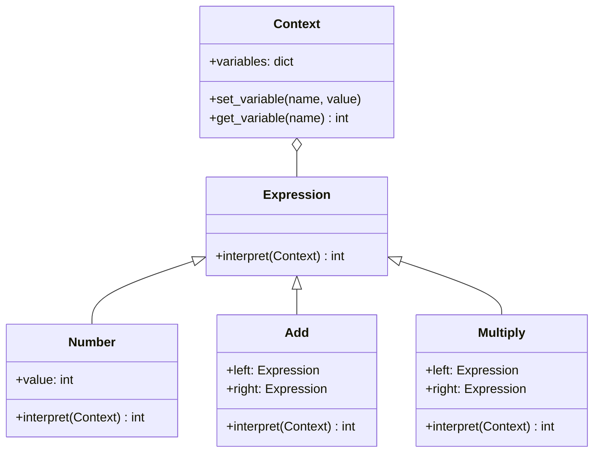

## 5.3.1 Implementing Interpreter in Python

In this section, we will delve into the Interpreter Pattern, a powerful behavioral design pattern used to define a grammar for a language and provide an interpreter to process sentences in that language. We will explore how to implement this pattern in Python, focusing on parsing and interpreting expressions using classes to represent grammar rules.

### Understanding the Interpreter Pattern

The Interpreter Pattern is used to evaluate sentences in a language defined by a grammar. It involves creating a class for each grammar rule and using these classes to interpret the language. This pattern is particularly useful for designing simple languages, scripting engines, or even configuration file parsers.

#### Key Concepts

- **Grammar**: A set of rules that define the structure of valid sentences in a language.
- **Terminal Expressions**: The basic elements of the grammar that cannot be broken down further.
- **NonTerminal Expressions**: Combinations of terminal and/or other nonterminal expressions.
- **Context**: Holds global information needed during interpretation, such as variable values.

### Defining Grammar Rules and Corresponding Classes

To implement the Interpreter Pattern, we first need to define the grammar rules for the language we want to interpret. Let's consider a simple mathematical expression language that supports addition and multiplication.

#### Grammar Definition

The grammar for our language can be defined as follows:

```
expression ::= term | expression '+' term
term       ::= factor | term '*' factor
factor     ::= number | '(' expression ')'
number     ::= digit+
digit      ::= '0' | '1' | ... | '9'
```

This grammar allows for expressions like `3 + 5 * (2 + 4)`.

#### Creating Classes for Grammar Rules

We will create a class for each grammar rule. Each class will have an `interpret` method that evaluates the expression it represents.

```python
from abc import ABC, abstractmethod

class Expression(ABC):
    @abstractmethod
    def interpret(self, context):
        pass

class Number(Expression):
    def __init__(self, value):
        self.value = value

    def interpret(self, context):
        return self.value

class Add(Expression):
    def __init__(self, left, right):
        self.left = left
        self.right = right

    def interpret(self, context):
        return self.left.interpret(context) + self.right.interpret(context)

class Multiply(Expression):
    def __init__(self, left, right):
        self.left = left
        self.right = right

    def interpret(self, context):
        return self.left.interpret(context) * self.right.interpret(context)
```

### Implementing the Interpreter

With our classes defined, we can now implement the interpreter that parses and evaluates expressions.

#### Parsing Expressions

To parse expressions, we need a simple parser that converts a string into a tree of `Expression` objects. For simplicity, we'll assume the input is well-formed.

```python
import re

class Parser:
    def __init__(self, expression):
        self.tokens = re.findall(r'\d+|\+|\*|\\(|\\)', expression)
        self.current_token_index = 0

    def parse(self):
        return self.parse_expression()

    def parse_expression(self):
        term = self.parse_term()
        while self.current_token() == '+':
            self.consume('+')
            term = Add(term, self.parse_term())
        return term

    def parse_term(self):
        factor = self.parse_factor()
        while self.current_token() == '*':
            self.consume('*')
            factor = Multiply(factor, self.parse_factor())
        return factor

    def parse_factor(self):
        token = self.current_token()
        if token.isdigit():
            self.consume(token)
            return Number(int(token))
        elif token == '(':
            self.consume('(')
            expression = self.parse_expression()
            self.consume(')')
            return expression
        raise SyntaxError("Invalid syntax")

    def current_token(self):
        return self.tokens[self.current_token_index]

    def consume(self, token):
        if self.current_token() == token:
            self.current_token_index += 1
        else:
            raise SyntaxError(f"Expected {token}, got {self.current_token()}")
```

### Evaluating Expressions

The `interpret` method of each `Expression` class evaluates the expression it represents. The `Context` class can be used to store variable values or other global information needed during interpretation.

```python
class Context:
    def __init__(self):
        self.variables = {}

    def set_variable(self, name, value):
        self.variables[name] = value

    def get_variable(self, name):
        return self.variables.get(name, 0)

expression = "3 + 5 * (2 + 4)"
parser = Parser(expression)
syntax_tree = parser.parse()
context = Context()
result = syntax_tree.interpret(context)
print(f"The result of '{expression}' is {result}")
```

### The Recursive Nature of the Interpreter Pattern

The Interpreter Pattern's recursive nature is evident in how `NonTerminalExpressions` combine `TerminalExpressions`. Each `NonTerminalExpression` recursively interprets its components, building up the final result.

#### Example: Interpreting a Complex Expression

Consider the expression `3 + 5 * (2 + 4)`. The interpreter will:

1. Parse `3` as a `Number`.
2. Parse `5 * (2 + 4)` as a `Multiply` expression.
3. Parse `2 + 4` as an `Add` expression.
4. Evaluate `2 + 4` to `6`.
5. Evaluate `5 * 6` to `30`.
6. Evaluate `3 + 30` to `33`.

### The Role of Context

The `Context` class holds global information needed during interpretation, such as variable values. In our example, the context is relatively simple, but in more complex languages, it could store variable bindings, function definitions, or other state information.

### Leveraging Python Features

Python's features, such as recursion, data classes, and operator overloading, can enhance the implementation of the Interpreter Pattern.

#### Using Data Classes

Data classes can simplify the definition of `Expression` classes by automatically generating boilerplate code like `__init__`.

```python
from dataclasses import dataclass

@dataclass
class Number(Expression):
    value: int

    def interpret(self, context):
        return self.value
```

#### Operator Overloading

For more advanced implementations, operator overloading can be used to define custom behavior for operators like `+` and `*`.

### Try It Yourself

Experiment with the code by modifying the grammar or adding new operations. For example, try adding support for subtraction or division.

```python
class Subtract(Expression):
    def __init__(self, left, right):
        self.left = left
        self.right = right

    def interpret(self, context):
        return self.left.interpret(context) - self.right.interpret(context)
```

### Visualizing the Interpreter Pattern

Below is a diagram illustrating the structure of the Interpreter Pattern and how expressions are parsed and interpreted.



### Knowledge Check

- What is the role of the `Context` class in the Interpreter Pattern?
- How do `NonTerminalExpressions` combine `TerminalExpressions`?
- Why is recursion important in the Interpreter Pattern?

### Summary

In this section, we explored the Interpreter Pattern and its implementation in Python. We defined grammar rules, created corresponding classes, and implemented an interpreter to parse and evaluate expressions. We also highlighted the recursive nature of the pattern and the role of the `Context` class. By leveraging Python's features, we can create powerful and flexible interpreters for various languages.

Remember, this is just the beginning. As you progress, you'll be able to design more complex interpreters for different languages. Keep experimenting, stay curious, and enjoy the journey!

## Quiz Time!



### What is the primary purpose of the Interpreter Pattern?

- [x] To evaluate sentences in a language defined by a grammar.
- [ ] To manage object creation.
- [ ] To provide a simplified interface to a complex subsystem.
- [ ] To decouple an abstraction from its implementation.

> **Explanation:** The Interpreter Pattern is used to evaluate sentences in a language defined by a grammar.

### Which class in the Interpreter Pattern holds global information needed during interpretation?

- [ ] Expression
- [ ] Number
- [x] Context
- [ ] Parser

> **Explanation:** The `Context` class holds global information needed during interpretation, such as variable values.

### What is a Terminal Expression in the Interpreter Pattern?

- [x] The basic elements of the grammar that cannot be broken down further.
- [ ] Combinations of terminal and/or other nonterminal expressions.
- [ ] A class that holds global information needed during interpretation.
- [ ] A class that parses expressions.

> **Explanation:** Terminal Expressions are the basic elements of the grammar that cannot be broken down further.

### How do NonTerminalExpressions combine TerminalExpressions?

- [x] By recursively interpreting their components.
- [ ] By holding global information needed during interpretation.
- [ ] By parsing expressions into tokens.
- [ ] By providing a simplified interface to a complex subsystem.

> **Explanation:** NonTerminalExpressions combine TerminalExpressions by recursively interpreting their components.

### What Python feature can simplify the definition of Expression classes?

- [ ] Operator overloading
- [x] Data classes
- [ ] Context management
- [ ] List comprehensions

> **Explanation:** Data classes can simplify the definition of Expression classes by automatically generating boilerplate code like `__init__`.

### What is the function of the `interpret` method in the Interpreter Pattern?

- [x] To evaluate the expression represented by the class.
- [ ] To parse expressions into tokens.
- [ ] To hold global information needed during interpretation.
- [ ] To provide a simplified interface to a complex subsystem.

> **Explanation:** The `interpret` method evaluates the expression represented by the class.

### Which of the following is a NonTerminal Expression in the provided example?

- [ ] Number
- [x] Add
- [ ] Context
- [ ] Parser

> **Explanation:** `Add` is a NonTerminal Expression that combines two expressions using addition.

### What is the role of the `Parser` class in the Interpreter Pattern?

- [x] To convert a string into a tree of Expression objects.
- [ ] To hold global information needed during interpretation.
- [ ] To evaluate the expression represented by the class.
- [ ] To provide a simplified interface to a complex subsystem.

> **Explanation:** The `Parser` class converts a string into a tree of Expression objects.

### Can operator overloading be used in the Interpreter Pattern?

- [x] True
- [ ] False

> **Explanation:** Operator overloading can be used to define custom behavior for operators like `+` and `*` in more advanced implementations.

### What is the result of interpreting the expression "3 + 5 * (2 + 4)" using the provided implementation?

- [x] 33
- [ ] 21
- [ ] 15
- [ ] 27

> **Explanation:** The expression "3 + 5 * (2 + 4)" is interpreted as `3 + (5 * 6)`, which equals `33`.




