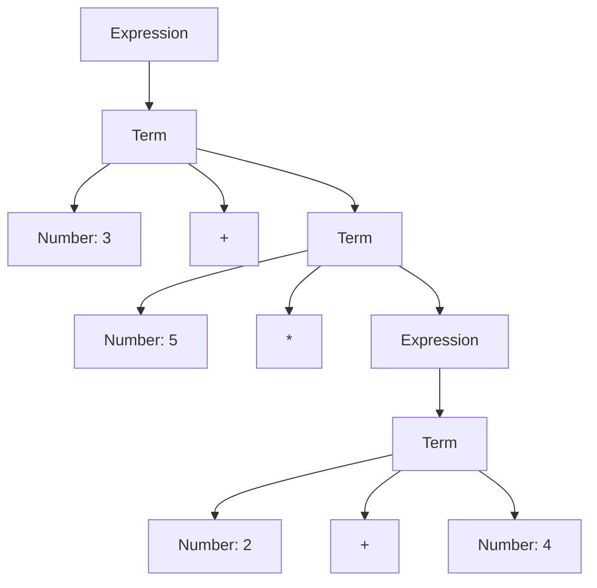

## 5.3.2 Defining Grammars

In the realm of software development, particularly when dealing with language interpreters or compilers, defining grammars is a fundamental step. Grammars provide a structured way to describe the syntax of a language, and Abstract Syntax Trees (ASTs) are pivotal in representing this syntax in a hierarchical tree structure. In this section, we will delve into the concepts of grammars and ASTs, explore how to define grammars using Backus-Naur Form (BNF), and demonstrate how to translate these definitions into Python class hierarchies. We will also discuss practical considerations for managing complexity and ensuring extensibility.

### Understanding Grammars and Abstract Syntax Trees

#### What is a Grammar?

A grammar is a formal description of a language's syntax. It defines the rules that specify how valid sentences (or expressions) in the language are constructed. Grammars are crucial in parsing, as they help in understanding and interpreting the structure of the input data.

One of the most common ways to define grammars is through Backus-Naur Form (BNF), which uses a set of production rules to describe the syntax. Each rule consists of a left-hand side (a non-terminal symbol) and a right-hand side (a sequence of terminals and/or non-terminals).

#### What is an Abstract Syntax Tree (AST)?

An Abstract Syntax Tree (AST) is a tree representation of the abstract syntactic structure of source code. Each node in the tree denotes a construct occurring in the source code. The syntax is "abstract" in the sense that it does not represent every detail appearing in the real syntax, but rather the structural or semantic content of the code.

ASTs are used in compilers and interpreters to analyze the syntax and semantics of the source code. They are pivotal in the transformation of source code into executable code.

### Defining Grammars with BNF

Backus-Naur Form (BNF) is a notation technique for context-free grammars, often used to describe the syntax of languages used in computing. Let's explore how to define grammars using BNF.

#### Simple BNF Example

Consider a simple arithmetic expression grammar:

```
<expression> ::= <term> | <expression> "+" <term>
<term> ::= <factor> | <term> "*" <factor>
<factor> ::= <number> | "(" <expression> ")"
<number> ::= "0" | "1" | "2" | ... | "9"
```

In this grammar:
- `<expression>`, `<term>`, `<factor>`, and `<number>` are non-terminal symbols.
- `"+"`, `"*"`, `"("`, `")"`, and digits are terminal symbols.
- The rules define how expressions, terms, factors, and numbers are constructed.

### Translating Grammar into Classes

To implement a language interpreter or compiler, we need to translate the grammar into a set of classes that represent the AST. Each non-terminal in the grammar typically corresponds to a class in the AST.

#### Mapping Grammar Rules to Class Hierarchies

Let's map the arithmetic expression grammar into Python classes:

```python
class Expression:
    def evaluate(self):
        raise NotImplementedError("Must be implemented by subclasses.")

class Term(Expression):
    def __init__(self, left, operator, right):
        self.left = left
        self.operator = operator
        self.right = right

    def evaluate(self):
        if self.operator == '+':
            return self.left.evaluate() + self.right.evaluate()
        elif self.operator == '*':
            return self.left.evaluate() * self.right.evaluate()

class Factor(Expression):
    def __init__(self, value):
        self.value = value

    def evaluate(self):
        return self.value

class Number(Factor):
    def __init__(self, value):
        super().__init__(value)

    def evaluate(self):
        return int(self.value)
```

In this example:
- `Expression` is an abstract class representing any expression.
- `Term` represents expressions involving operators like `+` and `*`.
- `Factor` is a subclass of `Expression` and represents numbers or grouped expressions.
- `Number` is a subclass of `Factor` that holds numeric values.

### Practical Considerations

#### Managing Complexity

As grammars grow more complex, managing the corresponding class hierarchies can become challenging. Here are some strategies to manage this complexity:

1. **Modular Design**: Break down the grammar into smaller, manageable modules. Each module can represent a subset of the language's syntax.

2. **Use of Design Patterns**: Employ design patterns like Visitor or Composite to handle operations on the AST without cluttering the class hierarchy.

3. **Automated Tools**: Use parser generators or tools like ANTLR or PLY to automatically generate parser code from grammar definitions.

#### Ensuring Extensibility

To ensure that your grammar and AST can be easily extended to accommodate new expressions or language features, consider the following:

1. **Open/Closed Principle**: Design the class hierarchy so that it can be extended without modifying existing code. Use inheritance and polymorphism to add new behavior.

2. **Visitor Pattern**: Implement the Visitor pattern to separate operations from the object structure, making it easier to add new operations without altering the existing classes.

3. **Clear Abstractions**: Define clear abstractions and interfaces for different components of the grammar. This makes it easier to introduce new components without affecting existing ones.

### Code Example: Parsing and Evaluating Expressions

Let's implement a simple parser and evaluator for arithmetic expressions using the defined classes:

```python
import re

class Parser:
    def __init__(self, expression):
        self.tokens = re.findall(r'\d+|[+*()]', expression)
        self.current_token = None
        self.next_token()

    def next_token(self):
        self.current_token = self.tokens.pop(0) if self.tokens else None

    def parse_expression(self):
        term = self.parse_term()
        while self.current_token == '+':
            self.next_token()
            term = Term(term, '+', self.parse_term())
        return term

    def parse_term(self):
        factor = self.parse_factor()
        while self.current_token == '*':
            self.next_token()
            factor = Term(factor, '*', self.parse_factor())
        return factor

    def parse_factor(self):
        if self.current_token.isdigit():
            number = Number(self.current_token)
            self.next_token()
            return number
        elif self.current_token == '(':
            self.next_token()
            expression = self.parse_expression()
            if self.current_token == ')':
                self.next_token()
            return expression

expression = "3 + 5 * (2 + 4)"
parser = Parser(expression)
ast = parser.parse_expression()
result = ast.evaluate()
print(f"The result of '{expression}' is {result}")
```

In this example:
- The `Parser` class tokenizes the input expression and parses it into an AST.
- The `parse_expression`, `parse_term`, and `parse_factor` methods correspond to the grammar rules.
- The `evaluate` method computes the result by traversing the AST.

### Visualizing the Abstract Syntax Tree

To better understand how the AST represents the arithmetic expression, let's visualize it using a diagram.



**Diagram Description**: This diagram represents the AST for the expression `3 + 5 * (2 + 4)`. The root node is an `Expression`, which contains a `Term` with a `+` operator. The right operand of the `+` operator is another `Term` with a `*` operator, whose right operand is a nested `Expression`.

### Try It Yourself

To deepen your understanding, try modifying the code examples:

- **Add Subtraction and Division**: Extend the grammar and classes to support `-` and `/` operators.
- **Implement Parentheses Handling**: Ensure that expressions with parentheses are correctly parsed and evaluated.
- **Create a New Expression Type**: Introduce a new type of expression, such as exponentiation, and update the grammar and classes accordingly.

### References and Links

For further reading on grammars and ASTs, consider these resources:

- [Backus-Naur Form (BNF) on Wikipedia](https://en.wikipedia.org/wiki/Backus%E2%80%93Naur_form)
- [Abstract Syntax Tree on Wikipedia](https://en.wikipedia.org/wiki/Abstract_syntax_tree)
- [Python's `ast` module](https://docs.python.org/3/library/ast.html)

### Knowledge Check

- **What is the purpose of an Abstract Syntax Tree (AST)?**
- **How does BNF help in defining grammars?**
- **What are some strategies for managing complexity in grammar definitions?**

### Embrace the Journey

Remember, defining grammars and building ASTs is a foundational skill in language processing. As you progress, you'll be able to tackle more complex languages and build sophisticated interpreters and compilers. Keep experimenting, stay curious, and enjoy the journey!

## Quiz Time!



### What is a grammar in the context of programming languages?

- [x] A formal description of a language's syntax.
- [ ] A tool for optimizing code execution.
- [ ] A method for debugging programs.
- [ ] A type of data structure used in databases.

> **Explanation:** A grammar is a formal description of a language's syntax, defining the rules for constructing valid sentences or expressions.

### What does an Abstract Syntax Tree (AST) represent?

- [x] The abstract syntactic structure of source code.
- [ ] The execution flow of a program.
- [ ] The memory layout of a program.
- [ ] The user interface of an application.

> **Explanation:** An AST represents the abstract syntactic structure of source code, capturing the hierarchical relationships between language constructs.

### Which notation is commonly used to define grammars?

- [x] Backus-Naur Form (BNF)
- [ ] JSON
- [ ] XML
- [ ] YAML

> **Explanation:** Backus-Naur Form (BNF) is a notation technique used to define the syntax of languages in computing.

### How can complexity be managed in grammar definitions?

- [x] By breaking down the grammar into smaller modules.
- [ ] By avoiding the use of design patterns.
- [ ] By using only terminal symbols.
- [ ] By ignoring extensibility.

> **Explanation:** Breaking down the grammar into smaller modules helps manage complexity by making the grammar more manageable and organized.

### What is the role of the `evaluate` method in the AST classes?

- [x] To compute the result of the expression represented by the AST.
- [ ] To parse the input expression into tokens.
- [ ] To visualize the AST structure.
- [ ] To optimize the execution of the expression.

> **Explanation:** The `evaluate` method computes the result of the expression by traversing the AST and performing the necessary operations.

### What is the Visitor pattern used for in the context of ASTs?

- [x] To separate operations from the object structure.
- [ ] To optimize memory usage.
- [ ] To simplify tokenization.
- [ ] To enhance user interfaces.

> **Explanation:** The Visitor pattern separates operations from the object structure, making it easier to add new operations without altering existing classes.

### How can new expressions be added to an existing grammar?

- [x] By extending the class hierarchy and updating the parser.
- [ ] By rewriting the entire grammar from scratch.
- [ ] By removing existing expressions.
- [ ] By using only terminal symbols.

> **Explanation:** New expressions can be added by extending the class hierarchy and updating the parser to accommodate the new syntax.

### What is a terminal symbol in a grammar?

- [x] A basic symbol that cannot be broken down further.
- [ ] A complex symbol that represents multiple constructs.
- [ ] A symbol used for debugging purposes.
- [ ] A symbol that defines the start of a grammar.

> **Explanation:** A terminal symbol is a basic symbol in a grammar that cannot be broken down further and represents the actual characters or tokens in the language.

### Why is the Open/Closed Principle important in grammar design?

- [x] It allows the grammar to be extended without modifying existing code.
- [ ] It ensures that the grammar is always closed to new expressions.
- [ ] It simplifies the parsing process.
- [ ] It guarantees optimal performance.

> **Explanation:** The Open/Closed Principle allows the grammar to be extended without modifying existing code, promoting flexibility and maintainability.

### True or False: An AST is a direct representation of the source code's syntax.

- [ ] True
- [x] False

> **Explanation:** False. An AST is an abstract representation of the source code's syntax, focusing on the structural or semantic content rather than every syntactic detail.


