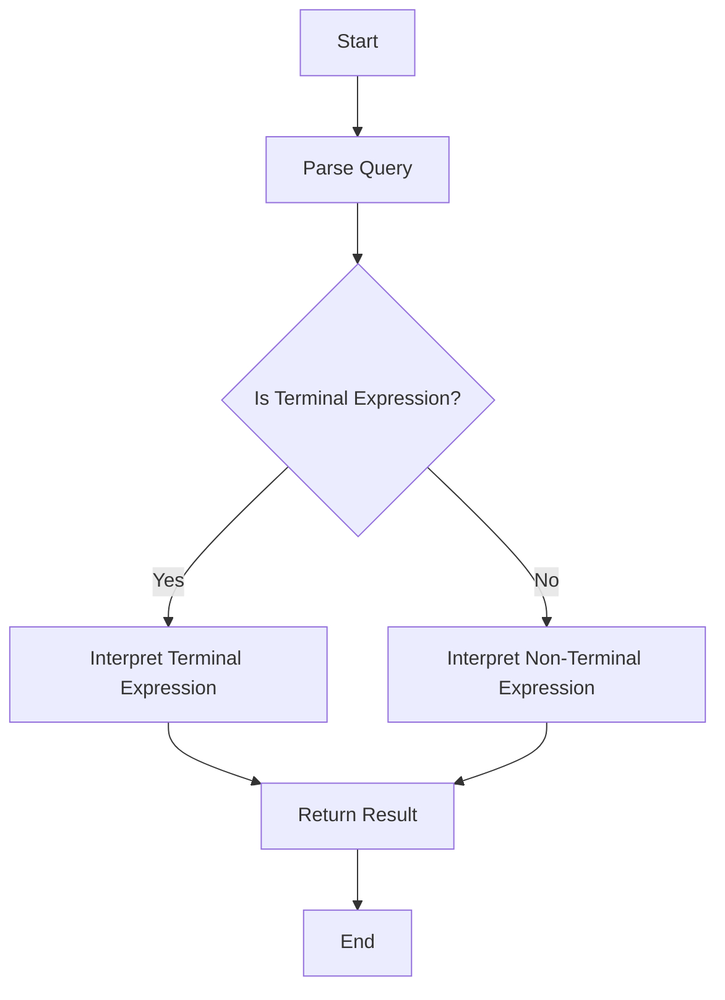

## 5.3.3 Use Cases and Examples

The Interpreter Pattern is a powerful tool in software design that allows developers to define a grammar for a language and interpret sentences in that language. This pattern is particularly useful in scenarios where you need to evaluate expressions or commands written in a specific language. Let's delve into some real-world use cases and examples to understand how the Interpreter Pattern can be effectively utilized in Python.

### Real-World Examples

#### Configuration Languages

Configuration files are ubiquitous in software applications, allowing users to customize settings without altering the source code. The Interpreter Pattern can be employed to parse and interpret these configuration files, providing flexibility and ease of use.

**Example: Parsing Custom Configuration Files**

Imagine a scenario where you have a configuration file for a web server. This file allows administrators to set various parameters like server port, logging level, and maximum connections. Using the Interpreter Pattern, you can create a parser that reads this file and applies the settings to your application.

```python
class Context:
    def __init__(self, text):
        self.text = text
        self.index = 0

    def next_token(self):
        if self.index < len(self.text):
            token = self.text[self.index]
            self.index += 1
            return token
        return None

class Expression:
    def interpret(self, context):
        pass

class TerminalExpression(Expression):
    def __init__(self, data):
        self.data = data

    def interpret(self, context):
        token = context.next_token()
        if token == self.data:
            return True
        return False

class NonTerminalExpression(Expression):
    def __init__(self, expr1, expr2):
        self.expr1 = expr1
        self.expr2 = expr2

    def interpret(self, context):
        return self.expr1.interpret(context) and self.expr2.interpret(context)

context = Context("port:8080 log:info max_conn:100")
expr1 = TerminalExpression("port:8080")
expr2 = TerminalExpression("log:info")
expr3 = TerminalExpression("max_conn:100")

non_terminal_expr = NonTerminalExpression(expr1, expr2)
print(non_terminal_expr.interpret(context))  # Output: True
```

In this example, the `Context` class manages the input text, while `TerminalExpression` and `NonTerminalExpression` classes interpret the tokens. This setup allows you to easily extend the configuration language by adding new expressions.

#### Domain-Specific Languages (DSLs)

Domain-Specific Languages are tailored to specific problem domains, providing a more intuitive and expressive way to solve domain-related problems. The Interpreter Pattern is ideal for implementing DSLs, as it allows you to define a grammar and interpret commands within that language.

**Example: Implementing a Simple Query Language**

Consider a simple query language for filtering a list of products based on attributes like price and category. Using the Interpreter Pattern, you can create a DSL that allows users to write queries like "price < 100 AND category = 'electronics'".

```python
class QueryContext:
    def __init__(self, query):
        self.query = query.split()

class QueryExpression:
    def interpret(self, context, data):
        pass

class PriceExpression(QueryExpression):
    def __init__(self, operator, value):
        self.operator = operator
        self.value = float(value)

    def interpret(self, context, data):
        if self.operator == '<':
            return [item for item in data if item['price'] < self.value]
        elif self.operator == '>':
            return [item for item in data if item['price'] > self.value]
        return []

class CategoryExpression(QueryExpression):
    def __init__(self, category):
        self.category = category

    def interpret(self, context, data):
        return [item for item in data if item['category'] == self.category]

products = [
    {'name': 'Laptop', 'price': 999.99, 'category': 'electronics'},
    {'name': 'Shoes', 'price': 49.99, 'category': 'fashion'},
    {'name': 'Smartphone', 'price': 499.99, 'category': 'electronics'}
]

context = QueryContext("price < 100")
price_expr = PriceExpression('<', 100)
filtered_products = price_expr.interpret(context, products)
print(filtered_products)  # Output: [{'name': 'Shoes', 'price': 49.99, 'category': 'fashion'}]
```

In this example, the `PriceExpression` and `CategoryExpression` classes are used to interpret the query and filter the product list accordingly. This approach provides a flexible and extensible way to handle complex queries.

### Outcomes

By using the Interpreter Pattern in these scenarios, you achieve several benefits:

- **Easier Customization**: Users can easily modify configuration files or write queries without needing to understand the underlying code.
- **Flexibility**: The pattern allows you to extend the language by adding new expressions or commands.
- **Separation of Concerns**: The pattern separates the interpretation logic from the application logic, making the codebase more maintainable.

### Considerations

While the Interpreter Pattern offers significant advantages, there are some considerations to keep in mind:

- **Performance Implications**: As the grammar grows larger, the interpretation process can become slower. It's essential to optimize the interpreter for performance, especially in real-time applications.
- **Security Considerations**: When interpreting user-supplied code, ensure that the interpreter is secure and cannot execute malicious commands. Implement validation and sanitization measures to prevent security vulnerabilities.

### Try It Yourself

To deepen your understanding of the Interpreter Pattern, try modifying the code examples provided:

- **Extend the Configuration Language**: Add new expressions to handle additional configuration parameters, such as setting a timeout or enabling/disabling features.
- **Enhance the Query Language**: Implement support for more complex queries, such as combining multiple conditions with AND/OR operators or adding support for sorting results.

By experimenting with these modifications, you'll gain a better grasp of how the Interpreter Pattern can be applied to real-world scenarios.

### Visualizing the Interpreter Pattern

To further illustrate the Interpreter Pattern, let's visualize the process of interpreting a simple query language using a flowchart.



This flowchart demonstrates the steps involved in interpreting a query using the Interpreter Pattern. The process begins with parsing the query, followed by interpreting terminal and non-terminal expressions, and finally returning the result.

### Knowledge Check

Before we conclude, let's reinforce what we've learned with a few questions:

- **What are the main benefits of using the Interpreter Pattern?**
- **How can the Interpreter Pattern be applied to configuration languages?**
- **What are some considerations to keep in mind when using the Interpreter Pattern?**

### Embrace the Journey

Remember, mastering design patterns like the Interpreter Pattern is a journey. As you continue to explore and experiment with these patterns, you'll develop a deeper understanding of how to apply them effectively in your projects. Keep experimenting, stay curious, and enjoy the journey!

## Quiz Time!



### What is a primary benefit of using the Interpreter Pattern?

- [x] Easier customization for end-users
- [ ] Improved performance for large data sets
- [ ] Reduced code complexity
- [ ] Enhanced security

> **Explanation:** The Interpreter Pattern allows for easier customization by enabling users to define and modify expressions in a specific language without altering the underlying code.

### In the context of the Interpreter Pattern, what is a Domain-Specific Language (DSL)?

- [x] A mini-language tailored to a specific problem domain
- [ ] A general-purpose programming language
- [ ] A language used for system-level programming
- [ ] A language for web development

> **Explanation:** A Domain-Specific Language (DSL) is a specialized language designed to solve problems within a specific domain, making it more intuitive and expressive for domain-related tasks.

### How can the Interpreter Pattern be applied to configuration languages?

- [x] By parsing and interpreting configuration files to apply settings
- [ ] By compiling configuration files into executable code
- [ ] By encrypting configuration files for security
- [ ] By converting configuration files into XML format

> **Explanation:** The Interpreter Pattern can be used to parse and interpret configuration files, allowing applications to apply user-defined settings without altering the source code.

### What is a potential drawback of using the Interpreter Pattern with large grammars?

- [x] Performance implications
- [ ] Increased code complexity
- [ ] Reduced flexibility
- [ ] Decreased security

> **Explanation:** As the grammar grows larger, the interpretation process can become slower, leading to performance implications.

### What should be considered when interpreting user-supplied code?

- [x] Security considerations
- [ ] Code readability
- [x] Validation and sanitization
- [ ] Code brevity

> **Explanation:** When interpreting user-supplied code, it's crucial to ensure security by implementing validation and sanitization measures to prevent malicious commands from being executed.

### Which class in the provided code example manages the input text?

- [x] Context
- [ ] TerminalExpression
- [ ] NonTerminalExpression
- [ ] QueryExpression

> **Explanation:** The `Context` class manages the input text and provides tokens for interpretation.

### How can the Interpreter Pattern enhance flexibility in applications?

- [x] By allowing new expressions or commands to be added easily
- [ ] By reducing the number of classes needed
- [ ] By simplifying the user interface
- [ ] By minimizing memory usage

> **Explanation:** The Interpreter Pattern enhances flexibility by allowing new expressions or commands to be added to the language, making it extensible.

### What is a Terminal Expression in the context of the Interpreter Pattern?

- [x] An expression that directly interprets a specific token
- [ ] An expression that combines multiple tokens
- [ ] An expression that modifies the context
- [ ] An expression that handles errors

> **Explanation:** A Terminal Expression is an expression that directly interprets a specific token in the language.

### What is the role of the Non-Terminal Expression in the Interpreter Pattern?

- [x] To interpret expressions that involve multiple tokens
- [ ] To handle errors during interpretation
- [ ] To manage the input context
- [ ] To optimize performance

> **Explanation:** The Non-Terminal Expression interprets expressions that involve multiple tokens, often combining the results of Terminal Expressions.

### True or False: The Interpreter Pattern is only useful for parsing configuration files.

- [ ] True
- [x] False

> **Explanation:** False. The Interpreter Pattern is versatile and can be used for various applications, including configuration languages, DSLs, and more.




