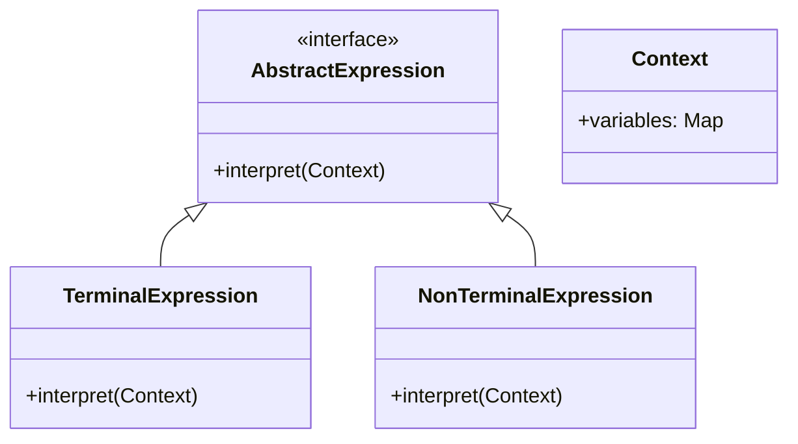
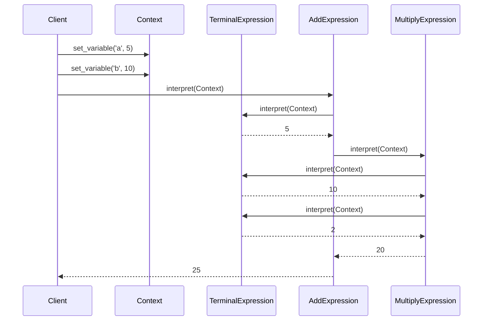

## 5.3 Interpreter Pattern

The Interpreter Pattern is a powerful design pattern used to define a representation for a grammar of a language and provide an interpreter to process this grammar. This pattern is particularly useful for parsing and interpreting sentences in a language, making it a valuable tool in the realm of compilers, interpreters, and domain-specific languages.

### Understanding the Interpreter Pattern

The primary purpose of the Interpreter Pattern is to define a way to evaluate sentences in a language. This involves creating a class structure that represents the grammar and an interpreter that can process these structures to yield results.

#### Key Concepts

- **Grammar**: A set of rules that define the structure of valid sentences in a language.
- **Expression**: A sentence or part of a sentence in the language that can be evaluated.
- **Interpreter**: A component that processes expressions according to the grammar rules.

### Structure of the Interpreter Pattern

The Interpreter Pattern typically involves the following components:

1. **AbstractExpression**: This defines the interface for interpreting expressions. It declares an `interpret` method that is implemented by all concrete expression classes.

2. **TerminalExpression**: Implements the `interpret` method for terminal symbols in the grammar. These are the basic elements that do not require further interpretation.

3. **NonTerminalExpression**: Implements the `interpret` method for non-terminal symbols. These are composed of other expressions and require recursive interpretation.

4. **Context**: Contains information that is global to the interpreter and is used during interpretation. This might include variable values or other state information.

#### Class Diagram

To better understand the structure, let's visualize the relationships between these components using a class diagram:



### Implementing the Interpreter Pattern in Python

Let's implement a simple arithmetic expression evaluator using the Interpreter Pattern. This evaluator will handle basic arithmetic operations: addition, subtraction, multiplication, and division.

#### Step 1: Define the Context

The `Context` class will store variable values and any other information needed during interpretation.

```python
class Context:
    def __init__(self):
        self.variables = {}

    def set_variable(self, name, value):
        self.variables[name] = value

    def get_variable(self, name):
        return self.variables.get(name, 0)
```

#### Step 2: Define AbstractExpression

The `AbstractExpression` class will serve as the base class for all expressions.

```python
from abc import ABC, abstractmethod

class AbstractExpression(ABC):
    @abstractmethod
    def interpret(self, context):
        pass
```

#### Step 3: Implement TerminalExpression

The `TerminalExpression` class will handle variables and constants.

```python
class TerminalExpression(AbstractExpression):
    def __init__(self, value):
        self.value = value

    def interpret(self, context):
        if isinstance(self.value, str):
            return context.get_variable(self.value)
        return self.value
```

#### Step 4: Implement NonTerminalExpression

The `NonTerminalExpression` class will handle operations like addition and multiplication.

```python
class AddExpression(AbstractExpression):
    def __init__(self, left, right):
        self.left = left
        self.right = right

    def interpret(self, context):
        return self.left.interpret(context) + self.right.interpret(context)

class MultiplyExpression(AbstractExpression):
    def __init__(self, left, right):
        self.left = left
        self.right = right

    def interpret(self, context):
        return self.left.interpret(context) * self.right.interpret(context)
```

#### Step 5: Using the Interpreter

Now, let's use the interpreter to evaluate an expression like "a + b * 2".

```python
context = Context()
context.set_variable('a', 5)
context.set_variable('b', 10)

expression = AddExpression(
    TerminalExpression('a'),
    MultiplyExpression(
        TerminalExpression('b'),
        TerminalExpression(2)
    )
)

result = expression.interpret(context)
print(f"The result of the expression is: {result}")
```

### When to Use the Interpreter Pattern

The Interpreter Pattern is suitable for:

- **Simple Grammars**: When the grammar is simple and the complexity is manageable.
- **Domain-Specific Languages (DSLs)**: When creating a small language for a specific domain.
- **Configuration Files**: When interpreting configuration files with a fixed structure.

### Limitations of the Interpreter Pattern

While the Interpreter Pattern is useful, it has its limitations:

- **Performance**: As the complexity of the grammar increases, the performance of the interpreter can degrade significantly.
- **Scalability**: The pattern is not well-suited for complex language parsing due to its recursive nature and potential for deep expression trees.
- **Alternatives**: For complex grammars, consider using parser generators like ANTLR or libraries like PLY (Python Lex-Yacc).

### Best Practices

- **Keep the Grammar Simple**: Avoid overly complex grammars to maintain performance and readability.
- **Combine with Other Patterns**: Use in conjunction with other patterns like the Visitor Pattern to separate operations from the grammar structure.
- **Optimize Context Usage**: Ensure the context is efficiently managed to avoid unnecessary overhead.

### Try It Yourself

Experiment with the code by:

- Adding support for subtraction and division.
- Introducing new terminal expressions for different data types.
- Modifying the context to handle more complex variable storage.

### Visualizing the Interpreter Pattern

Let's visualize the process of interpreting an arithmetic expression using a sequence diagram:



### Additional Resources

For further reading and exploration, consider these resources:

- [Python's `abc` module](https://docs.python.org/3/library/abc.html) for abstract base classes.
- [ANTLR](https://www.antlr.org/) for complex grammar parsing.
- [PLY (Python Lex-Yacc)](http://www.dabeaz.com/ply/) for building parsers in Python.

### Knowledge Check

Before we conclude, let's reinforce your understanding with some questions and exercises.

## Quiz Time!



### What is the primary purpose of the Interpreter Pattern?

- [x] To define a representation for a grammar and provide an interpreter for it.
- [ ] To optimize code execution speed.
- [ ] To manage object creation.
- [ ] To separate interface from implementation.

> **Explanation:** The Interpreter Pattern is specifically designed to define a grammar and provide an interpreter for parsing and evaluating sentences in that language.

### Which component of the Interpreter Pattern represents terminal symbols?

- [ ] AbstractExpression
- [x] TerminalExpression
- [ ] NonTerminalExpression
- [ ] Context

> **Explanation:** TerminalExpression is responsible for interpreting terminal symbols in the grammar, which are the basic elements that do not require further interpretation.

### What is the role of the Context in the Interpreter Pattern?

- [ ] To store the grammar rules.
- [x] To hold global information needed during interpretation.
- [ ] To execute the interpretation logic.
- [ ] To define the structure of expressions.

> **Explanation:** The Context holds information that is global to the interpreter, such as variable values, which are used during the interpretation process.

### When is the Interpreter Pattern most suitable?

- [x] For simple grammars with manageable complexity.
- [ ] For complex language parsing.
- [ ] For optimizing performance in large systems.
- [ ] For managing object lifecycles.

> **Explanation:** The Interpreter Pattern is best suited for simple grammars where the complexity is manageable, as it can become inefficient for more complex languages.

### What is a limitation of the Interpreter Pattern?

- [x] It can become inefficient with complex grammars.
- [ ] It cannot handle recursion.
- [ ] It is not suitable for simple grammars.
- [ ] It requires extensive memory usage.

> **Explanation:** The recursive nature of the Interpreter Pattern can lead to inefficiencies when dealing with complex grammars, making it less suitable for such scenarios.

### Which of the following is an alternative to the Interpreter Pattern for complex grammars?

- [ ] Singleton Pattern
- [ ] Factory Pattern
- [x] Parser Generators like ANTLR
- [ ] Observer Pattern

> **Explanation:** Parser generators like ANTLR are better suited for handling complex grammars, providing more efficient parsing capabilities than the Interpreter Pattern.

### How can the Interpreter Pattern be optimized?

- [x] By keeping the grammar simple and manageable.
- [ ] By using more complex data structures.
- [ ] By increasing the recursion depth.
- [ ] By avoiding the use of context.

> **Explanation:** Keeping the grammar simple and manageable helps optimize the Interpreter Pattern, preventing performance degradation.

### Which pattern can be combined with the Interpreter Pattern to separate operations from the grammar structure?

- [ ] Singleton Pattern
- [ ] Factory Pattern
- [x] Visitor Pattern
- [ ] Observer Pattern

> **Explanation:** The Visitor Pattern can be combined with the Interpreter Pattern to separate operations from the grammar structure, enhancing modularity and flexibility.

### True or False: The Interpreter Pattern is ideal for parsing complex programming languages.

- [ ] True
- [x] False

> **Explanation:** The Interpreter Pattern is not ideal for parsing complex programming languages due to its inefficiency with deep expression trees and complex grammars.

### What is a best practice when using the Interpreter Pattern?

- [x] Use it in combination with other patterns if necessary.
- [ ] Avoid using context.
- [ ] Implement it for all types of grammars.
- [ ] Focus on optimizing recursion depth.

> **Explanation:** Using the Interpreter Pattern in combination with other patterns, like the Visitor Pattern, can help manage complexity and improve the design.



Remember, this is just the beginning. As you progress, you'll build more complex and interactive systems using the Interpreter Pattern and other design patterns. Keep experimenting, stay curious, and enjoy the journey!
