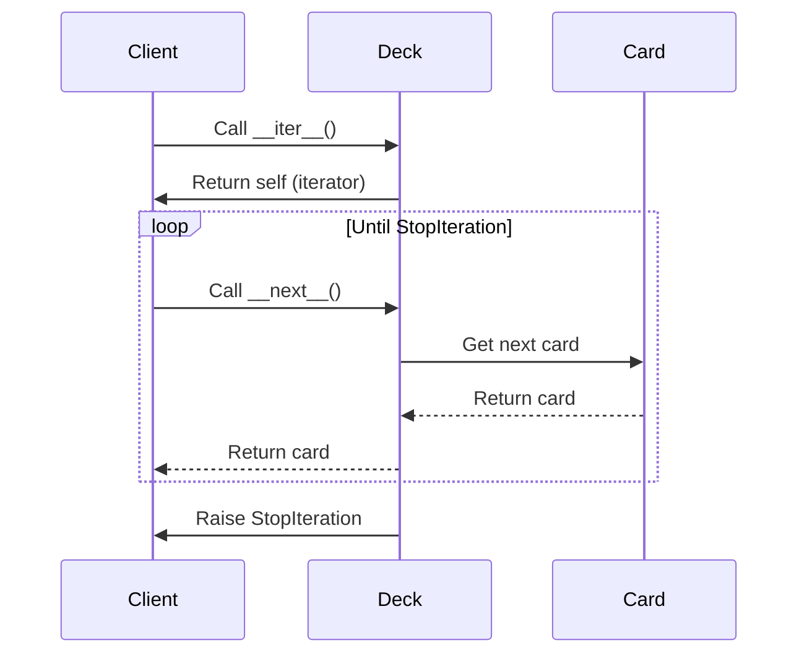

## 5.4.2 Custom Iterators with `__iter__` and `__next__`

In this section, we delve into the fascinating world of custom iterators in Python. Iterators are a cornerstone of Python's design, enabling efficient looping over collections and custom data structures. By mastering the iterator protocol, which consists of the `__iter__` and `__next__` methods, you can create powerful and flexible iterable objects tailored to your specific needs.

### Understanding the Iterator Protocol

The iterator protocol in Python is a fundamental concept that allows objects to be iterated over in a consistent and efficient manner. It consists of two main methods:

- **`__iter__()`**: This method returns the iterator object itself. It is called when an iteration is initialized, such as when a loop begins.

- **`__next__()`**: This method returns the next item from the collection. When there are no more items to return, it raises a `StopIteration` exception to signal the end of the iteration.

Let's explore these concepts with a practical example by creating a custom iterable class that models a deck of cards.

### Creating a Custom Iterable: Deck of Cards

To illustrate the iterator protocol, we'll build a `Deck` class that models a standard deck of playing cards. This class will implement both the `__iter__` and `__next__` methods to allow iteration over the deck.

```python
class Card:
    def __init__(self, suit, rank):
        self.suit = suit
        self.rank = rank

    def __repr__(self):
        return f"{self.rank} of {self.suit}"

class Deck:
    suits = ['Hearts', 'Diamonds', 'Clubs', 'Spades']
    ranks = ['2', '3', '4', '5', '6', '7', '8', '9', '10', 'Jack', 'Queen', 'King', 'Ace']

    def __init__(self):
        self.cards = [Card(suit, rank) for suit in self.suits for rank in self.ranks]

    def __iter__(self):
        self._index = 0
        return self

    def __next__(self):
        if self._index < len(self.cards):
            card = self.cards[self._index]
            self._index += 1
            return card
        else:
            raise StopIteration

deck = Deck()
for card in deck:
    print(card)
```

#### Explanation

- **Card Class**: Represents individual cards with a suit and rank.
- **Deck Class**: Contains a list of `Card` objects representing a full deck.
  - **`__iter__()`**: Initializes the iteration by setting an index to zero and returns the iterator object (itself).
  - **`__next__()`**: Retrieves the next card in the deck. If the end of the deck is reached, it raises `StopIteration`.

### Error Handling with `StopIteration`

Handling the `StopIteration` exception is crucial for the iterator protocol. This exception is used to signal that there are no more items to iterate over. In our `Deck` class, `StopIteration` is raised when the `_index` exceeds the number of cards.

#### Managing `StopIteration`

When implementing custom iterators, ensure that `StopIteration` is raised correctly to prevent infinite loops and other errors. This exception is automatically handled by Python's `for` loop, which stops iterating when `StopIteration` is encountered.

### Considerations for Custom Iterators

When designing custom iterators, consider the following:

- **Reusability**: Decide whether your iterator should be reusable. In our example, the `Deck` iterator is not reusable because it resets the index each time `__iter__()` is called. To make it reusable, you could return a new iterator object each time.

- **State Management**: Keep track of the iteration state carefully. In our `Deck` class, the `_index` variable manages the current position in the iteration.

- **Performance**: Ensure that your iterator is efficient, especially if it deals with large datasets or complex operations.

### Enhancing the Deck with Shuffling

To add more functionality to our `Deck` class, let's implement a method to shuffle the cards. This will demonstrate how to modify the internal state of an iterable object.

```python
import random

class Deck:
    # ... (previous code)

    def shuffle(self):
        random.shuffle(self.cards)

deck = Deck()
deck.shuffle()
for card in deck:
    print(card)
```

### Try It Yourself

Experiment with the `Deck` class by modifying the code:

- **Add Jokers**: Extend the `Deck` class to include Joker cards.
- **Reverse Order**: Implement a method to iterate over the deck in reverse order.
- **Custom Iteration**: Create a custom iteration pattern, such as skipping every other card.

### Visualizing the Iterator Protocol

To better understand the flow of the iterator protocol, let's visualize it using a sequence diagram.



**Diagram Description**: This sequence diagram illustrates the interaction between the client (e.g., a `for` loop), the `Deck` class, and the `Card` class during iteration. The client repeatedly calls `__next__()` on the `Deck` until `StopIteration` is raised.

### Advanced Custom Iterators

Custom iterators can be more complex, involving additional logic and state management. Let's explore a more advanced example: a `Fibonacci` iterator that generates Fibonacci numbers up to a specified limit.

```python
class Fibonacci:
    def __init__(self, limit):
        self.limit = limit
        self.a, self.b = 0, 1

    def __iter__(self):
        self._current = 0
        return self

    def __next__(self):
        if self._current < self.limit:
            value = self.a
            self.a, self.b = self.b, self.a + self.b
            self._current += 1
            return value
        else:
            raise StopIteration

fib = Fibonacci(10)
for number in fib:
    print(number)
```

#### Explanation

- **Initialization**: The `Fibonacci` class initializes with a limit and the first two Fibonacci numbers.
- **Iteration**: The `__next__()` method generates the next Fibonacci number and updates the sequence.

### Reusability and Fresh Iterators

To create reusable iterators, consider returning a new iterator object from `__iter__()` instead of the same object. This approach allows multiple iterations over the same data without resetting the state.

```python
class ReusableDeck:
    def __init__(self):
        self.cards = [Card(suit, rank) for suit in Deck.suits for rank in Deck.ranks]

    def __iter__(self):
        return DeckIterator(self.cards)

class DeckIterator:
    def __init__(self, cards):
        self.cards = cards
        self._index = 0

    def __next__(self):
        if self._index < len(self.cards):
            card = self.cards[self._index]
            self._index += 1
            return card
        else:
            raise StopIteration

reusable_deck = ReusableDeck()
for card in reusable_deck:
    print(card)
```

#### Explanation

- **`ReusableDeck` Class**: Returns a new `DeckIterator` object each time `__iter__()` is called, ensuring fresh iteration.

### Knowledge Check

Let's test your understanding with a few questions:

1. What are the two main methods of the iterator protocol?
2. How does the `StopIteration` exception function within an iterator?
3. Why might you choose to create a fresh iterator object each time `__iter__()` is called?

### Summary

In this section, we've explored the power of custom iterators in Python. By implementing the `__iter__` and `__next__` methods, you can create flexible and efficient iterable objects tailored to your specific needs. Remember to handle `StopIteration` correctly, consider reusability, and explore advanced iterator designs to enhance your Python programming skills.

### Further Reading

For more information on iterators and the iterator protocol, consider the following resources:

- [Python's Official Documentation on Iterators](https://docs.python.org/3/tutorial/classes.html#iterators)
- [Real Python's Guide to Iterators and Iterables](https://realpython.com/python-itertools/)
- [Effective Python: 59 Specific Ways to Write Better Python by Brett Slatkin](https://www.effectivepython.com/)

## Quiz Time!



### What is the purpose of the `__iter__` method in the iterator protocol?

- [x] To return the iterator object itself
- [ ] To return the next item in the iteration
- [ ] To raise a `StopIteration` exception
- [ ] To initialize the iteration state

> **Explanation:** The `__iter__` method is responsible for returning the iterator object itself, which is necessary to start the iteration process.

### What does the `__next__` method do when there are no more items to return?

- [ ] It returns `None`
- [ ] It resets the iteration
- [x] It raises a `StopIteration` exception
- [ ] It returns the first item again

> **Explanation:** The `__next__` method raises a `StopIteration` exception to signal that there are no more items to iterate over.

### In the `Deck` class example, what does the `shuffle` method do?

- [ ] It sorts the cards
- [x] It randomizes the order of the cards
- [ ] It removes all cards
- [ ] It adds new cards

> **Explanation:** The `shuffle` method uses the `random.shuffle` function to randomize the order of the cards in the deck.

### Why is it important to handle the `StopIteration` exception correctly?

- [x] To prevent infinite loops during iteration
- [ ] To allow the iterator to be reused
- [ ] To ensure the iterator returns `None` at the end
- [ ] To enable the iterator to start over automatically

> **Explanation:** Handling the `StopIteration` exception correctly is crucial to prevent infinite loops and ensure the iteration stops when there are no more items.

### What is a potential benefit of creating a fresh iterator object each time `__iter__()` is called?

- [x] It allows multiple independent iterations over the same data
- [ ] It reduces memory usage
- [ ] It simplifies the `__next__` method
- [ ] It eliminates the need for the `__next__` method

> **Explanation:** Creating a fresh iterator object each time `__iter__()` is called allows multiple independent iterations over the same data without resetting the state.

### How can you make an iterator reusable?

- [ ] By resetting the index in `__next__`
- [x] By returning a new iterator object in `__iter__`
- [ ] By raising `StopIteration` early
- [ ] By using a global index variable

> **Explanation:** To make an iterator reusable, return a new iterator object each time `__iter__` is called, ensuring a fresh state for each iteration.

### What does the `__next__` method return?

- [x] The next item in the iteration
- [ ] The iterator object itself
- [ ] The first item in the collection
- [ ] A boolean indicating if the iteration is complete

> **Explanation:** The `__next__` method returns the next item in the iteration sequence.

### What is the role of the `DeckIterator` class in the `ReusableDeck` example?

- [ ] To shuffle the deck
- [x] To manage the iteration state and logic
- [ ] To add new cards to the deck
- [ ] To sort the deck

> **Explanation:** The `DeckIterator` class manages the iteration state and logic, providing a fresh iterator object for each iteration.

### True or False: The `__iter__` method can return any object, not necessarily the iterator itself.

- [x] True
- [ ] False

> **Explanation:** True. The `__iter__` method can return any object that implements the iterator protocol, not necessarily the iterator itself.

### Which of the following is NOT a consideration when designing custom iterators?

- [ ] Reusability
- [ ] State Management
- [ ] Performance
- [x] Color of the code editor

> **Explanation:** The color of the code editor is not a consideration when designing custom iterators. Reusability, state management, and performance are important considerations.



Remember, this is just the beginning. As you progress, you'll build more complex and interactive Python programs. Keep experimenting, stay curious, and enjoy the journey!
