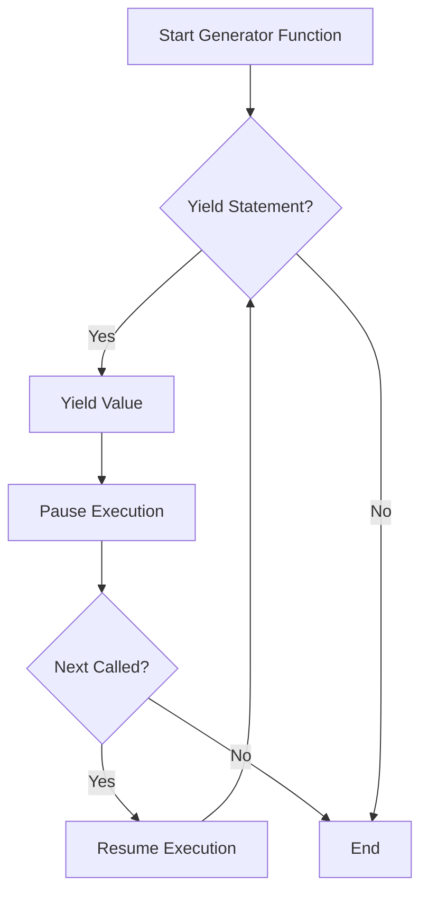

## 5.4.3 Generator Functions

Generator functions are a powerful feature in Python that allow developers to create iterators in a more concise and efficient manner. Unlike regular functions that return a single value using the `return` statement, generator functions use the `yield` statement to produce a series of values over time, pausing and resuming their execution state between each yield. This makes them particularly useful for handling large datasets or streams of data where loading everything into memory at once would be impractical.

### Introducing Generator Functions

Let's begin by understanding what generator functions are and how they differ from regular functions. A generator function is defined like a normal function but uses the `yield` statement to return data. When a generator function is called, it returns a generator object without even beginning execution of the function. When the `next()` method is called on the generator object, the function starts executing until it hits the `yield` statement, which pauses the function and returns the yielded value. The function can be resumed from where it left off when `next()` is called again.

**Example of a Simple Generator Function:**

```python
def simple_generator():
    yield 1
    yield 2
    yield 3

gen = simple_generator()

print(next(gen))  # Output: 1
print(next(gen))  # Output: 2
print(next(gen))  # Output: 3
```

In this example, `simple_generator` is a generator function that yields three values, one at a time. Each call to `next()` resumes the function from where it last yielded a value.

### Implementing a Generator for Fibonacci Numbers

One of the classic examples to demonstrate the utility of generators is the Fibonacci sequence. The Fibonacci sequence is a series of numbers where each number is the sum of the two preceding ones, usually starting with 0 and 1.

**Fibonacci Generator Function:**

```python
def fibonacci_generator():
    a, b = 0, 1
    while True:
        yield a
        a, b = b, a + b

fib_gen = fibonacci_generator()

for _ in range(10):
    print(next(fib_gen))
```

In this implementation, the `fibonacci_generator` function yields Fibonacci numbers indefinitely. The `while True` loop ensures that the generator can continue producing numbers as long as needed. This approach is memory efficient because it generates each number on-the-fly rather than storing the entire sequence in memory.

### Advantages of Generator Functions

Generator functions offer several advantages over traditional approaches to creating iterators:

1. **Memory Efficiency**: Generators do not store their contents in memory. Instead, they generate each value on-the-fly, which is particularly useful for working with large datasets or streams of data.

2. **Simplified Code**: Generators allow you to write cleaner and more concise code. The `yield` statement automatically handles the state of the function, eliminating the need for complex state management.

3. **Infinite Sequences**: Generators can produce infinite sequences, such as the Fibonacci sequence, without running out of memory.

4. **Lazy Evaluation**: Generators evaluate data lazily, meaning they only compute values as needed. This can lead to performance improvements in scenarios where not all data is required immediately.

### Generator Expressions

Generator expressions provide a concise syntax for creating simple generators. They are similar to list comprehensions but use parentheses instead of square brackets. Generator expressions are useful when you need a generator for a simple operation without defining a separate function.

**Example of a Generator Expression:**

```python
squares = (x * x for x in range(10))

for square in squares:
    print(square)
```

In this example, `squares` is a generator expression that yields the square of each number from 0 to 9. The expression `(x * x for x in range(10))` creates a generator object that can be iterated over.

### Highlighting Use Cases

Generator functions are particularly useful in scenarios where lazy evaluation and efficient data handling are crucial. Here are some common use cases:

1. **Handling Large Datasets**: When working with large datasets, loading all data into memory can be inefficient or impossible. Generators allow you to process data one piece at a time, reducing memory usage.

2. **Streaming Data**: In applications that process streaming data, such as log processing or real-time analytics, generators can be used to handle data as it arrives.

3. **Infinite Sequences**: Generators are ideal for generating infinite sequences, such as mathematical series or continuous data streams.

4. **Pipelining Operations**: Generators can be used to create data processing pipelines, where each generator in the pipeline processes data and passes it to the next generator.

### Visualizing Generator Functions

To better understand how generator functions work, let's visualize the process using a flowchart. This flowchart illustrates the execution flow of a generator function with multiple `yield` statements.



**Description:** This flowchart shows the execution flow of a generator function. When the generator function is called, it starts execution and checks for a `yield` statement. If a `yield` statement is encountered, the function yields a value and pauses execution. When `next()` is called, the function resumes execution from where it left off.

### Try It Yourself

To deepen your understanding of generator functions, try modifying the Fibonacci generator to include a stopping condition. For example, you could modify it to stop after generating a certain number of Fibonacci numbers.

**Exercise: Modify the Fibonacci Generator**

```python
def fibonacci_generator(limit):
    a, b = 0, 1
    count = 0
    while count < limit:
        yield a
        a, b = b, a + b
        count += 1

fib_gen = fibonacci_generator(10)

for number in fib_gen:
    print(number)
```

In this exercise, the `fibonacci_generator` function has been modified to accept a `limit` parameter, which specifies the number of Fibonacci numbers to generate. Try changing the `limit` value and observe the output.

### Knowledge Check

Before we move on, let's summarize the key points about generator functions:

- Generator functions use the `yield` statement to produce a series of values over time.
- They provide memory efficiency by generating values on-the-fly.
- Generator expressions offer a concise syntax for creating simple generators.
- Generators are ideal for handling large datasets, streaming data, and creating infinite sequences.

### Further Reading

For more information on generator functions and their applications, consider exploring the following resources:

- [Python's Official Documentation on Generators](https://docs.python.org/3/howto/functional.html#generators)
- [Real Python's Guide to Generators](https://realpython.com/introduction-to-python-generators/)
- [PEP 255: Simple Generators](https://www.python.org/dev/peps/pep-0255/)

### Embrace the Journey

Remember, mastering generator functions is just one step in your journey to becoming a proficient Python developer. Keep experimenting with different use cases, stay curious, and enjoy the process of learning and discovery.

## Quiz Time!



### What is a generator function in Python?

- [x] A function that uses the `yield` statement to return a series of values.
- [ ] A function that returns a single value using the `return` statement.
- [ ] A function that executes indefinitely without returning any value.
- [ ] A function that only works with lists and arrays.

> **Explanation:** A generator function uses the `yield` statement to return a series of values over time, pausing and resuming execution between each yield.

### How does a generator function differ from a regular function?

- [x] It uses the `yield` statement instead of `return`.
- [ ] It cannot accept parameters.
- [ ] It always returns a list.
- [ ] It cannot be called more than once.

> **Explanation:** Generator functions use the `yield` statement to produce values one at a time, whereas regular functions return a single value using `return`.

### What is the primary advantage of using generator functions?

- [x] Memory efficiency by generating values on-the-fly.
- [ ] Faster execution time for all operations.
- [ ] Ability to store all data in memory.
- [ ] Simplified error handling.

> **Explanation:** Generator functions provide memory efficiency by generating values on-the-fly, which is useful for handling large datasets.

### Which of the following is a valid generator expression?

- [x] `(x * x for x in range(10))`
- [ ] `[x * x for x in range(10)]`
- [ ] `{x * x for x in range(10)}`
- [ ] `x * x for x in range(10)`

> **Explanation:** A generator expression uses parentheses `( )` to create a generator object, whereas list comprehensions use square brackets `[ ]`.

### What happens when `next()` is called on a generator object?

- [x] The generator function resumes execution from where it last yielded a value.
- [ ] The generator function restarts from the beginning.
- [ ] The generator function stops execution permanently.
- [ ] The generator function raises an error.

> **Explanation:** When `next()` is called, the generator function resumes execution from where it last yielded a value, continuing until the next `yield` statement.

### What is lazy evaluation in the context of generators?

- [x] Delaying computation until the result is needed.
- [ ] Precomputing all values before iteration.
- [ ] Storing all values in memory for quick access.
- [ ] Evaluating all expressions immediately.

> **Explanation:** Lazy evaluation means that generators compute values only when they are needed, which can improve performance and reduce memory usage.

### Which of the following is a common use case for generator functions?

- [x] Handling large datasets efficiently.
- [ ] Storing configuration data.
- [ ] Performing complex mathematical calculations.
- [ ] Creating user interfaces.

> **Explanation:** Generators are ideal for handling large datasets efficiently by generating values on-the-fly without storing them in memory.

### How can you stop a generator function after a certain number of iterations?

- [x] Use a loop with a counter and a stopping condition.
- [ ] Use the `return` statement inside the generator.
- [ ] Use the `break` statement outside the generator.
- [ ] Use a global variable to control execution.

> **Explanation:** You can control the number of iterations by using a loop with a counter and a stopping condition within the generator function.

### What is the output of the following generator expression: `(x for x in range(3))`?

- [x] A generator object that yields 0, 1, 2.
- [ ] A list containing [0, 1, 2].
- [ ] A tuple containing (0, 1, 2).
- [ ] An error due to incorrect syntax.

> **Explanation:** The expression creates a generator object that yields the values 0, 1, and 2 when iterated over.

### True or False: Generator functions can produce infinite sequences.

- [x] True
- [ ] False

> **Explanation:** Generator functions can produce infinite sequences by using loops without a stopping condition, yielding values indefinitely.


