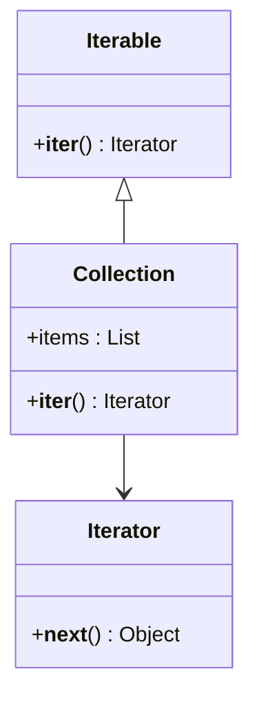

## 5.4.4 Use Cases and Examples

The Iterator Pattern is a powerful design pattern that provides a way to access elements of a collection sequentially without exposing the underlying representation. In Python, iterators are a fundamental part of the language, allowing for efficient looping and data processing. This section will explore practical applications of iterators in software development, focusing on file processing and data streaming. We will provide detailed examples and code snippets to illustrate the benefits of using iterators, such as memory efficiency and clean, readable code. Additionally, we will encourage experimentation by suggesting readers create iterators for their custom data structures.

### Understanding the Iterator Pattern

Before diving into specific use cases, let's briefly revisit the core concept of the Iterator Pattern. An iterator is an object that enables a programmer to traverse a container, particularly lists. In Python, the iterator protocol consists of two methods: `__iter__()` and `__next__()`. The `__iter__()` method returns the iterator object itself, while the `__next__()` method returns the next item from the container. When there are no more items to return, `__next__()` raises a `StopIteration` exception.

#### Basic Iterator Example

Let's start with a simple example to illustrate how iterators work in Python:

```python
class MyIterator:
    def __init__(self, data):
        self.data = data
        self.index = 0

    def __iter__(self):
        return self

    def __next__(self):
        if self.index < len(self.data):
            result = self.data[self.index]
            self.index += 1
            return result
        else:
            raise StopIteration

my_data = [1, 2, 3, 4, 5]
iterator = MyIterator(my_data)

for item in iterator:
    print(item)
```

In this example, `MyIterator` is a custom iterator class that iterates over a list of numbers. The `__iter__()` method returns the iterator object itself, and the `__next__()` method returns the next item in the list, raising `StopIteration` when the end of the list is reached.

### Use Case 1: File Processing

One of the most common applications of iterators is file processing. When dealing with large files, reading the entire file into memory can be inefficient and impractical. Instead, we can use iterators to read the file line by line, which is more memory-efficient.

#### Example: Reading a Large File Line by Line

Consider a scenario where we need to process a large log file. Using an iterator, we can read the file line by line without loading the entire file into memory:

```python
def read_large_file(file_path):
    with open(file_path, 'r') as file:
        for line in file:
            yield line.strip()

file_path = 'large_log_file.txt'
for line in read_large_file(file_path):
    print(line)
```

In this example, the `read_large_file` function is a generator function that yields each line of the file one at a time. This approach is memory-efficient because it only keeps one line in memory at a time, making it suitable for processing large files.

#### Benefits of Using Iterators for File Processing

- **Memory Efficiency**: Iterators allow us to process large files without loading them entirely into memory, reducing memory usage.
- **Clean and Readable Code**: Using iterators simplifies the code, making it easier to read and maintain.
- **Lazy Evaluation**: Lines are read only when needed, which can improve performance when processing large datasets.

### Use Case 2: Data Streaming

Another practical application of iterators is data streaming. When processing data from an API or a sensor, data often arrives in a continuous stream. Iterators provide an efficient way to handle such data by processing it incrementally.

#### Example: Processing Data from an API

Let's consider an example where we need to process data from a REST API that provides a large dataset in chunks:

```python
import requests

def fetch_data_from_api(url):
    response = requests.get(url, stream=True)
    for line in response.iter_lines():
        if line:
            yield line.decode('utf-8')

api_url = 'https://api.example.com/data'
for data_chunk in fetch_data_from_api(api_url):
    print(data_chunk)
```

In this example, the `fetch_data_from_api` function uses the `requests` library to fetch data from an API. The `stream=True` parameter ensures that data is streamed, and `iter_lines()` is used to iterate over each line of the response. This approach allows us to process large datasets efficiently without loading the entire response into memory.

#### Benefits of Using Iterators for Data Streaming

- **Real-Time Processing**: Iterators enable real-time processing of data as it arrives, which is essential for applications like live data feeds.
- **Reduced Latency**: By processing data incrementally, we can reduce latency and improve responsiveness.
- **Scalability**: Iterators allow us to handle large volumes of data without overwhelming system resources.

### Encouraging Experimentation

Now that we've explored some practical use cases of iterators, let's encourage you to experiment with creating iterators for your custom data structures. By implementing the iterator protocol, you can enable efficient traversal of your data structures and take advantage of Python's powerful iteration capabilities.

#### Example: Custom Iterator for a Binary Tree

Let's create a custom iterator for a binary tree data structure:

```python
class TreeNode:
    def __init__(self, value):
        self.value = value
        self.left = None
        self.right = None

class BinaryTreeIterator:
    def __init__(self, root):
        self.stack = []
        self._push_left(root)

    def _push_left(self, node):
        while node:
            self.stack.append(node)
            node = node.left

    def __iter__(self):
        return self

    def __next__(self):
        if not self.stack:
            raise StopIteration
        node = self.stack.pop()
        result = node.value
        self._push_left(node.right)
        return result

root = TreeNode(10)
root.left = TreeNode(5)
root.right = TreeNode(15)
root.left.left = TreeNode(3)
root.left.right = TreeNode(7)

iterator = BinaryTreeIterator(root)
for value in iterator:
    print(value)
```

In this example, `BinaryTreeIterator` is a custom iterator for traversing a binary tree in an in-order manner. The `_push_left` method is used to traverse the left subtree, and the `__next__()` method returns the next value in the traversal. This approach allows us to efficiently traverse the binary tree without using recursion.

### Visualizing the Iterator Pattern

To further enhance our understanding of the Iterator Pattern, let's visualize the process of iterating over a collection using a class diagram.



In this diagram, we have an `Iterable` interface with an `__iter__()` method that returns an `Iterator`. The `Iterator` interface has a `__next__()` method that returns the next item in the collection. The `Collection` class implements the `Iterable` interface and provides an iterator for its items.

### Try It Yourself

Now that we've covered the basics of the Iterator Pattern and explored some practical use cases, it's time for you to try it yourself. Here are a few suggestions for experimenting with iterators:

1. **Create an Iterator for a Custom Data Structure**: Implement the iterator protocol for a custom data structure, such as a linked list or a graph.

2. **Enhance the File Processing Example**: Modify the file processing example to filter lines based on specific criteria, such as lines containing a particular keyword.

3. **Experiment with Data Streaming**: Use an iterator to process data from a different API or sensor, and implement additional processing logic, such as data transformation or aggregation.

4. **Combine Iterators with Other Patterns**: Explore how iterators can be combined with other design patterns, such as the Decorator Pattern, to add additional functionality to the iteration process.

### Conclusion

The Iterator Pattern is a versatile and powerful tool in Python programming, enabling efficient traversal of collections and data streams. By leveraging iterators, we can achieve memory efficiency, clean and readable code, and real-time data processing. We encourage you to experiment with iterators in your projects and explore their potential for enhancing your software development practices.

## Quiz Time!



### What is the primary benefit of using iterators for file processing?

- [x] Memory efficiency
- [ ] Faster execution
- [ ] Increased security
- [ ] Simplified syntax

> **Explanation:** Iterators allow processing large files without loading them entirely into memory, which enhances memory efficiency.

### In the context of the Iterator Pattern, what does the `__next__()` method do?

- [x] Returns the next item in the collection
- [ ] Initializes the iterator
- [ ] Closes the iterator
- [ ] Resets the iterator

> **Explanation:** The `__next__()` method returns the next item from the collection and raises `StopIteration` when there are no more items.

### Which of the following is a common use case for iterators?

- [x] Data streaming
- [ ] User authentication
- [ ] Database indexing
- [ ] Encryption

> **Explanation:** Iterators are commonly used for data streaming, allowing efficient processing of data as it arrives.

### How does the `stream=True` parameter in the `requests.get()` function benefit data processing?

- [x] Enables data streaming
- [ ] Increases data security
- [ ] Reduces data size
- [ ] Simplifies data parsing

> **Explanation:** The `stream=True` parameter allows data to be streamed, enabling efficient processing of large datasets without loading them entirely into memory.

### What is a key advantage of using iterators for data streaming?

- [x] Real-time processing
- [ ] Enhanced security
- [ ] Faster sorting
- [ ] Simplified syntax

> **Explanation:** Iterators enable real-time processing of data as it arrives, which is crucial for applications like live data feeds.

### In the custom binary tree iterator example, what traversal method is used?

- [x] In-order traversal
- [ ] Pre-order traversal
- [ ] Post-order traversal
- [ ] Level-order traversal

> **Explanation:** The custom binary tree iterator uses in-order traversal, visiting the left subtree, then the node, and finally the right subtree.

### What does the `StopIteration` exception indicate in an iterator?

- [x] End of the collection
- [ ] Start of the collection
- [ ] Error in the collection
- [ ] Reset of the collection

> **Explanation:** The `StopIteration` exception indicates that there are no more items to return in the collection, signaling the end of the iteration.

### Which method must be implemented for a class to be considered an iterator in Python?

- [x] `__next__()`
- [ ] `__init__()`
- [ ] `__str__()`
- [ ] `__len__()`

> **Explanation:** The `__next__()` method is essential for a class to be considered an iterator, as it defines how the next item is retrieved.

### True or False: Iterators can only be used with built-in Python collections.

- [ ] True
- [x] False

> **Explanation:** False. Iterators can be implemented for custom data structures as well, allowing efficient traversal of any collection.

### What is the purpose of the `__iter__()` method in an iterator?

- [x] Returns the iterator object itself
- [ ] Initializes the collection
- [ ] Closes the iterator
- [ ] Resets the iterator

> **Explanation:** The `__iter__()` method returns the iterator object itself, allowing it to be used in a loop or other iteration context.


