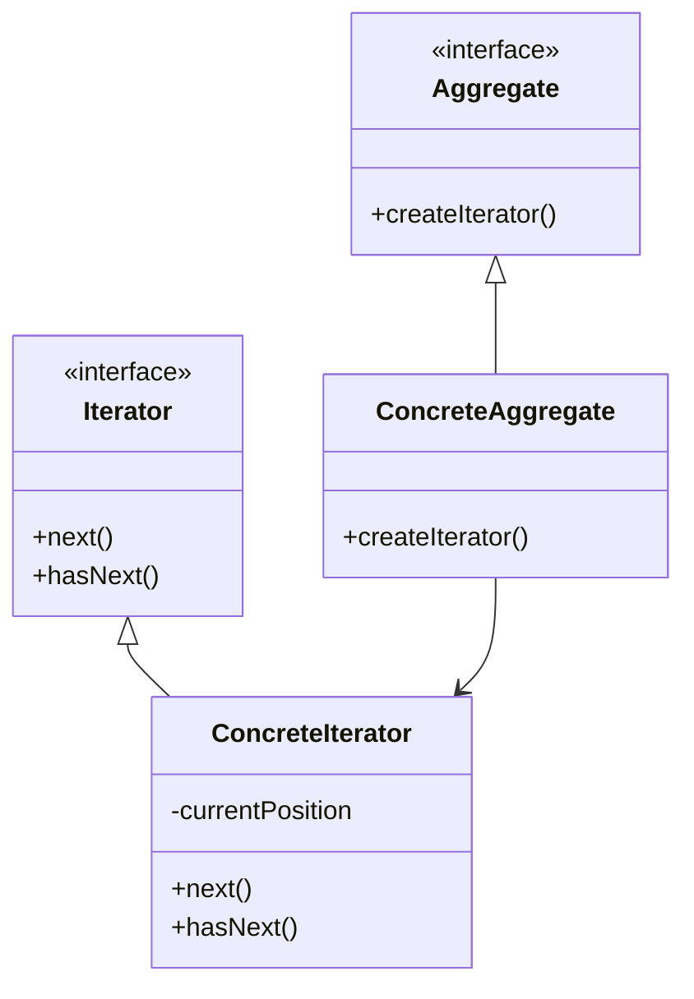

## 5.4 Iterator Pattern

The Iterator Pattern is a fundamental design pattern that provides a way to access the elements of an aggregate object sequentially without exposing its underlying representation. This pattern is particularly useful in scenarios where you need to traverse complex data structures while maintaining encapsulation and separation of concerns.

### Intent of the Iterator Pattern

The primary intent of the Iterator Pattern is to encapsulate the traversal logic of a collection, allowing clients to access elements without needing to understand the internal structure of the collection. By doing so, it promotes a clean separation between the collection's data structure and the logic used to iterate over it.

### Components of the Iterator Pattern

The Iterator Pattern consists of several key components:

1. **Iterator**: This defines an interface for accessing and traversing elements.
2. **ConcreteIterator**: This implements the Iterator interface and keeps track of the current position in the traversal.
3. **Aggregate**: This defines an interface for creating an Iterator object.
4. **ConcreteAggregate**: This implements the Aggregate interface and returns an instance of the ConcreteIterator.

Let's visualize these components using a class diagram:



### Python's Support for Iteration

Python provides robust support for iteration through its iterator protocol, which consists of two main methods: `__iter__()` and `__next__()`. These methods allow objects to be iterated over in a Pythonic way.

- **`__iter__()`**: This method returns the iterator object itself. It is required to implement the iterable protocol.
- **`__next__()`**: This method returns the next item from the collection. If there are no more items, it raises a `StopIteration` exception.

#### Example: Simple Iterator in Python

Let's implement a simple iterator for a list of numbers:

```python
class NumberIterator:
    def __init__(self, numbers):
        self._numbers = numbers
        self._index = 0

    def __iter__(self):
        return self

    def __next__(self):
        if self._index < len(self._numbers):
            result = self._numbers[self._index]
            self._index += 1
            return result
        else:
            raise StopIteration

numbers = [1, 2, 3, 4, 5]
iterator = NumberIterator(numbers)

for number in iterator:
    print(number)
```

In this example, `NumberIterator` is a custom iterator that iterates over a list of numbers. The `__next__()` method returns the next number in the list, and raises a `StopIteration` exception when there are no more numbers to return.

### Custom Iterators for Complex Data Structures

Custom iterators can be particularly useful when dealing with complex data structures, such as trees or graphs, where traversal logic can be non-trivial.

#### Example: Tree Iterator

Consider a binary tree structure. We can create an iterator to traverse the tree in-order:

```python
class TreeNode:
    def __init__(self, value):
        self.value = value
        self.left = None
        self.right = None

class InOrderIterator:
    def __init__(self, root):
        self.stack = []
        self._push_left(root)

    def __iter__(self):
        return self

    def __next__(self):
        if not self.stack:
            raise StopIteration
        node = self.stack.pop()
        result = node.value
        if node.right:
            self._push_left(node.right)
        return result

    def _push_left(self, node):
        while node:
            self.stack.append(node)
            node = node.left

root = TreeNode(10)
root.left = TreeNode(5)
root.right = TreeNode(15)
root.left.left = TreeNode(3)
root.left.right = TreeNode(7)

iterator = InOrderIterator(root)
for value in iterator:
    print(value)
```

In this example, the `InOrderIterator` traverses a binary tree in in-order fashion. The `_push_left()` method is used to traverse the left subtree, and the stack is used to keep track of nodes.

### Benefits of the Iterator Pattern

The Iterator Pattern offers several benefits:

- **Simplified Data Traversal**: It abstracts the traversal logic, making it easier to iterate over complex data structures.
- **Enhanced Encapsulation**: It hides the internal representation of the collection, promoting encapsulation.
- **Code Maintainability**: By separating traversal logic from the collection, it improves code maintainability and readability.

### Advanced Topics

#### Infinite Iterators

Python's `itertools` module provides tools for creating infinite iterators. For example, the `count()` function generates an infinite sequence of numbers:

```python
import itertools

counter = itertools.count(start=1, step=2)
for number in counter:
    if number > 10:
        break
    print(number)
```

#### Multi-threaded Iteration

When dealing with multi-threaded applications, iterators can be used to safely share data between threads. However, care must be taken to ensure thread safety, typically using locks or other synchronization mechanisms.

### Encouraging Application of the Pattern

We encourage you to apply the Iterator Pattern to your custom collections. Consider creating iterators for data structures you frequently use, such as linked lists, graphs, or even custom file formats.

### Try It Yourself

Experiment with the examples provided by modifying the data structures or traversal logic. For instance, try implementing a pre-order or post-order iterator for the binary tree example. This hands-on approach will deepen your understanding of the Iterator Pattern and its applications.

### Conclusion

The Iterator Pattern is a powerful tool in a developer's toolkit, enabling efficient and encapsulated traversal of complex data structures. By mastering this pattern, you can write more maintainable and flexible code, enhancing your ability to tackle a wide range of programming challenges.

## Quiz Time!



### What is the primary intent of the Iterator Pattern?

- [x] To provide a way to access elements of an aggregate object sequentially without exposing its underlying representation.
- [ ] To encapsulate the creation of objects.
- [ ] To define a family of algorithms and make them interchangeable.
- [ ] To separate the construction of a complex object from its representation.

> **Explanation:** The Iterator Pattern is designed to provide a way to access elements of an aggregate object sequentially without exposing its underlying representation.

### Which method is part of Python's iterator protocol?

- [x] `__iter__()`
- [x] `__next__()`
- [ ] `__getitem__()`
- [ ] `__setitem__()`

> **Explanation:** The iterator protocol in Python requires the implementation of `__iter__()` and `__next__()` methods.

### What does the `__next__()` method do?

- [x] Returns the next item from the collection.
- [ ] Initializes the iterator.
- [ ] Resets the iterator to the beginning.
- [ ] Returns the previous item from the collection.

> **Explanation:** The `__next__()` method returns the next item from the collection and raises a `StopIteration` exception when there are no more items.

### What is the role of the `ConcreteIterator` in the Iterator Pattern?

- [x] It implements the Iterator interface and keeps track of the current position in the traversal.
- [ ] It defines an interface for creating an Iterator object.
- [ ] It implements the Aggregate interface and returns an instance of the ConcreteIterator.
- [ ] It provides a simplified interface to a complex subsystem.

> **Explanation:** The `ConcreteIterator` implements the Iterator interface and is responsible for the actual traversal of the collection.

### Which Python module provides tools for creating infinite iterators?

- [x] `itertools`
- [ ] `collections`
- [ ] `functools`
- [ ] `operator`

> **Explanation:** The `itertools` module provides tools for creating infinite iterators, such as the `count()` function.

### What is a benefit of using the Iterator Pattern?

- [x] Simplified data traversal.
- [x] Enhanced encapsulation.
- [x] Improved code maintainability.
- [ ] Increased execution speed.

> **Explanation:** The Iterator Pattern simplifies data traversal, enhances encapsulation, and improves code maintainability, but it does not inherently increase execution speed.

### What exception does `__next__()` raise when there are no more items to return?

- [x] `StopIteration`
- [ ] `ValueError`
- [ ] `IndexError`
- [ ] `KeyError`

> **Explanation:** The `__next__()` method raises a `StopIteration` exception when there are no more items to return.

### How can iterators be used in multi-threaded applications?

- [x] By safely sharing data between threads with synchronization mechanisms.
- [ ] By allowing threads to modify the iterator's state directly.
- [ ] By using iterators to manage thread execution order.
- [ ] By preventing threads from accessing shared resources.

> **Explanation:** In multi-threaded applications, iterators can be used to safely share data between threads, typically using locks or other synchronization mechanisms.

### What is the purpose of the `__iter__()` method?

- [x] To return the iterator object itself.
- [ ] To initialize the iterator.
- [ ] To reset the iterator to the beginning.
- [ ] To return the next item from the collection.

> **Explanation:** The `__iter__()` method returns the iterator object itself and is required to implement the iterable protocol.

### True or False: The Iterator Pattern exposes the underlying representation of the collection.

- [ ] True
- [x] False

> **Explanation:** The Iterator Pattern does not expose the underlying representation of the collection; it provides a way to access elements sequentially while maintaining encapsulation.



Remember, this is just the beginning. As you progress, you'll build more complex and interactive applications using the Iterator Pattern. Keep experimenting, stay curious, and enjoy the journey!
