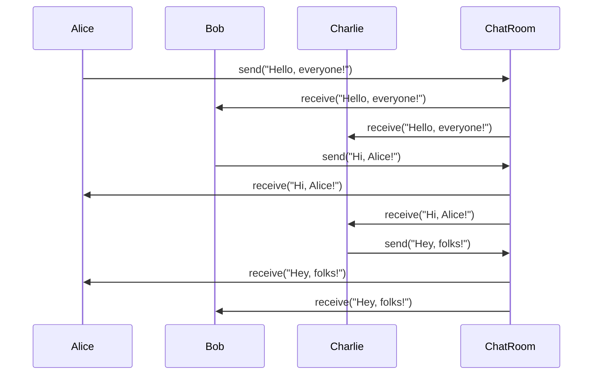

## 5.5.1 Implementing Mediator in Python

In the world of software design patterns, the Mediator Pattern stands out as a powerful tool for managing complex communications between objects. By centralizing control logic, the Mediator Pattern helps to reduce dependencies between interacting objects, leading to more maintainable and scalable code. In this section, we will delve into the implementation of the Mediator Pattern in Python, exploring how it can be used to streamline communication and control within your applications.

### Understanding the Mediator Pattern

The Mediator Pattern is a behavioral design pattern that encapsulates how a set of objects interact. Instead of objects communicating directly with each other, they communicate through a mediator object. This pattern promotes loose coupling by keeping objects from referring to each other explicitly, allowing their interaction to be varied independently.

**Key Concepts:**

- **Mediator**: The central object that facilitates communication between colleague objects.
- **Colleague**: Objects that communicate with each other through the mediator.

### Implementing the Mediator Pattern in Python

Let's walk through a step-by-step guide to implementing the Mediator Pattern in Python. We'll create a simple chat application where users (colleagues) send messages to each other through a chat room (mediator).

#### Step 1: Define the Mediator Interface

First, we need to define an interface for our mediator. This interface will declare methods that the mediator will use to facilitate communication between colleagues.

```python
from abc import ABC, abstractmethod

class Mediator(ABC):
    @abstractmethod
    def send_message(self, message: str, colleague: 'Colleague'):
        pass
```

#### Step 2: Implement the Concrete Mediator

Next, we'll implement a concrete mediator class that will handle the actual communication logic. This class will maintain a list of colleagues and provide a method for sending messages.

```python
class ChatRoom(Mediator):
    def __init__(self):
        self.participants = []

    def register(self, colleague: 'Colleague'):
        self.participants.append(colleague)

    def send_message(self, message: str, sender: 'Colleague'):
        for participant in self.participants:
            if participant != sender:
                participant.receive(message)
```

#### Step 3: Define the Colleague Interface

Now, let's define the interface for our colleague classes. This interface will declare methods for sending and receiving messages.

```python
class Colleague(ABC):
    def __init__(self, mediator: Mediator):
        self.mediator = mediator

    @abstractmethod
    def send(self, message: str):
        pass

    @abstractmethod
    def receive(self, message: str):
        pass
```

#### Step 4: Implement Concrete Colleagues

We will create concrete colleague classes that will implement the methods defined in the colleague interface. These classes will use the mediator to send messages.

```python
class User(Colleague):
    def __init__(self, name: str, mediator: Mediator):
        super().__init__(mediator)
        self.name = name

    def send(self, message: str):
        print(f"{self.name} sends: {message}")
        self.mediator.send_message(message, self)

    def receive(self, message: str):
        print(f"{self.name} receives: {message}")
```

#### Step 5: Demonstrate the Mediator Pattern

Let's put everything together and demonstrate how the mediator pattern works in our chat application.

```python
def main():
    chat_room = ChatRoom()

    alice = User("Alice", chat_room)
    bob = User("Bob", chat_room)
    charlie = User("Charlie", chat_room)

    chat_room.register(alice)
    chat_room.register(bob)
    chat_room.register(charlie)

    alice.send("Hello, everyone!")
    bob.send("Hi, Alice!")
    charlie.send("Hey, folks!")

if __name__ == "__main__":
    main()
```

### Communication Flow

In the code above, the communication flow is as follows:

1. **Registration**: Users (colleagues) register with the chat room (mediator).
2. **Message Sending**: When a user sends a message, it goes through the chat room.
3. **Message Routing**: The chat room forwards the message to all registered users except the sender.

### Design Considerations

When implementing the Mediator Pattern, it's important to consider the following:

- **Avoid Excessive Complexity**: Keep the mediator simple to prevent it from becoming a "god object" that knows too much about the system.
- **Decoupling**: Ensure that colleagues remain decoupled from each other by communicating only through the mediator.
- **Scalability**: The mediator pattern can help scale systems by centralizing control logic, but be mindful of potential bottlenecks if the mediator becomes too complex.

### Try It Yourself

Experiment with the code by adding new users or modifying the message sending logic. Try implementing additional features such as private messaging or user status updates to see how the mediator pattern can be extended.

### Visualizing the Mediator Pattern

To better understand how the Mediator Pattern works, let's visualize the communication flow using a sequence diagram.



### References and Links

For further reading on the Mediator Pattern and its applications, consider exploring the following resources:

- [Mediator Pattern on Wikipedia](https://en.wikipedia.org/wiki/Mediator_pattern)
- [Python Design Patterns - Real Python](https://realpython.com/python-design-patterns/)
- [Design Patterns: Elements of Reusable Object-Oriented Software](https://www.amazon.com/Design-Patterns-Elements-Reusable-Object-Oriented/dp/0201633612)

### Knowledge Check

To reinforce your understanding of the Mediator Pattern, consider the following questions:

1. What is the primary purpose of the Mediator Pattern?
2. How does the Mediator Pattern promote loose coupling between objects?
3. What are some potential drawbacks of using the Mediator Pattern?
4. How can you prevent the mediator from becoming a "god object"?

### Embrace the Journey

Remember, mastering design patterns is a journey. As you continue to explore and implement patterns like the Mediator, you'll gain valuable insights into creating more maintainable and scalable software. Keep experimenting, stay curious, and enjoy the journey!

## Quiz Time!



### What is the primary role of the Mediator Pattern in software design?

- [x] To centralize communication and control logic between objects.
- [ ] To increase the number of direct dependencies between objects.
- [ ] To replace all direct communication with indirect communication.
- [ ] To eliminate the need for any communication between objects.

> **Explanation:** The Mediator Pattern centralizes communication and control logic, reducing direct dependencies between objects.

### Which of the following is a key benefit of using the Mediator Pattern?

- [x] It promotes loose coupling between objects.
- [ ] It increases the complexity of object interactions.
- [ ] It requires objects to have detailed knowledge of each other.
- [ ] It eliminates the need for a central control point.

> **Explanation:** The Mediator Pattern promotes loose coupling by allowing objects to communicate through a central mediator, reducing dependencies.

### In the provided Python implementation, what is the role of the `ChatRoom` class?

- [x] It acts as the mediator, facilitating communication between users.
- [ ] It represents a user in the chat application.
- [ ] It stores messages sent by users.
- [ ] It handles user authentication.

> **Explanation:** The `ChatRoom` class acts as the mediator, managing communication between users in the chat application.

### How do users (colleagues) communicate in the provided chat application example?

- [x] They send messages through the `ChatRoom` mediator.
- [ ] They send messages directly to each other.
- [ ] They use a separate communication protocol.
- [ ] They communicate through a shared database.

> **Explanation:** Users send messages through the `ChatRoom` mediator, which forwards them to other users.

### What is a potential drawback of using the Mediator Pattern?

- [x] The mediator can become overly complex, acting as a "god object."
- [ ] It increases direct dependencies between objects.
- [ ] It eliminates the need for any communication between objects.
- [ ] It requires all objects to have detailed knowledge of each other.

> **Explanation:** If not carefully managed, the mediator can become overly complex, taking on too many responsibilities.

### How can you prevent the mediator from becoming a "god object"?

- [x] By keeping its responsibilities limited and focused.
- [ ] By allowing it to manage all aspects of the application.
- [ ] By increasing the number of methods it provides.
- [ ] By making it responsible for object creation.

> **Explanation:** Keeping the mediator's responsibilities limited and focused helps prevent it from becoming a "god object."

### What is the purpose of the `register` method in the `ChatRoom` class?

- [x] To add users to the chat room so they can receive messages.
- [ ] To send messages to users.
- [ ] To remove users from the chat room.
- [ ] To authenticate users before they can send messages.

> **Explanation:** The `register` method adds users to the chat room, allowing them to receive messages.

### How does the Mediator Pattern improve scalability in an application?

- [x] By centralizing control logic, making it easier to manage interactions.
- [ ] By increasing the number of direct dependencies between objects.
- [ ] By eliminating the need for any communication between objects.
- [ ] By requiring objects to have detailed knowledge of each other.

> **Explanation:** Centralizing control logic in the mediator makes it easier to manage and scale interactions.

### What is the main advantage of using interfaces for the mediator and colleague classes?

- [x] They provide a clear contract for communication methods.
- [ ] They increase the complexity of the implementation.
- [ ] They require all objects to have detailed knowledge of each other.
- [ ] They eliminate the need for any communication between objects.

> **Explanation:** Interfaces provide a clear contract for communication methods, ensuring consistency and flexibility.

### True or False: The Mediator Pattern eliminates the need for any communication between objects.

- [ ] True
- [x] False

> **Explanation:** The Mediator Pattern does not eliminate communication; it centralizes it through a mediator, reducing direct dependencies.




