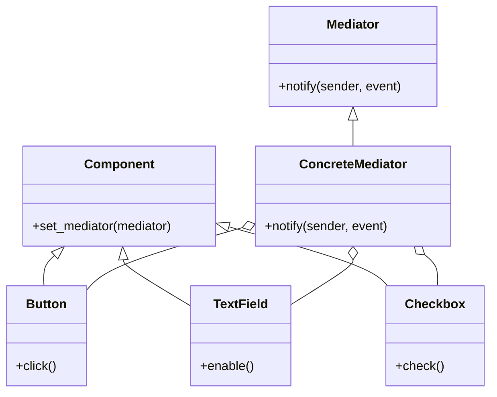

## 5.5.2 Simplifying Object Communication

In software development, particularly in object-oriented programming, managing communication between objects can become complex and cumbersome. When objects are tightly coupled, changes in one object can ripple through the system, leading to maintenance challenges and scalability issues. This section delves into the Mediator Pattern, a behavioral design pattern that addresses these challenges by simplifying object communication.

### Understanding the Problem: Tight Coupling

**Tight coupling** occurs when objects are heavily dependent on each other. This dependency can lead to several problems:

- **Maintenance Difficulty**: When objects are tightly coupled, a change in one object often requires changes in others. This interdependence can make the codebase difficult to maintain and evolve.
- **Scalability Issues**: As the system grows, the complexity of managing these interdependencies increases, making it challenging to scale the application.
- **Reduced Flexibility**: Tightly coupled systems are less flexible, as altering the behavior of one component can inadvertently affect others.

Consider a simple GUI application where multiple components, such as buttons and text fields, need to interact. If each component directly communicates with others, the system becomes a tangled web of dependencies.

### Introducing the Mediator Pattern

The **Mediator Pattern** provides a solution to the problems of tight coupling by introducing a mediator object that handles communication between other objects, known as colleagues. Instead of interacting directly, colleagues communicate through the mediator, which centralizes control and reduces dependencies.

#### Key Concepts

- **Mediator**: The central object that facilitates communication between colleagues. It defines an interface for communication and manages the interactions.
- **Colleagues**: Objects that interact with each other through the mediator. They are unaware of each other and only know about the mediator.

### How the Mediator Pattern Works

The Mediator Pattern decouples colleagues by introducing a mediator that handles all interactions. This approach simplifies the communication model and enhances modularity.

#### Example: GUI Application

Let's explore a GUI application example where the Mediator Pattern can be applied. Consider a dialog box with several components: a `Button`, a `TextField`, and a `Checkbox`. These components need to interact based on user actions.

```python
class Mediator:
    def notify(self, sender, event):
        pass

class ConcreteMediator(Mediator):
    def __init__(self, button, text_field, checkbox):
        self.button = button
        self.text_field = text_field
        self.checkbox = checkbox
        self.button.set_mediator(self)
        self.text_field.set_mediator(self)
        self.checkbox.set_mediator(self)

    def notify(self, sender, event):
        if sender == self.button and event == "click":
            print("Button clicked")
            self.text_field.enable()
        elif sender == self.checkbox and event == "check":
            print("Checkbox checked")
            self.button.enable()

class Component:
    def __init__(self):
        self.mediator = None

    def set_mediator(self, mediator):
        self.mediator = mediator

class Button(Component):
    def click(self):
        print("Button clicked")
        self.mediator.notify(self, "click")

class TextField(Component):
    def enable(self):
        print("TextField enabled")

class Checkbox(Component):
    def check(self):
        print("Checkbox checked")
        self.mediator.notify(self, "check")

button = Button()
text_field = TextField()
checkbox = Checkbox()
mediator = ConcreteMediator(button, text_field, checkbox)

button.click()
checkbox.check()
```

**Explanation**:
- **Mediator**: The `ConcreteMediator` class manages interactions between the `Button`, `TextField`, and `Checkbox`.
- **Colleagues**: The `Button`, `TextField`, and `Checkbox` classes represent components that interact through the mediator.
- **Communication**: When the `Button` is clicked, the mediator enables the `TextField`. When the `Checkbox` is checked, the mediator enables the `Button`.

### Impact on System Architecture

The Mediator Pattern significantly impacts system architecture by:

- **Improving Modularity**: By centralizing communication, the mediator pattern enhances modularity. Components can be developed and tested independently, as they only interact through the mediator.
- **Facilitating Maintenance**: Changes to one component do not directly affect others, making maintenance easier.
- **Enhancing Scalability**: As new components are added, they can be integrated without altering existing components, improving scalability.

### Balancing Responsibilities

While the Mediator Pattern simplifies communication, it's essential to balance responsibilities to avoid creating a "god object" mediator that becomes overly complex.

#### Tips for Effective Mediator Design

- **Keep Mediators Lean**: Ensure that the mediator only handles communication and does not take on additional responsibilities.
- **Distribute Logic Appropriately**: Delegate specific logic to the appropriate components, keeping the mediator focused on coordination.
- **Use Multiple Mediators**: In complex systems, consider using multiple mediators to manage different aspects of communication.

### Try It Yourself

Experiment with the code example by adding new components, such as a `Slider` or a `Label`, and modifying the mediator to handle interactions with these components. This exercise will help you understand how the Mediator Pattern can be extended and adapted to different scenarios.

### Visualizing the Mediator Pattern

To better understand the Mediator Pattern, let's visualize the communication flow using a diagram.



**Diagram Explanation**:
- **Mediator**: The `ConcreteMediator` class is the central hub for communication.
- **Components**: `Button`, `TextField`, and `Checkbox` are colleagues that interact through the mediator.
- **Communication Flow**: Arrows indicate the communication path, with the mediator managing interactions.

### References and Further Reading

For more information on the Mediator Pattern and its applications, consider exploring the following resources:

- [Mediator Pattern on Wikipedia](https://en.wikipedia.org/wiki/Mediator_pattern)
- [Design Patterns: Elements of Reusable Object-Oriented Software](https://www.amazon.com/Design-Patterns-Elements-Reusable-Object-Oriented/dp/0201633612) by Erich Gamma et al.
- [Python Design Patterns](https://refactoring.guru/design-patterns/python) on Refactoring Guru

### Knowledge Check

To reinforce your understanding of the Mediator Pattern, consider the following questions:

- How does the Mediator Pattern reduce tight coupling between objects?
- What are the potential drawbacks of using a mediator?
- How can you prevent a mediator from becoming a "god object"?

### Embrace the Journey

Remember, mastering design patterns is a journey. As you continue to explore and apply the Mediator Pattern, you'll gain insights into creating more maintainable and scalable systems. Keep experimenting, stay curious, and enjoy the process!

## Quiz Time!



### What is the primary purpose of the Mediator Pattern?

- [x] To reduce direct dependencies between objects
- [ ] To increase direct communication between objects
- [ ] To eliminate the need for communication between objects
- [ ] To centralize all logic in one object

> **Explanation:** The Mediator Pattern reduces direct dependencies by introducing a mediator that handles communication between objects.

### How does the Mediator Pattern improve system scalability?

- [x] By allowing new components to be added without altering existing ones
- [ ] By eliminating the need for new components
- [ ] By requiring all components to be tightly coupled
- [ ] By centralizing all logic in one component

> **Explanation:** The Mediator Pattern allows new components to be integrated without affecting existing ones, enhancing scalability.

### What is a potential drawback of using a mediator?

- [x] The mediator can become a "god object" if it takes on too many responsibilities
- [ ] The mediator eliminates the need for any communication
- [ ] The mediator increases direct dependencies between objects
- [ ] The mediator makes maintenance more difficult

> **Explanation:** If not carefully designed, the mediator can become overly complex, taking on too many responsibilities.

### In the provided code example, what role does the `ConcreteMediator` class play?

- [x] It manages interactions between the `Button`, `TextField`, and `Checkbox`
- [ ] It acts as a colleague that interacts with other components
- [ ] It eliminates the need for communication between components
- [ ] It directly modifies the behavior of each component

> **Explanation:** The `ConcreteMediator` class manages interactions between components, acting as the central communication hub.

### How can you prevent a mediator from becoming overly complex?

- [x] By keeping the mediator focused on communication and distributing logic appropriately
- [ ] By centralizing all logic in the mediator
- [ ] By eliminating the need for a mediator
- [ ] By allowing the mediator to handle all aspects of the system

> **Explanation:** Keeping the mediator focused on communication and distributing logic appropriately prevents it from becoming overly complex.

### What is the role of colleagues in the Mediator Pattern?

- [x] They interact with each other through the mediator
- [ ] They directly communicate with each other
- [ ] They eliminate the need for a mediator
- [ ] They centralize all logic in one component

> **Explanation:** Colleagues interact with each other through the mediator, reducing direct dependencies.

### How does the Mediator Pattern facilitate maintenance?

- [x] By decoupling components, making changes to one component less likely to affect others
- [ ] By centralizing all logic in one component
- [ ] By eliminating the need for communication between components
- [ ] By requiring all components to be tightly coupled

> **Explanation:** Decoupling components makes maintenance easier, as changes to one component are less likely to affect others.

### What is a key benefit of using multiple mediators in complex systems?

- [x] It allows for managing different aspects of communication separately
- [ ] It centralizes all communication in one mediator
- [ ] It eliminates the need for communication between components
- [ ] It increases direct dependencies between components

> **Explanation:** Using multiple mediators allows for managing different aspects of communication separately, enhancing modularity.

### What is the primary function of the `notify` method in the Mediator Pattern?

- [x] To handle communication between colleagues
- [ ] To eliminate the need for communication
- [ ] To centralize all logic in one component
- [ ] To directly modify the behavior of each component

> **Explanation:** The `notify` method handles communication between colleagues, acting as the mediator's primary function.

### True or False: The Mediator Pattern eliminates the need for communication between objects.

- [ ] True
- [x] False

> **Explanation:** False. The Mediator Pattern does not eliminate communication but centralizes it through a mediator to reduce direct dependencies.


