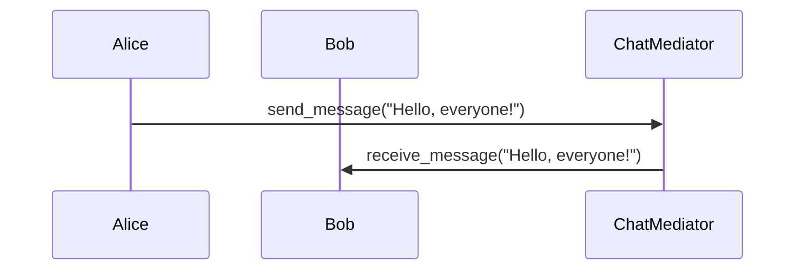

## 5.5.3 Use Cases and Examples

The Mediator Pattern is a behavioral design pattern that facilitates communication between different components in a system by introducing a mediator object. This pattern is particularly useful in scenarios where multiple objects need to interact with each other, but direct communication would lead to a tangled web of dependencies. By centralizing communication through a mediator, we can achieve a more organized and maintainable codebase.

### Understanding the Mediator Pattern

Before diving into specific use cases, let's briefly revisit the core concept of the Mediator Pattern. In this pattern, the mediator object encapsulates the interaction logic between various components, known as colleagues. Instead of communicating directly, colleagues send messages to the mediator, which then relays them to the appropriate recipients. This decouples the components, reducing dependencies and simplifying the overall system architecture.

### Use Case 1: Chat Application

In a chat application, multiple users need to communicate with each other. Without a mediator, each user would need to know about every other user in the system, leading to complex and tightly coupled code. By introducing a mediator, we can centralize message handling and simplify the communication logic.

#### Chat Application Example

Let's consider a simple chat application where users send messages through a central server acting as the mediator.

```python
class User:
    def __init__(self, name, mediator):
        self.name = name
        self.mediator = mediator

    def send_message(self, message):
        print(f"{self.name} sends message: {message}")
        self.mediator.broadcast_message(self, message)

    def receive_message(self, message):
        print(f"{self.name} received message: {message}")

class ChatMediator:
    def __init__(self):
        self.users = []

    def add_user(self, user):
        self.users.append(user)

    def broadcast_message(self, sender, message):
        for user in self.users:
            if user != sender:
                user.receive_message(message)

mediator = ChatMediator()
alice = User("Alice", mediator)
bob = User("Bob", mediator)
charlie = User("Charlie", mediator)

mediator.add_user(alice)
mediator.add_user(bob)
mediator.add_user(charlie)

alice.send_message("Hello, everyone!")
```

**Key Interactions and Mediator Functions:**

- **User Class**: Represents a chat participant. Each user has a reference to the mediator and can send and receive messages.
- **ChatMediator Class**: Manages the list of users and handles message broadcasting. It ensures that messages are sent to all users except the sender.

**Outcomes:**

- **Simplified Communication Logic**: Users do not need to know about each other. They only interact with the mediator.
- **Easier Feature Additions**: Adding new features, such as private messaging or user status updates, can be done by extending the mediator's functionality without altering the user class.

### Use Case 2: Air Traffic Control System

In an air traffic control system, aircraft must communicate with each other to ensure safe operations. Direct communication between aircraft can lead to complex dependencies and potential errors. By using a mediator, such as a control tower, we can centralize communication and improve safety.

#### Air Traffic Control Example

Let's explore how the Mediator Pattern can be applied to an air traffic control system.

```python
class Aircraft:
    def __init__(self, identifier, mediator):
        self.identifier = identifier
        self.mediator = mediator

    def request_landing(self):
        print(f"Aircraft {self.identifier} requests landing.")
        self.mediator.handle_landing_request(self)

    def receive_instruction(self, instruction):
        print(f"Aircraft {self.identifier} received instruction: {instruction}")

class ControlTower:
    def __init__(self):
        self.aircrafts = []

    def register_aircraft(self, aircraft):
        self.aircrafts.append(aircraft)

    def handle_landing_request(self, aircraft):
        # Simplified logic for demonstration
        instruction = f"Aircraft {aircraft.identifier}, you are cleared to land."
        aircraft.receive_instruction(instruction)

tower = ControlTower()
aircraft1 = Aircraft("A1", tower)
aircraft2 = Aircraft("A2", tower)

tower.register_aircraft(aircraft1)
tower.register_aircraft(aircraft2)

aircraft1.request_landing()
```

**Key Interactions and Mediator Functions:**

- **Aircraft Class**: Represents an aircraft. Each aircraft can request landing and receive instructions from the control tower.
- **ControlTower Class**: Acts as the mediator, managing aircraft registrations and handling landing requests.

**Outcomes:**

- **Centralized Communication**: The control tower manages all communication, reducing the complexity of direct interactions between aircraft.
- **Improved Safety and Coordination**: By centralizing communication, the system can better manage airspace and ensure safe operations.

### Encouraging Consideration

The Mediator Pattern is a powerful tool for simplifying communication in complex systems. By analyzing your current systems, you may identify opportunities to implement a mediator to improve design and maintainability. Consider the following questions:

- Are there components in your system that have complex interdependencies?
- Would centralizing communication improve the clarity and maintainability of your code?
- Could a mediator help manage dynamic interactions or facilitate future feature additions?

### Try It Yourself

Experiment with the provided examples by making the following modifications:

1. **Chat Application Enhancements**:
   - Implement private messaging between users.
   - Add a feature to notify users when someone joins or leaves the chat.

2. **Air Traffic Control System Enhancements**:
   - Introduce a queue for landing requests to manage multiple aircraft efficiently.
   - Add a feature for aircraft to request takeoff clearance.

By exploring these modifications, you'll gain a deeper understanding of the Mediator Pattern and its potential applications.

### Visualizing the Mediator Pattern

To further illustrate the Mediator Pattern, let's visualize the interactions in a chat application using a sequence diagram.



**Diagram Description:**

- **Alice (User1)** sends a message to the **ChatMediator**.
- The **ChatMediator** broadcasts the message to **Bob (User2)**.

This diagram highlights the central role of the mediator in managing communication between users.

### Knowledge Check

Before moving on, consider the following questions to reinforce your understanding:

- How does the Mediator Pattern reduce dependencies between components?
- What are the benefits of using a mediator in a chat application?
- How can the Mediator Pattern improve safety in an air traffic control system?

### Embrace the Journey

Remember, the Mediator Pattern is just one of many design patterns that can enhance your software architecture. As you continue your journey, keep exploring different patterns and their applications. Stay curious, experiment with new ideas, and enjoy the process of building better software!

## Quiz Time!



### What is the primary role of the mediator in the Mediator Pattern?

- [x] To centralize communication between components
- [ ] To increase dependencies between components
- [ ] To replace all direct communication with indirect communication
- [ ] To act as a standalone component without interaction

> **Explanation:** The mediator centralizes communication, reducing dependencies between components.

### In a chat application using the Mediator Pattern, who is responsible for broadcasting messages?

- [ ] The sender
- [x] The mediator
- [ ] Each recipient
- [ ] A separate broadcast component

> **Explanation:** The mediator handles broadcasting messages to all recipients.

### How does the Mediator Pattern improve safety in an air traffic control system?

- [x] By centralizing communication through a control tower
- [ ] By allowing direct communication between aircraft
- [ ] By eliminating the need for communication
- [ ] By increasing the number of communication channels

> **Explanation:** The control tower centralizes communication, improving coordination and safety.

### What is a potential benefit of using the Mediator Pattern in a complex system?

- [x] Simplified communication logic
- [ ] Increased complexity
- [ ] More direct dependencies
- [ ] Reduced maintainability

> **Explanation:** The Mediator Pattern simplifies communication logic by reducing direct dependencies.

### Which of the following is a key interaction in the chat application example?

- [x] User sends a message to the mediator
- [ ] User sends a message directly to another user
- [ ] Mediator sends a message to itself
- [ ] User receives a message from another user directly

> **Explanation:** Users send messages to the mediator, which then broadcasts them.

### In the air traffic control example, what role does the control tower play?

- [x] Mediator
- [ ] Aircraft
- [ ] Pilot
- [ ] Ground crew

> **Explanation:** The control tower acts as the mediator, managing communication between aircraft.

### How can the Mediator Pattern facilitate future feature additions?

- [x] By centralizing logic in the mediator
- [ ] By increasing direct communication
- [ ] By eliminating the need for a mediator
- [ ] By making components more dependent on each other

> **Explanation:** Centralizing logic in the mediator allows for easier feature additions without altering individual components.

### What is a key outcome of using the Mediator Pattern in a chat application?

- [x] Simplified communication logic
- [ ] Increased complexity
- [ ] More direct dependencies
- [ ] Reduced maintainability

> **Explanation:** The Mediator Pattern simplifies communication logic by reducing direct dependencies.

### Which of the following is a potential modification to the chat application example?

- [x] Implementing private messaging
- [ ] Removing the mediator
- [ ] Allowing direct communication between users
- [ ] Eliminating message broadcasting

> **Explanation:** Implementing private messaging is a potential enhancement that can be added to the mediator's functionality.

### True or False: The Mediator Pattern increases the number of direct dependencies between components.

- [ ] True
- [x] False

> **Explanation:** The Mediator Pattern reduces direct dependencies by centralizing communication through a mediator.


