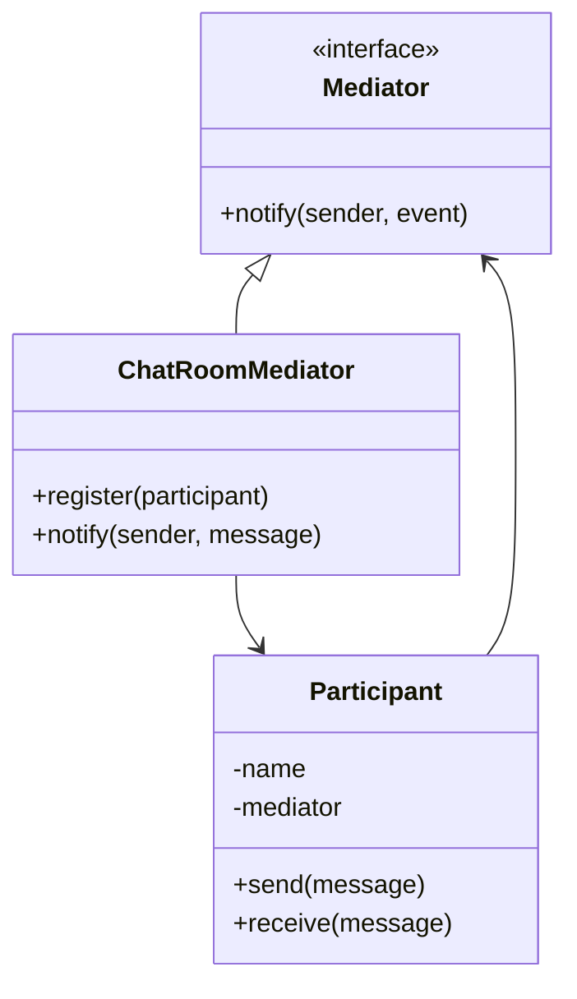

## 5.5 Mediator Pattern

### Introduction

In the realm of software design, managing the interactions between objects can become complex, especially as systems grow in size and functionality. The Mediator Pattern offers a solution by defining an object that encapsulates how a set of objects interact. This pattern promotes loose coupling by preventing objects from referring to each other explicitly, thereby simplifying complex communication networks.

### Purpose of the Mediator Pattern

The primary purpose of the Mediator Pattern is to reduce the dependencies between communicating objects. By introducing a mediator object, we can centralize the communication logic, which leads to a more organized and maintainable codebase. This pattern is particularly useful in scenarios where multiple objects need to interact with each other in a dynamic and flexible manner.

#### Simplifying Complex Communication

In a typical object-oriented system, objects often need to communicate with each other to perform their tasks. Without a mediator, this communication can lead to a tangled web of dependencies, making the system difficult to understand and maintain. The Mediator Pattern addresses this issue by acting as an intermediary that handles all interactions between objects. This not only reduces the direct dependencies but also makes it easier to modify the interactions without affecting the individual objects.

### Structure of the Mediator Pattern

The Mediator Pattern involves several key components:

1. **Mediator Interface**: Defines the communication methods that the mediator will implement.
2. **ConcreteMediator**: Implements the Mediator interface and coordinates the communication between Colleague objects.
3. **Colleagues**: These are the objects that communicate with each other through the mediator.

#### Mediator Interface

The Mediator interface declares the methods used by Colleagues to communicate. It acts as a contract that the ConcreteMediator must fulfill.

```python
from abc import ABC, abstractmethod

class Mediator(ABC):
    @abstractmethod
    def notify(self, sender, event):
        pass
```

#### ConcreteMediator

The ConcreteMediator implements the Mediator interface and contains the logic for coordinating the interactions between Colleagues.

```python
class ChatRoomMediator(Mediator):
    def __init__(self):
        self.participants = []

    def register(self, participant):
        self.participants.append(participant)

    def notify(self, sender, message):
        for participant in self.participants:
            if participant != sender:
                participant.receive(message)
```

#### Colleagues

Colleagues are the objects that interact with each other through the mediator. They hold a reference to the mediator and use it to communicate.

```python
class Participant:
    def __init__(self, name, mediator):
        self.name = name
        self.mediator = mediator
        self.mediator.register(self)

    def send(self, message):
        print(f"{self.name} sends: {message}")
        self.mediator.notify(self, message)

    def receive(self, message):
        print(f"{self.name} receives: {message}")
```

### Python Example: Chat Room

Let's implement a simple chat room where users (participants) communicate via a mediator.

```python
from abc import ABC, abstractmethod

class Mediator(ABC):
    @abstractmethod
    def notify(self, sender, event):
        pass

class ChatRoomMediator(Mediator):
    def __init__(self):
        self.participants = []

    def register(self, participant):
        self.participants.append(participant)

    def notify(self, sender, message):
        for participant in self.participants:
            if participant != sender:
                participant.receive(message)

class Participant:
    def __init__(self, name, mediator):
        self.name = name
        self.mediator = mediator
        self.mediator.register(self)

    def send(self, message):
        print(f"{self.name} sends: {message}")
        self.mediator.notify(self, message)

    def receive(self, message):
        print(f"{self.name} receives: {message}")

mediator = ChatRoomMediator()

alice = Participant("Alice", mediator)
bob = Participant("Bob", mediator)
charlie = Participant("Charlie", mediator)

alice.send("Hello, everyone!")
bob.send("Hi Alice!")
charlie.send("Hey folks!")
```

### Benefits of the Mediator Pattern

The Mediator Pattern offers several advantages:

- **Reduced Coupling**: By centralizing communication, the pattern reduces the direct dependencies between objects, making the system more modular.
- **Improved Scalability**: As new Colleagues are added, the mediator can handle their interactions without requiring changes to existing objects.
- **Simplified Maintenance**: Changes to the interaction logic are localized to the mediator, simplifying updates and bug fixes.

### Potential Issues

While the Mediator Pattern offers many benefits, it also has potential drawbacks:

- **Risk of Creating a God Object**: If the mediator becomes too complex, it can turn into a "god object" that knows too much about the system. This can lead to maintenance challenges and reduce the benefits of the pattern.
- **Performance Overhead**: The centralized communication can introduce a performance overhead, especially if the mediator handles a large number of interactions.

### Best Practices

To effectively use the Mediator Pattern, consider the following best practices:

- **Keep the Mediator Focused**: Ensure that the mediator only handles coordination logic and does not take on additional responsibilities.
- **Limit the Number of Colleagues**: Avoid adding too many Colleagues to a single mediator to prevent it from becoming overly complex.
- **Refactor Tightly Coupled Systems**: Use the Mediator Pattern to refactor systems where objects have many direct dependencies on each other.

### Encouraging Application

The Mediator Pattern is a powerful tool for managing complex interactions in software systems. By refactoring tightly coupled systems to use a mediator, you can achieve greater modularity and flexibility. Consider applying this pattern in scenarios where objects need to communicate frequently and dynamically.

### Visualizing the Mediator Pattern

To better understand the Mediator Pattern, let's visualize the interaction between the components using a class diagram.



**Diagram Description**: This class diagram illustrates the relationship between the Mediator interface, ConcreteMediator (ChatRoomMediator), and Colleagues (Participant). The ChatRoomMediator implements the Mediator interface and coordinates the communication between Participants.

### Try It Yourself

To deepen your understanding of the Mediator Pattern, try modifying the chat room example:

- **Add a New Feature**: Implement a feature where participants can send private messages to specific users.
- **Enhance the Mediator**: Introduce logging functionality within the mediator to track all messages sent and received.
- **Experiment with Different Mediators**: Create different types of mediators that handle communication in various ways, such as prioritizing messages or filtering content.

### Conclusion

The Mediator Pattern is a valuable design pattern for managing complex interactions between objects. By centralizing communication logic, it reduces coupling and enhances the maintainability of the system. As you continue to explore design patterns, consider how the Mediator Pattern can be applied to simplify and improve your software architecture.

Remember, this is just the beginning. As you progress, you'll build more complex and interactive systems. Keep experimenting, stay curious, and enjoy the journey!

## Quiz Time!



### What is the primary purpose of the Mediator Pattern?

- [x] To reduce dependencies between communicating objects
- [ ] To increase the number of direct interactions between objects
- [ ] To create a centralized database for object interactions
- [ ] To replace all direct communication with a single object

> **Explanation:** The Mediator Pattern reduces dependencies between objects by centralizing communication through a mediator.

### Which component in the Mediator Pattern handles the coordination logic?

- [ ] Colleagues
- [x] ConcreteMediator
- [ ] Mediator Interface
- [ ] Participant

> **Explanation:** The ConcreteMediator is responsible for implementing the coordination logic between Colleagues.

### What is a potential drawback of using the Mediator Pattern?

- [ ] Increased coupling between objects
- [x] Risk of creating a god object
- [ ] Reduced scalability
- [ ] Decreased modularity

> **Explanation:** If the mediator becomes too complex, it can turn into a god object, which is a potential drawback of the Mediator Pattern.

### In the provided Python example, what role does the `Participant` class play?

- [x] Colleague
- [ ] Mediator
- [ ] ConcreteMediator
- [ ] Observer

> **Explanation:** The `Participant` class acts as a Colleague that communicates through the mediator.

### What is a best practice when implementing the Mediator Pattern?

- [x] Keep the mediator focused on coordination logic
- [ ] Add as many Colleagues as possible to the mediator
- [ ] Allow Colleagues to communicate directly with each other
- [ ] Use the mediator to handle all system logic

> **Explanation:** Keeping the mediator focused on coordination logic ensures it doesn't become overly complex.

### How does the Mediator Pattern improve scalability?

- [x] By allowing new Colleagues to be added without changing existing objects
- [ ] By increasing the number of direct interactions between objects
- [ ] By centralizing all system logic in the mediator
- [ ] By reducing the number of objects in the system

> **Explanation:** The Mediator Pattern improves scalability by allowing new Colleagues to be added without affecting existing objects.

### Which of the following is NOT a component of the Mediator Pattern?

- [ ] Mediator Interface
- [ ] ConcreteMediator
- [ ] Colleagues
- [x] Singleton

> **Explanation:** Singleton is not a component of the Mediator Pattern.

### What is the role of the `notify` method in the Mediator Pattern?

- [x] To facilitate communication between Colleagues
- [ ] To initialize the mediator
- [ ] To register new Colleagues
- [ ] To log all interactions

> **Explanation:** The `notify` method is used to facilitate communication between Colleagues through the mediator.

### In the chat room example, what does the `register` method do?

- [x] Adds a participant to the list of participants in the mediator
- [ ] Sends a message to all participants
- [ ] Removes a participant from the chat room
- [ ] Logs a message to the console

> **Explanation:** The `register` method adds a participant to the list of participants managed by the mediator.

### True or False: The Mediator Pattern always results in better performance.

- [ ] True
- [x] False

> **Explanation:** While the Mediator Pattern reduces coupling, it can introduce performance overhead due to centralized communication.


