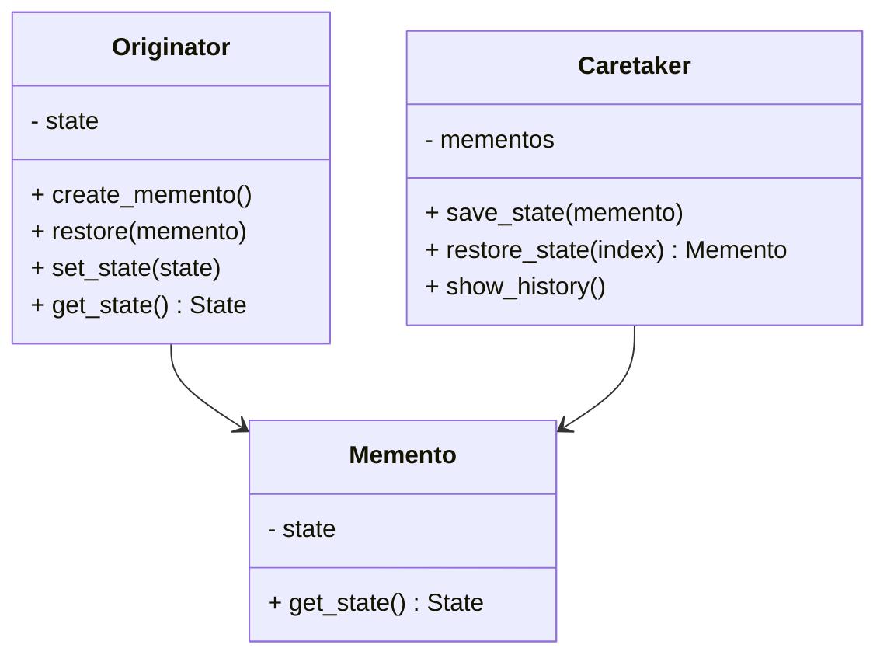

## 5.6.1 Implementing Memento in Python

The Memento Pattern is a behavioral design pattern that allows you to capture and restore an object's state without exposing its internal structure. This pattern is particularly useful in scenarios where you need to implement undo functionality or maintain a history of changes. In this section, we will explore the Memento Pattern, its components, and how to implement it in Python.

### Understanding the Memento Pattern

The Memento Pattern involves three key components:

1. **Originator**: The object whose state needs to be saved and restored.
2. **Memento**: A snapshot of the Originator's state.
3. **Caretaker**: Manages the Mementos and facilitates state restoration.

The Memento Pattern is designed to preserve encapsulation boundaries. The Originator creates a Memento containing a snapshot of its current state, and the Caretaker stores the Memento. When needed, the Caretaker can restore the Originator's state using the Memento.

### Implementing the Memento Pattern in Python

#### Step 1: Create the Originator Class

The Originator class is responsible for creating Mementos and restoring its state from them. It should have methods to save and restore its state.

```python
class Originator:
    def __init__(self, state):
        self._state = state

    def create_memento(self):
        return Memento(self._state)

    def restore(self, memento):
        self._state = memento.get_state()

    def set_state(self, state):
        self._state = state

    def get_state(self):
        return self._state

    def __str__(self):
        return f"Originator's state: {self._state}"
```

- **`create_memento`**: Captures the current state and returns a Memento.
- **`restore`**: Restores the state from a given Memento.
- **`set_state`** and **`get_state`**: Set and get the current state.

#### Step 2: Define the Memento Class

The Memento class stores the state of the Originator. It should not expose the internal structure of the Originator.

```python
class Memento:
    def __init__(self, state):
        self._state = state

    def get_state(self):
        return self._state
```

- The Memento class encapsulates the state and provides a method to retrieve it.

#### Step 3: Implement the Caretaker

The Caretaker is responsible for managing Mementos. It stores Mementos and can restore the Originator's state when needed.

```python
class Caretaker:
    def __init__(self):
        self._mementos = []

    def save_state(self, memento):
        self._mementos.append(memento)

    def restore_state(self, index):
        return self._mementos[index]

    def show_history(self):
        for i, memento in enumerate(self._mementos):
            print(f"State {i}: {memento.get_state()}")
```

- **`save_state`**: Adds a Memento to the list.
- **`restore_state`**: Retrieves a Memento by index.
- **`show_history`**: Displays all saved states.

### Demonstrating State Capture and Restoration

Let's see how these components work together to capture and restore the state of an Originator.

```python
originator = Originator("State1")
print(originator)

caretaker = Caretaker()

caretaker.save_state(originator.create_memento())

originator.set_state("State2")
print(originator)

caretaker.save_state(originator.create_memento())

originator.restore(caretaker.restore_state(0))
print(originator)

caretaker.show_history()
```

**Output:**

```
Originator's state: State1
Originator's state: State2
Originator's state: State1
State 0: State1
State 1: State2
```

### Encapsulation and Security Concerns

The Memento Pattern is designed to preserve encapsulation. The Memento class should not expose the internal details of the Originator. This ensures that the Originator's internal state is not accessible to external classes, maintaining the integrity of the object's encapsulation.

However, when implementing the Memento Pattern, it's essential to consider security implications, especially when storing sensitive data. If the state contains sensitive information, ensure that Mementos are securely managed and not exposed to unauthorized access.

### Serialization Options

In some cases, you may want to serialize the state to store it persistently. Python's `pickle` module can be used for this purpose. However, be cautious when using `pickle` with sensitive data, as it can execute arbitrary code during deserialization.

```python
import pickle

memento = originator.create_memento()
serialized_memento = pickle.dumps(memento)

deserialized_memento = pickle.loads(serialized_memento)
originator.restore(deserialized_memento)
print(originator)
```

### Security Implications

When storing Mementos, consider the following security concerns:

- **Access Control**: Ensure that only authorized components can access Mementos.
- **Data Encryption**: Encrypt sensitive data before storing it in Mementos.
- **Secure Storage**: Use secure storage mechanisms to prevent unauthorized access.

### Visualizing the Memento Pattern

To better understand the interaction between the components, let's visualize the Memento Pattern using a class diagram.



### Try It Yourself

To deepen your understanding of the Memento Pattern, try modifying the code examples:

- **Add More States**: Experiment with saving and restoring multiple states.
- **Implement Undo/Redo**: Extend the Caretaker to support undo and redo functionality.
- **Secure Mementos**: Implement encryption for Mementos containing sensitive data.

### Knowledge Check

- What are the three key components of the Memento Pattern?
- How does the Memento Pattern preserve encapsulation?
- What are the security concerns when storing Mementos?
- How can you serialize a Memento in Python?

### Summary

The Memento Pattern is a powerful tool for managing object state without violating encapsulation. By implementing the Originator, Memento, and Caretaker, you can capture and restore states effectively. Remember to consider security implications when dealing with sensitive data and explore serialization options for persistent storage.

## Quiz Time!



### What is the primary purpose of the Memento Pattern?

- [x] To capture and restore an object's state without exposing its internal structure.
- [ ] To manage object creation.
- [ ] To define a one-to-many dependency between objects.
- [ ] To allow incompatible interfaces to work together.

> **Explanation:** The Memento Pattern is designed to capture and restore an object's state without exposing its internal structure.

### Which component of the Memento Pattern is responsible for managing state snapshots?

- [ ] Originator
- [x] Caretaker
- [ ] Memento
- [ ] Observer

> **Explanation:** The Caretaker is responsible for managing Mementos, which are state snapshots.

### How does the Memento Pattern preserve encapsulation?

- [x] By ensuring the Memento does not expose the Originator's internal structure.
- [ ] By using inheritance to hide details.
- [ ] By storing state in a database.
- [ ] By encrypting all data.

> **Explanation:** The Memento Pattern preserves encapsulation by ensuring that the Memento does not expose the internal structure of the Originator.

### What is a potential security concern when using the Memento Pattern?

- [ ] Excessive memory usage.
- [x] Unauthorized access to sensitive data.
- [ ] Slow performance.
- [ ] Complex code structure.

> **Explanation:** A potential security concern is unauthorized access to sensitive data stored in Mementos.

### Which Python module can be used for serializing Mementos?

- [ ] json
- [x] pickle
- [ ] csv
- [ ] xml

> **Explanation:** The `pickle` module can be used for serializing Mementos in Python.

### What method in the Originator class is used to create a Memento?

- [ ] restore()
- [x] create_memento()
- [ ] set_state()
- [ ] get_state()

> **Explanation:** The `create_memento()` method in the Originator class is used to create a Memento.

### How can you enhance the security of Mementos containing sensitive data?

- [x] By encrypting the data before storing it.
- [ ] By using a different programming language.
- [ ] By storing data in plain text.
- [ ] By using a larger data structure.

> **Explanation:** Encrypting the data before storing it can enhance the security of Mementos containing sensitive data.

### What is the role of the Memento class in the Memento Pattern?

- [ ] To manage state snapshots.
- [ ] To change the state of the Originator.
- [x] To store the state of the Originator.
- [ ] To interact with external systems.

> **Explanation:** The Memento class is responsible for storing the state of the Originator.

### What does the `restore()` method in the Originator class do?

- [x] Restores the state from a given Memento.
- [ ] Saves the current state.
- [ ] Deletes a Memento.
- [ ] Changes the state of the Caretaker.

> **Explanation:** The `restore()` method in the Originator class restores the state from a given Memento.

### True or False: The Memento Pattern can be used to implement undo functionality.

- [x] True
- [ ] False

> **Explanation:** True. The Memento Pattern can be used to implement undo functionality by capturing and restoring previous states.


