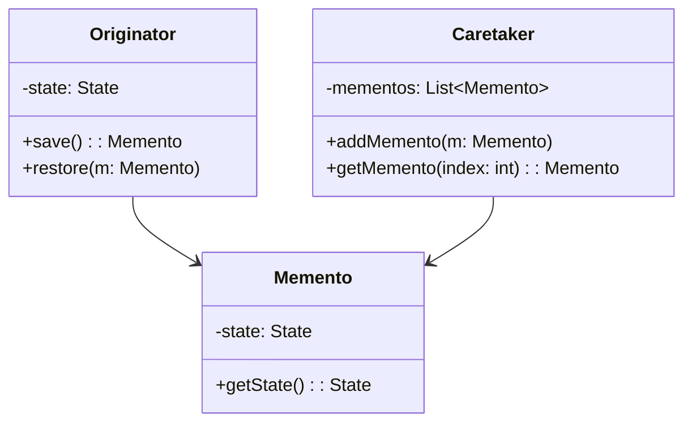

## 5.6.2 State Saving and Restoration

In the world of software development, the ability to save and restore the state of an object is crucial for a variety of applications. Whether you're implementing an undo feature in a text editor, saving game progress, or rolling back configurations, managing state efficiently and effectively is key. In this section, we will delve into the Memento Pattern, a behavioral design pattern that provides a systematic approach to capturing and restoring an object's state.

### Understanding the Need for State Management

State management is essential for maintaining the consistency and reliability of applications. It allows systems to recover from errors, provide undo functionality, and maintain user progress. Let's explore some common scenarios where state management is indispensable:

- **Recovery from Errors**: When an application encounters an unexpected error, having a saved state allows it to revert to a known good configuration, minimizing data loss and downtime.
- **Implementing Undo Features**: In applications like text editors or graphic design tools, users expect the ability to undo actions. This requires capturing the state before each change.
- **Game Save States**: Video games often allow players to save their progress. This involves storing the game state at specific points to enable players to resume from where they left off.
- **Configuration Rollbacks**: In systems where configurations change frequently, being able to revert to a previous configuration can prevent issues caused by faulty updates.

### The Memento Pattern: An Overview

The Memento Pattern is a behavioral design pattern that captures and externalizes an object's internal state so that it can be restored later without violating encapsulation. The pattern involves three primary components:

1. **Originator**: The object whose state needs to be saved and restored.
2. **Memento**: The object that stores the state of the Originator.
3. **Caretaker**: The object responsible for keeping track of the Memento.

The Memento Pattern allows the Originator to produce a Memento containing a snapshot of its current state. The Caretaker holds the Memento and can later use it to restore the Originator's state.

### Implementing the Memento Pattern in Python

Let's look at a practical example of implementing the Memento Pattern in Python. We'll create a simple text editor that supports undo functionality.

```python
class EditorState:
    """The Memento class that stores the state of the Editor."""
    def __init__(self, content: str):
        self._content = content

    def get_content(self) -> str:
        return self._content

class Editor:
    """The Originator class that creates and restores states."""
    def __init__(self):
        self._content = ""

    def type(self, words: str):
        self._content += words

    def save(self) -> EditorState:
        return EditorState(self._content)

    def restore(self, state: EditorState):
        self._content = state.get_content()

    def get_content(self) -> str:
        return self._content

class History:
    """The Caretaker class that manages the saved states."""
    def __init__(self):
        self._states = []

    def push(self, state: EditorState):
        self._states.append(state)

    def pop(self) -> EditorState:
        return self._states.pop()

editor = Editor()
history = History()

editor.type("Hello, ")
history.push(editor.save())

editor.type("world!")
history.push(editor.save())

print(editor.get_content())  # Output: Hello, world!

editor.restore(history.pop())
print(editor.get_content())  # Output: Hello, 

editor.restore(history.pop())
print(editor.get_content())  # Output: 
```

In this example, the `Editor` class acts as the Originator, the `EditorState` class is the Memento, and the `History` class is the Caretaker. The editor can type text, save its state, and restore it to a previous state using the Memento Pattern.

### Strategies for State Saving

When implementing state saving, you have several strategies to choose from, each with its own trade-offs:

- **Full State Copies**: This approach involves saving the entire state of the object at each point. While simple, it can be resource-intensive if the state is large.
- **Incremental Changes**: Instead of saving the entire state, you can save only the changes made since the last state. This can be more efficient but requires a mechanism to apply changes incrementally.

### Addressing Efficiency

Efficiency is a critical consideration in state management. Here are some strategies to balance thoroughness with resource usage:

- **Limit the Number of Stored States**: Keep only a fixed number of states to prevent excessive memory usage. Implement a strategy to discard the oldest states when the limit is reached.
- **Compress Data**: Use data compression techniques to reduce the size of stored states, especially when dealing with large amounts of data.
- **Use Lazy Saving**: Delay the saving of states until necessary, such as when the application is idle or when a significant change occurs.

### Best Practices for State Management

To ensure effective state management, consider the following best practices:

- **Encapsulation**: Keep the Memento's state encapsulated and accessible only to the Originator. This prevents external objects from modifying the state directly.
- **Immutable Mementos**: Design Mementos to be immutable to prevent accidental modifications after they are created.
- **Efficient State Representation**: Choose an efficient representation for the state, especially when dealing with complex objects or large datasets.
- **Versioning**: If the state structure changes over time, implement versioning to handle different state formats.

### Visualizing the Memento Pattern

To better understand the Memento Pattern, let's visualize the interaction between its components:



In this diagram, the `Originator` interacts with the `Memento` to save and restore its state. The `Caretaker` manages the collection of `Memento` objects.

### Try It Yourself

To deepen your understanding of the Memento Pattern, try modifying the example code:

- **Add a Redo Feature**: Extend the `History` class to support redo functionality, allowing the editor to move forward through states.
- **Implement Incremental Changes**: Modify the `Editor` class to save only the changes made since the last state, rather than the full content.
- **Compress State Data**: Integrate a simple compression algorithm to reduce the size of stored states.

### References and Further Reading

- [Memento Pattern on Wikipedia](https://en.wikipedia.org/wiki/Memento_pattern)
- [Python's `pickle` Module for Serialization](https://docs.python.org/3/library/pickle.html)
- [Design Patterns: Elements of Reusable Object-Oriented Software](https://en.wikipedia.org/wiki/Design_Patterns)

### Knowledge Check

Before we conclude, let's reinforce what we've learned:

- **Why is state management important in software development?**
- **What are the three main components of the Memento Pattern?**
- **How can you balance efficiency and thoroughness in state saving?**

### Embrace the Journey

Remember, mastering design patterns like the Memento Pattern is a journey. As you continue to explore and apply these patterns, you'll gain a deeper understanding of how to create robust and maintainable software. Keep experimenting, stay curious, and enjoy the process!

## Quiz Time!



### What is the primary purpose of the Memento Pattern?

- [x] To capture and restore an object's state without violating encapsulation
- [ ] To manage object creation
- [ ] To define a family of algorithms
- [ ] To provide a simplified interface to a complex subsystem

> **Explanation:** The Memento Pattern is designed to capture and restore an object's state without violating encapsulation, making it ideal for implementing undo functionality and state restoration.

### Which component of the Memento Pattern is responsible for storing the object's state?

- [ ] Originator
- [x] Memento
- [ ] Caretaker
- [ ] Observer

> **Explanation:** The Memento is the component responsible for storing the object's state. It encapsulates the state so that it can be restored later.

### In the Memento Pattern, what role does the Caretaker play?

- [ ] It creates and restores states
- [ ] It stores the state of the object
- [x] It manages the saved states
- [ ] It encapsulates the state

> **Explanation:** The Caretaker is responsible for managing the saved states, typically by storing and retrieving Memento objects.

### What is a potential downside of using full state copies for state saving?

- [ ] It is complex to implement
- [x] It can be resource-intensive
- [ ] It violates encapsulation
- [ ] It is not suitable for undo functionality

> **Explanation:** Full state copies can be resource-intensive, especially if the state is large, as they require storing the entire state at each point.

### How can you improve the efficiency of state saving?

- [x] Limit the number of stored states
- [x] Compress data
- [ ] Always save the full state
- [ ] Use mutable Mementos

> **Explanation:** Limiting the number of stored states and compressing data are strategies to improve efficiency. Saving the full state and using mutable Mementos can lead to inefficiency and potential errors.

### What is a best practice for designing Mementos?

- [ ] Make them mutable
- [x] Keep them immutable
- [ ] Allow external modification
- [ ] Store them in the Originator

> **Explanation:** Keeping Mementos immutable is a best practice to prevent accidental modifications after they are created, ensuring the integrity of the saved state.

### Which strategy involves saving only the changes made since the last state?

- [ ] Full state copies
- [x] Incremental changes
- [ ] Lazy saving
- [ ] Data compression

> **Explanation:** Incremental changes involve saving only the changes made since the last state, which can be more efficient than saving the full state each time.

### What is one way to handle different state formats over time?

- [ ] Use mutable Mementos
- [ ] Always save the full state
- [x] Implement versioning
- [ ] Discard old states

> **Explanation:** Implementing versioning allows you to handle different state formats over time, ensuring compatibility and flexibility.

### True or False: The Memento Pattern violates encapsulation by exposing the object's state.

- [ ] True
- [x] False

> **Explanation:** False. The Memento Pattern is specifically designed to capture and restore an object's state without violating encapsulation, keeping the state encapsulated within the Memento.

### Which of the following is NOT a component of the Memento Pattern?

- [ ] Originator
- [ ] Memento
- [ ] Caretaker
- [x] Adapter

> **Explanation:** The Adapter is not a component of the Memento Pattern. The pattern consists of the Originator, Memento, and Caretaker.


