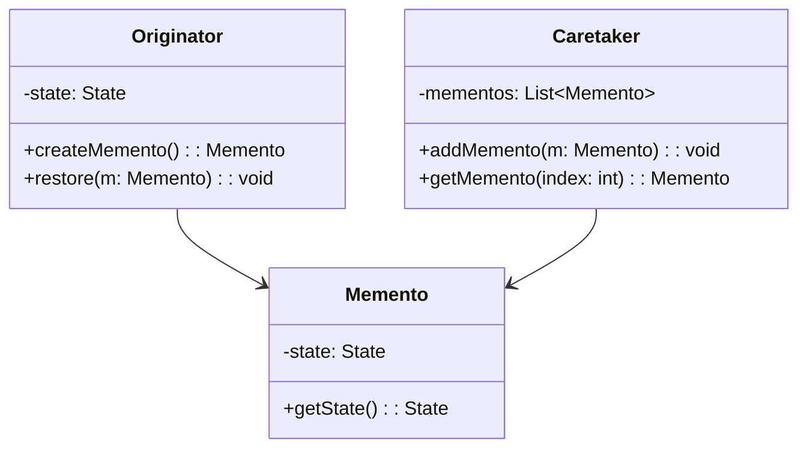

## 5.6.3 Use Cases and Examples

The Memento Pattern is a behavioral design pattern that provides the ability to restore an object to its previous state. This is particularly useful in applications where undo/redo functionality is required, such as text editors and graphic design software. In this section, we'll explore real-world applications of the Memento pattern, providing detailed examples and code snippets to illustrate its implementation in Python.

### Understanding the Memento Pattern

Before diving into the examples, let's briefly recap the core concept of the Memento pattern. The pattern involves three main components:

1. **Originator**: The object whose state needs to be saved and restored.
2. **Memento**: A snapshot of the originator's state at a given point in time.
3. **Caretaker**: Manages the mementos and is responsible for storing and restoring the originator's state.

The Memento pattern is particularly useful when you want to provide undo/redo functionality without exposing the internal state of the originator object.

### Use Case 1: Text Editor with Undo/Redo Functionality

One of the most common applications of the Memento pattern is in text editors, where users frequently need to undo or redo changes. Let's explore how we can implement this functionality using the Memento pattern in Python.

#### Implementing the Memento Pattern in a Text Editor

Consider a simple text editor application where users can type text and undo or redo their actions. We'll use the Memento pattern to save the state of the text after each change.

```python
class Memento:
    def __init__(self, state):
        self._state = state

    def get_state(self):
        return self._state

class TextEditor:
    def __init__(self):
        self._text = ""
        self._history = []

    def type(self, words):
        self._history.append(Memento(self._text))
        self._text += words

    def undo(self):
        if self._history:
            memento = self._history.pop()
            self._text = memento.get_state()

    def get_text(self):
        return self._text

editor = TextEditor()
editor.type("Hello, ")
editor.type("world!")
print(editor.get_text())  # Output: Hello, world!

editor.undo()
print(editor.get_text())  # Output: Hello, 
```

In this example, the `TextEditor` class acts as the originator, and the `Memento` class stores the state of the text. The `undo` method allows the user to revert to the previous state by popping the last memento from the history stack.

#### Benefits Observed

Implementing the Memento pattern in a text editor offers several benefits:

- **Enhanced User Experience**: Users can easily undo mistakes, improving the overall usability of the application.
- **Error Recovery**: The ability to revert to a previous state helps in recovering from errors or unintended changes.

### Use Case 2: Graphic Design Software

Graphic design software often requires saving snapshots of the work to allow users to experiment with different designs and revert to previous versions if needed. The Memento pattern is ideal for this scenario.

#### Implementing the Memento Pattern in Graphic Design Software

Let's consider a simple graphic design application where users can draw shapes and save their work at different stages.

```python
class GraphicMemento:
    def __init__(self, state):
        self._state = state

    def get_state(self):
        return self._state

class GraphicEditor:
    def __init__(self):
        self._shapes = []
        self._history = []

    def add_shape(self, shape):
        self._history.append(GraphicMemento(list(self._shapes)))
        self._shapes.append(shape)

    def undo(self):
        if self._history:
            memento = self._history.pop()
            self._shapes = memento.get_state()

    def get_shapes(self):
        return self._shapes

editor = GraphicEditor()
editor.add_shape("Circle")
editor.add_shape("Square")
print(editor.get_shapes())  # Output: ['Circle', 'Square']

editor.undo()
print(editor.get_shapes())  # Output: ['Circle']
```

In this example, the `GraphicEditor` class acts as the originator, and the `GraphicMemento` class stores the state of the shapes. The `undo` method allows the user to revert to a previous state by popping the last memento from the history stack.

#### Benefits Observed

Implementing the Memento pattern in graphic design software offers several benefits:

- **Enhanced User Experience**: Users can experiment with different designs and easily revert to previous versions.
- **State Integrity**: The pattern ensures that the state of the design is preserved and can be restored accurately.

### Encouraging Thoughtful Application

While the Memento pattern is powerful, it's important to use it judiciously. Consider the following when deciding to implement the Memento pattern:

- **State Integrity**: If maintaining the integrity of an object's state is critical, the Memento pattern is a suitable choice.
- **Memory Consumption**: Be mindful of the memory consumption, as storing multiple mementos can be resource-intensive.
- **Complexity**: Ensure that the added complexity of implementing the pattern is justified by the benefits it provides.

### Try It Yourself

To deepen your understanding of the Memento pattern, try modifying the code examples provided. Here are a few suggestions:

1. **Extend the Text Editor**: Add a redo functionality to the text editor example.
2. **Enhance the Graphic Editor**: Implement a feature that allows users to save multiple snapshots and navigate between them.
3. **Experiment with Different Data Types**: Modify the examples to work with different data types, such as lists or dictionaries.

### Visualizing the Memento Pattern

To better understand the Memento pattern, let's visualize its components and interactions using a class diagram.



In this diagram, the `Originator` class creates and restores mementos, the `Memento` class stores the state, and the `Caretaker` class manages the mementos.

### References and Further Reading

For more information on the Memento pattern and its applications, consider exploring the following resources:

- [Refactoring Guru - Memento Pattern](https://refactoring.guru/design-patterns/memento)
- [Wikipedia - Memento Pattern](https://en.wikipedia.org/wiki/Memento_pattern)
- [Python Design Patterns](https://python-patterns.guide/)

### Knowledge Check

To reinforce your understanding of the Memento pattern, consider the following questions:

1. What are the main components of the Memento pattern?
2. How does the Memento pattern enhance user experience in applications?
3. What are some potential drawbacks of using the Memento pattern?
4. How can you implement redo functionality in the text editor example?
5. What considerations should you keep in mind when using the Memento pattern?

### Embrace the Journey

Remember, this is just the beginning. As you progress, you'll discover more ways to apply the Memento pattern and other design patterns to create robust and user-friendly applications. Keep experimenting, stay curious, and enjoy the journey!

## Quiz Time!



### What is the primary purpose of the Memento pattern?

- [x] To restore an object to a previous state
- [ ] To manage object creation
- [ ] To handle object interactions
- [ ] To encapsulate algorithms

> **Explanation:** The Memento pattern is used to restore an object to a previous state without exposing its internal structure.

### Which component in the Memento pattern is responsible for storing the state?

- [ ] Originator
- [x] Memento
- [ ] Caretaker
- [ ] Observer

> **Explanation:** The Memento component is responsible for storing the state of the originator.

### In the text editor example, what does the `undo` method do?

- [x] Reverts the text to the previous state
- [ ] Saves the current state
- [ ] Clears the text
- [ ] Appends new text

> **Explanation:** The `undo` method reverts the text to the previous state by popping the last memento from the history stack.

### What is a potential drawback of using the Memento pattern?

- [x] High memory consumption
- [ ] Increased performance
- [ ] Simplified code
- [ ] Enhanced security

> **Explanation:** Storing multiple mementos can lead to high memory consumption, especially if the state is large.

### How can the Memento pattern enhance user experience?

- [x] By providing undo/redo functionality
- [ ] By increasing application speed
- [ ] By reducing code complexity
- [ ] By improving security

> **Explanation:** The Memento pattern enhances user experience by allowing users to undo and redo actions, providing greater flexibility and control.

### In graphic design software, what does the Memento pattern help preserve?

- [x] The state of the design
- [ ] The speed of rendering
- [ ] The color palette
- [ ] The user interface layout

> **Explanation:** The Memento pattern helps preserve the state of the design, allowing users to revert to previous versions.

### What should you consider when deciding to use the Memento pattern?

- [x] State integrity and memory consumption
- [ ] Network latency and bandwidth
- [ ] User interface design
- [ ] Database schema

> **Explanation:** It's important to consider state integrity and memory consumption when using the Memento pattern, as it involves storing multiple states.

### Which of the following is NOT a component of the Memento pattern?

- [ ] Originator
- [ ] Memento
- [ ] Caretaker
- [x] Adapter

> **Explanation:** The Adapter is not a component of the Memento pattern; it is a separate design pattern.

### What is the role of the Caretaker in the Memento pattern?

- [x] To manage and store mementos
- [ ] To create mementos
- [ ] To modify the state
- [ ] To encapsulate algorithms

> **Explanation:** The Caretaker is responsible for managing and storing mementos without modifying the state.

### True or False: The Memento pattern exposes the internal state of the originator.

- [ ] True
- [x] False

> **Explanation:** False. The Memento pattern does not expose the internal state of the originator, maintaining encapsulation.


