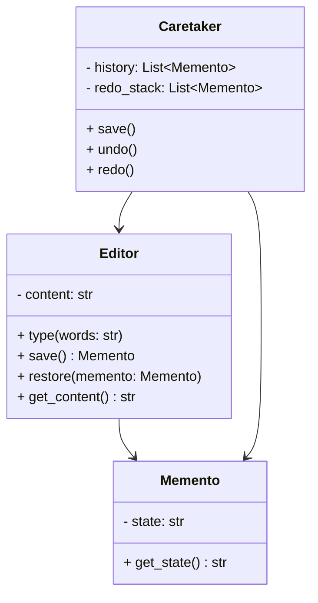

## 5.6 Memento Pattern

### Introduction

The Memento Pattern is a behavioral design pattern that allows capturing and externalizing an object's internal state so that the object can be restored to this state later, without violating encapsulation. This pattern is particularly useful in scenarios where you need to implement undo/redo functionality, manage transactional operations, or maintain historical states of an object.

### Intent of the Memento Pattern

The primary intent of the Memento Pattern is to provide the ability to restore an object to its previous state. This is achieved by capturing the object's state in a Memento object, which can be stored and retrieved as needed. The Memento Pattern ensures that the internal state of the object is saved and restored without exposing its implementation details, thus maintaining encapsulation.

### Components of the Memento Pattern

The Memento Pattern involves three main components:

1. **Originator**: The object whose state needs to be saved and restored. It creates a Memento containing a snapshot of its current state and can restore its state from a Memento.

2. **Memento**: A representation of the Originator's internal state at a specific point in time. It is an opaque object that only the Originator can access.

3. **Caretaker**: Manages the Mementos and is responsible for storing and retrieving them. The Caretaker does not modify or inspect the contents of the Memento.

Let's explore these components in more detail with a practical example.

### Python Example: Implementing an Editor with Undo/Redo

To illustrate the Memento Pattern, we'll implement a simple text editor with undo and redo functionality. This example will demonstrate how to capture and restore the editor's state using the Memento Pattern.

#### Step 1: Define the Memento Class

The Memento class will store the state of the editor. It should be a simple class that holds the necessary state information.

```python
class Memento:
    def __init__(self, state: str):
        self._state = state

    def get_state(self) -> str:
        return self._state
```

#### Step 2: Define the Originator Class

The Originator class represents the editor. It can create a Memento to save its state and restore its state from a Memento.

```python
class Editor:
    def __init__(self):
        self._content = ""

    def type(self, words: str):
        self._content += words

    def save(self) -> Memento:
        return Memento(self._content)

    def restore(self, memento: Memento):
        self._content = memento.get_state()

    def get_content(self) -> str:
        return self._content
```

#### Step 3: Define the Caretaker Class

The Caretaker class will manage the Mementos. It will store the Mementos and provide undo and redo functionality.

```python
class Caretaker:
    def __init__(self, editor: Editor):
        self._editor = editor
        self._history = []
        self._redo_stack = []

    def save(self):
        self._history.append(self._editor.save())
        self._redo_stack.clear()

    def undo(self):
        if not self._history:
            return
        memento = self._history.pop()
        self._redo_stack.append(self._editor.save())
        self._editor.restore(memento)

    def redo(self):
        if not self._redo_stack:
            return
        memento = self._redo_stack.pop()
        self._history.append(self._editor.save())
        self._editor.restore(memento)
```

#### Step 4: Demonstrate the Editor with Undo/Redo

Let's see how the editor works with undo and redo functionality.

```python
def main():
    editor = Editor()
    caretaker = Caretaker(editor)

    editor.type("Hello, ")
    caretaker.save()

    editor.type("world!")
    caretaker.save()

    print("Current content:", editor.get_content())  # Output: Hello, world!

    caretaker.undo()
    print("After undo:", editor.get_content())  # Output: Hello, 

    caretaker.redo()
    print("After redo:", editor.get_content())  # Output: Hello, world!

if __name__ == "__main__":
    main()
```

### Encapsulation Concerns

One of the key benefits of the Memento Pattern is that it maintains the encapsulation of the Originator's state. The Memento object is an opaque object that only the Originator can access. This ensures that the internal state of the Originator is not exposed to the outside world, preserving the integrity of the object's encapsulation.

### Practical Applications

The Memento Pattern is widely used in various applications, including:

- **Transactional Operations**: The Memento Pattern can be used to implement transactional operations where you need to rollback changes if an error occurs.

- **Undo Mechanisms**: Many applications, such as text editors and graphic design software, use the Memento Pattern to implement undo and redo functionality.

- **State History**: The Memento Pattern can be used to maintain a history of an object's state, allowing you to navigate through different states over time.

### Performance Considerations

When implementing the Memento Pattern, it's important to consider the performance implications of storing multiple states. Storing a large number of Mementos can consume significant memory, especially if the state of the Originator is large.

To manage memory efficiently, consider the following strategies:

- **Snapshots vs. Deltas**: Instead of storing the entire state, consider storing only the differences (deltas) between states. This can significantly reduce memory usage.

- **State Compression**: Use compression techniques to reduce the size of the stored states.

- **State Pruning**: Implement a strategy to prune older states that are no longer needed to free up memory.

### Best Practices

To effectively implement the Memento Pattern, consider the following best practices:

- **Efficient State Storage**: Use snapshots or deltas to store states efficiently and minimize memory usage.

- **Encapsulation**: Ensure that the Memento object is an opaque object that only the Originator can access, preserving encapsulation.

- **State Management**: Implement strategies to manage the lifecycle of stored states, such as pruning or compressing states.

### Try It Yourself

To deepen your understanding of the Memento Pattern, try modifying the example code to add additional features:

- **Versioning**: Implement a versioning system to label different states.
- **State Comparison**: Add functionality to compare two states and highlight differences.
- **State Persistence**: Implement a mechanism to persist states to disk and reload them.

### Visualizing the Memento Pattern

Below is a class diagram illustrating the relationships between the components of the Memento Pattern.



### Knowledge Check

- **What is the primary purpose of the Memento Pattern?**
- **How does the Memento Pattern maintain encapsulation?**
- **What are some practical applications of the Memento Pattern?**
- **What are the performance considerations when using the Memento Pattern?**

### Embrace the Journey

Remember, mastering design patterns is a journey. As you continue to explore and implement the Memento Pattern, you'll gain a deeper understanding of how to manage state effectively in your applications. Keep experimenting, stay curious, and enjoy the journey!

## Quiz Time!



### What is the primary purpose of the Memento Pattern?

- [x] To capture and restore an object's state without violating encapsulation
- [ ] To facilitate communication between objects
- [ ] To provide a simplified interface to a complex subsystem
- [ ] To allow incompatible interfaces to work together

> **Explanation:** The Memento Pattern is designed to capture and restore an object's state without exposing its internal details, thus maintaining encapsulation.

### Which component of the Memento Pattern is responsible for storing the object's state?

- [ ] Originator
- [x] Memento
- [ ] Caretaker
- [ ] Observer

> **Explanation:** The Memento component stores the state of the Originator and provides a way to restore it.

### How does the Memento Pattern maintain encapsulation?

- [x] By making the Memento an opaque object that only the Originator can access
- [ ] By using public methods to expose the internal state
- [ ] By allowing the Caretaker to modify the Memento
- [ ] By storing the state in a global variable

> **Explanation:** The Memento Pattern maintains encapsulation by ensuring that the Memento is an opaque object, accessible only by the Originator.

### What is a practical application of the Memento Pattern?

- [ ] Implementing a logging system
- [x] Providing undo and redo functionality in applications
- [ ] Facilitating communication between different systems
- [ ] Simplifying complex algorithms

> **Explanation:** The Memento Pattern is commonly used to implement undo and redo functionality by capturing and restoring object states.

### What is a potential performance consideration when using the Memento Pattern?

- [x] Memory usage when storing multiple states
- [ ] Increased CPU usage due to complex algorithms
- [ ] Network latency due to remote calls
- [ ] Difficulty in debugging due to opaque objects

> **Explanation:** Storing multiple states can consume significant memory, especially if the states are large, making memory management a key consideration.

### Which strategy can help reduce memory usage when storing states in the Memento Pattern?

- [x] Using snapshots or deltas
- [ ] Storing states in a database
- [ ] Using global variables
- [ ] Compressing the entire application

> **Explanation:** Using snapshots or deltas helps reduce memory usage by storing only the differences between states rather than the entire state.

### What role does the Caretaker play in the Memento Pattern?

- [x] It manages the Mementos and provides undo/redo functionality
- [ ] It modifies the state of the Originator
- [ ] It exposes the internal state of the Originator
- [ ] It performs complex calculations

> **Explanation:** The Caretaker is responsible for managing the Mementos, storing them, and providing undo/redo functionality.

### How can you enhance the Memento Pattern to support state persistence?

- [x] Implement a mechanism to persist states to disk
- [ ] Store states in a global variable
- [ ] Use public methods to expose states
- [ ] Avoid storing states altogether

> **Explanation:** Implementing a mechanism to persist states to disk allows states to be saved and reloaded, enhancing the pattern's functionality.

### What is a best practice when implementing the Memento Pattern?

- [x] Ensuring the Memento is an opaque object
- [ ] Allowing the Caretaker to modify the Memento
- [ ] Storing states in a global variable
- [ ] Using public methods to expose states

> **Explanation:** Ensuring the Memento is an opaque object maintains encapsulation and prevents external access to the Originator's internal state.

### True or False: The Memento Pattern can be used to implement transactional operations.

- [x] True
- [ ] False

> **Explanation:** The Memento Pattern can be used to implement transactional operations by capturing and restoring states, allowing rollbacks if needed.


