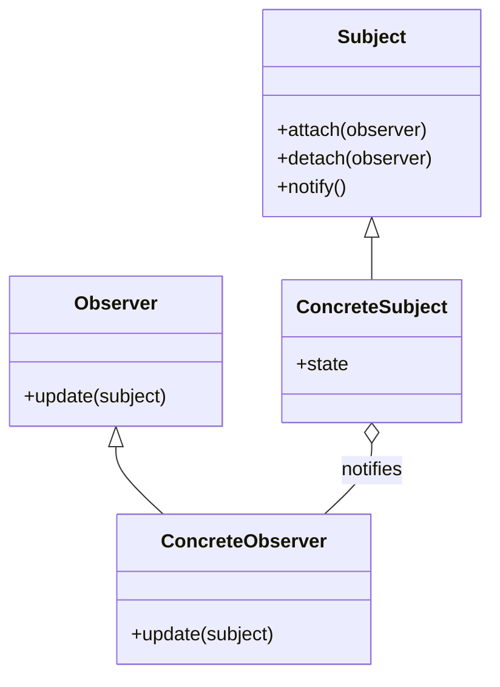

## 5.7.1 Implementing Observer in Python

The Observer Pattern is a fundamental design pattern in software development that allows an object, known as the subject, to maintain a list of dependents, called observers, and automatically notify them of any state changes. This pattern is particularly useful in scenarios where a change in one object requires changes in others, and it promotes a loose coupling between the subject and its observers.

### Understanding the Observer Pattern

The Observer Pattern is a behavioral design pattern that establishes a one-to-many relationship between objects. When the state of the subject changes, all its observers are notified and updated automatically. This pattern is widely used in event handling systems, such as GUI frameworks, where changes in the state of a component need to be reflected in other components.

#### Key Concepts

- **Subject**: The core entity whose state changes are of interest. It maintains a list of observers and provides methods to attach or detach them.
- **Observer**: An entity that needs to be informed about changes in the subject. It implements an update method that gets called when the subject's state changes.
- **Notification Mechanism**: The process by which the subject informs observers about state changes. This can be synchronous or asynchronous.

### Implementing the Observer Pattern in Python

#### Step 1: Define the Subject Class

The subject class is responsible for maintaining a list of observers and notifying them of any state changes. It typically provides methods to attach and detach observers.

```python
class Subject:
    def __init__(self):
        self._observers = []

    def attach(self, observer):
        if observer not in self._observers:
            self._observers.append(observer)

    def detach(self, observer):
        try:
            self._observers.remove(observer)
        except ValueError:
            pass

    def notify(self):
        for observer in self._observers:
            observer.update(self)
```

- **attach**: Adds an observer to the list if it's not already present.
- **detach**: Removes an observer from the list.
- **notify**: Calls the update method on each observer, passing itself as an argument.

#### Step 2: Define the Observer Class

The observer class implements an update method that gets called when the subject's state changes. This method is responsible for handling the notification.

```python
class Observer:
    def update(self, subject):
        pass
```

The `update` method is a placeholder and should be overridden by concrete observer implementations.

#### Step 3: Create Concrete Subject and Observer Classes

Here's an example of a concrete subject and observer implementation:

```python
class ConcreteSubject(Subject):
    def __init__(self, state=None):
        super().__init__()
        self._state = state

    @property
    def state(self):
        return self._state

    @state.setter
    def state(self, value):
        self._state = value
        self.notify()

class ConcreteObserver(Observer):
    def update(self, subject):
        print(f"Observer: Reacted to the state change: {subject.state}")
```

- **ConcreteSubject**: Inherits from `Subject` and adds a state property. When the state changes, it calls `notify` to update observers.
- **ConcreteObserver**: Inherits from `Observer` and implements the `update` method to react to state changes.

#### Step 4: Demonstrate the Observer Pattern

Let's see the Observer Pattern in action with a simple example:

```python
def main():
    subject = ConcreteSubject()

    observer1 = ConcreteObserver()
    observer2 = ConcreteObserver()

    subject.attach(observer1)
    subject.attach(observer2)

    subject.state = "New State 1"
    subject.state = "New State 2"

if __name__ == "__main__":
    main()
```

In this example, two observers are attached to the subject. When the subject's state changes, both observers are notified and react accordingly.

### Notification Mechanisms: Synchronous vs. Asynchronous

The Observer Pattern can be implemented using either synchronous or asynchronous notification mechanisms.

- **Synchronous Updates**: Observers are notified immediately when the subject's state changes. This is the simplest and most common approach.
- **Asynchronous Updates**: Observers are notified at a later time, allowing the subject to continue processing without waiting for observers to complete their updates. This can be achieved using threads or asynchronous programming techniques.

#### Asynchronous Notification Example

Here's how you might implement asynchronous notifications using Python's `threading` module:

```python
import threading

class AsyncSubject(Subject):
    def notify(self):
        for observer in self._observers:
            threading.Thread(target=observer.update, args=(self,)).start()
```

In this example, each observer's update method is called in a separate thread, allowing notifications to occur asynchronously.

### Leveraging Python Features

Python offers several features that can enhance the implementation of the Observer Pattern, such as decorators and context managers.

#### Using Decorators to Manage Observers

Decorators can be used to simplify the process of attaching and detaching observers. Here's an example:

```python
def observer(func):
    def wrapper(subject, *args, **kwargs):
        observer_instance = func(subject, *args, **kwargs)
        subject.attach(observer_instance)
        return observer_instance
    return wrapper

class DecoratedObserver(Observer):
    @observer
    def __init__(self, subject):
        self.subject = subject

    def update(self, subject):
        print(f"DecoratedObserver: Reacted to the state change: {subject.state}")
```

In this example, the `observer` decorator automatically attaches the observer to the subject when it is instantiated.

#### Using Context Managers for Observer Management

Context managers can be used to manage the lifecycle of observers, ensuring they are properly attached and detached:

```python
from contextlib import contextmanager

@contextmanager
def manage_observer(subject, observer):
    subject.attach(observer)
    try:
        yield
    finally:
        subject.detach(observer)

def main():
    subject = ConcreteSubject()
    observer = ConcreteObserver()

    with manage_observer(subject, observer):
        subject.state = "Temporary State"
```

In this example, the observer is automatically detached when the context manager exits, ensuring proper cleanup.

### Visualizing the Observer Pattern

To better understand the relationships between the subject and its observers, let's visualize the Observer Pattern using a class diagram.



This diagram illustrates the inheritance relationships and the notification mechanism between the `ConcreteSubject` and `ConcreteObserver`.

### Try It Yourself

Experiment with the Observer Pattern by modifying the code examples:

- **Add More Observers**: Create additional observer classes with different behaviors and attach them to the subject.
- **Implement Asynchronous Updates**: Use Python's `asyncio` module to implement asynchronous notifications.
- **Use Decorators**: Try using decorators to manage observer attachment and detachment.

### Knowledge Check

- **What is the primary purpose of the Observer Pattern?**
- **How does the subject notify its observers of state changes?**
- **What are the benefits of using asynchronous notifications?**

### Summary

In this section, we've explored the Observer Pattern and its implementation in Python. We've covered the roles of subjects and observers, the notification mechanism, and how Python features like decorators and context managers can enhance the pattern. By understanding and applying the Observer Pattern, you can create systems that are more modular, flexible, and responsive to changes.

Remember, this is just the beginning. As you progress, you'll build more complex and interactive systems. Keep experimenting, stay curious, and enjoy the journey!

## Quiz Time!



### What is the primary role of the Subject in the Observer Pattern?

- [x] To maintain a list of observers and notify them of state changes.
- [ ] To implement the update method.
- [ ] To handle user input in a GUI application.
- [ ] To manage database connections.

> **Explanation:** The Subject is responsible for maintaining a list of observers and notifying them when its state changes.

### How does the Observer Pattern promote loose coupling?

- [x] By allowing subjects and observers to interact without knowing each other's details.
- [ ] By using inheritance to share common behavior.
- [ ] By requiring all observers to be of the same type.
- [ ] By enforcing a strict order of operations.

> **Explanation:** The Observer Pattern allows subjects and observers to interact without being tightly coupled, as observers only need to implement an update method.

### Which Python feature can be used to manage the lifecycle of observers?

- [x] Context managers
- [ ] List comprehensions
- [ ] Lambda functions
- [ ] String formatting

> **Explanation:** Context managers can be used to manage the lifecycle of observers, ensuring they are properly attached and detached.

### What is a potential benefit of using asynchronous notifications in the Observer Pattern?

- [x] It allows the subject to continue processing without waiting for observers.
- [ ] It simplifies the implementation of the update method.
- [ ] It ensures all observers are notified in a specific order.
- [ ] It reduces the number of observers needed.

> **Explanation:** Asynchronous notifications allow the subject to continue processing without waiting for observers to complete their updates.

### In the Observer Pattern, what is the purpose of the update method?

- [x] To define how an observer reacts to changes in the subject.
- [ ] To initialize the state of the subject.
- [ ] To manage the list of observers.
- [ ] To handle user input.

> **Explanation:** The update method is implemented by observers to define how they react to changes in the subject.

### Which of the following is a common use case for the Observer Pattern?

- [x] Event handling systems
- [ ] Sorting algorithms
- [ ] Data serialization
- [ ] Memory management

> **Explanation:** The Observer Pattern is commonly used in event handling systems, where changes in one component need to be reflected in others.

### How can decorators be used in the Observer Pattern?

- [x] To simplify the process of attaching and detaching observers.
- [ ] To format strings in observer notifications.
- [ ] To manage memory allocation for observers.
- [ ] To handle exceptions in the update method.

> **Explanation:** Decorators can be used to simplify the process of attaching and detaching observers by automatically managing these actions.

### What is the relationship between ConcreteSubject and ConcreteObserver in the Observer Pattern?

- [x] ConcreteSubject notifies ConcreteObserver of state changes.
- [ ] ConcreteObserver manages the state of ConcreteSubject.
- [ ] ConcreteSubject inherits from ConcreteObserver.
- [ ] ConcreteObserver is a subclass of ConcreteSubject.

> **Explanation:** In the Observer Pattern, ConcreteSubject notifies ConcreteObserver of state changes, allowing the observer to react accordingly.

### True or False: The Observer Pattern can only be implemented using synchronous notifications.

- [ ] True
- [x] False

> **Explanation:** The Observer Pattern can be implemented using either synchronous or asynchronous notifications, depending on the requirements.

### Which method in the Subject class is responsible for notifying observers?

- [x] notify
- [ ] attach
- [ ] detach
- [ ] update

> **Explanation:** The notify method in the Subject class is responsible for notifying all attached observers of state changes.


