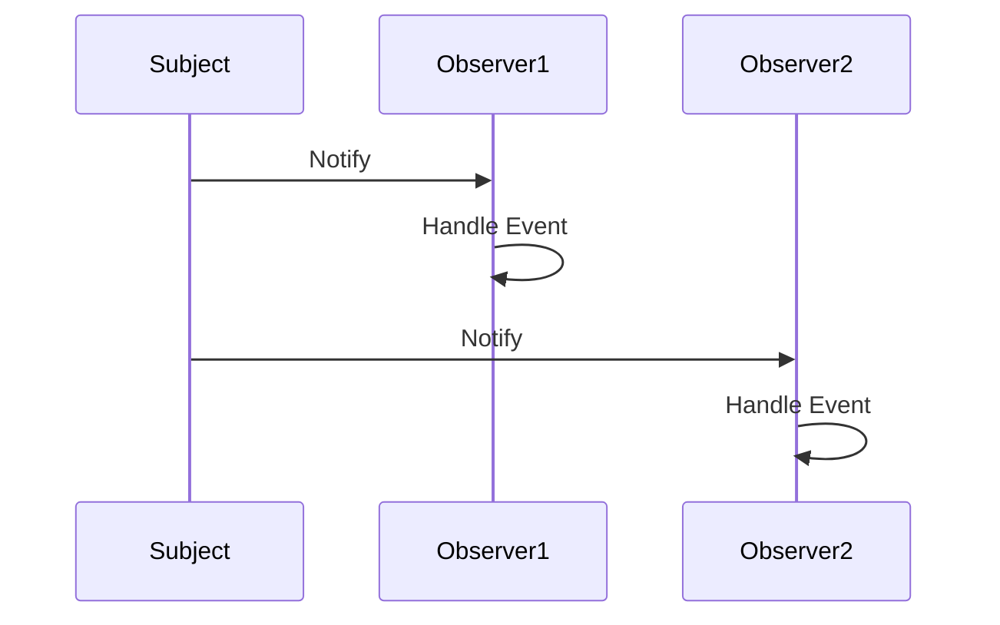

## 5.7.2 Event Handling

In the realm of software design, the Observer Pattern stands out as a powerful tool for managing changes and updates across different components of a system. At the heart of this pattern lies the concept of event handling. This section delves into how event handling integrates with the Observer Pattern, providing practical examples, discussing event loop integration, and highlighting key considerations for effective implementation.

### Understanding Event Handling in the Observer Pattern

Event handling is a core concept in the Observer Pattern, where subjects (also known as observables) emit events, and observers respond to these events. This mechanism allows for a decoupled architecture where components can react to changes without being tightly bound to the source of the change.

#### How Event Handling Fits with the Observer Pattern

In the Observer Pattern, the subject maintains a list of observers and notifies them of any state changes, typically by calling one of their methods. This notification is akin to an event being emitted by the subject and handled by the observers. The observers, in turn, execute their logic in response to the event.

**Key Components:**

- **Subject (Observable):** The entity that holds the state and emits events when changes occur.
- **Observer:** The entity that listens for events and reacts accordingly.
- **Event:** The signal emitted by the subject indicating a change or action that observers should respond to.

### Practical Examples of Event Handling

To illustrate the concept of event handling within the Observer Pattern, let's explore some practical examples.

#### Example 1: GUI Button Clicks

Graphical User Interfaces (GUIs) often rely on event handling to manage user interactions. Consider a simple button click event in a GUI application.

```python
class Button:
    def __init__(self):
        self._observers = []

    def click(self):
        print("Button clicked!")
        self._notify_observers()

    def add_observer(self, observer):
        self._observers.append(observer)

    def _notify_observers(self):
        for observer in self._observers:
            observer.update()

class ButtonClickHandler:
    def update(self):
        print("Button click handled.")

button = Button()
click_handler = ButtonClickHandler()
button.add_observer(click_handler)
button.click()
```

**Explanation:**

- **Button Class:** Acts as the subject, emitting a "click" event.
- **ButtonClickHandler Class:** Acts as the observer, handling the click event by printing a message.

#### Example 2: File System Watchers

File system watchers monitor changes in the file system and notify observers of any modifications.

```python
import os
import time

class FileWatcher:
    def __init__(self, file_path):
        self.file_path = file_path
        self._observers = []
        self._last_modified = os.path.getmtime(file_path)

    def watch(self):
        while True:
            current_modified = os.path.getmtime(self.file_path)
            if current_modified != self._last_modified:
                self._last_modified = current_modified
                self._notify_observers()
            time.sleep(1)

    def add_observer(self, observer):
        self._observers.append(observer)

    def _notify_observers(self):
        for observer in self._observers:
            observer.update(self.file_path)

class FileChangeHandler:
    def update(self, file_path):
        print(f"File {file_path} has been modified.")

file_watcher = FileWatcher("example.txt")
file_change_handler = FileChangeHandler()
file_watcher.add_observer(file_change_handler)
file_watcher.watch()
```

**Explanation:**

- **FileWatcher Class:** Monitors a file for changes and emits an event when a modification is detected.
- **FileChangeHandler Class:** Responds to the file modification event by printing a message.

### Event Loop Integration

Event loops are a fundamental component of event-driven architectures, allowing for asynchronous event handling. In Python, the `asyncio` library provides a robust framework for integrating event loops.

#### Integrating Observers with Event Loops

By leveraging `asyncio`, we can create observers that handle events asynchronously, improving the responsiveness and scalability of applications.

```python
import asyncio

class AsyncButton:
    def __init__(self):
        self._observers = []

    async def click(self):
        print("Button clicked!")
        await self._notify_observers()

    def add_observer(self, observer):
        self._observers.append(observer)

    async def _notify_observers(self):
        for observer in self._observers:
            await observer.update()

class AsyncButtonClickHandler:
    async def update(self):
        print("Button click handled asynchronously.")

async def main():
    button = AsyncButton()
    click_handler = AsyncButtonClickHandler()
    button.add_observer(click_handler)
    await button.click()

asyncio.run(main())
```

**Explanation:**

- **AsyncButton Class:** Utilizes asynchronous methods to emit events.
- **AsyncButtonClickHandler Class:** Handles events asynchronously, allowing for non-blocking execution.

### Considerations for Effective Event Handling

When implementing event handling within the Observer Pattern, several considerations can enhance the robustness and maintainability of your system.

#### Handling Exceptions in Observers

Observers may encounter exceptions during event handling. It's crucial to handle these exceptions gracefully to prevent disruptions in the event flow.

```python
class ResilientObserver:
    def update(self):
        try:
            # Simulate potential exception
            raise ValueError("An error occurred")
        except Exception as e:
            print(f"Exception handled: {e}")

resilient_observer = ResilientObserver()
resilient_observer.update()
```

**Explanation:**

- **ResilientObserver Class:** Demonstrates exception handling within an observer to ensure continuity in event processing.

#### Event Propagation

In complex systems, events may need to propagate through multiple layers of observers. Managing this propagation effectively is essential to avoid redundant processing and ensure timely responses.

**Strategies for Event Propagation:**

- **Event Bubbling:** Events propagate from the source to the root, allowing each observer to handle the event in sequence.
- **Event Capturing:** Events propagate from the root to the source, enabling early interception and handling.

### Visualizing Event Handling

To better understand the flow of events in the Observer Pattern, let's visualize the process using a sequence diagram.



**Diagram Explanation:**

- **Subject:** Emits notifications to observers.
- **Observer1 and Observer2:** Independently handle the events, demonstrating the decoupled nature of the Observer Pattern.

### Try It Yourself

Experiment with the provided examples by modifying the observers' behavior or adding new observers to the subjects. Consider implementing additional event types or integrating more complex event loops using `asyncio`.

### Knowledge Check

Before proceeding, take a moment to reflect on the following questions:

- How does the Observer Pattern facilitate event handling in a decoupled manner?
- What are the benefits of integrating event loops with observers in Python?
- How can exception handling improve the robustness of event-driven systems?

### Conclusion

Event handling is a cornerstone of the Observer Pattern, enabling dynamic and responsive software architectures. By understanding the integration of event loops, managing exceptions, and visualizing event propagation, you can harness the full potential of event-driven design in Python.

Remember, this is just the beginning. As you progress, you'll build more complex and interactive systems. Keep experimenting, stay curious, and enjoy the journey!

## Quiz Time!



### What is the primary role of the Subject in the Observer Pattern?

- [x] To emit events and notify observers of changes.
- [ ] To handle events and perform actions.
- [ ] To store data and manage state.
- [ ] To execute business logic independently.

> **Explanation:** The Subject's primary role is to emit events and notify observers of any changes, allowing them to react accordingly.

### How does the Observer Pattern facilitate decoupled architecture?

- [x] By allowing observers to react to events without being tightly bound to the subject.
- [ ] By integrating business logic directly into the subject.
- [ ] By storing all application data in a single location.
- [ ] By requiring observers to manage the subject's state.

> **Explanation:** The Observer Pattern allows observers to react to events without being tightly coupled to the subject, promoting a decoupled architecture.

### What is the purpose of an event loop in event-driven architectures?

- [x] To manage asynchronous event handling and improve responsiveness.
- [ ] To store application data and manage state.
- [ ] To execute business logic in a sequential manner.
- [ ] To handle exceptions and errors in the system.

> **Explanation:** An event loop manages asynchronous event handling, improving the responsiveness and scalability of event-driven architectures.

### Which Python library provides a framework for integrating event loops?

- [x] `asyncio`
- [ ] `os`
- [ ] `sys`
- [ ] `json`

> **Explanation:** The `asyncio` library provides a robust framework for integrating event loops in Python.

### What is a key consideration when implementing observers?

- [x] Handling exceptions to ensure continuity in event processing.
- [ ] Storing all application data within the observer.
- [ ] Integrating business logic directly into the observer.
- [ ] Managing the subject's state independently.

> **Explanation:** Handling exceptions within observers is crucial to ensure continuity in event processing and prevent disruptions.

### What is event bubbling?

- [x] A strategy where events propagate from the source to the root.
- [ ] A method for storing data within the subject.
- [ ] A technique for managing state in observers.
- [ ] A process for executing business logic sequentially.

> **Explanation:** Event bubbling is a strategy where events propagate from the source to the root, allowing each observer to handle the event in sequence.

### How can event propagation be managed effectively?

- [x] By using strategies like event bubbling and capturing.
- [ ] By storing all events in a single location.
- [ ] By integrating business logic directly into the subject.
- [ ] By requiring observers to manage the subject's state.

> **Explanation:** Event propagation can be managed effectively using strategies like event bubbling and capturing.

### What is the benefit of using asynchronous observers?

- [x] Improved responsiveness and non-blocking execution.
- [ ] Simplified state management within the subject.
- [ ] Direct integration of business logic into the observer.
- [ ] Enhanced data storage capabilities.

> **Explanation:** Asynchronous observers improve responsiveness and allow for non-blocking execution, enhancing the system's performance.

### Which of the following is a practical example of event handling?

- [x] GUI button clicks
- [ ] Data storage in a database
- [ ] Sequential execution of business logic
- [ ] Static file serving in a web server

> **Explanation:** GUI button clicks are a practical example of event handling, where user interactions trigger events that observers handle.

### True or False: Event handling in the Observer Pattern requires tight coupling between subjects and observers.

- [ ] True
- [x] False

> **Explanation:** False. Event handling in the Observer Pattern promotes decoupling, allowing observers to react to events without being tightly bound to the subject.


