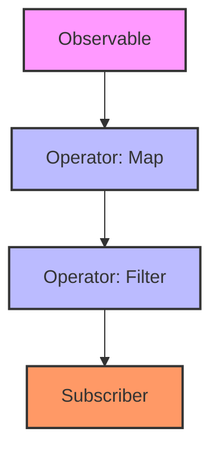

## 5.7.3 Using `Observable` in Python

In the world of software development, handling asynchronous data streams efficiently is crucial, especially in applications requiring real-time data processing. This is where the concept of **Observables** comes into play. Observables are a powerful tool in reactive programming, offering a way to work with asynchronous data streams and events. In this section, we will delve into the concept of observables, how they differ from traditional observers, and how to implement them in Python using the `RxPy` library.

### Introduction to Observables

Observables are a key component of reactive programming, a paradigm that focuses on asynchronous data streams and the propagation of change. Unlike traditional observer patterns, where observers are notified of changes in a subject, observables provide a more flexible and powerful approach to handling data streams.

#### Key Characteristics of Observables

- **Asynchronous Data Streams**: Observables allow you to work with data that arrives over time, such as user inputs, network requests, or sensor data.
- **Push-Based Model**: Unlike the pull-based model of iterators, observables push data to subscribers as it becomes available.
- **Composability**: Observables can be combined, filtered, and transformed using a variety of operators, making them highly composable.

### Observables vs. Traditional Observers

While both observables and traditional observers deal with the concept of change notification, they differ in several key aspects:

- **Data Flow**: Observables represent a stream of data over time, whereas traditional observers typically respond to discrete events.
- **Composability**: Observables can be easily combined and transformed, allowing for complex data processing pipelines.
- **Error Handling**: Observables provide built-in mechanisms for handling errors in data streams, making them more robust.

### Implementing Observables in Python with RxPy

`RxPy` is a Python library that brings the power of Reactive Extensions (Rx) to Python, enabling you to work with observables and asynchronous data streams effectively. Let's explore how to use `RxPy` to implement observables in Python.

#### Installing RxPy

Before we dive into code examples, ensure you have `RxPy` installed in your Python environment. You can install it using pip:

```bash
pip install rx
```

#### Creating a Simple Observable

Let's start by creating a simple observable that emits a sequence of numbers:

```python
import rx
from rx import operators as ops

observable = rx.from_([1, 2, 3, 4, 5])

observable.subscribe(lambda x: print(f"Received: {x}"))
```

In this example, we use `rx.from_` to create an observable from a list of numbers. We then subscribe to the observable, printing each item as it is emitted.

#### Transforming Data with Operators

One of the strengths of observables is their ability to transform data using operators. Let's see how we can use operators to manipulate data streams:

```python
observable = rx.from_([1, 2, 3, 4, 5])

squared_observable = observable.pipe(
    ops.map(lambda x: x ** 2)
)

squared_observable.subscribe(lambda x: print(f"Squared: {x}"))
```

Here, we use the `map` operator to transform each emitted item by squaring it. The `pipe` method allows us to chain multiple operators together, creating a data processing pipeline.

### Handling Asynchronous Data Streams

Observables excel at handling asynchronous data streams, such as real-time data feeds. Let's implement a simple real-time data feed using `RxPy`.

#### Simulating a Real-Time Data Feed

We'll simulate a real-time data feed by emitting random numbers at regular intervals:

```python
import rx
from rx import operators as ops
from rx.scheduler import ThreadPoolScheduler
import time
import random

scheduler = ThreadPoolScheduler(1)

observable = rx.interval(1.0).pipe(
    ops.map(lambda _: random.randint(1, 100))
)

observable.subscribe(
    lambda x: print(f"Real-time data: {x}"),
    scheduler=scheduler
)

time.sleep(10)
```

In this example, we use `rx.interval` to create an observable that emits items at regular intervals. We then use the `map` operator to generate random numbers. The `ThreadPoolScheduler` allows us to run the observable on a separate thread, ensuring it doesn't block the main thread.

### Advanced Topics: Combining and Filtering Observables

Observables can be combined and filtered to create complex data processing pipelines. Let's explore some advanced techniques for working with observables.

#### Combining Observables

You can combine multiple observables using operators like `merge`, `concat`, and `zip`. Here's an example of combining two observables:

```python
observable1 = rx.from_([1, 2, 3])
observable2 = rx.from_([4, 5, 6])

combined_observable = rx.merge(observable1, observable2)

combined_observable.subscribe(lambda x: print(f"Combined: {x}"))
```

In this example, we use the `merge` operator to combine two observables into a single stream.

#### Filtering Data Streams

Filtering allows you to selectively process items in a data stream. Here's how you can filter a data stream using the `filter` operator:

```python
observable = rx.from_([1, 2, 3, 4, 5, 6, 7, 8, 9, 10])

filtered_observable = observable.pipe(
    ops.filter(lambda x: x % 2 == 0)
)

filtered_observable.subscribe(lambda x: print(f"Even number: {x}"))
```

In this example, we use the `filter` operator to allow only even numbers to pass through the data stream.

### Visualizing Observables and Data Flow

To better understand how observables work, let's visualize the data flow using a flowchart.



In this flowchart, we see an observable emitting data, which is then transformed by a `map` operator, filtered by a `filter` operator, and finally consumed by a subscriber.

### Benefits of Using Observables

Observables offer several benefits, especially in applications dealing with asynchronous data streams:

- **Simplified Asynchronous Programming**: Observables provide a unified approach to handling asynchronous data, reducing the complexity of managing callbacks and promises.
- **Composability**: The ability to combine and transform observables makes it easy to build complex data processing pipelines.
- **Error Handling**: Observables come with built-in error handling mechanisms, allowing you to gracefully handle errors in data streams.
- **Scalability**: Observables can efficiently handle large volumes of data, making them suitable for real-time applications.

### Try It Yourself

Now that we've covered the basics of using observables in Python, try experimenting with the code examples. Here are some suggestions for modifications:

- **Modify the Data Feed**: Change the interval or the range of random numbers in the real-time data feed example.
- **Combine More Observables**: Create additional observables and combine them using different operators.
- **Filter Complex Data**: Implement a more complex filtering logic, such as filtering based on multiple conditions.

### Advanced Topics: Combining Observables, Filtering Data Streams

As you become more comfortable with observables, you can explore advanced topics such as combining multiple observables and filtering data streams. These techniques allow you to create sophisticated data processing pipelines.

#### Combining Observables

Combining observables is a powerful technique that enables you to merge multiple data streams into a single observable. This can be useful when you have multiple sources of data that need to be processed together.

```python
observable1 = rx.from_([1, 2, 3])
observable2 = rx.from_([4, 5, 6])

combined_observable = rx.merge(observable1, observable2)

combined_observable.subscribe(lambda x: print(f"Combined: {x}"))
```

In this example, we use the `merge` operator to combine two observables into a single stream. The `merge` operator emits items from both observables as they become available.

#### Filtering Data Streams

Filtering data streams allows you to selectively process items based on specific criteria. This can be useful when you only want to process certain types of data or when you need to reduce the volume of data being processed.

```python
observable = rx.from_([1, 2, 3, 4, 5, 6, 7, 8, 9, 10])

filtered_observable = observable.pipe(
    ops.filter(lambda x: x % 2 == 0)
)

filtered_observable.subscribe(lambda x: print(f"Even number: {x}"))
```

In this example, we use the `filter` operator to allow only even numbers to pass through the data stream. The `filter` operator applies a predicate function to each item in the stream, only allowing items that satisfy the predicate to be emitted.

### Knowledge Check

To reinforce your understanding of observables and their use in Python, consider the following questions:

- What are the key differences between observables and traditional observers?
- How can you transform data streams using operators in `RxPy`?
- What are some benefits of using observables in asynchronous programming?

### Conclusion

Observables are a powerful tool in reactive programming, offering a flexible and efficient way to handle asynchronous data streams. By leveraging the capabilities of `RxPy`, you can create complex data processing pipelines, handle errors gracefully, and build scalable applications. As you continue to explore observables, experiment with different operators and techniques to fully harness their potential.

Remember, this is just the beginning. As you progress, you'll build more complex and interactive applications. Keep experimenting, stay curious, and enjoy the journey!

## Quiz Time!



### What is a key characteristic of observables?

- [x] They represent asynchronous data streams.
- [ ] They are synchronous by nature.
- [ ] They cannot be combined.
- [ ] They do not support error handling.

> **Explanation:** Observables represent asynchronous data streams, allowing you to work with data that arrives over time.

### How do observables differ from traditional observers?

- [x] Observables provide a stream of data over time.
- [ ] Observables are only used for synchronous data.
- [ ] Observables cannot be transformed.
- [ ] Observables do not support error handling.

> **Explanation:** Observables provide a stream of data over time, whereas traditional observers typically respond to discrete events.

### Which library is used to implement observables in Python?

- [x] RxPy
- [ ] NumPy
- [ ] Pandas
- [ ] Matplotlib

> **Explanation:** RxPy is a Python library that brings the power of Reactive Extensions (Rx) to Python, enabling you to work with observables.

### What operator is used to transform data in an observable?

- [x] map
- [ ] filter
- [ ] reduce
- [ ] merge

> **Explanation:** The `map` operator is used to transform data in an observable by applying a function to each emitted item.

### How can you combine multiple observables?

- [x] Using the merge operator
- [ ] Using the map operator
- [ ] Using the filter operator
- [ ] Using the reduce operator

> **Explanation:** The `merge` operator is used to combine multiple observables into a single stream.

### What is a benefit of using observables?

- [x] Simplified handling of asynchronous data streams
- [ ] Increased complexity in error handling
- [ ] Reduced composability
- [ ] Limited scalability

> **Explanation:** Observables simplify the handling of asynchronous data streams, reducing the complexity of managing callbacks and promises.

### How can you filter data streams in an observable?

- [x] Using the filter operator
- [ ] Using the map operator
- [ ] Using the merge operator
- [ ] Using the reduce operator

> **Explanation:** The `filter` operator is used to selectively process items in a data stream based on specific criteria.

### What does the `interval` function do in RxPy?

- [x] Emits items at regular intervals
- [ ] Combines multiple observables
- [ ] Transforms data in an observable
- [ ] Filters data streams

> **Explanation:** The `interval` function in RxPy creates an observable that emits items at regular intervals.

### What is the purpose of the `ThreadPoolScheduler` in RxPy?

- [x] To run the observable on a separate thread
- [ ] To combine multiple observables
- [ ] To transform data in an observable
- [ ] To filter data streams

> **Explanation:** The `ThreadPoolScheduler` allows you to run the observable on a separate thread, ensuring it doesn't block the main thread.

### True or False: Observables can only handle synchronous data streams.

- [ ] True
- [x] False

> **Explanation:** False. Observables are designed to handle asynchronous data streams, allowing you to work with data that arrives over time.


