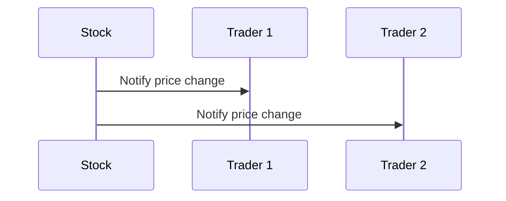

## 5.7.4 Use Cases and Examples

The Observer pattern is a powerful behavioral design pattern that establishes a one-to-many relationship between objects. When the state of one object changes, all its dependents are notified and updated automatically. This pattern is particularly useful in scenarios where changes to one object need to be reflected across multiple others without tightly coupling them. In this section, we will explore practical applications of the Observer pattern in Python, focusing on two detailed examples: a Stock Market Ticker and Notification Systems.

### Understanding the Observer Pattern

Before diving into the examples, let's briefly recap the core components of the Observer pattern:

- **Subject**: The object that holds the state and notifies observers of changes.
- **Observer**: The object that wants to be informed about changes in the subject.
- **ConcreteSubject**: A specific implementation of the subject.
- **ConcreteObserver**: A specific implementation of the observer that reacts to changes in the subject.

The Observer pattern is widely used in various domains, such as GUI toolkits, event handling systems, and real-time data feeds. It promotes loose coupling and enhances the flexibility and scalability of a system.

### Example 1: Stock Market Ticker

In the world of finance, stock prices fluctuate constantly, and traders need to be updated in real-time. The Observer pattern is an ideal fit for implementing a Stock Market Ticker, where multiple observers (traders, analysts, applications) need to be notified whenever a stock price changes.

#### Implementing a Stock Market Ticker

Let's implement a simple Stock Market Ticker using the Observer pattern in Python. We'll create a `Stock` class as the subject and a `StockObserver` class as the observer.

```python
class Stock:
    def __init__(self, name, price):
        self._name = name
        self._price = price
        self._observers = []

    def attach(self, observer):
        if observer not in self._observers:
            self._observers.append(observer)

    def detach(self, observer):
        try:
            self._observers.remove(observer)
        except ValueError:
            pass

    def notify(self):
        for observer in self._observers:
            observer.update(self)

    @property
    def price(self):
        return self._price

    @price.setter
    def price(self, new_price):
        if new_price != self._price:
            self._price = new_price
            self.notify()

class StockObserver:
    def __init__(self, name):
        self._name = name

    def update(self, stock):
        print(f"{self._name} notified. {stock._name} price changed to {stock.price}")

apple_stock = Stock('Apple', 150)
trader1 = StockObserver('Trader 1')
trader2 = StockObserver('Trader 2')

apple_stock.attach(trader1)
apple_stock.attach(trader2)

apple_stock.price = 155
apple_stock.price = 160
```

**Explanation:**

- **Stock Class**: Acts as the subject. It maintains a list of observers and notifies them when the stock price changes.
- **StockObserver Class**: Represents an observer that gets notified of stock price changes.
- **Usage**: We create a `Stock` object for Apple and attach two `StockObserver` instances. When the stock price changes, both observers are notified.

#### Outcomes and Benefits

- **Improved Responsiveness**: Observers are updated in real-time, ensuring that traders have the latest information.
- **Decoupled Components**: Observers and the subject are loosely coupled, allowing for flexible system design and easy addition or removal of observers.

### Example 2: Notification Systems

Notification systems are ubiquitous in modern applications, providing users with timely updates on various events. The Observer pattern is well-suited for implementing such systems, where multiple users (observers) need to be notified of events (subject).

#### Implementing a Notification System

Let's create a simple notification system using the Observer pattern. We'll have a `NotificationService` as the subject and `User` as the observer.

```python
class NotificationService:
    def __init__(self):
        self._observers = []

    def subscribe(self, observer):
        if observer not in self._observers:
            self._observers.append(observer)

    def unsubscribe(self, observer):
        try:
            self._observers.remove(observer)
        except ValueError:
            pass

    def notify(self, message):
        for observer in self._observers:
            observer.update(message)

class User:
    def __init__(self, username):
        self._username = username

    def update(self, message):
        print(f"Notification for {self._username}: {message}")

notification_service = NotificationService()
user1 = User('Alice')
user2 = User('Bob')

notification_service.subscribe(user1)
notification_service.subscribe(user2)

notification_service.notify("New event available!")
notification_service.notify("Your subscription is about to expire.")
```

**Explanation:**

- **NotificationService Class**: Acts as the subject. It maintains a list of users (observers) and notifies them of new messages.
- **User Class**: Represents an observer that receives notifications.
- **Usage**: We create a `NotificationService` and subscribe two `User` instances. When a notification is sent, both users receive the message.

#### Outcomes and Benefits

- **Enhanced User Engagement**: Users receive timely updates, keeping them informed and engaged.
- **Scalable System**: New users can be easily added or removed from the notification list without affecting the system's core functionality.

### Try It Yourself

Now that we've explored two examples of the Observer pattern, let's encourage you to try implementing it in your projects. Consider the following ideas:

- **Weather Monitoring System**: Create a system where weather stations (subjects) update multiple displays (observers) with the latest weather data.
- **Chat Application**: Implement a chat application where users (observers) receive messages from chat rooms (subjects) they are subscribed to.

### Visualizing the Observer Pattern

To better understand the flow of the Observer pattern, let's visualize it using a sequence diagram.



**Diagram Description**: This sequence diagram illustrates the notification process in the Stock Market Ticker example. When the stock price changes, the `Stock` object notifies all attached observers (`Trader 1` and `Trader 2`).

### References and Further Reading

- [Observer Pattern - Wikipedia](https://en.wikipedia.org/wiki/Observer_pattern)
- [Python Design Patterns - GeeksforGeeks](https://www.geeksforgeeks.org/python-design-patterns/)
- [Observer Pattern - Refactoring Guru](https://refactoring.guru/design-patterns/observer)

### Knowledge Check

To reinforce your understanding of the Observer pattern, consider the following questions:

- How does the Observer pattern promote loose coupling in a system?
- What are some potential drawbacks of using the Observer pattern?
- How can you ensure that observers are notified in a specific order?

### Embrace the Journey

Remember, mastering design patterns is a journey. As you continue to explore and implement the Observer pattern, you'll discover new ways to enhance your applications' responsiveness and scalability. Keep experimenting, stay curious, and enjoy the journey!

## Quiz Time!



### Which component in the Observer pattern is responsible for notifying observers?

- [x] Subject
- [ ] Observer
- [ ] ConcreteObserver
- [ ] ConcreteSubject

> **Explanation:** The Subject is responsible for maintaining a list of observers and notifying them of any state changes.

### In the Stock Market Ticker example, what triggers the notification to observers?

- [x] Change in stock price
- [ ] Addition of a new observer
- [ ] Removal of an observer
- [ ] Initialization of the Stock object

> **Explanation:** Observers are notified when the stock price changes, as this is the event they are interested in.

### What is a key benefit of using the Observer pattern in a notification system?

- [x] Enhanced user engagement
- [ ] Increased system complexity
- [ ] Tightly coupled components
- [ ] Reduced scalability

> **Explanation:** The Observer pattern enhances user engagement by providing timely updates to users.

### How does the Observer pattern affect system scalability?

- [x] It improves scalability by allowing easy addition/removal of observers.
- [ ] It reduces scalability by tightly coupling components.
- [ ] It has no impact on scalability.
- [ ] It makes the system less scalable by increasing complexity.

> **Explanation:** The Observer pattern improves scalability by allowing observers to be added or removed without affecting the core system.

### What is a potential drawback of the Observer pattern?

- [x] Increased complexity in managing observers
- [ ] Reduced system responsiveness
- [ ] Tightly coupled components
- [ ] Limited flexibility in adding observers

> **Explanation:** Managing a large number of observers can increase system complexity.

### In the Notification System example, what role does the `User` class play?

- [x] Observer
- [ ] Subject
- [ ] ConcreteSubject
- [ ] ConcreteObserver

> **Explanation:** The `User` class acts as an observer that receives notifications from the `NotificationService`.

### How can you ensure observers are notified in a specific order?

- [x] Implement a priority mechanism in the subject.
- [ ] Randomize the order of notifications.
- [ ] Use a single observer at a time.
- [ ] Notify observers based on their creation order.

> **Explanation:** Implementing a priority mechanism allows you to control the order in which observers are notified.

### What is the main advantage of decoupling components using the Observer pattern?

- [x] Increased flexibility and maintainability
- [ ] Reduced system performance
- [ ] Tighter integration between components
- [ ] Simplified code structure

> **Explanation:** Decoupling components increases flexibility and maintainability by allowing independent changes.

### Which of the following is NOT a typical use case for the Observer pattern?

- [ ] Stock Market Ticker
- [ ] Notification Systems
- [x] Singleton Pattern
- [ ] Event Handling Systems

> **Explanation:** The Singleton pattern is not related to the Observer pattern; it ensures a class has only one instance.

### True or False: The Observer pattern is only applicable in real-time systems.

- [ ] True
- [x] False

> **Explanation:** The Observer pattern is applicable in various systems, not just real-time systems, as it provides a way to notify observers of changes.


