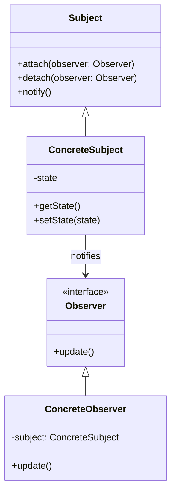
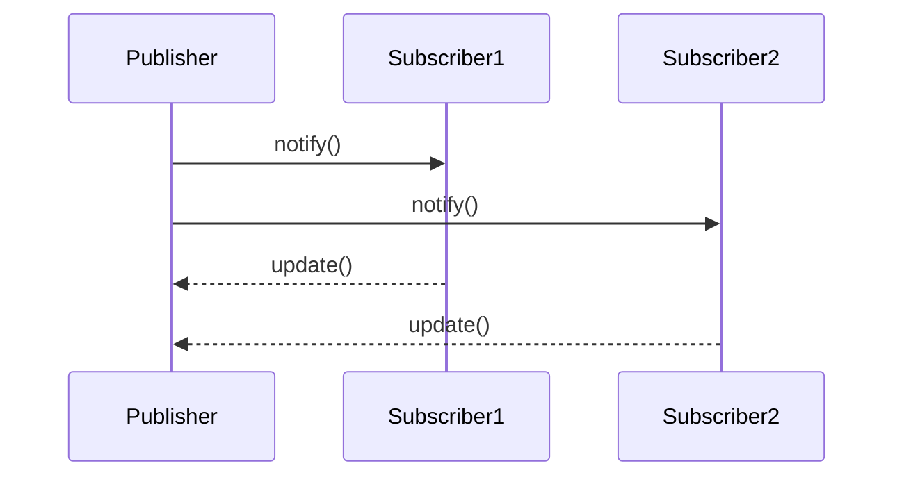

## 5.7 Observer Pattern

The Observer Pattern is a fundamental design pattern in software development, particularly useful for creating a one-to-many dependency between objects. This pattern is essential for ensuring that when one object changes state, all its dependents are notified and updated automatically. In this section, we will delve into the purpose of the Observer Pattern, its components, implementation in Python, use cases, challenges, and best practices.

### Purpose of the Observer Pattern

The primary purpose of the Observer Pattern is to establish a relationship between objects where a change in one object triggers updates in others. This pattern is crucial for decoupling the subject (the object being observed) from its observers (the objects that react to changes). By decoupling these components, the Observer Pattern promotes flexibility and reusability in software design.

#### Key Benefits:

- **Decoupling**: Subjects and observers are loosely coupled, allowing changes to one without affecting the other.
- **Scalability**: Easily add new observers without modifying the subject.
- **Reusability**: Observers can be reused across different subjects.

### Components of the Observer Pattern

The Observer Pattern consists of several key components:

1. **Subject**: The core component that maintains a list of observers and notifies them of any state changes.
2. **Observer**: An interface or abstract class that defines the update method, which is called when the subject changes.
3. **ConcreteSubject**: A specific implementation of the subject that holds the state and notifies observers when changes occur.
4. **ConcreteObserver**: A specific implementation of the observer that reacts to changes in the subject.

Let's visualize these components and their interactions:



### Implementing the Observer Pattern in Python

To illustrate the Observer Pattern in Python, we'll create a simple notification system where a `NewsPublisher` (subject) notifies `Subscribers` (observers) whenever a new article is published.

#### Step-by-Step Implementation

1. **Define the Observer Interface**

```python
class Subscriber:
    def update(self, article: str):
        pass
```

2. **Implement Concrete Observer**

```python
class EmailSubscriber(Subscriber):
    def __init__(self, email: str):
        self.email = email

    def update(self, article: str):
        print(f"Email to {self.email}: New article published - {article}")
```

3. **Define the Subject Interface**

```python
class Publisher:
    def __init__(self):
        self.subscribers = []

    def attach(self, subscriber: Subscriber):
        self.subscribers.append(subscriber)

    def detach(self, subscriber: Subscriber):
        self.subscribers.remove(subscriber)

    def notify(self, article: str):
        for subscriber in self.subscribers:
            subscriber.update(article)
```

4. **Implement Concrete Subject**

```python
class NewsPublisher(Publisher):
    def __init__(self):
        super().__init__()
        self.latest_article = None

    def publish_article(self, article: str):
        self.latest_article = article
        self.notify(article)
```

5. **Using the Observer Pattern**

```python
if __name__ == "__main__":
    news_publisher = NewsPublisher()

    email_subscriber1 = EmailSubscriber("subscriber1@example.com")
    email_subscriber2 = EmailSubscriber("subscriber2@example.com")

    news_publisher.attach(email_subscriber1)
    news_publisher.attach(email_subscriber2)

    news_publisher.publish_article("Observer Pattern in Python")

    news_publisher.detach(email_subscriber1)

    news_publisher.publish_article("Understanding Design Patterns")
```

### Implementing Observers in Python

Python provides several ways to implement the Observer Pattern, including using built-in libraries or custom implementations. The example above demonstrates a custom implementation. However, Python's `weakref` module can be used to manage references to observers, preventing memory leaks.

#### Using Weak References

```python
import weakref

class Publisher:
    def __init__(self):
        self.subscribers = weakref.WeakSet()

    def attach(self, subscriber: Subscriber):
        self.subscribers.add(subscriber)

    def detach(self, subscriber: Subscriber):
        self.subscribers.discard(subscriber)

    def notify(self, article: str):
        for subscriber in self.subscribers:
            subscriber.update(article)
```

### Use Cases for the Observer Pattern

The Observer Pattern is widely used in various applications, particularly in:

- **GUI Applications**: For updating the user interface in response to changes in the underlying data model.
- **Event-Driven Systems**: For handling events and notifications in a decoupled manner.
- **Real-Time Systems**: For monitoring and reacting to changes in real-time data.

### Challenges and Considerations

Implementing the Observer Pattern comes with its own set of challenges:

- **Managing Subscriptions**: Keeping track of active observers and ensuring they are notified correctly.
- **Preventing Memory Leaks**: Using weak references to avoid retaining observers that are no longer needed.
- **Thread Safety**: Ensuring that notifications are thread-safe, especially in multi-threaded applications.

### Best Practices for the Observer Pattern

To effectively implement the Observer Pattern, consider the following best practices:

- **Use Weak References**: Utilize Python's `weakref` module to manage observer references and prevent memory leaks.
- **Ensure Thread Safety**: Use locks or other synchronization mechanisms to ensure notifications are thread-safe.
- **Decouple Logic**: Keep observer logic separate from the subject to maintain flexibility and reusability.

### Try It Yourself

Experiment with the code examples provided by adding new types of subscribers, such as `SMSSubscriber` or `PushNotificationSubscriber`. Modify the `NewsPublisher` to handle different types of content, such as breaking news or sports updates, and observe how the system adapts to these changes.

### Visualizing the Observer Pattern

To further understand the Observer Pattern, let's visualize the flow of notifications using a sequence diagram:



This diagram illustrates how the `Publisher` notifies each `Subscriber`, which then updates itself based on the new information.

### Key Takeaways

- The Observer Pattern is essential for creating a one-to-many dependency between objects.
- It promotes decoupling, scalability, and reusability in software design.
- Python's `weakref` module can be used to manage observer references and prevent memory leaks.
- Thread safety is crucial when implementing the Observer Pattern in multi-threaded applications.

### References and Further Reading

- [Python Official Documentation](https://docs.python.org/3/library/weakref.html) on weak references.
- [Observer Pattern on Wikipedia](https://en.wikipedia.org/wiki/Observer_pattern) for a deeper understanding of its applications.
- [Design Patterns: Elements of Reusable Object-Oriented Software](https://en.wikipedia.org/wiki/Design_Patterns) by Erich Gamma et al.

## Quiz Time!



### What is the primary purpose of the Observer Pattern?

- [x] To establish a one-to-many dependency between objects.
- [ ] To create a one-to-one relationship between objects.
- [ ] To ensure objects are tightly coupled.
- [ ] To simplify the code structure.

> **Explanation:** The Observer Pattern is designed to create a one-to-many dependency so that when one object changes state, all its dependents are notified and updated automatically.

### Which component in the Observer Pattern maintains a list of observers?

- [x] Subject
- [ ] Observer
- [ ] ConcreteObserver
- [ ] ConcreteSubject

> **Explanation:** The Subject is responsible for maintaining a list of observers and notifying them of any state changes.

### What is a key benefit of using the Observer Pattern?

- [x] Decoupling subjects and observers.
- [ ] Increasing code complexity.
- [ ] Reducing the number of classes.
- [ ] Making code less flexible.

> **Explanation:** The Observer Pattern decouples subjects and observers, allowing changes to one without affecting the other, thus promoting flexibility and reusability.

### How can memory leaks be prevented when implementing the Observer Pattern in Python?

- [x] Using weak references.
- [ ] Using strong references.
- [ ] Avoiding the use of classes.
- [ ] Using global variables.

> **Explanation:** Using weak references helps prevent memory leaks by ensuring that observers are not retained longer than necessary.

### What is a common use case for the Observer Pattern?

- [x] GUI applications
- [ ] Command-line tools
- [ ] Static websites
- [ ] Batch processing systems

> **Explanation:** The Observer Pattern is commonly used in GUI applications to update the user interface in response to changes in the underlying data model.

### Which Python module can be used to manage observer references?

- [x] weakref
- [ ] threading
- [ ] collections
- [ ] itertools

> **Explanation:** The `weakref` module in Python can be used to manage observer references and prevent memory leaks.

### What should be considered for thread safety in the Observer Pattern?

- [x] Using locks or synchronization mechanisms.
- [ ] Avoiding the use of threads.
- [ ] Using global variables.
- [ ] Ignoring thread safety.

> **Explanation:** Ensuring thread safety involves using locks or synchronization mechanisms to manage concurrent access to shared resources.

### What is the role of the ConcreteObserver in the Observer Pattern?

- [x] To react to changes in the subject.
- [ ] To maintain a list of subjects.
- [ ] To notify other observers.
- [ ] To change the state of the subject.

> **Explanation:** The ConcreteObserver is responsible for reacting to changes in the subject and updating itself accordingly.

### How does the Observer Pattern promote scalability?

- [x] By allowing new observers to be added without modifying the subject.
- [ ] By reducing the number of observers.
- [ ] By increasing the complexity of the subject.
- [ ] By tightly coupling subjects and observers.

> **Explanation:** The Observer Pattern allows new observers to be added easily without modifying the subject, thus promoting scalability.

### The Observer Pattern is primarily used for creating a one-to-one dependency between objects.

- [ ] True
- [x] False

> **Explanation:** The Observer Pattern is used to create a one-to-many dependency between objects, not a one-to-one dependency.



Remember, this is just the beginning. As you progress, you'll build more complex and interactive systems using the Observer Pattern. Keep experimenting, stay curious, and enjoy the journey!
