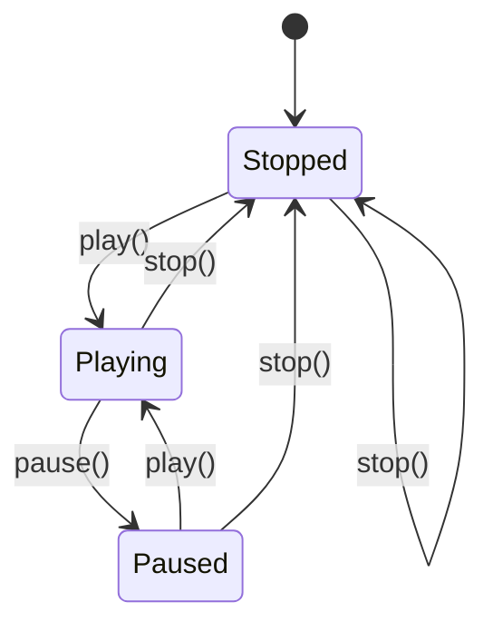

## 5.8.1 Implementing State Pattern in Python

The State Pattern is a behavioral design pattern that allows an object to change its behavior when its internal state changes. This pattern is particularly useful when an object must change its behavior at runtime depending on its state. By encapsulating state-specific behavior and delegating state transitions within a Context object, the State Pattern provides a clean and organized way to manage state-dependent behavior.

### Understanding the State Pattern

The State Pattern is based on the idea of representing different states of an object as separate classes. Each state class encapsulates the behavior associated with a particular state. The Context class maintains an instance of a state subclass to represent the current state and delegates state-dependent behavior to this instance.

#### Key Components of the State Pattern

1. **State Interface or Abstract Base Class**: Defines the interface for encapsulating the behavior associated with a particular state of the Context.
2. **Concrete State Classes**: Implement the behavior associated with a state of the Context.
3. **Context Class**: Maintains an instance of a Concrete State subclass to represent the current state and delegates state-dependent behavior to this instance.

### Implementing the State Pattern in Python

Let's walk through a detailed implementation of the State Pattern in Python using a practical example: a media player with states such as Stopped, Playing, and Paused.

#### Step 1: Define the State Interface

First, we define an interface or abstract base class for the state. This class will declare the methods that all concrete states must implement.

```python
from abc import ABC, abstractmethod

class State(ABC):
    @abstractmethod
    def play(self, context):
        pass

    @abstractmethod
    def pause(self, context):
        pass

    @abstractmethod
    def stop(self, context):
        pass
```

#### Step 2: Implement Concrete State Classes

Next, we implement the concrete state classes. Each class represents a specific state of the media player and implements the behavior associated with that state.

```python
class StoppedState(State):
    def play(self, context):
        print("Transitioning from Stopped to Playing.")
        context.state = PlayingState()
    
    def pause(self, context):
        print("Cannot pause. The media player is already stopped.")
    
    def stop(self, context):
        print("The media player is already stopped.")

class PlayingState(State):
    def play(self, context):
        print("The media player is already playing.")
    
    def pause(self, context):
        print("Transitioning from Playing to Paused.")
        context.state = PausedState()
    
    def stop(self, context):
        print("Transitioning from Playing to Stopped.")
        context.state = StoppedState()

class PausedState(State):
    def play(self, context):
        print("Transitioning from Paused to Playing.")
        context.state = PlayingState()
    
    def pause(self, context):
        print("The media player is already paused.")
    
    def stop(self, context):
        print("Transitioning from Paused to Stopped.")
        context.state = StoppedState()
```

#### Step 3: Create the Context Class

The Context class maintains an instance of a state subclass to represent the current state. It delegates state-dependent behavior to this instance.

```python
class MediaPlayer:
    def __init__(self):
        self.state = StoppedState()
    
    def play(self):
        self.state.play(self)
    
    def pause(self):
        self.state.pause(self)
    
    def stop(self):
        self.state.stop(self)
```

#### Step 4: Demonstrate State Transitions

Let's see how the state transitions occur in the media player.

```python
if __name__ == "__main__":
    player = MediaPlayer()
    
    player.play()   # Transitioning from Stopped to Playing.
    player.pause()  # Transitioning from Playing to Paused.
    player.stop()   # Transitioning from Paused to Stopped.
```

### How State Transitions Occur

In the State Pattern, state transitions are handled within the state methods. Each state class can change the Context's state by assigning a new State object to the Context. This allows the object to change its behavior dynamically at runtime.

### Advantages of the State Pattern

- **Eliminates Large Conditional Statements**: The State Pattern eliminates the need for large conditional statements that check the state of an object. Instead, state-specific behavior is encapsulated in state classes.
- **Simplifies Adding New States**: Adding new states or modifying existing ones is straightforward. You simply create a new state class or modify an existing one without affecting other parts of the code.
- **Improves Code Maintainability**: By encapsulating state-specific behavior in separate classes, the State Pattern improves code readability and maintainability.

### Best Practices for Implementing the State Pattern

- **Keep State Classes Focused**: Each state class should focus on the behavior specific to that state. Avoid adding unrelated logic to state classes.
- **Ensure Explicit State Transitions**: State transitions should be explicit and well-documented. This makes it easier to understand how an object transitions between states.
- **Use Descriptive Names**: Use descriptive names for state classes and methods to make the code self-explanatory.

### Try It Yourself

Let's encourage some experimentation. Try modifying the code to add a new state, such as a FastForwarding state, and implement the behavior associated with this state. Consider how the new state will interact with existing states and how transitions will occur.

### Visualizing State Transitions

To better understand how the State Pattern works, let's visualize the state transitions using a state diagram.



This diagram represents the state transitions of the media player. The arrows indicate the transitions between states, and the labels on the arrows represent the actions that trigger the transitions.

### References and Further Reading

- [State Pattern - Wikipedia](https://en.wikipedia.org/wiki/State_pattern)
- [Design Patterns: Elements of Reusable Object-Oriented Software](https://en.wikipedia.org/wiki/Design_Patterns) by Erich Gamma, Richard Helm, Ralph Johnson, and John Vlissides
- [Python's `abc` Module](https://docs.python.org/3/library/abc.html) for defining abstract base classes

### Knowledge Check

Before we conclude, let's pose some questions to reinforce your understanding of the State Pattern:

1. What are the key components of the State Pattern?
2. How does the Context class interact with state classes?
3. What are the advantages of using the State Pattern over conditional statements?
4. How can you add a new state to an existing implementation of the State Pattern?

### Embrace the Journey

Remember, this is just the beginning. As you progress, you'll discover more ways to apply the State Pattern to solve complex problems. Keep experimenting, stay curious, and enjoy the journey!

## Quiz Time!



### What is the primary purpose of the State Pattern?

- [x] To allow an object to change its behavior when its internal state changes.
- [ ] To encapsulate algorithms within a class.
- [ ] To provide a way to create objects without specifying the exact class.
- [ ] To define a family of algorithms and make them interchangeable.

> **Explanation:** The State Pattern allows an object to change its behavior when its internal state changes, making it suitable for managing state-dependent behavior.

### Which component of the State Pattern maintains the current state of an object?

- [x] Context Class
- [ ] State Interface
- [ ] Concrete State Class
- [ ] Abstract Base Class

> **Explanation:** The Context class maintains the current state of an object and delegates state-dependent behavior to the current state instance.

### How does the State Pattern simplify adding new states to an object?

- [x] By encapsulating state-specific behavior in separate classes.
- [ ] By using large conditional statements.
- [ ] By hardcoding state transitions.
- [ ] By using a single class for all states.

> **Explanation:** The State Pattern encapsulates state-specific behavior in separate classes, making it easy to add new states without affecting existing code.

### What method should each Concrete State class implement?

- [x] Methods defined in the State Interface or Abstract Base Class.
- [ ] Methods specific to the Context class.
- [ ] Methods that are not related to state transitions.
- [ ] Methods that directly modify the Context's properties.

> **Explanation:** Each Concrete State class should implement the methods defined in the State Interface or Abstract Base Class to ensure consistent behavior across states.

### What is a key advantage of using the State Pattern?

- [x] It eliminates large conditional statements based on state.
- [ ] It centralizes all state logic in a single class.
- [ ] It requires fewer classes to manage state.
- [ ] It uses inheritance to manage state transitions.

> **Explanation:** The State Pattern eliminates large conditional statements by encapsulating state-specific behavior in separate classes.

### How do state transitions occur in the State Pattern?

- [x] By assigning a new State object to the Context.
- [ ] By modifying the Context's properties directly.
- [ ] By using conditional statements.
- [ ] By calling methods on the Context class.

> **Explanation:** State transitions occur by assigning a new State object to the Context, allowing the object to change its behavior dynamically.

### What is the role of the Context class in the State Pattern?

- [x] To maintain the current state and delegate behavior to the state instance.
- [ ] To implement all state-specific behavior.
- [ ] To define the interface for state classes.
- [ ] To manage state transitions directly.

> **Explanation:** The Context class maintains the current state and delegates behavior to the state instance, ensuring that state-specific behavior is encapsulated.

### Which of the following is a best practice for implementing the State Pattern?

- [x] Keep state classes focused on their specific behavior.
- [ ] Use a single class for all states.
- [ ] Avoid documenting state transitions.
- [ ] Implement state transitions within the Context class.

> **Explanation:** Keeping state classes focused on their specific behavior ensures that the code remains organized and maintainable.

### What is a common use case for the State Pattern?

- [x] Managing state-dependent behavior in a media player.
- [ ] Encapsulating algorithms within a class.
- [ ] Creating objects without specifying the exact class.
- [ ] Defining a family of algorithms and making them interchangeable.

> **Explanation:** The State Pattern is commonly used to manage state-dependent behavior, such as in a media player with states like Playing, Paused, and Stopped.

### True or False: The State Pattern is useful for objects that need to change their behavior based on their internal state.

- [x] True
- [ ] False

> **Explanation:** True. The State Pattern is specifically designed for objects that need to change their behavior based on their internal state.


