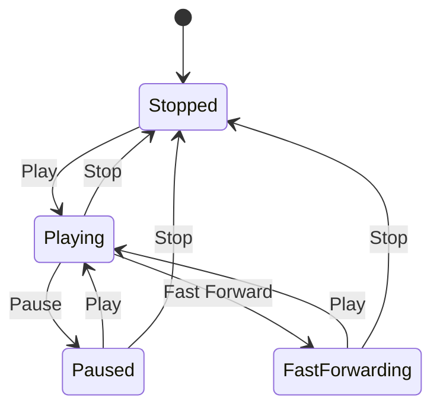
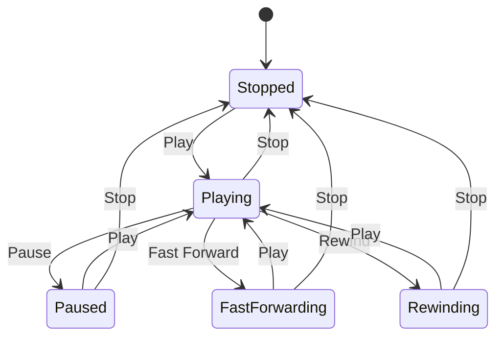

## 5.8.2 Managing Object State

In the realm of software design, managing object state is crucial for creating systems that can adapt their behavior dynamically in response to changing conditions. The State Pattern is a powerful tool in this regard, allowing us to encapsulate varying behavior for the same object based on its state. In this section, we will delve into the intricacies of managing object state transitions using the State Pattern in Python, ensuring robust and maintainable code.

### The Importance of Managing State Transitions Carefully

Managing state transitions is essential because it directly impacts the reliability and maintainability of your application. Improper handling of state transitions can lead to invalid states, inconsistent behavior, and difficult-to-debug errors. Here are some key considerations:

- **Invalid State Transitions**: These occur when an object transitions to a state that is not allowed from its current state. This can lead to unexpected behavior and system crashes.
- **Well-Defined State Diagram**: A state diagram or table helps visualize all possible states and transitions, ensuring that every state change is accounted for and valid.
- **Consistency and Predictability**: Proper state management ensures that the system behaves consistently and predictably, which is crucial for user satisfaction and system reliability.

### Example of State Transitions

Let's consider a media player as an example to illustrate valid and invalid state transitions. A media player can be in one of several states: `Stopped`, `Playing`, `Paused`, or `FastForwarding`. The transitions between these states are triggered by user actions like play, pause, stop, and fast forward.



#### Valid Transitions

- From `Stopped` to `Playing` when the user presses play.
- From `Playing` to `Paused` when the user presses pause.
- From `Paused` to `Playing` when the user presses play again.
- From `Playing` to `Stopped` when the user presses stop.

#### Invalid Transitions

- From `Stopped` to `Paused` directly, as pausing a stopped player doesn't make sense.
- From `FastForwarding` to `Paused` without playing first.

### Strategies for State Management

To manage states effectively, we can use several strategies:

#### Using Enumerations or Constants

Enumerations or constants can represent states, providing clarity and preventing errors due to typos or incorrect values.

```python
from enum import Enum

class PlayerState(Enum):
    STOPPED = 1
    PLAYING = 2
    PAUSED = 3
    FAST_FORWARDING = 4
```

#### Validation Checks

Implement validation checks to ensure that transitions are legal. This can be done by maintaining a dictionary of valid transitions.

```python
class MediaPlayer:
    def __init__(self):
        self.state = PlayerState.STOPPED
        self.valid_transitions = {
            PlayerState.STOPPED: [PlayerState.PLAYING],
            PlayerState.PLAYING: [PlayerState.PAUSED, PlayerState.STOPPED, PlayerState.FAST_FORWARDING],
            PlayerState.PAUSED: [PlayerState.PLAYING, PlayerState.STOPPED],
            PlayerState.FAST_FORWARDING: [PlayerState.PLAYING, PlayerState.STOPPED]
        }

    def change_state(self, new_state):
        if new_state in self.valid_transitions[self.state]:
            self.state = new_state
            print(f"Transitioned to {self.state.name}")
        else:
            print(f"Invalid transition from {self.state.name} to {new_state.name}")
```

### Handling Events or Inputs

State changes are often triggered by events or inputs, such as user actions or system events. It's important to decouple event handling from state logic to maintain clean and modular code.

#### Decoupling Event Handling

Use a separate event handler to manage inputs and delegate state changes to the state management logic.

```python
class MediaPlayer:
    def __init__(self):
        self.state = PlayerState.STOPPED

    def handle_event(self, event):
        if event == "play":
            self.change_state(PlayerState.PLAYING)
        elif event == "pause":
            self.change_state(PlayerState.PAUSED)
        elif event == "stop":
            self.change_state(PlayerState.STOPPED)
        elif event == "fast_forward":
            self.change_state(PlayerState.FAST_FORWARDING)

    def change_state(self, new_state):
        # Validation logic here
        pass
```

### Error Handling Considerations

Handling unexpected states or transitions gracefully is crucial for robust applications. Here are some strategies:

- **Default State**: Define a default state to fall back on in case of errors.
- **Logging**: Log invalid transitions for debugging purposes.
- **User Feedback**: Provide feedback to users when an action cannot be performed due to an invalid state.

```python
def change_state(self, new_state):
    if new_state in self.valid_transitions[self.state]:
        self.state = new_state
        print(f"Transitioned to {self.state.name}")
    else:
        print(f"Invalid transition from {self.state.name} to {new_state.name}")
        # Log the error
        log_error(f"Invalid transition from {self.state.name} to {new_state.name}")
        # Provide user feedback
        notify_user("Action not allowed in the current state.")
```

### Try It Yourself

Experiment with the media player example by adding new states or transitions. For instance, you could add a `Rewinding` state and define its valid transitions. Consider how this affects the overall state diagram and the logic for handling events.

### Visualizing State Transitions

Visualizing state transitions can greatly aid in understanding and managing them. Use state diagrams to map out all possible states and transitions, ensuring that every transition is accounted for.



### Conclusion

Managing object state is a critical aspect of software design, enabling dynamic behavior changes and robust application logic. By carefully defining state transitions, using enumerations and validation checks, and handling events and errors gracefully, we can create systems that are both flexible and reliable. The State Pattern provides a structured approach to managing state, ensuring that our applications can adapt to changing conditions without sacrificing maintainability or clarity.

Remember, this is just the beginning. As you progress, you'll build more complex systems that require even more sophisticated state management. Keep experimenting, stay curious, and enjoy the journey!

## Quiz Time!



### What is the primary purpose of managing object state?

- [x] To enable dynamic behavior changes in response to different conditions.
- [ ] To ensure objects are always in a default state.
- [ ] To prevent objects from being used in multiple contexts.
- [ ] To simplify the object creation process.

> **Explanation:** Managing object state allows objects to change their behavior dynamically based on their current state, which is crucial for creating flexible and adaptable systems.


### What is an invalid state transition?

- [x] A transition that is not allowed from the current state.
- [ ] A transition that leads to a default state.
- [ ] A transition that occurs without user input.
- [ ] A transition that involves multiple states simultaneously.

> **Explanation:** An invalid state transition occurs when an object attempts to move to a state that is not permissible from its current state, leading to potential errors and inconsistent behavior.


### Which of the following is a valid state transition for a media player?

- [x] From `Stopped` to `Playing`.
- [ ] From `Paused` to `Stopped`.
- [ ] From `Playing` to `Paused`.
- [ ] From `FastForwarding` to `Paused`.

> **Explanation:** The valid transition from `Stopped` to `Playing` occurs when the user presses play, which is a typical action for a media player.


### What is the role of a state diagram?

- [x] To visualize all possible states and transitions in a system.
- [ ] To define the default state for an object.
- [ ] To list all invalid transitions in a system.
- [ ] To simplify the event handling process.

> **Explanation:** A state diagram helps visualize all possible states and transitions, ensuring that every state change is accounted for and valid.


### How can you prevent invalid state transitions?

- [x] By using validation checks and a dictionary of valid transitions.
- [ ] By allowing all possible transitions.
- [x] By defining a default state.
- [ ] By ignoring user inputs.

> **Explanation:** Validation checks and a dictionary of valid transitions help ensure that only permissible transitions occur, preventing invalid state changes.


### What is a common strategy for handling unexpected states?

- [x] Defining a default state to fall back on.
- [ ] Ignoring the unexpected state.
- [ ] Logging all transitions.
- [ ] Allowing the system to crash.

> **Explanation:** Defining a default state provides a fallback option in case of errors, ensuring that the system remains stable and predictable.


### How can you decouple event handling from state logic?

- [x] By using a separate event handler to manage inputs.
- [ ] By embedding event logic within state transitions.
- [x] By using a state diagram.
- [ ] By ignoring user inputs.

> **Explanation:** A separate event handler manages inputs and delegates state changes to the state management logic, maintaining clean and modular code.


### What is the benefit of using enumerations for states?

- [x] They provide clarity and prevent errors due to typos.
- [ ] They simplify the object creation process.
- [ ] They allow all transitions to be valid.
- [ ] They eliminate the need for validation checks.

> **Explanation:** Enumerations provide a clear and error-free way to represent states, reducing the risk of typos and incorrect values.


### Which of the following is a strategy for handling invalid transitions?

- [x] Logging the error and providing user feedback.
- [ ] Allowing the transition to occur.
- [ ] Ignoring the transition.
- [ ] Resetting the system.

> **Explanation:** Logging errors and providing user feedback helps diagnose issues and inform users when an action cannot be performed due to an invalid state.


### True or False: The State Pattern is only useful for simple systems.

- [ ] True
- [x] False

> **Explanation:** False. The State Pattern is useful for both simple and complex systems, as it provides a structured approach to managing state and enabling dynamic behavior changes.


