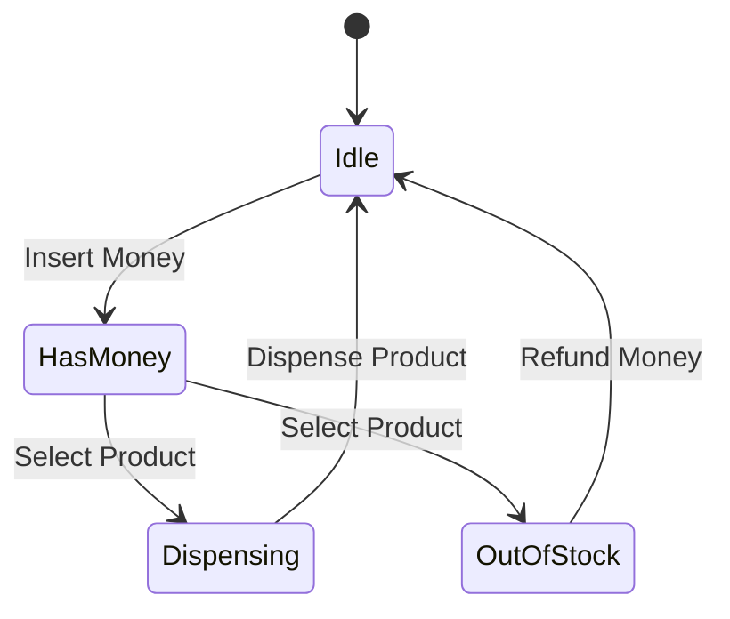
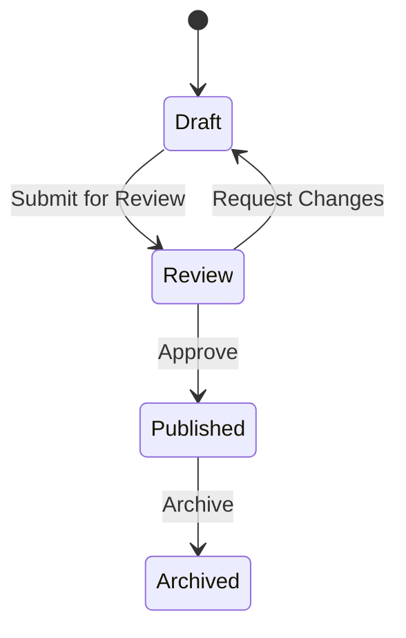

## 5.8.3 Use Cases and Examples

The State pattern is a behavioral design pattern that allows an object to change its behavior when its internal state changes. This pattern is particularly useful in scenarios where an object must change its behavior based on its current state, and it helps in organizing code that deals with state-dependent logic. In this section, we will explore practical applications of the State pattern in Python, focusing on real-world examples such as vending machines and document workflows. We will also discuss the benefits of using the State pattern and encourage you to apply it in your projects.

### Understanding the State Pattern

Before diving into the use cases and examples, let's briefly recap what the State pattern is and how it works. The State pattern involves three main components:

1. **Context**: This is the class that maintains an instance of a ConcreteState subclass that defines the current state.
2. **State**: This is an interface or abstract class that defines the behavior associated with a particular state of the Context.
3. **ConcreteState**: These are classes that implement the State interface and define the behavior for a specific state of the Context.

The Context delegates state-specific behavior to the current ConcreteState object. As the state changes, the Context switches to a different ConcreteState object.

### Practical Example 1: Vending Machine

A vending machine is a classic example of the State pattern. The machine can be in different states such as Idle, HasMoney, Dispensing, and OutOfStock. Each state dictates the behavior of the vending machine.

#### Vending Machine State Diagram



#### Implementing the Vending Machine in Python

Let's implement a simple vending machine using the State pattern in Python.

```python
from abc import ABC, abstractmethod

class State(ABC):
    @abstractmethod
    def insert_money(self, amount):
        pass

    @abstractmethod
    def select_product(self):
        pass

    @abstractmethod
    def dispense(self):
        pass

class IdleState(State):
    def __init__(self, machine):
        self.machine = machine

    def insert_money(self, amount):
        print(f"Money inserted: ${amount}")
        self.machine.balance += amount
        self.machine.set_state(self.machine.has_money_state)

    def select_product(self):
        print("Insert money first.")

    def dispense(self):
        print("Insert money first.")

class HasMoneyState(State):
    def __init__(self, machine):
        self.machine = machine

    def insert_money(self, amount):
        print(f"Additional money inserted: ${amount}")
        self.machine.balance += amount

    def select_product(self):
        if self.machine.balance >= self.machine.product_price:
            print("Product selected.")
            self.machine.set_state(self.machine.dispensing_state)
        else:
            print("Not enough money. Please insert more.")

    def dispense(self):
        print("Select a product first.")

class DispensingState(State):
    def __init__(self, machine):
        self.machine = machine

    def insert_money(self, amount):
        print("Please wait, dispensing product.")

    def select_product(self):
        print("Already dispensing product.")

    def dispense(self):
        print("Dispensing product...")
        self.machine.balance -= self.machine.product_price
        if self.machine.balance > 0:
            print(f"Returning change: ${self.machine.balance}")
            self.machine.balance = 0
        self.machine.set_state(self.machine.idle_state)

class OutOfStockState(State):
    def __init__(self, machine):
        self.machine = machine

    def insert_money(self, amount):
        print("Machine is out of stock. Returning money.")
        self.machine.balance += amount
        self.machine.set_state(self.machine.idle_state)

    def select_product(self):
        print("Machine is out of stock.")

    def dispense(self):
        print("Machine is out of stock.")

class VendingMachine:
    def __init__(self, product_price):
        self.idle_state = IdleState(self)
        self.has_money_state = HasMoneyState(self)
        self.dispensing_state = DispensingState(self)
        self.out_of_stock_state = OutOfStockState(self)
        self.state = self.idle_state
        self.balance = 0
        self.product_price = product_price

    def set_state(self, state):
        self.state = state

    def insert_money(self, amount):
        self.state.insert_money(amount)

    def select_product(self):
        self.state.select_product()

    def dispense(self):
        self.state.dispense()

machine = VendingMachine(product_price=2)
machine.insert_money(1)
machine.select_product()
machine.insert_money(1)
machine.select_product()
machine.dispense()
```

#### Explanation

- **IdleState**: The machine waits for money to be inserted.
- **HasMoneyState**: The machine has received money and waits for product selection.
- **DispensingState**: The machine dispenses the product and returns to the Idle state.
- **OutOfStockState**: The machine is out of stock and cannot dispense products.

### Practical Example 2: Document Workflow

Another common use case for the State pattern is a document workflow system. Documents can be in various states such as Draft, Review, Published, and Archived. Each state has specific behaviors and transitions.

#### Document Workflow State Diagram



#### Implementing the Document Workflow in Python

Let's implement a document workflow system using the State pattern in Python.

```python
from abc import ABC, abstractmethod

class DocumentState(ABC):
    @abstractmethod
    def submit_review(self):
        pass

    @abstractmethod
    def approve(self):
        pass

    @abstractmethod
    def request_changes(self):
        pass

    @abstractmethod
    def archive(self):
        pass

class DraftState(DocumentState):
    def __init__(self, document):
        self.document = document

    def submit_review(self):
        print("Document submitted for review.")
        self.document.set_state(self.document.review_state)

    def approve(self):
        print("Cannot approve a draft document.")

    def request_changes(self):
        print("No changes requested in draft state.")

    def archive(self):
        print("Cannot archive a draft document.")

class ReviewState(DocumentState):
    def __init__(self, document):
        self.document = document

    def submit_review(self):
        print("Document is already under review.")

    def approve(self):
        print("Document approved.")
        self.document.set_state(self.document.published_state)

    def request_changes(self):
        print("Changes requested. Returning to draft.")
        self.document.set_state(self.document.draft_state)

    def archive(self):
        print("Cannot archive a document under review.")

class PublishedState(DocumentState):
    def __init__(self, document):
        self.document = document

    def submit_review(self):
        print("Document is already published.")

    def approve(self):
        print("Document is already approved.")

    def request_changes(self):
        print("Cannot request changes to a published document.")

    def archive(self):
        print("Document archived.")
        self.document.set_state(self.document.archived_state)

class ArchivedState(DocumentState):
    def __init__(self, document):
        self.document = document

    def submit_review(self):
        print("Cannot review an archived document.")

    def approve(self):
        print("Cannot approve an archived document.")

    def request_changes(self):
        print("Cannot request changes to an archived document.")

    def archive(self):
        print("Document is already archived.")

class Document:
    def __init__(self):
        self.draft_state = DraftState(self)
        self.review_state = ReviewState(self)
        self.published_state = PublishedState(self)
        self.archived_state = ArchivedState(self)
        self.state = self.draft_state

    def set_state(self, state):
        self.state = state

    def submit_review(self):
        self.state.submit_review()

    def approve(self):
        self.state.approve()

    def request_changes(self):
        self.state.request_changes()

    def archive(self):
        self.state.archive()

document = Document()
document.submit_review()
document.approve()
document.archive()
```

#### Explanation

- **DraftState**: The document is being drafted and can be submitted for review.
- **ReviewState**: The document is under review and can be approved or sent back to draft.
- **PublishedState**: The document is published and can be archived.
- **ArchivedState**: The document is archived and cannot be modified.

### Benefits of Using the State Pattern

The State pattern offers several benefits:

- **Improved Code Clarity**: By encapsulating state-specific behavior in separate classes, the code becomes more organized and easier to understand.
- **Separation of Concerns**: Each state is responsible for its behavior, leading to better separation of concerns.
- **Ease of Extending Functionality**: Adding new states or modifying existing ones is straightforward, as each state is encapsulated in its own class.
- **Reduced Complexity**: The pattern reduces the complexity of the Context class by delegating state-specific behavior to state classes.

### Encouraging Application of the State Pattern

We encourage you to analyze your applications for areas with complex state-dependent logic. Consider refactoring such code using the State pattern to improve maintainability and scalability. The State pattern is particularly useful in scenarios where an object can be in multiple states, and each state has distinct behavior.

### Try It Yourself

To reinforce your understanding of the State pattern, try modifying the examples provided:

- **Vending Machine**: Add a new state for maintenance mode where the machine cannot accept money or dispense products.
- **Document Workflow**: Introduce a new state for rejected documents that can be revised and resubmitted for review.

Experiment with these modifications to see how the State pattern simplifies the management of state-dependent behavior.

## Quiz Time!



### What is the primary purpose of the State pattern?

- [x] To allow an object to change its behavior when its internal state changes.
- [ ] To encapsulate a request as an object.
- [ ] To define a one-to-many dependency between objects.
- [ ] To provide a way to access elements of a collection sequentially.

> **Explanation:** The State pattern allows an object to change its behavior when its internal state changes, making it suitable for scenarios with state-dependent logic.


### Which component of the State pattern maintains the current state?

- [x] Context
- [ ] State
- [ ] ConcreteState
- [ ] Interface

> **Explanation:** The Context class maintains an instance of a ConcreteState subclass that defines the current state.


### In the vending machine example, what happens when the machine is in the HasMoney state and the product is selected?

- [x] The machine transitions to the Dispensing state.
- [ ] The machine refunds the money.
- [ ] The machine transitions to the Idle state.
- [ ] The machine transitions to the OutOfStock state.

> **Explanation:** When the product is selected in the HasMoney state, the machine transitions to the Dispensing state to dispense the product.


### What is the role of the ConcreteState classes in the State pattern?

- [x] To implement the behavior for a specific state of the Context.
- [ ] To maintain the current state of the Context.
- [ ] To define the interface for state-specific behavior.
- [ ] To encapsulate a request as an object.

> **Explanation:** ConcreteState classes implement the behavior for a specific state of the Context, defining how the Context should behave in that state.


### How does the State pattern improve code clarity?

- [x] By encapsulating state-specific behavior in separate classes.
- [ ] By reducing the number of classes in the application.
- [ ] By eliminating the need for interfaces.
- [ ] By combining multiple states into a single class.

> **Explanation:** The State pattern improves code clarity by encapsulating state-specific behavior in separate classes, making the code more organized and easier to understand.


### Which of the following is a benefit of using the State pattern?

- [x] Ease of extending functionality by adding new states.
- [ ] Reducing the number of classes in the application.
- [ ] Eliminating the need for interfaces.
- [ ] Combining multiple states into a single class.

> **Explanation:** The State pattern makes it easy to extend functionality by adding new states, as each state is encapsulated in its own class.


### In the document workflow example, what happens when a document in the Review state is approved?

- [x] The document transitions to the Published state.
- [ ] The document transitions to the Draft state.
- [ ] The document is archived.
- [ ] The document is deleted.

> **Explanation:** When a document in the Review state is approved, it transitions to the Published state.


### What is a common use case for the State pattern?

- [x] Vending machines with different operational states.
- [ ] Logging systems with multiple log levels.
- [ ] Iterating over a collection of elements.
- [ ] Encapsulating a request as an object.

> **Explanation:** A common use case for the State pattern is vending machines with different operational states, where each state dictates specific behavior.


### How does the State pattern reduce complexity in the Context class?

- [x] By delegating state-specific behavior to state classes.
- [ ] By reducing the number of methods in the Context class.
- [ ] By eliminating the need for interfaces.
- [ ] By combining multiple states into a single class.

> **Explanation:** The State pattern reduces complexity in the Context class by delegating state-specific behavior to state classes, allowing the Context to focus on managing state transitions.


### True or False: The State pattern is only useful for simple applications with few states.

- [ ] True
- [x] False

> **Explanation:** False. The State pattern is useful for applications with complex state-dependent logic, regardless of the number of states, as it helps organize and manage state-specific behavior effectively.


