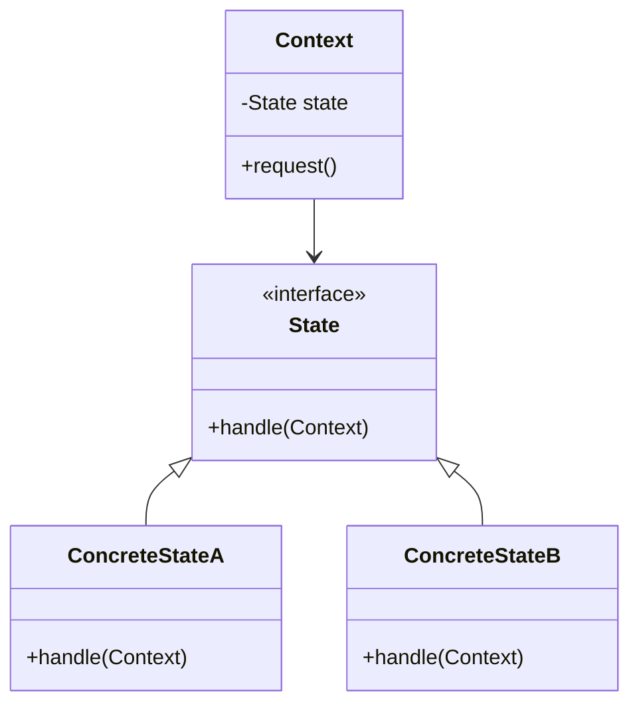
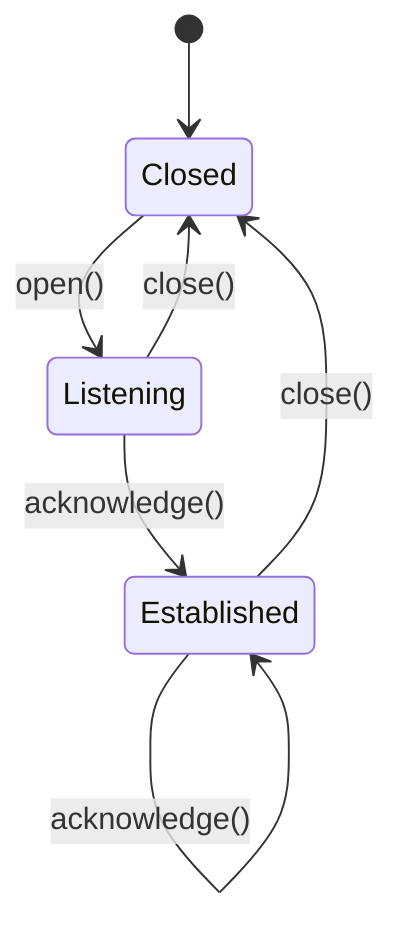

## 5.8 State Pattern

In the realm of software design patterns, the State Pattern stands out as a powerful tool for managing an object's behavior based on its internal state. This pattern is particularly useful when an object must change its behavior at runtime depending on its state, making it appear as if the object has changed its class.

### Intent and Motivation

The primary intent of the State Pattern is to allow an object to alter its behavior when its internal state changes. This pattern is motivated by the need to manage state-dependent behavior in a clean and organized manner. Instead of using complex conditional logic to handle different states, the State Pattern encapsulates state-specific behavior into separate classes. This separation of concerns leads to more maintainable and flexible code.

#### Why Use the State Pattern?

- **Dynamic Behavior**: The State Pattern enables objects to change their behavior dynamically as their internal state changes. This is akin to polymorphism, where the behavior of an object can change at runtime.
- **Code Organization**: By encapsulating state-specific behavior in separate classes, the State Pattern promotes better organization and separation of concerns.
- **Simplified Logic**: It simplifies complex conditional logic by delegating state-specific behavior to individual state classes.

### Structure of the State Pattern

The State Pattern is composed of the following key components:

1. **Context**: This is the class that maintains an instance of a ConcreteState subclass that defines the current state.
2. **State Interface**: This defines the interface for encapsulating the behavior associated with a particular state of the Context.
3. **Concrete State Classes**: These classes implement the behavior associated with a state of the Context.

#### UML Diagram

Below is a UML diagram illustrating the structure of the State Pattern:



In this diagram:
- The `Context` class holds a reference to a `State` object, which represents the current state.
- The `State` interface declares a method for handling requests, which is implemented by `ConcreteStateA` and `ConcreteStateB`.

### Python Example: TCP Connection

Let's implement a real-world scenario using the State Pattern: a TCP connection that can be in different states such as Closed, Listening, and Established.

#### Step 1: Define the State Interface

First, we define an interface for the state:

```python
from abc import ABC, abstractmethod

class TCPState(ABC):
    @abstractmethod
    def open(self, context):
        pass

    @abstractmethod
    def close(self, context):
        pass

    @abstractmethod
    def acknowledge(self, context):
        pass
```

#### Step 2: Create Concrete State Classes

Next, we implement the concrete state classes:

```python
class ClosedState(TCPState):
    def open(self, context):
        print("Opening connection...")
        context.state = ListeningState()

    def close(self, context):
        print("Connection already closed.")

    def acknowledge(self, context):
        print("No connection to acknowledge.")

class ListeningState(TCPState):
    def open(self, context):
        print("Connection already open.")

    def close(self, context):
        print("Closing connection...")
        context.state = ClosedState()

    def acknowledge(self, context):
        print("Acknowledging connection...")
        context.state = EstablishedState()

class EstablishedState(TCPState):
    def open(self, context):
        print("Connection already established.")

    def close(self, context):
        print("Closing connection...")
        context.state = ClosedState()

    def acknowledge(self, context):
        print("Acknowledging data...")
```

#### Step 3: Implement the Context Class

The `Context` class maintains an instance of a `TCPState` subclass:

```python
class TCPConnection:
    def __init__(self):
        self.state = ClosedState()

    def open(self):
        self.state.open(self)

    def close(self):
        self.state.close(self)

    def acknowledge(self):
        self.state.acknowledge(self)
```

#### Step 4: Demonstrate State Transitions

Let's see how the TCP connection behaves as it transitions between states:

```python
if __name__ == "__main__":
    connection = TCPConnection()

    connection.open()          # Output: Opening connection...
    connection.acknowledge()   # Output: Acknowledging connection...
    connection.acknowledge()   # Output: Acknowledging data...
    connection.close()         # Output: Closing connection...
    connection.close()         # Output: Connection already closed.
```

### Benefits of the State Pattern

- **Improved Code Organization**: By encapsulating state-specific behavior in separate classes, the State Pattern promotes better code organization and separation of concerns.
- **Simplified Logic**: It eliminates the need for complex conditional logic, making the code easier to understand and maintain.
- **Enhanced Flexibility**: New states and transitions can be added without modifying existing code, enhancing the flexibility of the system.

### Potential Complexities

While the State Pattern offers numerous benefits, it also introduces some complexities:

- **Overhead of Multiple Classes**: Implementing the State Pattern requires creating multiple state classes, which can increase the complexity of the codebase.
- **Careful Management of State Transitions**: State transitions must be managed carefully to avoid errors and ensure the system behaves as expected.

### Best Practices

- **Encapsulate State-Specific Behavior**: Encapsulate behavior related to a specific state within its corresponding state class.
- **Use Context Methods for Delegation**: Use methods in the Context class to delegate behavior to the current state, ensuring a clear separation of responsibilities.

### Encouraging Application

The State Pattern is particularly useful for modeling complex state-dependent behavior. Consider using this pattern when:

- An object's behavior depends on its state, and it must change behavior at runtime.
- You want to simplify complex conditional logic related to state transitions.
- You need to add new states and transitions without modifying existing code.

### Visualizing State Transitions

To better understand how the State Pattern manages state transitions, let's visualize the state transitions of our TCP connection example:



In this state diagram:
- The TCP connection starts in the `Closed` state.
- It transitions to the `Listening` state when the `open()` method is called.
- The `acknowledge()` method transitions the connection to the `Established` state.
- The `close()` method transitions the connection back to the `Closed` state.

### Try It Yourself

To deepen your understanding of the State Pattern, try modifying the code examples:

- **Add a New State**: Introduce a new state, such as `HalfOpenState`, and implement its behavior.
- **Modify Transitions**: Change the transitions between states to see how it affects the behavior of the TCP connection.
- **Extend Functionality**: Add new methods to the `TCPState` interface and implement them in the concrete state classes.

### References and Further Reading

- [Design Patterns: Elements of Reusable Object-Oriented Software](https://en.wikipedia.org/wiki/Design_Patterns) by Erich Gamma, Richard Helm, Ralph Johnson, and John Vlissides.
- [State Pattern on Wikipedia](https://en.wikipedia.org/wiki/State_pattern)
- [Python's `abc` Module](https://docs.python.org/3/library/abc.html)

### Knowledge Check

Before we conclude, let's reinforce what we've learned about the State Pattern:

- How does the State Pattern improve code organization?
- What are the key components of the State Pattern?
- How does the State Pattern simplify complex conditional logic?
- What are some potential complexities introduced by the State Pattern?
- When should you consider using the State Pattern?

Remember, mastering design patterns is a journey. Keep experimenting, stay curious, and enjoy the process of learning and applying these powerful tools in your software development projects.

## Quiz Time!



### What is the primary intent of the State Pattern?

- [x] To allow an object to alter its behavior when its internal state changes.
- [ ] To encapsulate a request as an object.
- [ ] To provide a simplified interface to a complex subsystem.
- [ ] To define a one-to-many dependency between objects.

> **Explanation:** The State Pattern allows an object to change its behavior when its internal state changes, making it appear as if the object has changed its class.

### Which component of the State Pattern maintains the current state?

- [x] Context
- [ ] State Interface
- [ ] Concrete State
- [ ] Observer

> **Explanation:** The Context class maintains an instance of a ConcreteState subclass that defines the current state.

### How does the State Pattern simplify complex conditional logic?

- [x] By encapsulating state-specific behavior in separate classes.
- [ ] By using a single class to handle all states.
- [ ] By eliminating the need for any state management.
- [ ] By using complex algorithms to manage states.

> **Explanation:** The State Pattern simplifies complex conditional logic by encapsulating state-specific behavior in separate classes, allowing for cleaner and more maintainable code.

### What is a potential complexity introduced by the State Pattern?

- [x] Overhead of creating multiple state classes.
- [ ] Lack of flexibility in adding new states.
- [ ] Difficulty in understanding state transitions.
- [ ] Inability to manage state-dependent behavior.

> **Explanation:** Implementing the State Pattern requires creating multiple state classes, which can increase the complexity of the codebase.

### Which method in the Context class is used to delegate behavior to the current state?

- [x] Methods like `open()`, `close()`, and `acknowledge()`.
- [ ] The constructor method.
- [ ] The destructor method.
- [ ] A static method.

> **Explanation:** Methods in the Context class, such as `open()`, `close()`, and `acknowledge()`, are used to delegate behavior to the current state.

### What is a benefit of using the State Pattern?

- [x] Improved code organization and maintainability.
- [ ] Increased complexity and overhead.
- [ ] Reduced flexibility in state management.
- [ ] Simplified single-class design.

> **Explanation:** The State Pattern improves code organization and maintainability by encapsulating state-specific behavior in separate classes.

### When should you consider using the State Pattern?

- [x] When an object's behavior depends on its state and must change at runtime.
- [ ] When you want to eliminate all state-dependent behavior.
- [ ] When you want to use a single class for all behaviors.
- [ ] When you want to avoid using any design patterns.

> **Explanation:** Consider using the State Pattern when an object's behavior depends on its state and must change at runtime.

### What does the State Pattern help avoid?

- [x] Complex conditional logic.
- [ ] State-dependent behavior.
- [ ] Multiple state classes.
- [ ] Dynamic behavior changes.

> **Explanation:** The State Pattern helps avoid complex conditional logic by encapsulating state-specific behavior in separate classes.

### How does the State Pattern enhance flexibility?

- [x] By allowing new states and transitions to be added without modifying existing code.
- [ ] By using a single class for all states.
- [ ] By eliminating the need for state management.
- [ ] By using complex algorithms to manage states.

> **Explanation:** The State Pattern enhances flexibility by allowing new states and transitions to be added without modifying existing code.

### True or False: The State Pattern can make an object appear to change its class.

- [x] True
- [ ] False

> **Explanation:** True. The State Pattern allows an object to change its behavior dynamically based on its internal state, making it appear as if the object has changed its class.


