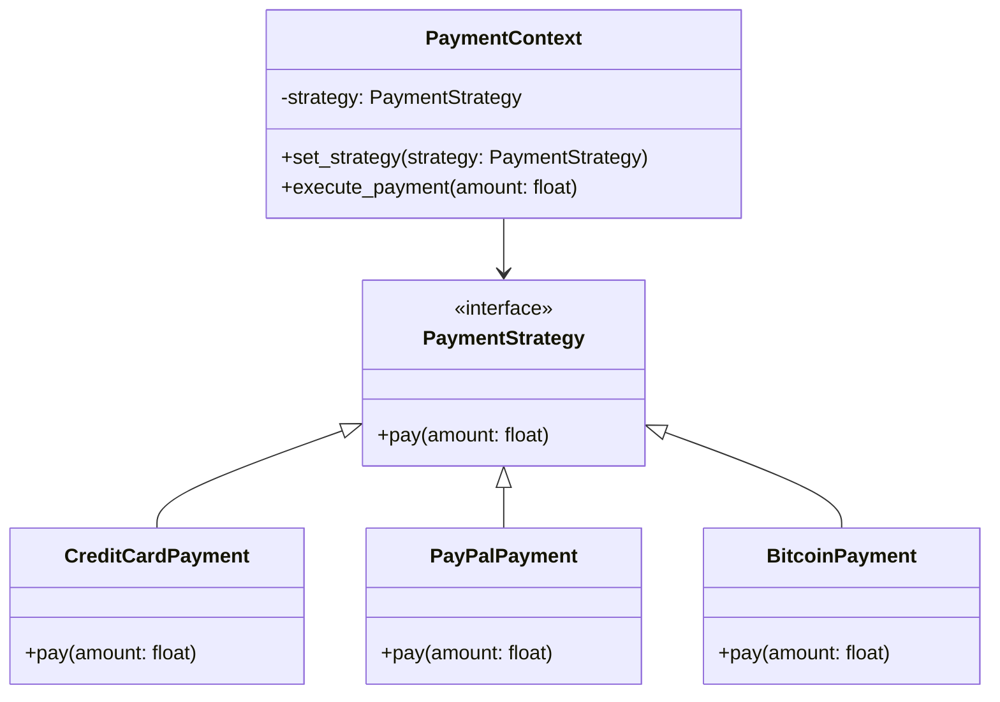

## 5.9.1 Implementing Strategy Pattern in Python

The Strategy Pattern is a behavioral design pattern that enables selecting an algorithm's behavior at runtime. This pattern is particularly useful when you want to define a family of algorithms, encapsulate each one, and make them interchangeable. The Strategy Pattern allows the algorithm to vary independently from the clients that use it. In this section, we will delve into the implementation of the Strategy Pattern in Python, using a practical example of payment processing with different payment methods.

### Understanding the Strategy Pattern

Before we dive into the code, let's break down the key components of the Strategy Pattern:

1. **Strategy Interface**: Defines a common interface for all supported algorithms. The Context uses this interface to call the algorithm defined by a Concrete Strategy.
2. **Concrete Strategy**: Implements the algorithm using the Strategy interface.
3. **Context**: Maintains a reference to a Strategy object and is configured with a Concrete Strategy object. The Context interacts with the Strategy interface to execute the algorithm.

### Implementation Guide

#### Step 1: Define the Strategy Interface

In Python, we can define a Strategy interface using an abstract base class. This interface will declare the method(s) that all Concrete Strategies must implement.

```python
from abc import ABC, abstractmethod

class PaymentStrategy(ABC):
    @abstractmethod
    def pay(self, amount: float):
        pass
```

Here, `PaymentStrategy` is an abstract base class with an abstract method `pay`. Any class implementing this interface must provide an implementation for the `pay` method.

#### Step 2: Implement Concrete Strategy Classes

Next, we implement different payment methods as Concrete Strategy classes. Each class will implement the `pay` method defined in the `PaymentStrategy` interface.

```python
class CreditCardPayment(PaymentStrategy):
    def __init__(self, card_number: str, card_holder: str, cvv: str, expiry_date: str):
        self.card_number = card_number
        self.card_holder = card_holder
        self.cvv = cvv
        self.expiry_date = expiry_date

    def pay(self, amount: float):
        print(f"Processing credit card payment of {amount} for {self.card_holder}")

class PayPalPayment(PaymentStrategy):
    def __init__(self, email: str):
        self.email = email

    def pay(self, amount: float):
        print(f"Processing PayPal payment of {amount} for {self.email}")

class BitcoinPayment(PaymentStrategy):
    def __init__(self, wallet_address: str):
        self.wallet_address = wallet_address

    def pay(self, amount: float):
        print(f"Processing Bitcoin payment of {amount} to {self.wallet_address}")
```

Each Concrete Strategy class provides its unique implementation of the `pay` method, tailored to the specific payment method.

#### Step 3: Create a Context Class

The Context class will use a Strategy object to perform the payment. It will maintain a reference to a Strategy object and delegate the payment task to it.

```python
class PaymentContext:
    def __init__(self, strategy: PaymentStrategy):
        self._strategy = strategy

    def set_strategy(self, strategy: PaymentStrategy):
        self._strategy = strategy

    def execute_payment(self, amount: float):
        self._strategy.pay(amount)
```

The `PaymentContext` class is initialized with a `PaymentStrategy` object. It provides a `set_strategy` method to change the strategy at runtime and an `execute_payment` method to perform the payment using the current strategy.

### Code Example: Payment Processing

Let's see how we can use the Strategy Pattern to process payments with different methods.

```python
credit_card_payment = CreditCardPayment("1234-5678-9876-5432", "John Doe", "123", "12/23")
paypal_payment = PayPalPayment("john.doe@example.com")
bitcoin_payment = BitcoinPayment("1A1zP1eP5QGefi2DMPTfTL5SLmv7DivfNa")

payment_context = PaymentContext(credit_card_payment)
payment_context.execute_payment(100.0)  # Output: Processing credit card payment of 100.0 for John Doe

payment_context.set_strategy(paypal_payment)
payment_context.execute_payment(200.0)  # Output: Processing PayPal payment of 200.0 for john.doe@example.com

payment_context.set_strategy(bitcoin_payment)
payment_context.execute_payment(300.0)  # Output: Processing Bitcoin payment of 300.0 to 1A1zP1eP5QGefi2DMPTfTL5SLmv7DivfNa
```

### Selecting and Switching Strategies

One of the key advantages of the Strategy Pattern is the ability to select and switch strategies at runtime. This flexibility allows the application to adapt to changing requirements without modifying the Context or Strategy classes.

#### Passing Strategy to Context

The Strategy can be passed to the Context via the constructor or a setter method. This approach decouples the Context from the specific strategies, allowing for easy substitution.

#### Changing Strategy at Runtime

The `set_strategy` method in the `PaymentContext` class enables changing the strategy at runtime. This feature is particularly useful in scenarios where the strategy needs to be altered based on user input or other dynamic conditions.

### Advantages of the Strategy Pattern

- **Code Reusability**: The Strategy Pattern promotes code reusability by encapsulating algorithms in separate classes. This separation allows for easy reuse of strategies across different contexts.
- **Flexibility**: Strategies can be switched at runtime, providing flexibility to adapt to changing requirements.
- **Simplified Unit Testing**: Each strategy can be tested independently, simplifying unit testing and improving code quality.
- **Open/Closed Principle**: The Strategy Pattern adheres to the Open/Closed Principle by allowing new strategies to be added without modifying existing code.

### Best Practices for Implementing the Strategy Pattern

- **Consistent Interface**: Ensure all strategies implement the same interface. This consistency allows the Context to interact with strategies interchangeably.
- **Avoid Hardcoding**: Avoid hardcoding strategy selection within the Context. Instead, pass the strategy as a parameter to the Context.
- **Use Dependency Injection**: Consider using dependency injection to provide strategies to the Context. This approach enhances testability and decouples the Context from specific strategies.

### Visualizing the Strategy Pattern

To better understand the Strategy Pattern, let's visualize the relationships between the Context, Strategy, and Concrete Strategies using a class diagram.



In this diagram, `PaymentStrategy` is the interface implemented by `CreditCardPayment`, `PayPalPayment`, and `BitcoinPayment`. The `PaymentContext` class uses a `PaymentStrategy` to execute payments.

### Try It Yourself

Now that we've covered the basics of the Strategy Pattern, let's encourage you to experiment with the code. Try the following modifications:

- **Add a New Payment Method**: Implement a new payment method, such as `ApplePayPayment`, and integrate it with the existing system.
- **Enhance the Context**: Modify the `PaymentContext` class to log payment details before executing the payment.
- **Dynamic Strategy Selection**: Implement a mechanism to select a strategy based on user input or configuration settings.

### Knowledge Check

Before we wrap up, let's reinforce your understanding with a few questions:

- What is the primary purpose of the Strategy Pattern?
- How does the Strategy Pattern promote code reusability?
- What are the benefits of using an interface for strategies?
- How can strategies be switched at runtime?
- Why is it important to avoid hardcoding strategy selection within the Context?

### Embrace the Journey

Remember, mastering design patterns is a journey. The Strategy Pattern is just one of many patterns that can enhance your software design skills. As you continue to explore and apply design patterns, you'll discover new ways to write clean, maintainable, and flexible code. Keep experimenting, stay curious, and enjoy the journey!

## Quiz Time!



### What is the primary purpose of the Strategy Pattern?

- [x] To define a family of algorithms, encapsulate each one, and make them interchangeable.
- [ ] To create a single instance of a class.
- [ ] To provide a simplified interface to a complex subsystem.
- [ ] To compose objects into tree structures to represent part-whole hierarchies.

> **Explanation:** The Strategy Pattern is used to define a family of algorithms, encapsulate each one, and make them interchangeable, allowing the algorithm to vary independently from the clients that use it.

### How does the Strategy Pattern promote code reusability?

- [x] By encapsulating algorithms in separate classes.
- [ ] By using a single class for all algorithms.
- [ ] By hardcoding algorithms within the Context.
- [ ] By avoiding the use of interfaces.

> **Explanation:** The Strategy Pattern promotes code reusability by encapsulating algorithms in separate classes, allowing them to be reused across different contexts.

### What is the role of the Context class in the Strategy Pattern?

- [x] To maintain a reference to a Strategy object and delegate tasks to it.
- [ ] To implement all algorithms directly.
- [ ] To provide a user interface for selecting strategies.
- [ ] To define the common interface for all strategies.

> **Explanation:** The Context class maintains a reference to a Strategy object and delegates tasks to it, allowing the strategy to be changed at runtime.

### How can strategies be switched at runtime in the Strategy Pattern?

- [x] By using a setter method in the Context class.
- [ ] By modifying the Strategy interface.
- [ ] By creating a new Context instance.
- [ ] By hardcoding the strategy selection.

> **Explanation:** Strategies can be switched at runtime by using a setter method in the Context class to change the Strategy object.

### Why is it important to avoid hardcoding strategy selection within the Context?

- [x] To allow flexibility and adaptability in strategy selection.
- [ ] To ensure all strategies are implemented in the Context.
- [ ] To prevent the use of multiple strategies.
- [ ] To simplify the Context class.

> **Explanation:** Avoiding hardcoding strategy selection within the Context allows for flexibility and adaptability, enabling strategies to be selected dynamically based on runtime conditions.

### What is a key advantage of using the Strategy Pattern for unit testing?

- [x] Each strategy can be tested independently.
- [ ] The Context class does not require testing.
- [ ] All strategies are tested together.
- [ ] Testing is not required for strategies.

> **Explanation:** A key advantage of the Strategy Pattern is that each strategy can be tested independently, simplifying unit testing and improving code quality.

### Which principle does the Strategy Pattern adhere to?

- [x] Open/Closed Principle.
- [ ] Single Responsibility Principle.
- [ ] Dependency Inversion Principle.
- [ ] Interface Segregation Principle.

> **Explanation:** The Strategy Pattern adheres to the Open/Closed Principle by allowing new strategies to be added without modifying existing code.

### What is the benefit of using an interface for strategies?

- [x] It ensures all strategies follow a consistent interface.
- [ ] It allows strategies to be implemented in the Context class.
- [ ] It prevents the use of multiple strategies.
- [ ] It simplifies the implementation of the Context class.

> **Explanation:** Using an interface for strategies ensures all strategies follow a consistent interface, allowing them to be used interchangeably by the Context.

### What is the role of Concrete Strategy classes in the Strategy Pattern?

- [x] To implement the algorithm using the Strategy interface.
- [ ] To maintain a reference to the Context class.
- [ ] To provide a user interface for selecting strategies.
- [ ] To define the common interface for all strategies.

> **Explanation:** Concrete Strategy classes implement the algorithm using the Strategy interface, providing specific implementations for different strategies.

### True or False: The Strategy Pattern allows the algorithm to vary independently from the clients that use it.

- [x] True
- [ ] False

> **Explanation:** True. The Strategy Pattern allows the algorithm to vary independently from the clients that use it, enabling flexibility and adaptability in algorithm selection.


