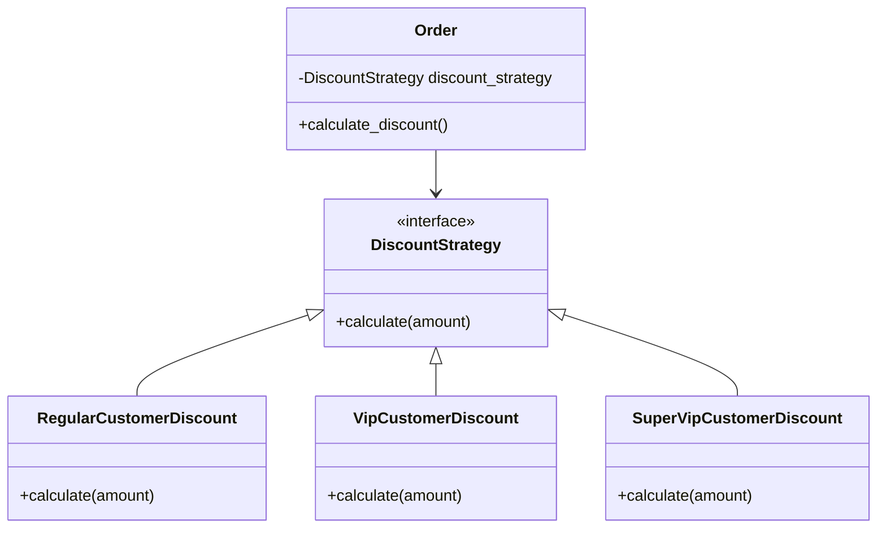

## 5.9.2 Replacing Conditional Logic

In software development, conditional logic is a common tool used to control the flow of a program. However, as applications grow in complexity, relying heavily on conditional statements like `if`, `elif`, and `switch` can lead to code that is difficult to read, maintain, and extend. The Strategy Pattern offers a robust solution to this problem by allowing us to encapsulate algorithms within strategy objects, thus replacing complex conditional logic with more flexible and maintainable code structures.

### Understanding the Problem: Complex Conditional Logic

Before we dive into the Strategy Pattern, let's examine the challenges posed by complex conditional logic. Consider a scenario where we need to calculate discounts for different types of customers in an e-commerce application. A straightforward implementation might use a series of `if` statements to determine the correct discount:

```python
class Order:
    def __init__(self, customer_type, amount):
        self.customer_type = customer_type
        self.amount = amount

    def calculate_discount(self):
        if self.customer_type == 'regular':
            return self.amount * 0.05
        elif self.customer_type == 'vip':
            return self.amount * 0.10
        elif self.customer_type == 'super_vip':
            return self.amount * 0.15
        else:
            return 0
```

In this example, the `calculate_discount` method uses conditional logic to apply different discount rates based on the `customer_type`. While this approach works, it has several drawbacks:

- **Readability**: The logic becomes harder to follow as more conditions are added.
- **Maintainability**: Adding new customer types or changing discount rates requires modifying the existing code, increasing the risk of introducing bugs.
- **Scalability**: The code is not easily extensible to accommodate new behaviors.

### Introducing the Strategy Pattern

The Strategy Pattern is a behavioral design pattern that enables selecting an algorithm's behavior at runtime. It defines a family of algorithms, encapsulates each one, and makes them interchangeable. This pattern is particularly useful when you have multiple algorithms for a specific task and want to switch between them easily.

#### Key Components of the Strategy Pattern

1. **Strategy Interface**: Defines a common interface for all supported algorithms.
2. **Concrete Strategies**: Implement the algorithm defined by the Strategy interface.
3. **Context**: Maintains a reference to a Strategy object and delegates the algorithm execution to the strategy object.

### Refactoring with the Strategy Pattern

Let's refactor the previous example using the Strategy Pattern to eliminate the conditional logic:

```python
from abc import ABC, abstractmethod

class DiscountStrategy(ABC):
    @abstractmethod
    def calculate(self, amount):
        pass

class RegularCustomerDiscount(DiscountStrategy):
    def calculate(self, amount):
        return amount * 0.05

class VipCustomerDiscount(DiscountStrategy):
    def calculate(self, amount):
        return amount * 0.10

class SuperVipCustomerDiscount(DiscountStrategy):
    def calculate(self, amount):
        return amount * 0.15

class Order:
    def __init__(self, discount_strategy: DiscountStrategy, amount):
        self.discount_strategy = discount_strategy
        self.amount = amount

    def calculate_discount(self):
        return self.discount_strategy.calculate(self.amount)

order1 = Order(RegularCustomerDiscount(), 1000)
print(order1.calculate_discount())  # Output: 50.0

order2 = Order(VipCustomerDiscount(), 1000)
print(order2.calculate_discount())  # Output: 100.0

order3 = Order(SuperVipCustomerDiscount(), 1000)
print(order3.calculate_discount())  # Output: 150.0
```

#### Explanation of the Refactored Code

- **Strategy Interface**: `DiscountStrategy` is an abstract base class that defines the `calculate` method.
- **Concrete Strategies**: Each customer type has its own class (`RegularCustomerDiscount`, `VipCustomerDiscount`, `SuperVipCustomerDiscount`) implementing the `calculate` method.
- **Context**: The `Order` class now accepts a `DiscountStrategy` object, allowing it to delegate the discount calculation to the strategy object.

### Benefits of Using the Strategy Pattern

1. **Improved Readability**: The code is more organized and easier to understand, as each strategy is encapsulated in its own class.
2. **Enhanced Maintainability**: Adding new customer types or modifying discount rates is straightforward and does not affect existing code.
3. **Increased Flexibility**: Strategies can be changed at runtime, allowing for dynamic behavior adjustments.
4. **Reusability**: Strategies can be reused across different contexts, promoting code reuse.

### Potential Pitfalls

While the Strategy Pattern offers numerous advantages, it's important to be mindful of potential pitfalls:

- **Overhead**: Introducing multiple classes for simple logic can add unnecessary complexity. Use this pattern when the benefits outweigh the overhead.
- **Overengineering**: Avoid using the Strategy Pattern for straightforward scenarios where simple conditional logic suffices.

### Visualizing the Strategy Pattern

To better understand how the Strategy Pattern works, let's visualize the relationships between the components using a class diagram:



### Try It Yourself

To deepen your understanding, try experimenting with the code:

- **Add a New Strategy**: Implement a `NoDiscount` strategy for customers with no discount.
- **Modify Existing Strategies**: Change the discount rates and observe how the code remains unaffected.
- **Switch Strategies at Runtime**: Modify the `Order` class to allow changing the strategy after instantiation.

### Knowledge Check

- **What is the primary benefit of using the Strategy Pattern?**
- **How does the Strategy Pattern improve code maintainability?**
- **What are the potential downsides of using the Strategy Pattern?**

### Summary

The Strategy Pattern is a powerful tool for replacing complex conditional logic with a more flexible and maintainable design. By encapsulating algorithms within strategy objects, we can improve code readability, facilitate easy extension, and promote code reuse. However, it's essential to balance the benefits against the potential for overengineering, ensuring that the pattern is applied judiciously.

Remember, this is just the beginning. As you progress, you'll discover more opportunities to apply design patterns in your projects. Keep experimenting, stay curious, and enjoy the journey!

## Quiz Time!



### What is the primary purpose of the Strategy Pattern?

- [x] To encapsulate algorithms and make them interchangeable
- [ ] To enforce a single instance of a class
- [ ] To provide a simplified interface to a complex subsystem
- [ ] To manage object creation

> **Explanation:** The Strategy Pattern is used to encapsulate algorithms within strategy objects, allowing them to be interchangeable.

### How does the Strategy Pattern improve code maintainability?

- [x] By encapsulating algorithms in separate classes
- [ ] By reducing the number of classes
- [ ] By using global variables
- [ ] By hardcoding logic

> **Explanation:** The Strategy Pattern improves maintainability by encapsulating algorithms in separate classes, making the code easier to modify and extend.

### What is a potential downside of using the Strategy Pattern?

- [x] Overengineering for simple scenarios
- [ ] Reducing code readability
- [ ] Increasing conditional logic
- [ ] Decreasing flexibility

> **Explanation:** The Strategy Pattern can lead to overengineering if used for simple scenarios where conditional logic would suffice.

### Which component of the Strategy Pattern defines the algorithm interface?

- [x] Strategy Interface
- [ ] Concrete Strategy
- [ ] Context
- [ ] Client

> **Explanation:** The Strategy Interface defines the common interface for all supported algorithms.

### In the Strategy Pattern, what role does the Context play?

- [x] It maintains a reference to a Strategy object and delegates algorithm execution
- [ ] It defines the algorithm interface
- [ ] It implements the algorithm
- [ ] It manages object creation

> **Explanation:** The Context maintains a reference to a Strategy object and delegates the algorithm execution to the strategy object.

### What is the benefit of encapsulating algorithms in the Strategy Pattern?

- [x] It allows for dynamic behavior changes at runtime
- [ ] It reduces the number of classes
- [ ] It simplifies object creation
- [ ] It enforces a single instance of a class

> **Explanation:** Encapsulating algorithms allows for dynamic behavior changes at runtime, enhancing flexibility.

### How can the Strategy Pattern help with scalability?

- [x] By allowing easy addition of new strategies without modifying existing code
- [ ] By reducing the number of strategies
- [ ] By using global variables
- [ ] By hardcoding logic

> **Explanation:** The Strategy Pattern allows for easy addition of new strategies, improving scalability without affecting existing code.

### What is a key advantage of using the Strategy Pattern over conditional logic?

- [x] Improved code readability and organization
- [ ] Reduced number of classes
- [ ] Increased use of global variables
- [ ] Hardcoded logic

> **Explanation:** The Strategy Pattern improves code readability and organization by encapsulating algorithms in separate classes.

### Can the Strategy Pattern be used to switch algorithms at runtime?

- [x] True
- [ ] False

> **Explanation:** The Strategy Pattern allows for switching algorithms at runtime, providing flexibility in behavior.

### Which of the following is NOT a component of the Strategy Pattern?

- [x] Singleton
- [ ] Strategy Interface
- [ ] Concrete Strategy
- [ ] Context

> **Explanation:** The Singleton is not a component of the Strategy Pattern; it is a separate design pattern.


