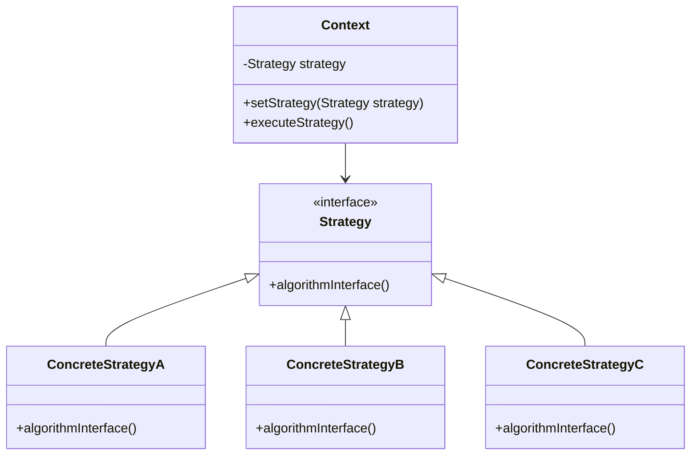

## 5.9.3 Use Cases and Examples

The Strategy pattern is a powerful design pattern that allows us to define a family of algorithms, encapsulate each one, and make them interchangeable. This pattern is particularly useful when we want to select an algorithm at runtime. In this section, we will explore two real-world examples where the Strategy pattern can be effectively applied: a file compression tool and a route planning application. We will also discuss the benefits of using the Strategy pattern and encourage you to identify areas in your code where this pattern could be beneficial.

### Real-World Example 1: File Compression Tool

In a file compression tool, you might want to support multiple compression algorithms such as ZIP, RAR, and GZIP. Each algorithm has its own implementation details, but the interface for compressing files remains consistent. The Strategy pattern allows us to encapsulate these algorithms and switch between them easily.

#### Code Example: File Compression Tool

Let's implement a file compression tool using the Strategy pattern. We'll define a common interface for all compression strategies and implement different algorithms.

```python
from abc import ABC, abstractmethod

class CompressionStrategy(ABC):
    @abstractmethod
    def compress(self, file_path: str) -> None:
        pass

class ZipCompressionStrategy(CompressionStrategy):
    def compress(self, file_path: str) -> None:
        print(f"Compressing {file_path} using ZIP compression.")

class RarCompressionStrategy(CompressionStrategy):
    def compress(self, file_path: str) -> None:
        print(f"Compressing {file_path} using RAR compression.")

class GzipCompressionStrategy(CompressionStrategy):
    def compress(self, file_path: str) -> None:
        print(f"Compressing {file_path} using GZIP compression.")

class FileCompressor:
    def __init__(self, strategy: CompressionStrategy) -> None:
        self._strategy = strategy

    def set_strategy(self, strategy: CompressionStrategy) -> None:
        self._strategy = strategy

    def compress_file(self, file_path: str) -> None:
        self._strategy.compress(file_path)

file_path = "example.txt"
compressor = FileCompressor(ZipCompressionStrategy())
compressor.compress_file(file_path)

compressor.set_strategy(RarCompressionStrategy())
compressor.compress_file(file_path)

compressor.set_strategy(GzipCompressionStrategy())
compressor.compress_file(file_path)
```

In this example, we define a `CompressionStrategy` interface with a `compress` method. We then create concrete strategies for ZIP, RAR, and GZIP compression. The `FileCompressor` class acts as the context, allowing us to set and use different compression strategies.

#### Benefits Observed

1. **Extensibility**: Adding a new compression algorithm is straightforward. Simply implement a new strategy class without modifying existing code.
2. **Code Organization**: Each compression algorithm is encapsulated in its own class, making the code easier to maintain and understand.
3. **Flexibility**: The compression strategy can be changed at runtime, allowing the application to adapt to different requirements.

### Real-World Example 2: Route Planning Application

In a route planning application, different users might prefer different routing algorithms. Some might want the shortest path, others the fastest route, and some might prefer a scenic route. The Strategy pattern allows us to encapsulate these routing algorithms and switch between them based on user preference.

#### Code Example: Route Planning Application

Let's implement a route planning application using the Strategy pattern. We'll define a common interface for all routing strategies and implement different algorithms.

```python
from abc import ABC, abstractmethod

class RoutingStrategy(ABC):
    @abstractmethod
    def calculate_route(self, start: str, end: str) -> None:
        pass

class ShortestPathStrategy(RoutingStrategy):
    def calculate_route(self, start: str, end: str) -> None:
        print(f"Calculating shortest path from {start} to {end}.")

class FastestRouteStrategy(RoutingStrategy):
    def calculate_route(self, start: str, end: str) -> None:
        print(f"Calculating fastest route from {start} to {end}.")

class ScenicRouteStrategy(RoutingStrategy):
    def calculate_route(self, start: str, end: str) -> None:
        print(f"Calculating scenic route from {start} to {end}.")

class RoutePlanner:
    def __init__(self, strategy: RoutingStrategy) -> None:
        self._strategy = strategy

    def set_strategy(self, strategy: RoutingStrategy) -> None:
        self._strategy = strategy

    def plan_route(self, start: str, end: str) -> None:
        self._strategy.calculate_route(start, end)

start_location = "A"
end_location = "B"
planner = RoutePlanner(ShortestPathStrategy())
planner.plan_route(start_location, end_location)

planner.set_strategy(FastestRouteStrategy())
planner.plan_route(start_location, end_location)

planner.set_strategy(ScenicRouteStrategy())
planner.plan_route(start_location, end_location)
```

In this example, we define a `RoutingStrategy` interface with a `calculate_route` method. We then create concrete strategies for the shortest path, fastest route, and scenic route. The `RoutePlanner` class acts as the context, allowing us to set and use different routing strategies.

#### Benefits Observed

1. **Extensibility**: Adding a new routing algorithm is straightforward. Simply implement a new strategy class without modifying existing code.
2. **Code Organization**: Each routing algorithm is encapsulated in its own class, making the code easier to maintain and understand.
3. **Flexibility**: The routing strategy can be changed at runtime, allowing the application to adapt to different user preferences.

### Encouraging the Use of the Strategy Pattern

The Strategy pattern is a versatile tool that can be applied in many areas of software development. Here are some tips to help you identify where the Strategy pattern might be useful in your code:

- **Review Code for Multiple Algorithms**: Look for areas in your code where multiple algorithms or behaviors are implemented. These are prime candidates for the Strategy pattern.
- **Encapsulate Algorithms**: By encapsulating algorithms in their own classes, you can improve code organization and make it easier to extend functionality.
- **Enhance Flexibility**: The Strategy pattern allows you to change algorithms at runtime, providing greater flexibility in your application.

### Try It Yourself

To get a better understanding of the Strategy pattern, try modifying the code examples provided:

- **Add a New Compression Algorithm**: Implement a new compression strategy, such as TAR, and integrate it into the file compression tool.
- **Implement a New Routing Algorithm**: Create a new routing strategy, such as an eco-friendly route, and integrate it into the route planning application.
- **Experiment with Strategy Selection**: Modify the context classes to select strategies based on user input or configuration files.

### Visualizing the Strategy Pattern

To further enhance your understanding, let's visualize how the Strategy pattern works using a class diagram.



**Diagram Description**: This class diagram represents the Strategy pattern. The `Context` class maintains a reference to a `Strategy` object. The `Strategy` interface defines the algorithm interface, and `ConcreteStrategyA`, `ConcreteStrategyB`, and `ConcreteStrategyC` are concrete implementations of the strategy.

### Conclusion

The Strategy pattern is a powerful tool for managing algorithms and behaviors in a flexible and organized manner. By encapsulating algorithms in their own classes, you can extend functionality easily and improve code maintainability. We encourage you to explore your codebase for opportunities to apply the Strategy pattern and enjoy the benefits it brings.

## Quiz Time!



### What is the primary purpose of the Strategy pattern?

- [x] To define a family of algorithms, encapsulate each one, and make them interchangeable.
- [ ] To create a single instance of a class.
- [ ] To provide a simplified interface to a complex subsystem.
- [ ] To compose objects into tree structures.

> **Explanation:** The Strategy pattern allows you to define a family of algorithms, encapsulate each one, and make them interchangeable, providing flexibility in algorithm selection.

### In the file compression example, which class acts as the context?

- [ ] CompressionStrategy
- [ ] ZipCompressionStrategy
- [x] FileCompressor
- [ ] GzipCompressionStrategy

> **Explanation:** The `FileCompressor` class acts as the context, maintaining a reference to a `CompressionStrategy` object and allowing strategy selection.

### How can you add a new routing algorithm to the route planning application?

- [ ] Modify the existing strategies.
- [x] Implement a new strategy class.
- [ ] Change the context class.
- [ ] Update the interface.

> **Explanation:** To add a new routing algorithm, you simply implement a new strategy class that adheres to the `RoutingStrategy` interface.

### What is a key benefit of using the Strategy pattern?

- [ ] It reduces the number of classes in the application.
- [x] It enhances flexibility by allowing algorithm changes at runtime.
- [ ] It simplifies the user interface.
- [ ] It eliminates the need for interfaces.

> **Explanation:** The Strategy pattern enhances flexibility by allowing algorithms to be changed at runtime, adapting to different requirements.

### Which of the following is NOT a benefit of the Strategy pattern?

- [ ] Extensibility
- [ ] Code Organization
- [x] Reducing the number of classes
- [ ] Flexibility

> **Explanation:** While the Strategy pattern provides extensibility, code organization, and flexibility, it does not necessarily reduce the number of classes, as each strategy is encapsulated in its own class.

### In the Strategy pattern, what does the context class do?

- [ ] Implements the algorithm interface.
- [x] Maintains a reference to a strategy object.
- [ ] Provides a simplified interface.
- [ ] Composes objects into tree structures.

> **Explanation:** The context class maintains a reference to a strategy object and interacts with it to execute the desired algorithm.

### What is the role of the `CompressionStrategy` interface in the file compression example?

- [x] It defines the method that all compression strategies must implement.
- [ ] It compresses files using a specific algorithm.
- [ ] It selects the appropriate compression strategy.
- [ ] It acts as the context for compression.

> **Explanation:** The `CompressionStrategy` interface defines the method that all concrete compression strategies must implement, ensuring consistency.

### How does the Strategy pattern improve code organization?

- [ ] By reducing the number of methods in a class.
- [ ] By eliminating the need for inheritance.
- [x] By encapsulating algorithms in separate classes.
- [ ] By simplifying the user interface.

> **Explanation:** The Strategy pattern improves code organization by encapsulating each algorithm in its own class, making the code easier to maintain and understand.

### True or False: The Strategy pattern allows for changing algorithms at runtime.

- [x] True
- [ ] False

> **Explanation:** True. One of the key benefits of the Strategy pattern is the ability to change algorithms at runtime, providing flexibility and adaptability.

### Which of the following scenarios is a good candidate for the Strategy pattern?

- [x] An application with multiple algorithms that need to be selected at runtime.
- [ ] A system that requires a single instance of a class.
- [ ] A complex subsystem that needs a simplified interface.
- [ ] An object structure that needs to be represented as a tree.

> **Explanation:** The Strategy pattern is ideal for applications with multiple algorithms that need to be selected and used interchangeably at runtime.


