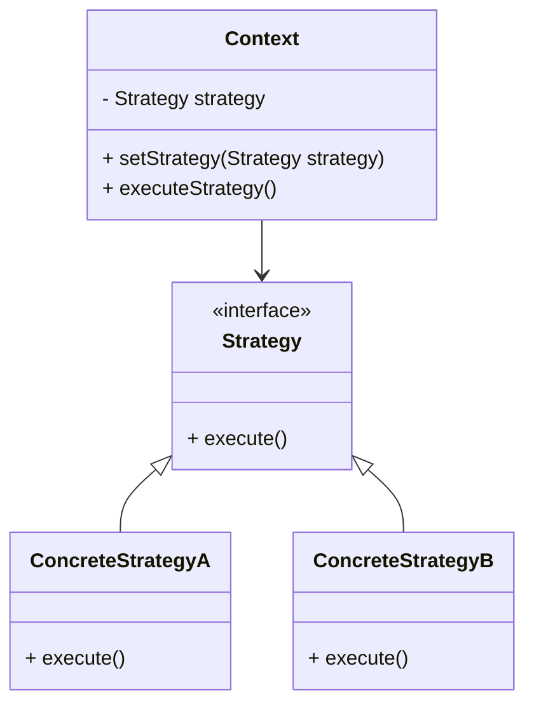
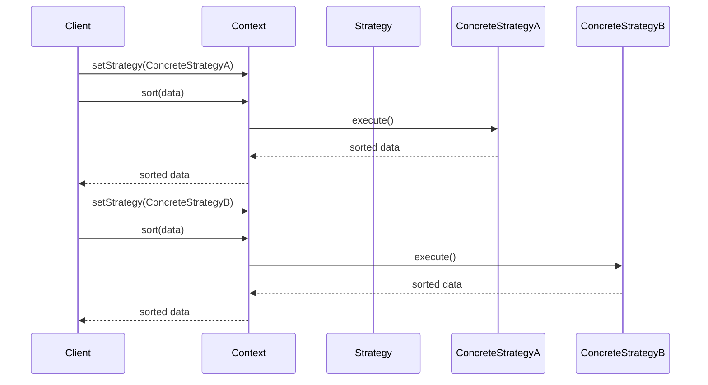

## 5.9 Strategy Pattern

The Strategy Pattern is a behavioral design pattern that enables selecting an algorithm's behavior at runtime. By defining a family of algorithms, encapsulating each one, and making them interchangeable, the Strategy Pattern allows the algorithm to vary independently from the clients that use it. This pattern is particularly useful in scenarios where multiple algorithms are applicable for a problem, and the choice of algorithm might depend on the context or specific conditions.

### Intent and Motivation

The primary intent of the Strategy Pattern is to define a set of algorithms, encapsulate each one, and make them interchangeable. This pattern is motivated by the need to select an algorithm at runtime, promoting flexibility and adherence to the Open/Closed Principle, which states that software entities should be open for extension but closed for modification.

#### Key Motivations:

- **Algorithm Selection at Runtime**: The Strategy Pattern allows for dynamic selection of algorithms based on the current context or user input, without altering the client code.
- **Promoting Open/Closed Principle**: By encapsulating algorithms in separate classes, the Strategy Pattern enables the addition of new algorithms without modifying existing code, thus adhering to the Open/Closed Principle.
- **Reducing Conditional Logic**: This pattern eliminates the need for complex conditional statements to select algorithms, simplifying the client code.

### Structure of the Strategy Pattern

The Strategy Pattern comprises three main components:

1. **Strategy Interface**: Defines a common interface for all supported algorithms. This interface is used by the Context to call the algorithm defined by a Concrete Strategy.

2. **Concrete Strategy Classes**: Implement the Strategy interface to provide specific algorithms. Each Concrete Strategy encapsulates a distinct algorithm.

3. **Context**: Maintains a reference to a Strategy object and delegates algorithm execution to the Strategy object.

#### Diagram: Strategy Pattern Structure



**Description**: The diagram illustrates the relationship between the Context, Strategy interface, and Concrete Strategies. The Context holds a reference to a Strategy and delegates execution to it.

### Python Example: Sorting Application

Let's implement a sorting application that can use different sorting algorithms, such as Bubble Sort, Merge Sort, and Quick Sort. We'll demonstrate how the strategy can be changed dynamically.

#### Step 1: Define the Strategy Interface

```python
from abc import ABC, abstractmethod

class SortStrategy(ABC):
    @abstractmethod
    def sort(self, data):
        pass
```

**Explanation**: The `SortStrategy` class is an abstract base class (ABC) that defines the `sort` method, which all concrete strategies must implement.

#### Step 2: Implement Concrete Strategy Classes

```python
class BubbleSortStrategy(SortStrategy):
    def sort(self, data):
        n = len(data)
        for i in range(n):
            for j in range(0, n-i-1):
                if data[j] > data[j+1]:
                    data[j], data[j+1] = data[j+1], data[j]
        return data

class MergeSortStrategy(SortStrategy):
    def sort(self, data):
        if len(data) > 1:
            mid = len(data) // 2
            left_half = data[:mid]
            right_half = data[mid:]

            self.sort(left_half)
            self.sort(right_half)

            i = j = k = 0
            while i < len(left_half) and j < len(right_half):
                if left_half[i] < right_half[j]:
                    data[k] = left_half[i]
                    i += 1
                else:
                    data[k] = right_half[j]
                    j += 1
                k += 1

            while i < len(left_half):
                data[k] = left_half[i]
                i += 1
                k += 1

            while j < len(right_half):
                data[k] = right_half[j]
                j += 1
                k += 1
        return data

class QuickSortStrategy(SortStrategy):
    def sort(self, data):
        if len(data) <= 1:
            return data
        else:
            pivot = data[0]
            less = [x for x in data[1:] if x <= pivot]
            greater = [x for x in data[1:] if x > pivot]
            return self.sort(less) + [pivot] + self.sort(greater)
```

**Explanation**: We have implemented three concrete strategies: `BubbleSortStrategy`, `MergeSortStrategy`, and `QuickSortStrategy`. Each class provides a specific sorting algorithm.

#### Step 3: Implement the Context

```python
class SortContext:
    def __init__(self, strategy: SortStrategy):
        self._strategy = strategy

    def set_strategy(self, strategy: SortStrategy):
        self._strategy = strategy

    def sort(self, data):
        return self._strategy.sort(data)
```

**Explanation**: The `SortContext` class maintains a reference to a `SortStrategy` object and delegates the sorting operation to the current strategy.

#### Step 4: Demonstrate Dynamic Strategy Selection

```python
data = [64, 34, 25, 12, 22, 11, 90]

context = SortContext(BubbleSortStrategy())
print("Bubble Sort:", context.sort(data.copy()))

context.set_strategy(MergeSortStrategy())
print("Merge Sort:", context.sort(data.copy()))

context.set_strategy(QuickSortStrategy())
print("Quick Sort:", context.sort(data.copy()))
```

**Explanation**: The `SortContext` is initialized with a `BubbleSortStrategy`. We then change the strategy dynamically to `MergeSortStrategy` and `QuickSortStrategy`, demonstrating the flexibility of the Strategy Pattern.

### Benefits of the Strategy Pattern

- **Eliminates Conditional Statements**: By encapsulating algorithms in separate classes, the Strategy Pattern removes the need for conditional statements to select algorithms, simplifying the client code.
- **Facilitates Adding New Algorithms**: New algorithms can be added without modifying existing code, adhering to the Open/Closed Principle.
- **Promotes Reusability**: Strategies are independent and reusable across different contexts.

### Potential Complexities

- **Overhead of Creating Classes**: Each algorithm requires a separate class, which can increase the complexity of the codebase.
- **Consistent Interface**: Ensuring that all strategies adhere to a consistent interface is crucial for seamless integration with the Context.

### Best Practices

- **Use Dependency Injection**: Pass strategies to the Context using dependency injection to enhance flexibility and testability.
- **Keep Strategies Independent**: Design strategies to be independent and reusable across different contexts.
- **Identify Interchangeable Behaviors**: Look for areas in your codebase where behaviors or algorithms can be interchanged, and apply the Strategy Pattern to enhance flexibility.

### Encouraging Application

The Strategy Pattern is particularly useful in scenarios where multiple algorithms are applicable for a problem, and the choice of algorithm might depend on the context or specific conditions. Consider applying this pattern in areas with interchangeable behaviors or algorithms, such as sorting, filtering, or data processing tasks.

### Try It Yourself

Experiment with the provided code examples by implementing additional sorting algorithms, such as Insertion Sort or Heap Sort. Modify the `SortContext` to dynamically select a strategy based on user input or specific conditions.

### Visualizing the Strategy Pattern



**Description**: This sequence diagram illustrates how the Client sets a strategy in the Context and executes the sorting operation. The Context delegates the sorting task to the selected Concrete Strategy, which processes the data and returns the sorted result.

### Knowledge Check

- What are the main components of the Strategy Pattern?
- How does the Strategy Pattern adhere to the Open/Closed Principle?
- What are the benefits of using the Strategy Pattern?
- How can you dynamically change the strategy in a Context?

### Embrace the Journey

Remember, mastering design patterns is a journey. As you explore the Strategy Pattern, consider how it can enhance the flexibility and maintainability of your code. Keep experimenting, stay curious, and enjoy the process of learning and applying design patterns in your projects!

## Quiz Time!



### What is the primary intent of the Strategy Pattern?

- [x] To define a family of algorithms, encapsulate each one, and make them interchangeable.
- [ ] To create a single algorithm that can handle all scenarios.
- [ ] To eliminate the need for any algorithms in a program.
- [ ] To hard-code algorithm selection into the client code.

> **Explanation:** The Strategy Pattern aims to define a family of algorithms, encapsulate each one, and make them interchangeable, allowing the algorithm to vary independently from the clients that use it.

### Which principle does the Strategy Pattern promote?

- [x] Open/Closed Principle
- [ ] Single Responsibility Principle
- [ ] Liskov Substitution Principle
- [ ] Interface Segregation Principle

> **Explanation:** The Strategy Pattern promotes the Open/Closed Principle by allowing new algorithms to be added without modifying existing code.

### What is the role of the Context in the Strategy Pattern?

- [x] To maintain a reference to a Strategy object and delegate algorithm execution to it.
- [ ] To implement all possible algorithms directly.
- [ ] To decide which algorithm to use based on hard-coded conditions.
- [ ] To eliminate the need for a Strategy interface.

> **Explanation:** The Context maintains a reference to a Strategy object and delegates the execution of the algorithm to the Strategy, allowing for dynamic selection of algorithms.

### How does the Strategy Pattern eliminate conditional statements?

- [x] By encapsulating algorithms in separate classes, removing the need for conditional logic to select algorithms.
- [ ] By using a single algorithm that handles all cases.
- [ ] By embedding all algorithms within the client code.
- [ ] By hard-coding the algorithm selection process.

> **Explanation:** The Strategy Pattern encapsulates algorithms in separate classes, eliminating the need for conditional logic to select algorithms, thus simplifying the client code.

### What is a potential complexity of using the Strategy Pattern?

- [x] The overhead of creating classes for each algorithm.
- [ ] The inability to add new algorithms.
- [ ] The requirement to modify client code for each new algorithm.
- [ ] The lack of flexibility in selecting algorithms.

> **Explanation:** A potential complexity of the Strategy Pattern is the overhead of creating separate classes for each algorithm, which can increase the complexity of the codebase.

### How can strategies be passed to the Context?

- [x] Using dependency injection.
- [ ] By hard-coding them into the Context.
- [ ] By embedding them within the client code.
- [ ] By using global variables.

> **Explanation:** Strategies can be passed to the Context using dependency injection, which enhances flexibility and testability.

### What is the benefit of keeping strategies independent?

- [x] They can be reused across different contexts.
- [ ] They can only be used in a single context.
- [ ] They require modification for each new context.
- [ ] They eliminate the need for a Strategy interface.

> **Explanation:** Keeping strategies independent allows them to be reused across different contexts, promoting flexibility and reusability.

### How does the Strategy Pattern facilitate adding new algorithms?

- [x] By allowing new algorithms to be added without modifying existing code.
- [ ] By requiring modifications to all existing code.
- [ ] By embedding new algorithms within the client code.
- [ ] By eliminating the need for new algorithms.

> **Explanation:** The Strategy Pattern facilitates adding new algorithms by allowing them to be added without modifying existing code, adhering to the Open/Closed Principle.

### What is a common use case for the Strategy Pattern?

- [x] Sorting algorithms
- [ ] Hard-coding algorithm selection
- [ ] Eliminating all algorithms
- [ ] Using a single algorithm for all scenarios

> **Explanation:** A common use case for the Strategy Pattern is sorting algorithms, where different sorting strategies can be applied based on the context or specific conditions.

### True or False: The Strategy Pattern allows for dynamic selection of algorithms at runtime.

- [x] True
- [ ] False

> **Explanation:** True. The Strategy Pattern allows for dynamic selection of algorithms at runtime, enhancing flexibility and adaptability.




