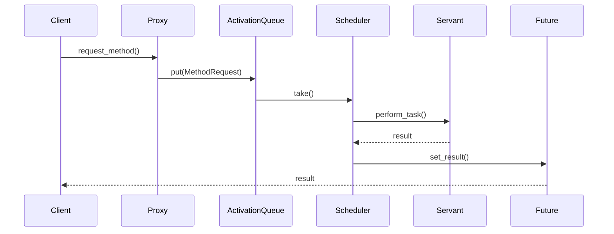

## 6.1.1 Implementing Active Object in Python

The Active Object Pattern is a concurrency design pattern that decouples method invocation from method execution. This allows for asynchronous processing, which is particularly useful in scenarios where tasks are I/O-bound or require parallel execution. In this section, we will explore how to implement the Active Object Pattern in Python using threads and `asyncio`.

### Understanding the Active Object Pattern

The Active Object Pattern involves several components that work together to achieve asynchronous execution:

- **Proxy**: This component exposes methods to the client and enqueues method requests into the activation queue.
- **Method Request**: Encapsulates the method to be executed, its arguments, and a future object to hold the result.
- **Activation Queue**: A thread-safe queue that stores method requests.
- **Scheduler**: A thread that monitors the activation queue, dequeues method requests, and executes them using the servant.
- **Servant**: Contains the actual business logic to be executed.
- **Future**: Represents the result of an asynchronous computation.

### Step-by-Step Implementation Guide

Let's dive into the implementation of each component in Python.

#### 1. Proxy

The Proxy class exposes the methods of the Servant and enqueues method requests into the activation queue. It returns a Future object that will eventually hold the result of the computation.

```python
import queue
import threading
from concurrent.futures import Future

class Proxy:
    def __init__(self, servant, activation_queue):
        self.servant = servant
        self.activation_queue = activation_queue

    def request_method(self, *args):
        future = Future()
        method_request = MethodRequest(self.servant, args, future)
        self.activation_queue.put(method_request)
        return future
```

**Explanation**: 
- The `Proxy` class takes a `servant` and an `activation_queue` as arguments.
- The `request_method` enqueues a `MethodRequest` into the `activation_queue` and returns a `Future`.

#### 2. Method Request

The Method Request class encapsulates the method to be executed, its arguments, and the future object.

```python
class MethodRequest:
    def __init__(self, servant, args, future):
        self.servant = servant
        self.args = args
        self.future = future

    def execute(self):
        try:
            result = self.servant.perform_task(*self.args)
            self.future.set_result(result)
        except Exception as e:
            self.future.set_exception(e)
```

**Explanation**:
- The `MethodRequest` class stores the `servant`, `args`, and `future`.
- The `execute` method calls the servant's `perform_task` and sets the result in the `future`.

#### 3. Activation Queue

The Activation Queue uses `queue.Queue` for thread-safe request storage.

```python
class ActivationQueue:
    def __init__(self):
        self.queue = queue.Queue()

    def put(self, method_request):
        self.queue.put(method_request)

    def take(self):
        return self.queue.get()
```

**Explanation**:
- The `ActivationQueue` class wraps a `queue.Queue` to store method requests.
- The `put` and `take` methods add and remove requests from the queue.

#### 4. Scheduler

The Scheduler continuously monitors the Activation Queue and executes method requests.

```python
class Scheduler(threading.Thread):
    def __init__(self, activation_queue):
        super().__init__()
        self.activation_queue = activation_queue
        self.daemon = True

    def run(self):
        while True:
            method_request = self.activation_queue.take()
            method_request.execute()
```

**Explanation**:
- The `Scheduler` class extends `threading.Thread` and runs as a daemon thread.
- It continuously dequeues and executes method requests.

#### 5. Servant

The Servant contains the actual business logic.

```python
class Servant:
    def perform_task(self, data):
        # Simulate a time-consuming task
        import time
        time.sleep(2)
        return f"Processed {data}"
```

**Explanation**:
- The `Servant` class has a `perform_task` method that simulates a time-consuming operation.

#### 6. Future

The Future object is used to hold the result of the asynchronous computation.

```python
```

**Explanation**:
- We use `concurrent.futures.Future` to represent the result of the computation.

### Putting It All Together

Let's see how all these components work together in a complete example.

```python
def main():
    servant = Servant()
    activation_queue = ActivationQueue()
    proxy = Proxy(servant, activation_queue)
    scheduler = Scheduler(activation_queue)
    scheduler.start()

    # Make asynchronous requests
    future1 = proxy.request_method("Task 1")
    future2 = proxy.request_method("Task 2")

    # Wait for results
    print(future1.result())
    print(future2.result())

if __name__ == "__main__":
    main()
```

**Explanation**:
- We create instances of `Servant`, `ActivationQueue`, `Proxy`, and `Scheduler`.
- We start the scheduler and make asynchronous requests through the proxy.
- We wait for and print the results of the futures.

### Synchronization and Thread Safety

In concurrent programming, synchronization is crucial to prevent race conditions. The Active Object Pattern uses thread-safe data structures like `queue.Queue` to ensure that method requests are safely enqueued and dequeued. Additionally, the `Future` object is thread-safe, allowing safe access to the result of the computation.

### Performance Considerations

While threading introduces some overhead, it allows for parallel execution of tasks, which can significantly improve performance for I/O-bound operations. However, for CPU-bound tasks, the Global Interpreter Lock (GIL) in CPython can limit the effectiveness of threading. In such cases, using `asyncio` for asynchronous I/O operations might be more efficient.

### Real-World Example: Asynchronous Task Executor

Let's implement a sample application that uses the Active Object Pattern to execute tasks asynchronously.

```python
import random

class TaskExecutorServant:
    def execute_task(self, task_id):
        import time
        time.sleep(random.uniform(0.5, 2.0))
        return f"Task {task_id} completed."

def task_executor_example():
    servant = TaskExecutorServant()
    activation_queue = ActivationQueue()
    proxy = Proxy(servant, activation_queue)
    scheduler = Scheduler(activation_queue)
    scheduler.start()

    futures = [proxy.request_method(i) for i in range(5)]

    for future in futures:
        print(future.result())

if __name__ == "__main__":
    task_executor_example()
```

**Explanation**:
- The `TaskExecutorServant` simulates task execution with random delays.
- We create multiple asynchronous requests and print their results as they complete.

### Try It Yourself

Experiment with the code by modifying the `perform_task` method in the `Servant` class to simulate different types of tasks. You can also try implementing the Active Object Pattern using `asyncio` for I/O-bound operations.

### Visualizing the Active Object Pattern

Below is a sequence diagram illustrating the interaction between components in the Active Object Pattern.



**Diagram Description**: The sequence diagram shows how a client request is handled by the proxy, enqueued in the activation queue, processed by the scheduler, executed by the servant, and the result is set in the future.

### Knowledge Check

- What is the role of the Proxy in the Active Object Pattern?
- How does the Scheduler ensure that method requests are executed?
- Why is the `queue.Queue` used in the Activation Queue?
- What are the benefits of using the Active Object Pattern for I/O-bound tasks?

### Embrace the Journey

Implementing the Active Object Pattern in Python is a powerful way to handle asynchronous processing. As you explore this pattern, remember that it's just one of many tools available for managing concurrency. Keep experimenting, stay curious, and enjoy the journey!

## Quiz Time!



### What is the primary purpose of the Active Object Pattern?

- [x] To decouple method invocation from execution, allowing asynchronous processing.
- [ ] To ensure that all method invocations are executed in sequence.
- [ ] To provide a synchronous interface for asynchronous operations.
- [ ] To simplify the implementation of complex algorithms.

> **Explanation:** The Active Object Pattern is designed to decouple method invocation from execution, enabling asynchronous processing.

### Which component of the Active Object Pattern is responsible for executing the business logic?

- [ ] Proxy
- [ ] Method Request
- [ ] Activation Queue
- [x] Servant

> **Explanation:** The Servant contains the actual business logic to be executed.

### What does the Proxy return to the client after enqueuing a Method Request?

- [ ] The result of the computation
- [x] A Future object
- [ ] A Method Request object
- [ ] An Activation Queue object

> **Explanation:** The Proxy returns a Future object that will eventually hold the result of the computation.

### How does the Scheduler execute Method Requests?

- [ ] By directly calling the Servant's methods
- [x] By dequeuing Method Requests from the Activation Queue
- [ ] By creating new threads for each request
- [ ] By using a timer to schedule execution

> **Explanation:** The Scheduler dequeues Method Requests from the Activation Queue and executes them using the Servant.

### Why is `queue.Queue` used in the Activation Queue?

- [x] To ensure thread-safe storage of Method Requests
- [ ] To prioritize Method Requests based on urgency
- [ ] To limit the number of concurrent Method Requests
- [ ] To provide a blocking mechanism for Method Requests

> **Explanation:** `queue.Queue` is used for thread-safe storage of Method Requests, ensuring that they are safely enqueued and dequeued.

### What is a potential drawback of using threads in Python for concurrency?

- [ ] Threads cannot be used for I/O-bound tasks
- [ ] Threads require complex synchronization mechanisms
- [x] The Global Interpreter Lock (GIL) can limit performance for CPU-bound tasks
- [ ] Threads are not supported in Python

> **Explanation:** The Global Interpreter Lock (GIL) in CPython can limit the effectiveness of threading for CPU-bound tasks.

### Which Python module is recommended for asynchronous I/O operations?

- [ ] threading
- [ ] queue
- [x] asyncio
- [ ] concurrent.futures

> **Explanation:** The `asyncio` module is recommended for asynchronous I/O operations in Python.

### What is the role of the Future object in the Active Object Pattern?

- [ ] To store the Method Request
- [ ] To execute the business logic
- [x] To represent the result of an asynchronous computation
- [ ] To manage the Activation Queue

> **Explanation:** The Future object represents the result of an asynchronous computation.

### How can the Active Object Pattern improve performance for I/O-bound tasks?

- [x] By allowing tasks to be executed asynchronously
- [ ] By reducing the number of threads used
- [ ] By prioritizing tasks based on urgency
- [ ] By simplifying the business logic

> **Explanation:** The Active Object Pattern allows tasks to be executed asynchronously, which can improve performance for I/O-bound tasks.

### True or False: The Active Object Pattern can only be implemented using threads in Python.

- [ ] True
- [x] False

> **Explanation:** The Active Object Pattern can be implemented using threads or `asyncio` for asynchronous processing in Python.


