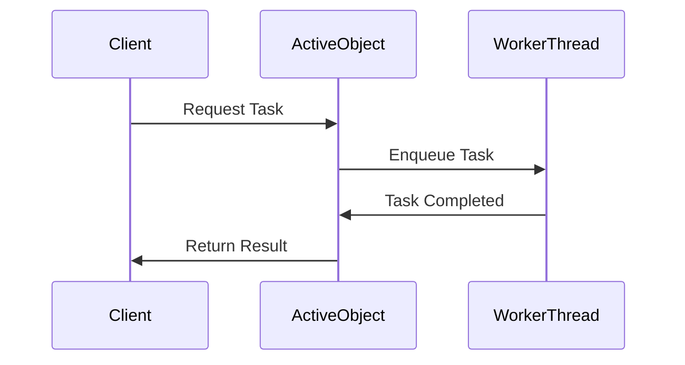

## 6.1.3 Use Cases and Examples

The Active Object Pattern is a concurrency pattern that decouples method execution from method invocation to enhance the responsiveness and scalability of applications. This pattern is particularly useful in scenarios where tasks need to be executed asynchronously without blocking the main thread. In this section, we will explore practical use cases and examples where the Active Object Pattern can be effectively applied in Python.

### GUI Applications

One of the most common use cases for the Active Object Pattern is in graphical user interface (GUI) applications. In such applications, it is crucial to maintain a responsive interface while performing long-running tasks in the background. The Active Object Pattern allows us to achieve this by offloading these tasks to separate threads or processes.

#### Example: Responsive Image Processing Application

Let's consider a simple image processing application where users can apply filters to images. Applying filters can be computationally intensive, and doing so on the main thread would freeze the interface. By using the Active Object Pattern, we can process images in the background, allowing the user to continue interacting with the application.

```python
import threading
import time
from queue import Queue

class ImageProcessor:
    def __init__(self):
        self.task_queue = Queue()
        self.result_queue = Queue()
        self.worker_thread = threading.Thread(target=self._process_images)
        self.worker_thread.start()

    def apply_filter(self, image, filter_function):
        self.task_queue.put((image, filter_function))

    def _process_images(self):
        while True:
            image, filter_function = self.task_queue.get()
            result = filter_function(image)
            self.result_queue.put(result)
            self.task_queue.task_done()

    def get_result(self):
        try:
            return self.result_queue.get_nowait()
        except Queue.Empty:
            return None

def dummy_filter(image):
    time.sleep(2)  # Simulate a time-consuming filter
    return f"Processed {image}"

processor = ImageProcessor()
processor.apply_filter("image1.jpg", dummy_filter)

while True:
    result = processor.get_result()
    if result:
        print(result)
        break
    print("Processing...")
    time.sleep(0.5)
```

**Benefits Observed:**

- **Enhanced User Experience**: The application remains responsive, allowing users to perform other actions while the image is being processed.
- **Efficient Resource Utilization**: By using separate threads, the application can make better use of multi-core processors.

### Asynchronous File Writing

Another practical application of the Active Object Pattern is in logging systems that need to write to disk without blocking the main application flow. This is particularly important in high-performance applications where logging should not interfere with the application's primary tasks.

#### Example: Non-Blocking Logging System

Consider a logging system that writes log messages to a file. By using the Active Object Pattern, we can ensure that log writing is done asynchronously, preventing any delays in the main application.

```python
import threading
from queue import Queue

class AsyncLogger:
    def __init__(self, log_file):
        self.log_file = log_file
        self.log_queue = Queue()
        self.worker_thread = threading.Thread(target=self._write_logs)
        self.worker_thread.start()

    def log(self, message):
        self.log_queue.put(message)

    def _write_logs(self):
        with open(self.log_file, 'a') as file:
            while True:
                message = self.log_queue.get()
                file.write(message + '\n')
                self.log_queue.task_done()

logger = AsyncLogger("application.log")
logger.log("Application started")
logger.log("Performing some task")
```

**Benefits Observed:**

- **Non-Blocking I/O**: The main application flow is not interrupted by disk I/O operations.
- **Scalability**: The logging system can handle a high volume of log messages without affecting performance.

### Remote Method Invocation

The Active Object Pattern is also useful in scenarios involving remote method invocation, where network communication needs to be decoupled from business logic. This allows the application to continue processing other tasks while waiting for network responses.

#### Example: Asynchronous Remote Service Call

Let's consider an application that needs to fetch data from a remote service. By using the Active Object Pattern, we can perform the network call asynchronously, allowing the application to remain responsive.

```python
import threading
import requests
from queue import Queue

class RemoteServiceClient:
    def __init__(self):
        self.task_queue = Queue()
        self.result_queue = Queue()
        self.worker_thread = threading.Thread(target=self._fetch_data)
        self.worker_thread.start()

    def fetch_data(self, url):
        self.task_queue.put(url)

    def _fetch_data(self):
        while True:
            url = self.task_queue.get()
            response = requests.get(url)
            self.result_queue.put(response.text)
            self.task_queue.task_done()

    def get_result(self):
        try:
            return self.result_queue.get_nowait()
        except Queue.Empty:
            return None

client = RemoteServiceClient()
client.fetch_data("https://api.example.com/data")

while True:
    result = client.get_result()
    if result:
        print("Data received:", result)
        break
    print("Waiting for data...")
    time.sleep(0.5)
```

**Benefits Observed:**

- **Decoupled Network Communication**: The application logic is separated from network communication, improving maintainability.
- **Improved Responsiveness**: The application can continue processing other tasks while waiting for network responses.

### Encouraging Experimentation

To fully grasp the benefits and nuances of the Active Object Pattern, it is essential to experiment with it in small applications. Start by implementing the pattern in simple scenarios, such as a basic GUI application or a logging system. Gradually build on these examples to understand the intricacies of synchronization and concurrency.

#### Try It Yourself

- **Modify the Image Processor**: Add a progress bar to the GUI application to visualize the progress of image processing tasks.
- **Enhance the Logger**: Implement log rotation in the asynchronous logging system to manage log file sizes.
- **Extend the Remote Client**: Add error handling and retry logic to the remote service client to handle network failures gracefully.

### Visualizing the Active Object Pattern

To better understand the flow of the Active Object Pattern, let's visualize it using a sequence diagram. This diagram illustrates the interaction between the client, the active object, and the worker thread.



**Diagram Description:**

- **Client**: Initiates a task request to the Active Object.
- **Active Object**: Enqueues the task and returns control to the client immediately.
- **Worker Thread**: Processes the task asynchronously and notifies the Active Object upon completion.
- **Active Object**: Returns the result to the client once the task is completed.

### References and Further Reading

- [Python's `threading` Module](https://docs.python.org/3/library/threading.html): Official documentation for Python's threading module.
- [Python's `queue` Module](https://docs.python.org/3/library/queue.html): Official documentation for Python's queue module.
- [Concurrency Patterns in Python](https://realpython.com/python-concurrency/): A comprehensive guide on concurrency patterns in Python.

### Knowledge Check

Before moving on, let's reinforce what we've learned with a few questions:

- What are the main benefits of using the Active Object Pattern in GUI applications?
- How does the Active Object Pattern improve the responsiveness of an application?
- What are some potential challenges when implementing the Active Object Pattern?

### Embrace the Journey

Remember, this is just the beginning. As you progress, you'll build more complex and interactive applications using the Active Object Pattern. Keep experimenting, stay curious, and enjoy the journey!

## Quiz Time!



### What is the primary benefit of using the Active Object Pattern in GUI applications?

- [x] It prevents the user interface from freezing during long-running tasks.
- [ ] It simplifies the codebase by reducing the number of classes.
- [ ] It ensures that all tasks are executed in sequence.
- [ ] It eliminates the need for error handling.

> **Explanation:** The Active Object Pattern allows long-running tasks to be executed in the background, preventing the user interface from freezing and enhancing user experience.

### How does the Active Object Pattern improve application responsiveness?

- [x] By executing tasks asynchronously in separate threads.
- [ ] By reducing the number of tasks that need to be performed.
- [ ] By increasing the priority of the main thread.
- [ ] By simplifying the task logic.

> **Explanation:** The Active Object Pattern improves responsiveness by executing tasks asynchronously in separate threads, allowing the main thread to remain responsive.

### What is a common use case for the Active Object Pattern in logging systems?

- [x] Asynchronous file writing to prevent blocking the main application flow.
- [ ] Synchronous file writing to ensure log integrity.
- [ ] Writing logs to a database instead of a file.
- [ ] Eliminating the need for log files altogether.

> **Explanation:** The Active Object Pattern is commonly used in logging systems to write logs asynchronously, preventing the main application flow from being blocked by disk I/O operations.

### In the context of remote method invocation, what does the Active Object Pattern help achieve?

- [x] Decoupling network communication from business logic.
- [ ] Ensuring all network requests are synchronous.
- [ ] Reducing the amount of data sent over the network.
- [ ] Simplifying the network protocol used.

> **Explanation:** The Active Object Pattern helps decouple network communication from business logic, allowing the application to remain responsive while waiting for network responses.

### What is a potential challenge when implementing the Active Object Pattern?

- [x] Managing synchronization and concurrency issues.
- [ ] Reducing the number of classes in the application.
- [ ] Ensuring all tasks are executed in sequence.
- [ ] Eliminating the need for error handling.

> **Explanation:** A potential challenge when implementing the Active Object Pattern is managing synchronization and concurrency issues, as tasks are executed asynchronously.

### Which Python module is commonly used for implementing the Active Object Pattern?

- [x] `threading`
- [ ] `os`
- [ ] `sys`
- [ ] `math`

> **Explanation:** The `threading` module is commonly used in Python to implement the Active Object Pattern by creating and managing threads.

### What is the role of the worker thread in the Active Object Pattern?

- [x] To process tasks asynchronously in the background.
- [ ] To manage the user interface.
- [ ] To handle network communication.
- [ ] To simplify the task logic.

> **Explanation:** The worker thread in the Active Object Pattern processes tasks asynchronously in the background, allowing the main thread to remain responsive.

### How can the Active Object Pattern be visualized?

- [x] Using a sequence diagram to illustrate the interaction between the client, active object, and worker thread.
- [ ] Using a class diagram to show the hierarchy of classes.
- [ ] Using a flowchart to depict the logic of each task.
- [ ] Using a pie chart to represent task distribution.

> **Explanation:** The Active Object Pattern can be visualized using a sequence diagram, which illustrates the interaction between the client, active object, and worker thread.

### What is the purpose of the task queue in the Active Object Pattern?

- [x] To hold tasks that need to be processed asynchronously.
- [ ] To store the results of completed tasks.
- [ ] To manage user input events.
- [ ] To simplify the task logic.

> **Explanation:** The task queue in the Active Object Pattern holds tasks that need to be processed asynchronously by the worker thread.

### True or False: The Active Object Pattern can only be used in GUI applications.

- [ ] True
- [x] False

> **Explanation:** False. The Active Object Pattern can be used in various scenarios, including GUI applications, asynchronous file writing, and remote method invocation, among others.


