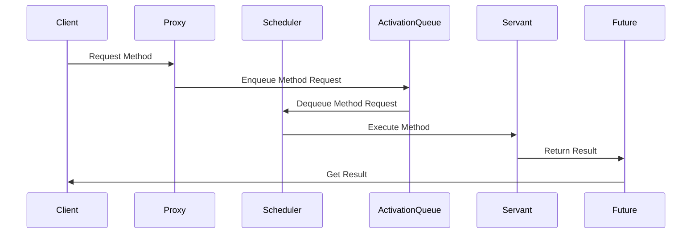

## 6.1 Active Object Pattern

The Active Object Pattern is a concurrency design pattern that decouples method execution from method invocation to enhance concurrency and simplify synchronized code. This pattern is particularly useful in multi-threaded environments where managing shared resources and ensuring thread safety can be complex and error-prone. By introducing asynchronous method execution, the Active Object Pattern allows for improved responsiveness and more manageable synchronization.

### Purpose and Intent

The primary purpose of the Active Object Pattern is to manage concurrency by separating the interface of an object from its method execution. This separation allows method calls to be handled asynchronously, enabling clients to continue processing without waiting for the method to complete. This pattern is particularly beneficial in scenarios where tasks can be executed in parallel, such as in GUI applications, network servers, or any system where tasks can be executed asynchronously.

#### Problem Solved

In multi-threaded environments, synchronizing shared resources can be challenging. The Active Object Pattern addresses this by centralizing concurrency management in a Scheduler, which handles the execution of method requests. This approach simplifies synchronization and reduces the risk of race conditions and deadlocks.

### Structure of the Active Object Pattern

The Active Object Pattern consists of several key components that work together to achieve asynchronous method execution:

- **Proxy**: Interfaces with clients, providing methods to initiate requests.
- **Method Request**: An object representing a request, encapsulating the method call and its arguments.
- **Scheduler**: Manages the execution of Method Requests, deciding the order of execution.
- **Activation Queue**: A thread-safe queue that stores incoming Method Requests.
- **Servant**: The object that performs the actual work requested.
- **Future**: A placeholder for the result, allowing the client to continue processing.

#### Diagram of the Active Object Pattern

Below is a diagram illustrating how requests flow from the client through the Proxy to the Scheduler and Servant:



This diagram shows the sequence of interactions between the components of the Active Object Pattern. The client makes a request through the Proxy, which enqueues a Method Request in the Activation Queue. The Scheduler dequeues the request and instructs the Servant to execute the method. The result is returned to the Future, which the client can later retrieve.

### Python Implementation

Let's implement an asynchronous logging system using the Active Object Pattern. This system will process log messages in the background, allowing the client to continue execution without waiting for the logging operation to complete.

#### Step 1: Define the Method Request

The Method Request is an object that encapsulates a method call and its arguments. In our logging system, the method request will represent a log message.

```python
class MethodRequest:
    def __init__(self, method, *args, **kwargs):
        self.method = method
        self.args = args
        self.kwargs = kwargs

    def call(self):
        return self.method(*self.args, **self.kwargs)
```

#### Step 2: Implement the Proxy

The Proxy provides an interface for clients to initiate requests. It enqueues Method Requests in the Activation Queue.

```python
from queue import Queue
from threading import Thread

class LoggerProxy:
    def __init__(self, scheduler):
        self.scheduler = scheduler

    def log(self, message):
        method_request = MethodRequest(self.scheduler.servant.log, message)
        self.scheduler.enqueue(method_request)
```

#### Step 3: Create the Scheduler

The Scheduler manages the execution of Method Requests. It dequeues requests from the Activation Queue and executes them using the Servant.

```python
class Scheduler(Thread):
    def __init__(self, servant):
        super().__init__()
        self.activation_queue = Queue()
        self.servant = servant
        self.daemon = True

    def enqueue(self, method_request):
        self.activation_queue.put(method_request)

    def run(self):
        while True:
            method_request = self.activation_queue.get()
            method_request.call()
```

#### Step 4: Define the Servant

The Servant performs the actual work requested. In our logging system, the Servant writes log messages to a file.

```python
class LoggerServant:
    def log(self, message):
        with open('log.txt', 'a') as file:
            file.write(f"{message}\n")
        print(f"Logged: {message}")
```

#### Step 5: Utilize the Future

The Future acts as a placeholder for the result of an asynchronous operation. In this example, the Future is not explicitly used, as logging does not return a result. However, it can be implemented to handle operations that produce a result.

#### Step 6: Client Interaction

The client interacts with the Proxy to log messages asynchronously.

```python
if __name__ == "__main__":
    servant = LoggerServant()
    scheduler = Scheduler(servant)
    proxy = LoggerProxy(scheduler)

    scheduler.start()

    proxy.log("This is an asynchronous log message.")
    proxy.log("Another log message.")

    # The client can continue processing without waiting for logging to complete.
    print("Client continues execution.")
```

### Benefits and Challenges

#### Benefits

- **Improved Responsiveness**: Clients are not blocked while operations execute, allowing for more responsive applications.
- **Simplified Synchronization**: Concurrency management is centralized in the Scheduler, reducing the complexity of synchronizing shared resources.

#### Challenges

- **Increased Complexity**: The codebase becomes more complex due to the additional components involved in the pattern.
- **Overhead**: Managing threads and synchronization primitives introduces overhead, which can impact performance.

### Best Practices

- **Thread Safety**: Ensure that all shared resources are accessed in a thread-safe manner. Use Python's `queue.Queue` for thread-safe queues.
- **Exception Handling**: Implement robust exception handling within the Active Object framework to prevent crashes and ensure reliability.
- **Performance Considerations**: Be mindful of the overhead introduced by managing threads and synchronization. Optimize where possible.

### Encouraging Application

The Active Object Pattern is well-suited for applications where tasks can be executed asynchronously, such as:

- **GUI Applications**: Improve responsiveness by handling user interactions asynchronously.
- **Network Servers**: Process requests in the background to handle high loads efficiently.
- **Asynchronous Systems**: Consider using alternative concurrency models like `asyncio` for I/O-bound tasks.

### Try It Yourself

Experiment with the provided code by modifying the logging system to include a Future that returns a confirmation message once the log is written. This exercise will help you understand how Futures can be used to handle asynchronous results.

### References and Further Reading

- [Python `threading` module documentation](https://docs.python.org/3/library/threading.html)
- [Python `queue` module documentation](https://docs.python.org/3/library/queue.html)
- [Concurrency Patterns in Python](https://realpython.com/python-concurrency/)

### Knowledge Check

To reinforce your understanding of the Active Object Pattern, consider the following questions:

1. What is the primary purpose of the Active Object Pattern?
2. How does the Active Object Pattern improve responsiveness in applications?
3. What are the key components of the Active Object Pattern?
4. How does the Scheduler manage concurrency in the Active Object Pattern?
5. What challenges might you encounter when implementing the Active Object Pattern?

## Quiz Time!



### What is the primary purpose of the Active Object Pattern?

- [x] To decouple method execution from method invocation
- [ ] To simplify single-threaded applications
- [ ] To enhance data storage capabilities
- [ ] To improve graphical user interfaces

> **Explanation:** The Active Object Pattern is designed to decouple method execution from method invocation, allowing for asynchronous processing and improved concurrency.

### Which component of the Active Object Pattern interfaces with clients?

- [x] Proxy
- [ ] Servant
- [ ] Scheduler
- [ ] Future

> **Explanation:** The Proxy interfaces with clients, providing methods to initiate requests and enqueue them for asynchronous execution.

### What role does the Scheduler play in the Active Object Pattern?

- [x] It manages the execution of Method Requests
- [ ] It interfaces with clients
- [ ] It performs the actual work requested
- [ ] It acts as a placeholder for the result

> **Explanation:** The Scheduler manages the execution of Method Requests, deciding the order of execution and ensuring thread safety.

### How does the Active Object Pattern improve responsiveness?

- [x] By allowing clients to continue processing without waiting for operations to complete
- [ ] By simplifying the codebase
- [ ] By reducing the number of components
- [ ] By increasing the complexity of method calls

> **Explanation:** The Active Object Pattern improves responsiveness by allowing clients to continue processing without waiting for operations to complete, as method execution is handled asynchronously.

### Which component of the Active Object Pattern performs the actual work requested?

- [ ] Proxy
- [x] Servant
- [ ] Scheduler
- [ ] Future

> **Explanation:** The Servant is responsible for performing the actual work requested by the Method Requests.

### What is a potential challenge of using the Active Object Pattern?

- [x] Increased complexity in the codebase
- [ ] Simplified synchronization
- [ ] Improved responsiveness
- [ ] Reduced overhead

> **Explanation:** One potential challenge of using the Active Object Pattern is the increased complexity in the codebase due to the additional components involved.

### What is the role of the Future in the Active Object Pattern?

- [x] It acts as a placeholder for the result
- [ ] It manages the execution of Method Requests
- [ ] It interfaces with clients
- [ ] It performs the actual work requested

> **Explanation:** The Future acts as a placeholder for the result of an asynchronous operation, allowing clients to retrieve the result once it is available.

### Which Python module is recommended for thread-safe queues?

- [x] `queue.Queue`
- [ ] `threading.Thread`
- [ ] `asyncio`
- [ ] `collections.deque`

> **Explanation:** The `queue.Queue` module is recommended for creating thread-safe queues in Python, ensuring safe access to shared resources.

### What is a benefit of using the Active Object Pattern?

- [x] Simplified synchronization
- [ ] Increased complexity
- [ ] Reduced responsiveness
- [ ] Increased overhead

> **Explanation:** A benefit of using the Active Object Pattern is simplified synchronization, as concurrency management is centralized in the Scheduler.

### True or False: The Active Object Pattern is suitable for single-threaded applications.

- [ ] True
- [x] False

> **Explanation:** False. The Active Object Pattern is designed for multi-threaded environments where asynchronous method execution is beneficial.



Remember, this is just the beginning. As you progress, you'll build more complex and interactive systems using the Active Object Pattern. Keep experimenting, stay curious, and enjoy the journey!
