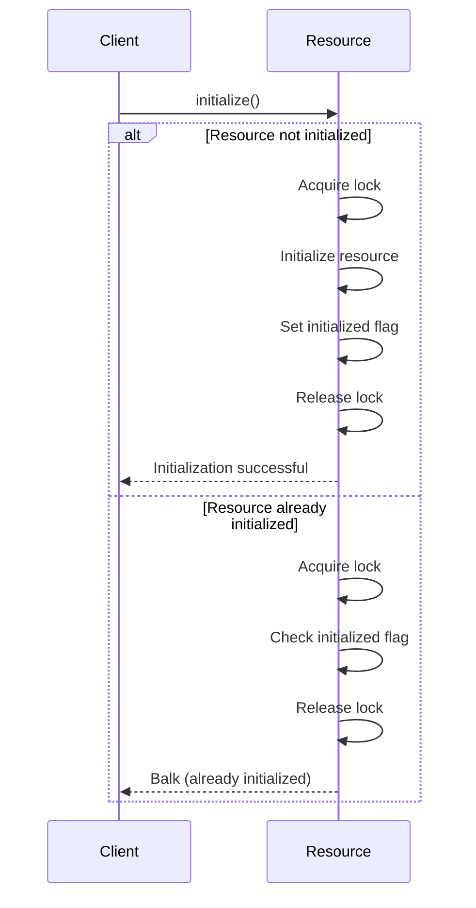

## 6.2.1 Implementing Balking in Python

Concurrency in programming often requires careful management of resources to ensure that operations are performed safely and efficiently. The Balking Pattern is a concurrency design pattern that helps manage operations by checking the state of an object before proceeding with an action. If the object is not in the correct state, the operation is simply abandoned, or "balked." This pattern is particularly useful in scenarios where operations should only be performed under certain conditions, such as initializing a resource only once.

### Understanding the Balking Pattern

The Balking Pattern is a concurrency pattern that prevents an operation from being executed if the system is not in the correct state. This is achieved by checking a condition or state before performing the operation. If the condition is not met, the operation is skipped, thereby preventing unnecessary or unsafe actions.

#### Key Concepts

- **State Management**: Use a flag or state variable to indicate whether an object is ready to perform an operation.
- **Method Implementation**: Check the state at the beginning of the method. If the state is not appropriate, return immediately.
- **Thread Safety**: Use synchronization mechanisms like locks to ensure that state checks and changes are atomic.

### Step-by-Step Implementation

Let's explore how to implement the Balking Pattern in Python with a practical example.

#### State Management

First, define a flag or state variable to indicate whether the object is ready to perform the operation. This flag will be checked before proceeding with any operation.

```python
import threading

class Resource:
    def __init__(self):
        self._initialized = False
        self._lock = threading.Lock()

    def initialize(self):
        with self._lock:
            if self._initialized:
                print("Initialization already done. Balking...")
                return
            # Proceed with initialization
            print("Initializing resource...")
            self._initialized = True
```

In this example, `_initialized` is a flag that indicates whether the resource has been initialized. The `initialize` method checks this flag before proceeding with the initialization.

#### Method Implementation

The `initialize` method checks the state of the `_initialized` flag. If the flag is `True`, it means the resource is already initialized, and the method will balk by returning immediately.

#### Thread Safety

To ensure thread safety, use a lock (`threading.Lock`) to make sure that state checks and changes are atomic. This prevents race conditions where multiple threads might attempt to initialize the resource simultaneously.

```python
def initialize(self):
    with self._lock:
        if self._initialized:
            print("Initialization already done. Balking...")
            return
        # Proceed with initialization
        print("Initializing resource...")
        self._initialized = True
```

Using `with self._lock:` ensures that the lock is acquired before checking the state and released after the operation, providing a clean and safe way to manage concurrency.

### Synchronization Techniques

Synchronization is crucial in implementing the Balking Pattern to ensure that only one thread can perform the operation at a time.

#### Acquiring and Releasing Locks

Use the `with` statement to acquire and release locks automatically. This ensures that the lock is always released, even if an exception occurs.

```python
with self._lock:
    # Critical section
    if self._initialized:
        return
    # Perform operation
```

The `with` statement simplifies lock management by automatically acquiring the lock at the beginning and releasing it at the end of the block.

#### Handling Balked Requests

When a request is balked, you can choose how to handle it. Common approaches include:

- **Returning a Status Code**: Indicate whether the operation was successful or balked.
- **Raising an Exception**: Signal that the operation could not be performed.
- **Doing Nothing**: Simply return without performing any action.

Here's an example of raising an exception for a balked request:

```python
class ResourceInitializationError(Exception):
    pass

def initialize(self):
    with self._lock:
        if self._initialized:
            raise ResourceInitializationError("Resource already initialized.")
        # Proceed with initialization
```

### Potential Pitfalls

While implementing the Balking Pattern, be aware of potential pitfalls:

- **Deadlocks**: Ensure that locks are acquired and released correctly to avoid deadlocks. Use the `with` statement to manage locks safely.
- **Minimizing Lock Time**: Hold locks for the shortest time possible to avoid blocking other threads unnecessarily.

### Try It Yourself

To experiment with the Balking Pattern, try modifying the code examples to:

- Implement a different operation that uses the balking pattern.
- Change the handling of balked requests to return a status code instead of raising an exception.
- Add logging to track when operations are balked.

### Visualizing the Balking Pattern

To better understand the flow of the Balking Pattern, let's visualize it using a sequence diagram.



In this diagram, we see the client attempting to initialize the resource. If the resource is not initialized, the operation proceeds. If it is already initialized, the operation is balked.

### Knowledge Check

Before we conclude, let's reinforce what we've learned:

- **What is the Balking Pattern?**: A concurrency pattern that prevents an operation if the system is not in the correct state.
- **Why use locks?**: To ensure thread safety by making state checks and changes atomic.
- **How to handle balked requests?**: Return a status code, raise an exception, or do nothing.

### Embrace the Journey

Remember, implementing concurrency patterns like the Balking Pattern is just the beginning of mastering concurrent programming. Keep experimenting, stay curious, and enjoy the journey!

## Quiz Time!



### What is the primary purpose of the Balking Pattern?

- [x] To prevent operations when the system is not in the correct state.
- [ ] To ensure all operations are executed regardless of state.
- [ ] To manage memory allocation efficiently.
- [ ] To optimize CPU usage.

> **Explanation:** The Balking Pattern is used to prevent operations when the system is not in the correct state, ensuring safe and efficient execution.

### How do you ensure thread safety when implementing the Balking Pattern in Python?

- [x] Use a lock to make state checks and changes atomic.
- [ ] Avoid using locks to improve performance.
- [ ] Use global variables to manage state.
- [ ] Implement a separate thread for each operation.

> **Explanation:** Using a lock ensures that state checks and changes are atomic, preventing race conditions and ensuring thread safety.

### What is a common way to handle balked requests?

- [x] Return a status code.
- [ ] Ignore the request and proceed.
- [x] Raise an exception.
- [ ] Log the request and retry.

> **Explanation:** Common ways to handle balked requests include returning a status code or raising an exception to indicate the operation was not performed.

### What is the role of the `with` statement in managing locks?

- [x] It automatically acquires and releases locks.
- [ ] It prevents locks from being used.
- [ ] It delays lock acquisition until necessary.
- [ ] It optimizes lock performance.

> **Explanation:** The `with` statement automatically acquires and releases locks, ensuring they are managed safely and efficiently.

### Which of the following is a potential pitfall when implementing the Balking Pattern?

- [x] Deadlocks due to incorrect lock management.
- [ ] Excessive memory usage.
- [ ] Increased CPU load.
- [ ] Reduced code readability.

> **Explanation:** Deadlocks can occur if locks are not managed correctly, making it crucial to acquire and release them properly.

### What does the `_initialized` flag represent in the code example?

- [x] Whether the resource has been initialized.
- [ ] The current state of the lock.
- [ ] The number of threads accessing the resource.
- [ ] The priority of the operation.

> **Explanation:** The `_initialized` flag indicates whether the resource has been initialized, determining if the operation should proceed or be balked.

### Why is it important to minimize the time locks are held?

- [x] To avoid blocking other threads unnecessarily.
- [ ] To reduce memory usage.
- [ ] To increase CPU utilization.
- [ ] To improve code readability.

> **Explanation:** Minimizing the time locks are held prevents blocking other threads, improving concurrency and performance.

### In the sequence diagram, what happens if the resource is already initialized?

- [x] The operation is balked, and the client is informed.
- [ ] The operation proceeds regardless.
- [ ] The system retries the operation.
- [ ] The resource is re-initialized.

> **Explanation:** If the resource is already initialized, the operation is balked, and the client is informed that initialization is not needed.

### What is a benefit of using the Balking Pattern?

- [x] It prevents unnecessary operations, improving efficiency.
- [ ] It ensures all operations are executed.
- [ ] It simplifies code by removing state checks.
- [ ] It increases the complexity of the system.

> **Explanation:** The Balking Pattern prevents unnecessary operations, improving efficiency by only performing actions when the system is in the correct state.

### True or False: The Balking Pattern can be used to manage resource initialization.

- [x] True
- [ ] False

> **Explanation:** True. The Balking Pattern is often used to manage resource initialization, ensuring it occurs only once.


