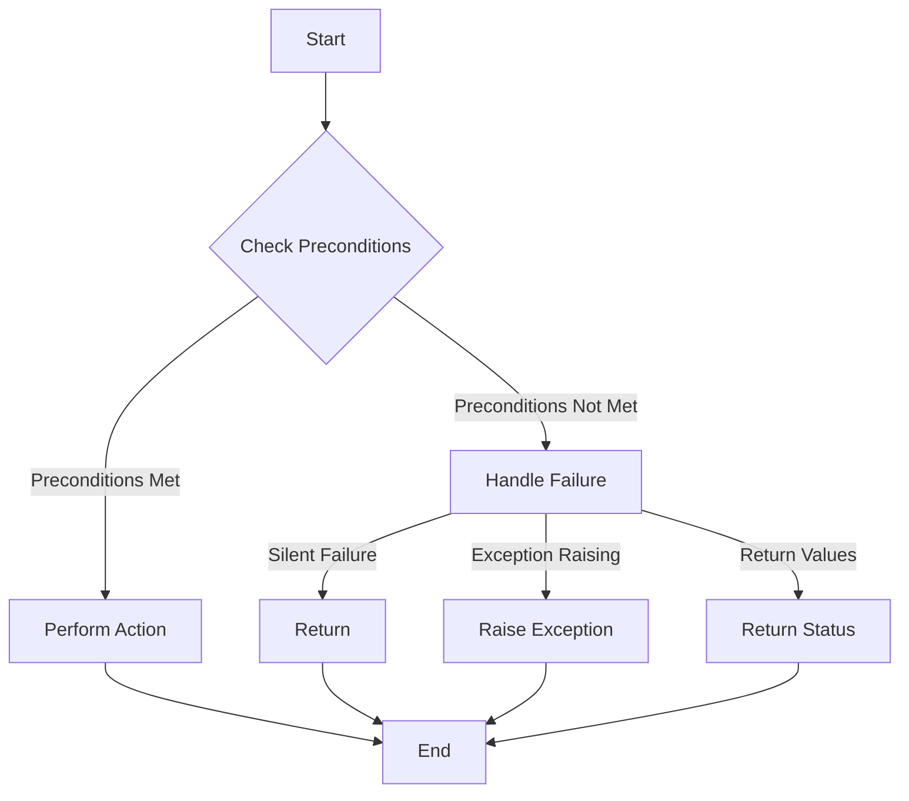

## 6.2.2 Handling Precondition Failures

In the realm of software design, handling precondition failures is a critical aspect of ensuring robust and reliable applications. The Balking Pattern provides a framework for gracefully declining to perform actions when preconditions are not met. This section delves into various strategies for handling balking, including silent failure, exception raising, and return values. We will explore each strategy with detailed code examples and discuss best practices to help you choose the most suitable approach for your application.

### Understanding the Balking Pattern

The Balking Pattern is a concurrency design pattern that is used to prevent an operation from being executed if certain preconditions are not satisfied. This pattern is particularly useful in situations where resources are limited or when operations are expensive. By checking preconditions before proceeding, the pattern helps avoid unnecessary computations and resource usage.

### Strategies for Handling Balking

There are several strategies for handling balking when preconditions are not met. Each strategy has its own advantages and is suitable for different scenarios. Let's explore these strategies in detail.

#### 1. Silent Failure

In the silent failure approach, the method simply returns without performing any action if the preconditions are not met. This strategy is useful when the failure to perform an action is not critical and does not require immediate attention.

**Code Example: Silent Failure**

```python
class ResourceHandler:
    def __init__(self):
        self.resource_available = False

    def perform_action(self):
        # Check precondition
        if not self.resource_available:
            # Preconditions not met, silently return
            return
        # Perform the action
        print("Action performed successfully.")

handler = ResourceHandler()
handler.perform_action()  # No output, as the resource is not available
```

In this example, the `perform_action` method checks if the resource is available. If not, it simply returns without performing any action.

**Client Code Response**

The client code should be aware that the method might not perform the action and should handle this scenario appropriately. For instance, the client might log a message or attempt the operation later.

#### 2. Exception Raising

Raising an exception is a more explicit way to handle precondition failures. This strategy is suitable when the failure to perform an action is critical and requires immediate attention from the caller.

**Code Example: Exception Raising**

```python
class ResourceUnavailableException(Exception):
    pass

class ResourceHandler:
    def __init__(self):
        self.resource_available = False

    def perform_action(self):
        # Check precondition
        if not self.resource_available:
            # Preconditions not met, raise an exception
            raise ResourceUnavailableException("Resource is not available.")
        # Perform the action
        print("Action performed successfully.")

handler = ResourceHandler()
try:
    handler.perform_action()
except ResourceUnavailableException as e:
    print(f"Failed to perform action: {e}")
```

In this example, the `perform_action` method raises a `ResourceUnavailableException` if the resource is not available.

**Client Code Response**

The client code should catch the exception and handle it appropriately, such as logging the error, notifying the user, or retrying the operation.

#### 3. Return Values

Returning a boolean or status code is another way to handle precondition failures. This strategy is useful when the caller needs to know whether the operation was successful but does not require detailed information about the failure.

**Code Example: Return Values**

```python
class ResourceHandler:
    def __init__(self):
        self.resource_available = False

    def perform_action(self):
        # Check precondition
        if not self.resource_available:
            # Preconditions not met, return False
            return False
        # Perform the action
        print("Action performed successfully.")
        return True

handler = ResourceHandler()
success = handler.perform_action()
if not success:
    print("Action could not be performed. Resource unavailable.")
```

In this example, the `perform_action` method returns `False` if the resource is not available, indicating that the action could not be performed.

**Client Code Response**

The client code should check the return value and take appropriate action, such as logging a message or attempting a fallback operation.

### Guidelines for Choosing a Strategy

When deciding which strategy to use for handling precondition failures, consider the following guidelines:

- **Application's Error Handling Approach**: Choose a strategy that aligns with the overall error handling approach of your application. For instance, if your application uses exceptions for error handling, consider raising exceptions for precondition failures.
  
- **Criticality of the Operation**: If the operation is critical and requires immediate attention, raising an exception might be the best choice. For less critical operations, silent failure or return values might be more appropriate.
  
- **Client Code Requirements**: Ensure that the client code can appropriately handle the balked operation. For example, if the client code needs to know whether the operation was successful, returning a boolean or status code might be suitable.

### Best Practices for Handling Precondition Failures

To effectively handle precondition failures, consider the following best practices:

- **Documentation**: Clearly document the behavior of the method when balking occurs. This includes specifying the preconditions and the expected behavior if they are not met.

- **Meaningful Messages or Exceptions**: Provide meaningful messages or exceptions to aid in debugging. This helps the caller understand why the operation could not be performed and take appropriate action.

- **Consistent Error Handling**: Maintain consistency in error handling across your application. This makes it easier for developers to understand and manage error scenarios.

- **Testing**: Thoroughly test your code to ensure that precondition failures are handled correctly and that the client code responds appropriately.

### Visualizing Precondition Handling

To better understand how precondition handling works, let's visualize the process using a flowchart.



**Description**: This flowchart illustrates the process of handling preconditions in a method. The method checks if the preconditions are met. If they are, the action is performed. If not, the method handles the failure using one of the strategies: silent failure, exception raising, or return values.

### Try It Yourself

To deepen your understanding of handling precondition failures, try modifying the code examples provided:

- **Silent Failure**: Add logging to the silent failure example to track when the precondition is not met.
- **Exception Raising**: Modify the exception raising example to include additional information in the exception message.
- **Return Values**: Extend the return values example to return different status codes for different types of failures.

### Knowledge Check

To reinforce your understanding of handling precondition failures, consider the following questions:

1. What are the advantages and disadvantages of using silent failure to handle precondition failures?
2. When might it be more appropriate to raise an exception rather than return a status code?
3. How can you ensure that client code handles balked operations appropriately?
4. What are some best practices for documenting the behavior of methods that use the Balking Pattern?

### Conclusion

Handling precondition failures is an essential aspect of building robust and reliable applications. By using the Balking Pattern and choosing the appropriate strategy for your application, you can ensure that your code gracefully handles scenarios where preconditions are not met. Remember to document your methods, provide meaningful messages or exceptions, and test your code thoroughly to ensure that precondition failures are handled effectively.

## Quiz Time!



### Which strategy involves returning without performing any action if preconditions are not met?

- [x] Silent Failure
- [ ] Exception Raising
- [ ] Return Values
- [ ] All of the above

> **Explanation:** Silent Failure involves returning without performing any action when preconditions are not met.

### What is a suitable strategy when the failure to perform an action is critical?

- [ ] Silent Failure
- [x] Exception Raising
- [ ] Return Values
- [ ] Logging

> **Explanation:** Exception Raising is suitable when the failure to perform an action is critical and requires immediate attention.

### How does the return values strategy indicate success or failure?

- [ ] By raising an exception
- [ ] By logging a message
- [x] By returning a boolean or status code
- [ ] By performing the action

> **Explanation:** The return values strategy indicates success or failure by returning a boolean or status code.

### What should client code do when using the exception raising strategy?

- [ ] Ignore the exception
- [x] Catch the exception and handle it appropriately
- [ ] Retry the operation indefinitely
- [ ] Log the exception and continue

> **Explanation:** Client code should catch the exception and handle it appropriately, such as logging the error or retrying the operation.

### Which of the following is a best practice for handling precondition failures?

- [x] Clearly document the behavior of the method
- [ ] Use silent failure for all operations
- [ ] Avoid using exceptions
- [ ] Ignore preconditions

> **Explanation:** Clearly documenting the behavior of the method is a best practice for handling precondition failures.

### What is the primary purpose of the Balking Pattern?

- [ ] To perform actions regardless of preconditions
- [x] To prevent operations when preconditions are not met
- [ ] To log all operations
- [ ] To raise exceptions for all errors

> **Explanation:** The primary purpose of the Balking Pattern is to prevent operations when preconditions are not met.

### In the silent failure strategy, what might client code do after a method returns without performing an action?

- [ ] Raise an exception
- [ ] Retry the operation immediately
- [x] Log a message or attempt the operation later
- [ ] Ignore the failure

> **Explanation:** Client code might log a message or attempt the operation later in the silent failure strategy.

### What is a potential disadvantage of using silent failure?

- [ ] It always raises exceptions
- [x] It may lead to unreported failures
- [ ] It always returns a status code
- [ ] It requires complex error handling

> **Explanation:** A potential disadvantage of using silent failure is that it may lead to unreported failures.

### When using return values, what should client code check?

- [ ] The exception type
- [x] The return value for success or failure
- [ ] The log file
- [ ] The method signature

> **Explanation:** When using return values, client code should check the return value for success or failure.

### True or False: The Balking Pattern is only applicable in concurrent programming scenarios.

- [ ] True
- [x] False

> **Explanation:** False. The Balking Pattern can be applied in various scenarios, not just concurrent programming, to handle precondition failures.



Remember, handling precondition failures effectively is crucial for building resilient applications. Keep experimenting, stay curious, and enjoy the journey!
